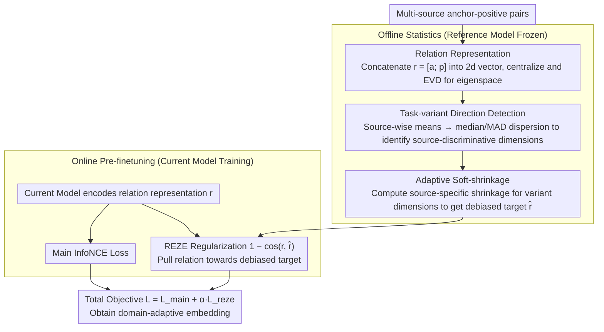

# REZE: Representation Regularization for Domain-adaptive Text Embedding Pre-finetuning

**Conference**: ACL2026  
**arXiv**: [2604.17257](https://arxiv.org/abs/2604.17257)  
**Code**: No public repository link provided in the main text  
**Area**: Information Retrieval  
**Keywords**: Text embedding, domain adaptation, pre-finetuning, representation regularization, negative transfer

## TL;DR
REZE performs eigenspace decomposition on the anchor-positive relation representation during domain embedding pre-finetuning, using robust statistics to identify task-specific shifts and applying soft-shrinkage. This enables the model to absorb shared domain knowledge while suppressing representation drift caused by heterogeneous tasks.

## Background & Motivation
**Background**: Modern text embedding models typically undergo large-scale weakly supervised contrastive learning and pre-finetuning (PFT) to serve tasks like retrieval, classification, and semantic similarity. For specialized domains such as finance, code, or chemistry, a common practice is to collect multiple small-scale domain datasets, uniform them into anchor-positive pairs, and perform contrastive PFT.

**Limitations of Prior Work**: These domain data are often heterogeneous and fragmented, spanning across retrieval, classification, reranking, STS, and clustering tasks. Directly mixing them for PFT injects task-specific biases into the embedding space, causing uncontrollable drift in representation geometry, which may even lead to PFT performing worse than direct FT.

**Key Challenge**: Domain PFT needs to utilize shared domain knowledge across heterogeneous tasks while preventing task-specific data formats, label structures, and biases from dominating the representation space. Traditional isotropy or post-hoc whitening methods only reshape the distribution after training and cannot distinguish which directions originate from task conflicts, potentially further damaging useful geometric structures.

**Goal**: The authors aim to explicitly control representation shift during the pre-finetuning process, allowing the model to retain shared semantics across tasks while suppressing task-induced bias without increasing inference overhead.

**Key Insight**: Instead of processing individual sentence vectors, the paper concatenates anchor and positive embeddings to form a relation representation. The authors argue that shared domain knowledge should remain relatively consistent in the relation structure across different tasks, whereas task-specific bias manifests as dispersion in the means of different data sources along certain eigendimensions.

**Core Idea**: In the eigenspace of relation representations from a reference model, median/MAD are used to identify directions with high task-source variance. Source-specific adaptive soft-shrinkage is applied to these directions, and the resulting debiased relations serve as the regularization target for pre-finetuning.

## Method
REZE is an auxiliary regularization framework for the pre-finetuning stage. It first constructs a global eigenspace using a frozen reference embedding model before training and calculates the shift patterns for each data source within this space. During training, the model still learns anchor-positive matching via InfoNCE but is additionally constrained by a relation-level regularization that pulls the current relation representation toward the reference relation representation after removing task bias.

### Overall Architecture
The input consists of anchor-positive pairs from multiple source datasets. In the offline stage, REZE encodes all pairs with the reference model, concatenates the anchor and positive into $r=[a;p]$, and performs EVD on the centralized covariance matrix to obtain the eigenspace. Subsequently, it calculates the mean for each source on each eigendimension and uses median-based dispersion to determine which dimensions primarily distinguish the task sources.

During the online pre-finetuning stage, for each sample, REZE retrieves the corresponding shrinkage matrix based on its source, pulls the reference relation representation back toward the robust consensus across tasks, and uses cosine dissimilarity to require the current model's relation representation to approach this debiased target. The final training objective is the InfoNCE loss plus the REZE regularization term.

### Key Designs

**1. Relation Representation instead of Single Sentence Representation: Shifting the regularization target from individual points to anchor-positive relation structures**

The essence of supervision in embedding PFT is "which texts should be similar," and task bias often resides in this relational structure—the positive in one task type might resemble a label, while in another, it resembles a document. If regularization only focuses on individual sentence vector positions, it fails to capture this pair-level shift. Therefore, REZE constructs a relation representation $r_{s,i}=[a_{s,i};p_{s,i}]\in\mathbb{R}^{2d}$ for each sample, concatenating anchor and positive into a $2d$ vector. Global mean, covariance, and eigenspace are estimated across these relation representations. This aligns the regularization target with contrastive learning: it constrains "what the relationship between this pair should look like" rather than "where this sentence should be."

**2. Robust Statistics-based Task-variant Direction Detection: Using median/MAD to identify eigendimensions distinguishing task sources**

After centralization, the global mean is near zero. Shrinking toward the mean ignores task bias and might destroy task-invariant semantics; moreover, the mean is sensitive to outlier tasks. REZE uses robust statistics: for each source, it calculates its mean $\mu_s$ in the eigenspace, uses the component-wise median $m_j$ of source means as a robust center, and measures dispersion via $v_j=\frac{1}{S}\sum_s(\mu_{s,j}-m_j)^2$. Dimensions with high dispersion are directions where task sources diverge rather than share semantics. Detection is performed only within active dimensions covering 99% of variance to avoid low-variance noise. The identified center represents a "geometric consensus shared by most tasks" rather than an average skewed by specific tasks.

**3. Adaptive Soft-shrinkage and Training Regularization: Source-specific soft-shrinkage for identified task-variant directions**

Hard-dropping top components loses useful semantics, and post-hoc whitening reshapes the final space indiscriminately. REZE only calculates a shrinkage coefficient $\alpha_{s,j}$ when the source shift in a dimension exceeds a robust threshold, pulling the representation back toward a band around the median—directions without task conflict are preserved. In the offline stage, a shrinkage matrix $A_s$ is constructed for each source to form the debiased target $\hat{r}^{(0)}=W A_s W^T(r^{(0)}-u)+u$ (where $W$ is the eigenvector matrix and $u$ is the global mean). During training, the model's relation representation is required to stay close to this via $1-\cos(r_i,\hat{r}^{(0)}_i)$. Because shrinkage is applied at the source and dimension level, it precisely suppresses task-variant directions without altering the overall geometry.

### Loss & Training
The main loss is the standard InfoNCE: aligning anchors with their positives in a batch while treating other positives as negatives. The REZE regularization term is the cosine dissimilarity between the current relation representation and the debiased reference relation. The final objective is $L=L_{main}+\alpha L_{reze}$, with a default temperature $\tau=0.05$ and regularization strength $\alpha=1.0$. Since the eigenspace, means, and shrinkage matrices are computed before training, there is no additional overhead during inference.

## Key Experimental Results

### Main Results
BACKBONES tested: E5, ModernBERT, GTE, Qwen3-Embedding across FinMTEB, Code(MTEB), and ChemTEB. Baselines include FT, PFT, PFT+Whitening, and PFT+NormalizingFlow.

| Model / Domain | Samples | FT | PFT | REZE | Main Gain |
|--------|------|------|----------|------|------|
| E5 / Code(MTEB) | 1000 | 0.4898 | 0.3565 | 0.5286 | +0.1721 over PFT, +0.0388 over FT |
| ModernBERT / FinMTEB | 1000 | 0.8247 | 0.8192 | 0.8373 | Consistently higher than FT and PFT |
| GTE / Code(MTEB) | 500 | 0.5239 | 0.5352 | 0.6167 | Significant gain in code domain |
| Qwen3-Embedding / Code(MTEB) | 100 | 0.4019 | 0.1214 | 0.4081 | Avoided PFT collapse |
| Qwen3-Embedding / ChemTEB | 1000 | 0.6563 | 0.6765 | 0.6688 | Slightly lower than PFT, better than FT |

Overall, REZE outperforms standard PFT and post-hoc isotropy methods in most settings. Notably, on Qwen3/Code(MTEB), PFT dropped from 0.4019 to 0.1214, while REZE maintained 0.4081, indicating that controlling representation drift is critical for heterogeneous domain PFT.

### Ablation Study
The paper analyzes regularization weight, median vs. mean, isotropy, and representation drift.

| Configuration | Key Metric | Description |
|------|---------|------|
| Default REZE | $\alpha=1.0$ | Stable overall mean, particularly strong at low sample sizes |
| Large $\alpha$ | 5 or 10 | Most tasks saturate or decline; excessive regularization suppresses adaptation |
| Median aggregation | Higher on most FinMTEB tasks | More robust than mean; avoids being skewed by outlier sources |
| Mean aggregation / ESGClassification | 0.8997 | Lower than median (0.9117) |
| Mean aggregation / FINAL | 0.5331 | Lower than median (0.6172) |
| REZE vs PFT IsoScore | ~3x improvement on FinMTEB/Code | More balanced usage of representation dimensions |

### Key Findings
- Simple PFT often performs worse than direct FT, indicating that more domain data does not automatically lead to gains; heterogeneous task conflicts cause negative transfer.
- Whitening and Normalizing Flow degrade significantly in low-resource settings (e.g., ChemTEB), likely because post-processing statistics estimated from limited data are unstable and amplify low-variance noise.
- REZE does not blindly pursue isotropy but controls representation drift to keep it near the original embedding manifold. This "controlled shift" is more suitable for domain adaptation than forcibly reshaping the space after training.
- Batches need to mix different sources for REZE's distribution alignment to be effective. It is essentially a regularization of relation structures across tasks, not a single-task enhancement.

## Highlights & Insights
- The paper clearly identifies the core risk in domain-adaptive embedding PFT: bias from task heterogeneity can outweigh domain knowledge gains. This is common in real-world enterprise retrieval and specialized embeddings.
- Relation-level regularization is clever. It doesn't just keep individual sentence vectors in place but ensures the "anchor-positive relationship" stays near a debiased reference structure, aligning better with contrastive training goals.
- The choice of median/MAD is simple yet highly suitable for multi-source scenarios. Compared to global whitening, it distinguishes between "a specific source is biased" and "the overall semantic structure should be preserved."
- Results suggest that in low-resource or highly heterogeneous domains, controlling representation drift may be more important than increasing data volume or post-hoc isotropy. This provides insights for building embedding pipelines in finance, code, law, and medicine.

## Limitations & Future Work
- While domains include finance, code, and chemistry, the professional depth of public benchmarks remains limited. Highly specialized domains like law might further validate the method or reveal new issues.
- Model sizes only cover 0.1B to 0.6B embedding backbones; trends for larger models or larger batch contrastive training are not yet verified.
- REZE requires performing EVD and source-level statistics on reference representations before PFT. For ultra-large scale corpora or streaming data, offline costs and incremental update mechanisms require further study.
- The method assumes source identifiers are known and that bias between sources can be characterized by mean dispersion. In real-world data with fuzzy borders or mixed sources, finer clustering or dynamic source modeling may be needed.

## Related Work & Insights
- **vs. Standard PFT**: PFT absorbs data via InfoNCE but learns task biases; REZE introduces a debiased relation target to control this drift.
- **vs. Whitening / Normalizing Flow**: Post-hoc methods change the final space but do not participate in training or distinguish task-specific bias; REZE actively constrains the representation trajectory during PFT.
- **vs. All-but-the-top / Isotropy Methods**: These often remove high-variance directions or aim for uniform dimension usage; REZE specifically soft-shrinks only task-variant active dimensions.
- **Insight**: Multi-task embedding training can use "consistency of relation structures across sources" as a regularization signal. Future work could combine this with gradient surgery, task routing, or mixture-of-experts to further separate domain knowledge from task noise.

## Rating
- Novelty: ⭐⭐⭐⭐☆ The combination of eigenspace and robust soft-shrinkage is not complex but highly valuable for the problem definition of heterogeneous embedding PFT.
- Experimental Thoroughness: ⭐⭐⭐⭐☆ Covers 3 domains, 4 backbones, multiple sample sizes, and geometric analysis; larger models and more specialized benchmarks are still needed.
- Writing Quality: ⭐⭐⭐⭐☆ Formulas are clear and motivation is solid; some experimental tables are large and require careful reading to understand task-specific performance.
- Value: ⭐⭐⭐⭐☆ Highly practical for professional retrieval and enterprise embedding adaptation, especially in realistic multi-source, small-data scenarios.

<!-- RELATED:START -->

## Related Papers

- [\[ACL 2026\] More Than Efficiency: Embedding Compression Improves Domain Adaptation in Dense Retrieval](more_than_efficiency_embedding_compression_improves_domain_adaptation_in_dense_r.md)
- [\[ACL 2026\] PL-MTEB: Polish Massive Text Embedding Benchmark](pl-mteb_polish_massive_text_embedding_benchmark.md)
- [\[ACL 2025\] Accelerating Adaptive Retrieval Augmented Generation via Instruction-Driven Representation Reduction of Retrieval Overlaps](../../ACL2025/information_retrieval/accelerating_adaptive_retrieval_augmented_generation_via_instruction-driven_repr.md)
- [\[ICLR 2026\] HUME: Measuring the Human-Model Performance Gap in Text Embedding Tasks](../../ICLR2026/information_retrieval/hume_measuring_the_human-model_performance_gap_in_text_embedding_tasks.md)
- [\[ACL 2026\] Domain-Specific Data Generation Framework for RAG Adaptation](domain-specific_data_generation_framework_for_rag_adaptation.md)

<!-- RELATED:END -->
