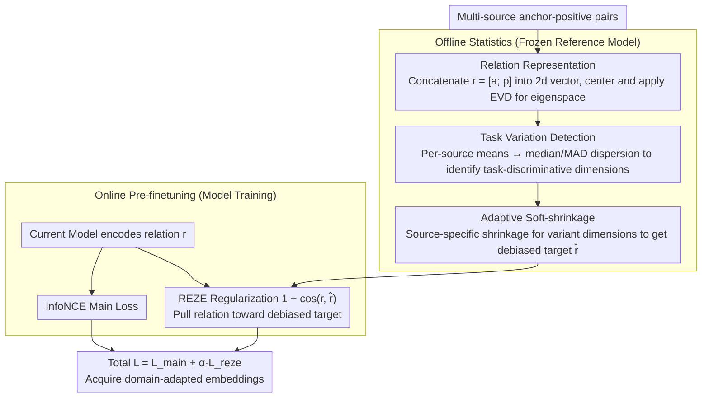

# REZE: Representation Regularization for Domain-adaptive Text Embedding Pre-finetuning

**Conference**: ACL2026  
**arXiv**: [2604.17257](https://arxiv.org/abs/2604.17257)  
**Code**: No public repository link provided in the main text  
**Area**: Information Retrieval  
**Keywords**: Text Embeddings, Domain Adaptation, Pre-finetuning, Representation Regularization, Negative Transfer

## TL;DR
REZE performs eigenspace decomposition on anchor-positive relation representations during domain embedding pre-finetuning. It uses robust statistics to identify and soft-shrink task-specific shifts, thereby absorbing shared domain knowledge while suppressing representation drift caused by heterogeneous tasks.

## Background & Motivation
**Background**: Modern text embedding models are typically trained through large-scale weakly supervised contrastive learning and pre-finetuning (PFT) to serve tasks such as retrieval, classification, and semantic similarity. For specialized domains like finance, code, and chemistry, a common practice is to collect multiple small-scale domain datasets, unify them into anchor-positive pairs, and perform contrastive pre-finetuning.

**Limitations of Prior Work**: These domain datasets are often heterogeneous and fragmented, covering task types like retrieval, classification, reranking, STS, and clustering. Directly mixing them for pre-finetuning injects task-specific biases into the embedding space, leading to uncontrollable drift in representation geometry, which can sometimes make PFT performance worse than direct fine-tuning (FT).

**Key Challenge**: Domain pre-finetuning needs to leverage shared domain knowledge across heterogeneous tasks while preventing task-specific data formats, label structures, and biases from dominating the representation space. Traditional isotropy or post-hoc whitening methods only reshape the distribution after training and cannot distinguish which directions stem from task conflicts, potentially further damaging useful geometric structures.

**Goal**: The authors aim to explicitly control representation shift during the pre-finetuning process, allowing the model to retain common semantics across tasks while suppressing task-induced bias without increasing inference overhead.

**Key Insight**: Rather than processing individual sentence vectors, the paper concatenates anchor and positive embeddings into a relation representation. The authors posit that shared domain knowledge should remain relatively consistent in the relation structure across different tasks, whereas task-specific biases manifest as dispersion in the means of different data sources along certain eigendimensions.

**Core Idea**: Within the eigenspace of the reference model's relation representations, median/MAD statistics are used to identify directions with high task-source variance. Source-specific adaptive soft-shrinkage is applied to these directions, and the resulting debiased relations serve as regularization targets for pre-finetuning.

## Method
REZE is an auxiliary regularization framework for the pre-finetuning stage. It first constructs a global eigenspace using a frozen reference embedding model before training and calculates the shift patterns for each data source in that space. During training, the model still learns anchor-positive matching via InfoNCE but is additionally constrained by a relation-level regularization that pulls the current relation representation toward the debiased reference target.

### Overall Architecture
The input consists of anchor-positive pairs from multiple source datasets. In the offline phase, REZE encodes all pairs using the reference model, concatenates anchor and positive embeddings into $r=[a;p]$, and performs EVD on the centralized covariance matrix to obtain the eigenspace. Subsequently, the mean for each source is calculated for each eigendimension, and median-based dispersion is used to determine which dimensions primarily distinguish task sources.

In the online pre-finetuning phase, for each sample, REZE applies a source-specific shrinkage matrix to pull the reference relation representation back toward a robust consensus across tasks, creating a debiased target. Cosine dissimilarity is then used to encourage the current model's relation representation to approach this target. The final objective is the InfoNCE loss plus the REZE regularization term.

### Key Designs

**1. Relation Representation instead of Single-sentence Representation: Regularizing anchor-positive structures**

The supervision in embedding pre-finetuning essentially answers "which texts should be similar," and task bias often resides in this relational structure—the positive in one task might look like a label, while in another, it resembles a document. Regularizing only the position of individual sentence vectors fails to capture these pair-level shifts. REZE constructs relation representations $r_{s,i}=[a_{s,i};p_{s,i}]\in\mathbb{R}^{2d}$ by concatenating the anchor and positive into a $2d$ vector to estimate global means, covariance, and the eigenspace. This aligns the regularization target naturally with contrastive learning: it constrains "how the relationship between these texts should look" rather than "where this sentence should be."

**2. Robust Statistics for Task Variation Detection: Using median/MAD to identify task-discriminative eigendimensions**

Since the global mean after centralization is near zero, shrinking directly toward the mean fails to isolate task bias and may destroy task-invariant semantics; furthermore, the mean is susceptible to being skewed by outlier tasks. REZE employs robust statistics: it calculates the mean $\mu_s$ for each source in the eigenspace, uses the component-wise median $m_j$ of these source means as a robust center, and measures dispersion via $v_j=\frac{1}{S}\sum_s(\mu_{s,j}-m_j)^2$. Dimensions with high dispersion represent directions where task sources diverge rather than share semantics. Detection is limited to active dimensions explaining 99% of the variance to avoid low-variance noise. The identified center represents a "geometric consensus shared by most tasks."

**3. Adaptive Soft-shrinkage and Training-time Regularization: Precise source-specific correction**

Hard-dropping top components loses useful semantics, and post-hoc whitening reshapes the final space indiscriminately. REZE only calculates a shrinkage coefficient $\alpha_{s,j}$ for a specific source and dimension when the source shift exceeds a robust threshold. This pulls the representation toward a band around the median, while directions without task conflict are preserved. In the offline phase, a shrinkage matrix $A_s$ is constructed for each source to create the debiased target $\hat{r}^{(0)}=W A_s W^T(r^{(0)}-u)+u$ (where $W$ is the eigenvector matrix and $u$ is the global mean). During training, the regularization term $1-\cos(r_i,\hat{r}^{(0)}_i)$ ensures the current model stays close to this target. Because shrinkage is fine-grained at the source and dimension level, it precisely suppresses task-variant directions without disturbing the overall geometry.

### Loss & Training
The main loss is standard InfoNCE: making the anchor and its corresponding positive similar within a batch while treating other positives as negatives. The REZE regularization term is the cosine dissimilarity between the current relation representation and the debiased reference relation. The total objective is $L=L_{main}+\alpha L_{reze}$. Experiments use a default temperature $\tau=0.05$ and regularization strength $\alpha=1.0$. Since the eigenspace, means, and shrinkage matrices are computed pre-training, there is no additional overhead during inference.

## Key Experimental Results

### Main Results
The authors evaluated REZE across three specialized benchmarks—FinMTEB, Code(MTEB), and ChemTEB—using four backbones: E5, ModernBERT, GTE, and Qwen3-Embedding. Comparisons were made against FT, PFT, PFT+Whitening, and PFT+NormalizingFlow.

| Model / Domain | Samples | FT | PFT | REZE | Main Gain |
|--------|------|------|----------|------|------|
| E5 / Code(MTEB) | 1000 | 0.4898 | 0.3565 | 0.5286 | +0.1721 vs PFT, +0.0388 vs FT |
| ModernBERT / FinMTEB | 1000 | 0.8247 | 0.8192 | 0.8373 | Consistently higher than FT/PFT |
| GTE / Code(MTEB) | 500 | 0.5239 | 0.5352 | 0.6167 | Significant gain in code domain |
| Qwen3-Embedding / Code(MTEB) | 100 | 0.4019 | 0.1214 | 0.4081 | Avoids PFT collapse |
| Qwen3-Embedding / ChemTEB | 1000 | 0.6563 | 0.6765 | 0.6688 | Slightly lower than PFT, better than FT |

Overall, REZE outperforms standard PFT and post-hoc isotropy methods in most settings. Notably, on Qwen3 with Code(MTEB), where PFT dropped from 0.4019 to 0.1214, REZE maintained 0.4081, demonstrating that controlling representation drift is critical for heterogeneous domain pre-finetuning.

### Ablation Study
The paper analyzes regularization weights, median vs. mean, isotropy, and representation drift.

| Configuration | Key Metric | Description |
|------|---------|------|
| Default REZE | $\alpha=1.0$ | Stable overall mean, strong at low sample sizes |
| Large $\alpha$ | 5 or 10 | Most tasks saturate or decline; excessive regularization suppresses adaptation |
| median aggregation | Higher on most FinMTEB tasks | More robust than mean, avoids being skewed by outlier sources |
| mean aggregation / ESGClassification | 0.8997 | Lower than median (0.9117) |
| mean aggregation / FINAL | 0.5331 | Lower than median (0.6172) |
| REZE vs PFT IsoScore | ~3x improvement on FinMTEB/Code | More balanced use of representation dimensions |

### Key Findings
- Simple PFT often performs worse than direct FT, suggesting that more domain data does not automatically guarantee gains; heterogeneous task conflict causes negative transfer.
- Whitening and Normalizing Flow degrade significantly in low-resource settings like ChemTEB, likely because post-processing statistics estimated from limited training sets are unstable and amplify low-variance noise.
- REZE does not blindly pursue isotropy but instead controls representation drift near the original embedding manifold. This "controlled shift" is more suitable for domain adaptation than forcibly reshaping the space after training.
- Batches need to mix different sources for REZE's distribution alignment to be effective. It is essentially a regularization of cross-task relational structures rather than single-task augmentation.

## Highlights & Insights
- The paper clearly identifies the core risk of domain-adaptive embedding PFT: task heterogeneity bias can outweigh domain knowledge gains. This is a common issue in practical enterprise retrieval and professional domain embeddings.
- Relation-level regularization is clever. It doesn't just keep individual sentence vectors in place; it pulls the "relationship between anchor and positive" toward a debiased reference structure, aligning better with contrastive training objectives.
- The choice of median/MAD is simple but fits multi-source data scenarios perfectly. Compared to global whitening, it can distinguish between "a specific source being biased" and "the overall semantic structure that should be preserved."
- Results indicate that in low-resource or highly heterogeneous domains, controlling representation drift may be more important than increasing training data or applying post-hoc isotropy. This is insightful for building embedding pipelines in finance, code, law, and medicine.

## Limitations & Future Work
- While the evaluation covers finance, code, and chemistry, the professional depth of public benchmarks remains limited. Domains with high terminology density and strong jurisdictional context, such as law, might further demonstrate the value or expose new issues.
- Model scales only cover embedding backbones from approximately 0.1B to 0.6B; trends for larger models or larger batch contrastive training have not been verified.
- REZE requires EVD and source-level statistics on reference representations before pre-finetuning. For ultra-large-scale corpora or continuously updating data streams, the cost of offline statistics and incremental update mechanisms requires further study.
- The method assumes source identifiers are known and that bias between sources can be characterized by mean dispersion. In real-world data with fuzzy task boundaries or mixed sources, finer-grained clustering or dynamic source modeling may be needed.

## Related Work & Insights
- **vs. Standard PFT**: PFT uses only InfoNCE to absorb heterogeneous domain data, which easily learns task biases; REZE adds a debiased relation target during training to control this drift.
- **vs. Whitening / Normalizing Flow**: Post-processing methods change the final embedding space but do not participate in the training process and do not distinguish task-specific bias; REZE actively constrains the representation trajectory during pre-finetuning.
- **vs. All-but-the-top / Isotropy Methods**: These methods often remove high-variance directions or seek uniform dimension usage; REZE specifically targets task-variant active dimensions for soft-shrinkage.
- **Insights**: Multi-task embedding training can use "consistency of relational structures across sources" as a regularization signal. Future work could combine this with gradient surgery, task routing, or mixture-of-experts to further separate shared domain knowledge from task noise.

## Rating
- Novelty: ⭐⭐⭐⭐☆ The combination of eigenspace and robust soft-shrinkage is straightforward but highly valuable for the problem definition and relation-level design in heterogeneous PFT.
- Experimental Thoroughness: ⭐⭐⭐⭐☆ Covers 3 domains, 4 backbones, and multiple sample scales with geometric analysis, though larger models and more specialized benchmarks are still needed.
- Writing Quality: ⭐⭐⭐⭐☆ Formulas are clear, and motivations are solid; some experimental tables are large and require care to interpret alongside task selection protocols.
- Value: ⭐⭐⭐⭐☆ Highly practical for professional retrieval and enterprise embedding adaptation, especially in realistic scenarios with small, multi-source datasets.

<!-- RELATED:START -->

## Related Papers

- [\[ACL 2026\] More Than Efficiency: Embedding Compression Improves Domain Adaptation in Dense Retrieval](more_than_efficiency_embedding_compression_improves_domain_adaptation_in_dense_r.md)
- [\[ACL 2026\] PL-MTEB: Polish Massive Text Embedding Benchmark](pl-mteb_polish_massive_text_embedding_benchmark.md)
- [\[ACL 2025\] Accelerating Adaptive Retrieval Augmented Generation via Instruction-Driven Representation Reduction of Retrieval Overlaps](../../ACL2025/information_retrieval/accelerating_adaptive_retrieval_augmented_generation_via_instruction-driven_repr.md)
- [\[ACL 2026\] SkMTEB: Slovak Massive Text Embedding Benchmark and Model Adaptation](skmteb_slovak_massive_text_embedding_benchmark_and_model_adaptation.md)
- [\[ICLR 2026\] HUME: Measuring the Human-Model Performance Gap in Text Embedding Tasks](../../ICLR2026/information_retrieval/hume_measuring_the_human-model_performance_gap_in_text_embedding_tasks.md)

<!-- RELATED:END -->
