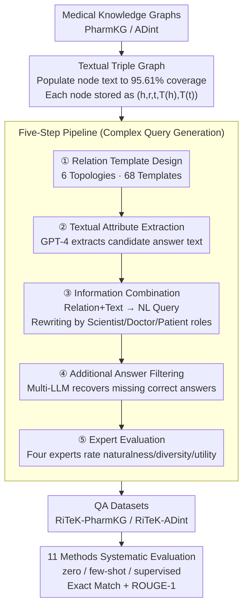

# RiTeK: A Dataset for Large Language Models Complex Reasoning over Textual Knowledge Graphs in Medicine

**Conference**: ACL 2026 Findings  
**arXiv**: [2410.13987](https://arxiv.org/abs/2410.13987)  
**Code**: [https://github.com/ToneLi/Medical-Textual-KG-Reasoning-Benchmark](https://github.com/ToneLi/Medical-Textual-KG-Reasoning-Benchmark)  
**Area**: Medical Imaging  
**Keywords**: Textual Knowledge Graphs, Medical Question Answering, Complex Reasoning, Retrieval Systems, Topological Structure

## TL;DR

RiTeK constructs two large-scale medical Textual Knowledge Graphs (TKG) and corresponding complex reasoning QA datasets, covering 6 topological structures and rich textual descriptions. It evaluates 11 retrieval methods and reveals the severe inadequacies of existing LLM-driven retrieval systems in medical TKG reasoning.

## Background & Motivation

**Background**: Answering complex medical questions requires precise retrieval of relational path information from medical textual knowledge graphs (TKG) to enhance the reasoning capabilities of LLMs. TKGs combine structured entity relations with unstructured textual descriptions, enabling richer semantic expression than traditional KGs.

**Limitations of Prior Work**: (1) Existing medical TKGs are scarce and have limited topological expression (e.g., STaRK-Prime only covers 3 structures); (2) Existing datasets often require only 1-2 hop reasoning paths, which are too simple to reflect the complexity of real medical scenarios; (3) Textual description coverage of nodes is low (STaRK-Prime is only 15.29%), limiting semantic understanding; (4) Lack of a comprehensive evaluation of existing LLM retrieval systems on medical TKGs.

**Key Challenge**: Real medical queries involve multi-hop reasoning, multiple constraints, and complex topological structures, yet neither existing datasets nor retrieval systems can effectively handle this complexity.

**Goal**: (1) Construct medical TKGs with rich topological structures and complete textual descriptions; (2) Generate complex query datasets that fuse relational information and textual attributes; (3) Comprehensively evaluate the capabilities and deficiencies of existing retrieval systems.

**Key Insight**: Simultaneously enhance dataset quality from two dimensions: topological diversity and textual information richness. Queries are generated through 6 topological structure templates and validated by medical experts for naturalness, diversity, and utility.

**Core Idea**: Construct a medical TKG benchmark that simultaneously tests relational reasoning and semantic alignment capabilities to expose bottlenecks in existing methods and indicate directions for improvement.

## Method

### Overall Architecture

RiTeK is not a new model but a construction methodology for a medical complex reasoning benchmark, decoupling the tasks of graph construction and query generation. The first part uses PharmKG and ADint as the skeletal medical KGs, back-filling textual descriptions of nodes from databases such as Ensembl, UMLS, and Mondo Disease Ontology to obtain structure-and-semantic-complete medical TKGs. The second part executes a five-step pipeline on this TKG—relation template design, textual attribute extraction, information combination, additional answer filtering, and expert evaluation—to fuse graph relational paths and node text into natural language complex queries. This results in two QA datasets, followed by a systematic evaluation of 11 retrieval methods to assess their difficulty.

### Key Designs

**1. Textual Triple Graph: Enabling both relational and semantic constraints in queries.** Instead of directly adopting sparse medical KGs, RiTeK populates node text for PharmKG (3 entity types, 29 relations, 500k+ triples) and ADint (102 entity types, 15 relations, 1M+ triples), achieving a node text coverage of 95.61% for RiTeK-PharmKG, compared to 15.29% for STaRK-Prime. In terms of representation, each node is defined within a Textual Triple Graph as $(h, r, t, T(h), T(t))$, unifying relational triples with the textual attributes of head and tail entities into a single object.

High coverage allows generated queries to carry both structural constraints (which relational path to follow) and semantic constraints (textual features of entities), closely mimicking real medical scenarios where patients or doctors provide descriptions of symptoms while limiting pathological categories.

**2. Five-Step Pipeline: Increasing the density and rigor of complex queries.** In the first step, medical experts design relational templates for 6 topological structures (multi-hop, constrained multi-hop, etc.). RiTeK-PharmKG includes 68 templates with an instantiation rate of 11.33, significantly higher than STaRK's 1.25–9.3. The second step involves selecting candidate answer entities and using GPT-4 to extract their textual attributes. The third step synthesizes relational info and textual attributes into natural language queries, rewritten in the roles of medical scientist, doctor, and patient to increase linguistic diversity.

To ensure answer completeness, the fourth step uses multiple LLMs to verify if other candidate entities satisfy the same query conditions, recovering "missing correct labels." Finally, four medical experts evaluate 1000 samples for naturalness, diversity, and utility.

**3. Systematic Evaluation of 11 Methods: Exposing bottlenecks in existing retrieval systems.** RiTeK evaluates 11 representative methods across zero-shot, few-shot, and supervised settings, covering direct generation (GPT-4), graph search (Random Walk, MCTS), prompting strategies (COT, TOT, GOT, TOG), RAG methods (G-retriever, KAR), and supervised methods (GCR, GNN-RAG), measured by Exact Match (EM) and ROUGE-1.

This cross-comparison identifies the strengths and weaknesses of methods in relational reasoning versus textual semantic alignment, clarifying exactly where existing systems fail.

### Loss & Training

Dataset construction itself does not involve model training; query generation utilizes GPT-4o-mini. Supervised methods in the evaluation (G-retriever, GCR, GNN-RAG) are fine-tuned on 80% of the training set, while others use zero-shot/few-shot inference.

## Key Experimental Results

### Main Results

**RiTeK-PharmKG zero-shot Results (Exact Match F1 %)**

| Method | EM F1 |
|------|-------|
| GPT-4 | 11.03 |
| GPT-4 + COT | 13.70 |
| GPT-4 + TOT | 7.22 |
| GPT-4 + GOT | 3.75 |
| GPT-4 + TOG | 31.14 |
| GPT-4 + KAR | 25.18 |
| G-retriever (supervised) | 37.62 |
| GCR (supervised) | 47.71 |
| GNN-RAG (supervised) | **49.72** |

**RiTeK-ADint zero-shot Results (Exact Match F1 %)**

| Method | EM F1 |
|------|-------|
| GPT-4 | 8.03 |
| GPT-4 + KAR | 27.29 |
| GNN-RAG (supervised) | **50.55** |

### Ablation Study

**Human Evaluation Results (Positive/Acceptable %)**

| Dimension | RiTeK-PharmKG | RiTeK-ADint |
|------|---------------|-------------|
| Naturalness | 81.80/99.60 | 81.20/99.20 |
| Diversity | 81.60/99.40 | 74.80/100 |
| Utility | 67.40/97.80 | 68.60/96.60 |

**Dataset Statistics Comparison**

| Dataset | Queries | Topologies | Instantiation Rate |
|--------|--------|-----------|--------|
| STaRK-Prime | 11,204 | 3 | 9.3 |
| RiTeK-PharmKG | 10,235 | 6 | 11.33 |
| RiTeK-ADint | 5,322 | 6 | 9.67 |

### Key Findings

- All zero-shot methods perform poorly on complex medical TKG reasoning; GPT-4 direct generation EM F1 is only ~11%, indicating internal LLM knowledge is insufficient for complex relational reasoning.
- TOT and GOT performed worse than simple COT, suggesting structured prompting logic can be counterproductive without access to external knowledge.
- KAR (Knowledge-Aware Retrieval combining text semantics and structure) performed best among zero-shot methods, validating the importance of structural + textual information.
- Even the strongest supervised method, GNN-RAG, achieved less than 50% EM F1, highlighting the significant challenge of complex reasoning in medical TKGs.

## Highlights & Insights

- The dataset design philosophy is clear: by enriching topologies and ensuring high text coverage, TKG QA is elevated from simple lookup to true complex reasoning.
- Multi-role simulation (Scientist/Doctor/Patient) makes the generated queries realistic for practical application scenarios.
- The 95.61% text coverage is a massive improvement over STaRK-Prime (15.29%).
- Evaluation results provide a clear direction for the community: there is a need for retrieval systems that can simultaneously handle structural reasoning and textual semantic alignment.

## Limitations & Future Work

- Using GPT-4 to generate queries may introduce synthetic bias, leaving a gap between generated and real user queries.
- Evaluation is limited to English medical queries, not covering multilingual medical scenarios.
- Latency issues on large-scale TKGs were not explored in depth.
- Future research could explore more efficient hybrid retrieval architectures and pre-training strategies specialized for medical TKGs.

## Related Work & Insights

- Compared to the STaRK series, RiTeK provides richer topological structures and higher textual coverage in the medical domain.
- TOG's strong performance in few-shot settings suggests that beam search on knowledge graphs combined with few-shot examples is a promising direction.
- The relative success of GNN-RAG indicates the advantages of GNNs in processing structured path information.

## Rating

- Novelty: ⭐⭐⭐⭐ Fills a dataset gap in medical TKGs, though the methodology is primarily dataset construction.
- Experimental Thoroughness: ⭐⭐⭐⭐ Systematic evaluation of 11 retrieval methods, including human evaluation and cross-dataset comparison.
- Writing Quality: ⭐⭐⭐⭐ Clear problem definition and detailed construction process, though some table information is redundant.

<!-- RELATED:START -->

## Related Papers

- [\[ACL 2026\] How Large Language Models Balance Internal Knowledge with User and Document Assertions](how_large_language_models_balance_internal_knowledge_with_user_and_document_asse.md)
- [\[ACL 2025\] RARE: Retrieval-Augmented Reasoning Enhancement for Large Language Models](../../ACL2025/information_retrieval/rare_retrieval_augmented_reasoning.md)
- [\[ICLR 2026\] SynthWorlds: Controlled Parallel Worlds for Disentangling Reasoning and Knowledge in Language Models](../../ICLR2026/information_retrieval/synthworlds_controlled_parallel_worlds_for_disentangling_reasoning_and_knowledge.md)
- [\[ICLR 2026\] Query-Level Uncertainty in Large Language Models](../../ICLR2026/information_retrieval/query-level_uncertainty_in_large_language_models.md)
- [\[ICLR 2026\] TokMem: One-Token Procedural Memory for Large Language Models](../../ICLR2026/information_retrieval/tokmem_one-token_procedural_memory_for_large_language_models.md)

<!-- RELATED:END -->
