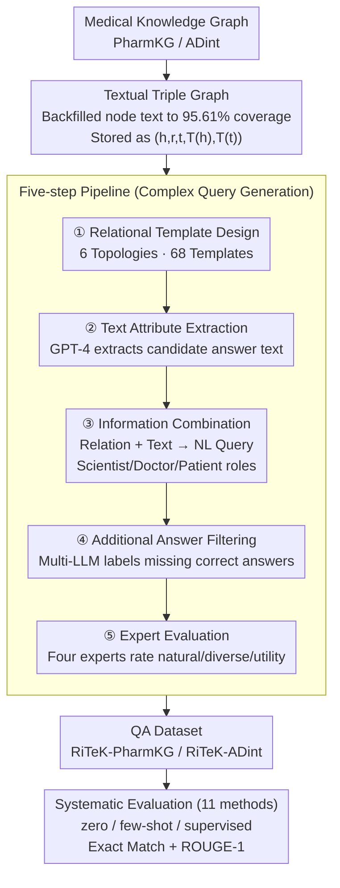

# RiTeK: A Dataset for Large Language Models Complex Reasoning over Textual Knowledge Graphs in Medicine

**Conference**: ACL 2026 Findings  
**arXiv**: [2410.13987](https://arxiv.org/abs/2410.13987)  
**Code**: [https://github.com/ToneLi/Medical-Textual-KG-Reasoning-Benchmark](https://github.com/ToneLi/Medical-Textual-KG-Reasoning-Benchmark)  
**Area**: Medical Imaging  
**Keywords**: Textual Knowledge Graph, Medical QA, Complex Reasoning, Retrieval System, Topology

## TL;DR

RiTeK constructs two large-scale medical Textual Knowledge Graphs (TKG) and corresponding complex reasoning QA datasets, covering 6 topological structures and rich textual descriptions. It evaluates 11 retrieval methods and reveals significant deficiencies in existing LLM-driven retrieval systems for medical TKG reasoning.

## Background & Motivation

**Background**: Answering complex medical questions requires precise retrieval of relational path information from medical textual knowledge graphs (TKG) to enhance LLM reasoning capabilities. TKG combines structured entity relations with unstructured textual descriptions, enabling richer semantic expression than traditional KGs.

**Limitations of Prior Work**: (1) Existing medical TKGs are scarce with limited topological expression (e.g., STaRK-Prime covers only 3 structures); (2) Existing datasets usually require only 1-2 hop reasoning paths, failing to reflect real-world medical complexity; (3) Textual description coverage for nodes is low (STaRK-Prime is only 15.29%), limiting semantic understanding; (4) Lack of comprehensive evaluation of LLM retrieval systems on medical TKGs.

**Key Challenge**: Real medical queries involve multi-hop reasoning, multiple constraints, and complex topological structures, yet neither existing datasets nor retrieval systems can effectively handle this complexity.

**Goal**: (1) Construct a medical TKG with diverse topological structures and complete textual descriptions; (2) Generate a complex query dataset integrating relational information and textual attributes; (3) Comprehensively evaluate the capabilities and shortcomings of existing retrieval systems.

**Key Insight**: Simultaneously enhance dataset quality from two dimensions—topological diversity and textual information richness—generating queries via 6 topological structure templates and validating naturalness, diversity, and utility through medical experts.

**Core Idea**: Build a medical TKG benchmark that simultaneously tests relational reasoning and semantic alignment capabilities, exposing bottlenecks in existing methods and pointing toward future improvements.

## Method

### Overall Architecture

RiTeK is not a new model but a construction methodology for medical complex reasoning benchmarks, separating "graph construction" and "query generation." The first part uses PharmKG and ADint as skeletons, backfilling textual descriptions from databases like Ensembl, UMLS, and Mondo Disease Ontology to obtain structured and semantically complete medical TKGs. The second part executes a five-step pipeline on this TKG—relational template design, textual attribute extraction, information combination, additional answer filtering, and expert evaluation—to transform relational paths and node texts into natural language complex queries. Finally, two QA datasets are produced, and 11 retrieval methods are systematically evaluated.

### Key Designs

**1. Textual Triple Graph: Enabling relational and semantic constraints.** Instead of using sparse medical KGs, RiTeK completes node text for PharmKG (3 entity types, 29 relations, 500k+ triples) and ADint (102 entity types, 15 relations, 1M+ triples). Node text coverage reaches 95.61% for RiTeK-PharmKG, compared to 15.29% for STaRK-Prime. Each node is defined in a Textual Triple Graph as $(h, r, t, T(h), T(t))$, unifying relational triples and semantic attributes. This allows queries to carry both structural constraints (relational paths) and semantic constraints (textual features of entities), mimicking real-world clinical queries.

**2. Five-Step Pipeline: Refining query complexity.** First, experts design relation templates for 6 topologies (multi-hop, constrained multi-hop, etc.). RiTeK-PharmKG features 68 templates with an instance rate of 11.33, much higher than STaRK's 1.25–9.3. Second, candidate answers are selected and GPT-4 extracts their textual attributes. Third, information is synthesized into natural language queries rewritten from the perspectives of scientists, doctors, and patients. Fourth, multiple LLMs identify missing correct answers to ensure dataset completeness. Finally, four medical experts evaluate 1,000 samples for naturalness, diversity, and utility.

**3. Systematic Evaluation of 11 Methods: Exposing bottlenecks.** Eleven representative methods are evaluated across zero-shot, few-shot, and supervised settings. These include direct generation (GPT-4), graph search (Random Walk, MCTS), prompting strategies (COT, TOT, GOT, TOG), RAG methods (G-retriever, KAR), and supervised methods (GCR, GNN-RAG), measured by Exact Match and ROUGE-1. This comparison maps method performance across relational reasoning and semantic alignment.

### Loss & Training

The dataset construction itself does not involve model training; query generation utilizes GPT-4o-mini. Supervised methods (G-retriever, GCR, GNN-RAG) were fine-tuned on 80% of the training set, while others performed zero-shot/few-shot inference.

## Key Experimental Results

### Main Results

**RiTeK-PharmKG Zero-shot Results (Exact Match F1 %)**

| Method | EM F1 |
|------|-------|
| GPT-4 | 11.03 |
| GPT-4 + COT | 13.70 |
| GPT-4 + TOT | 7.22 |
| GPT-4 + GOT | 3.75 |
| GPT-4 + TOG | 31.14 |
| GPT-4 + KAR | 25.18 |
| G-retriever (supervised) | 37.62 |
| GCR (supervised) | 47.71 |
| GNN-RAG (supervised) | **49.72** |

**RiTeK-ADint Zero-shot Results (Exact Match F1 %)**

| Method | EM F1 |
|------|-------|
| GPT-4 | 8.03 |
| GPT-4 + KAR | 27.29 |
| GNN-RAG (supervised) | **50.55** |

### Ablation Study

**Human Evaluation Results (Positive/Acceptable %)**

| Metric | RiTeK-PharmKG | RiTeK-ADint |
|------|---------------|-------------|
| Naturalness | 81.80/99.60 | 81.20/99.20 |
| Diversity | 81.60/99.40 | 74.80/100 |
| Utility | 67.40/97.80 | 68.60/96.60 |

**Dataset Statistics Comparison**

| Dataset | Queries | Topologies | Instance Rate |
|--------|--------|-----------|--------|
| STaRK-Prime | 11,204 | 3 | 9.3 |
| RiTeK-PharmKG | 10,235 | 6 | 11.33 |
| RiTeK-ADint | 5,322 | 6 | 9.67 |

### Key Findings

- All zero-shot methods perform poorly on complex medical TKG reasoning; GPT-4 direct generation yields ~11% EM F1, indicating that internal knowledge is insufficient for complex relations.
- TOT and GOT underperform simple COT, suggesting that structured prompting frameworks may be counterproductive without external knowledge access.
- KAR (Knowledge-Aware Retrieval combining text and structure) performs best in zero-shot, validating the importance of dual information streams.
- Even the strongest supervised method, GNN-RAG, achieves less than 50% EM F1, highlighting the significant challenge of complex medical TKG reasoning.

## Highlights & Insights

- The dataset design is conceptually clear: by enriching topology and text coverage, it elevates TKG QA from simple lookup to true complex reasoning.
- Multi-role simulation (Scientist/Doctor/Patient) ensures queries reflect real-world use cases.
- 95.61% text coverage is a substantial improvement over STaRK-Prime (15.29%).
- Evaluation results provide a clear direction: the community needs retrieval systems capable of simultaneously processing structural reasoning and semantic alignment.

## Limitations & Future Work

- Using GPT-4 for query generation may introduce synthetic bias compared to real user queries.
- Only English medical queries are evaluated, lacking coverage for multi-lingual medical scenarios.
- Latency issues in large-scale TKGs were not explored in depth.
- Future work may explore efficient hybrid retrieval architectures and pre-training strategies specialized for medical TKGs.

## Related Work & Insights

- Compared to the STaRK series, RiTeK provides richer topologies and higher text coverage in the medical domain.
- TOG performs excellently in few-shot settings, suggesting that beam search on knowledge graphs combined with few-shot examples is a promising direction.
- The relative success of GNN-RAG demonstrates the advantage of GNNs in processing structured path information.

## Rating

- Novelty: ⭐⭐⭐⭐ Fills a critical gap in medical TKG datasets, though the methodology is primarily dataset construction.
- Experimental Thoroughness: ⭐⭐⭐⭐ Systematic evaluation of 11 retrieval methods, including human evaluation and multi-dataset comparisons.
- Writing Quality: ⭐⭐⭐⭐ Clear problem definition and detailed construction process, though some tables are slightly redundant.

<!-- RELATED:START -->

## Related Papers

- [\[ACL 2026\] How Large Language Models Balance Internal Knowledge with User and Document Assertions](how_large_language_models_balance_internal_knowledge_with_user_and_document_asse.md)
- [\[ACL 2025\] RARE: Retrieval-Augmented Reasoning Enhancement for Large Language Models](../../ACL2025/information_retrieval/rare_retrieval_augmented_reasoning.md)
- [\[ICLR 2026\] SynthWorlds: Controlled Parallel Worlds for Disentangling Reasoning and Knowledge in Language Models](../../ICLR2026/information_retrieval/synthworlds_controlled_parallel_worlds_for_disentangling_reasoning_and_knowledge.md)
- [\[ICLR 2026\] Query-Level Uncertainty in Large Language Models](../../ICLR2026/information_retrieval/query-level_uncertainty_in_large_language_models.md)
- [\[ICLR 2026\] G-reasoner: Foundation Models for Unified Reasoning over Graph-structured Knowledge](../../ICLR2026/information_retrieval/g-reasoner_foundation_models_for_unified_reasoning_over_graph-structured_knowled.md)

<!-- RELATED:END -->
