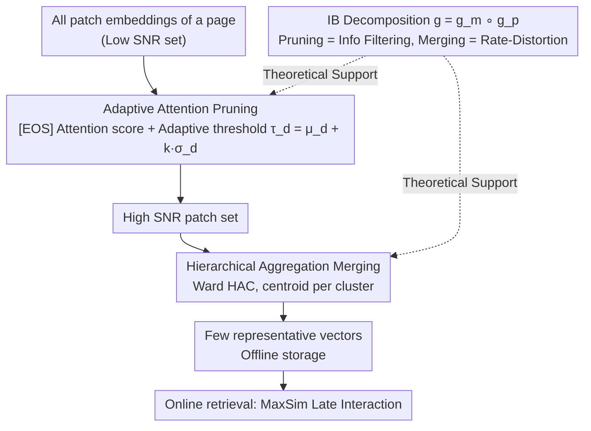

# Prune-then-Merge: Towards Efficient Multi-Vector Visual Document Retrieval

**Conference**: ACL 2026 Findings  
**arXiv**: [2602.19549](https://arxiv.org/abs/2602.19549)  
**Code**: None  
**Area**: Information Retrieval / Document Retrieval  
**Keywords**: Visual Document Retrieval, Multi-vector Compression, Adaptive Pruning, Hierarchical Aggregation, ColPali

## TL;DR

This paper proposes Prune-then-Merge, a two-stage training-free multi-vector document compression framework. It first removes low-information patches through adaptive attention pruning and then merges the remaining high-signal patches via hierarchical clustering. It extends the near-lossless compression range from 50-60% to 60-70% across 29 VDR datasets and significantly outperforms single-stage methods at high compression rates (80%+).

## Background & Motivation

**Background**: Visual Document Retrieval (VDR) utilizes LVLMs to process document pages as images. The multi-vector paradigm (e.g., ColPali) represents each page as a set of patch-level embeddings and achieves fine-grained matching through MaxSim late interaction, yielding state-of-the-art performance.

**Limitations of Prior Work**: Multi-vector models incur massive storage and computational overhead, storing hundreds or thousands of vectors per page, which is impractical for large-scale deployment. Existing optimizations follow two paths: (1) Pruning (e.g., DocPruner), which is near-lossless at moderate rates but suffers sharp performance drops at high compression; (2) Merging (e.g., Light-ColPali), which is more graceful at high compression but may dilute discriminative features, leading to unstable near-lossless ranges.

**Key Challenge**: Pruning excels at removing noise but cannot handle high redundancy; merging excels at high-ratio compression but centroids are biased by noise in noisy data. Both methods have weaknesses, and neither satisfies the requirements for both near-lossless and high-compression needs when used in isolation.

**Goal**: Synergize two complementary methods—pruning to improve the Signal-to-Noise Ratio (SNR) followed by merging to achieve high-ratio compression.

**Key Insight**: Based on Information Bottleneck (IB) theory, total compression is decomposed into two more manageable sub-problems: query-agnostic information filtering (pruning) and redundancy elimination (merging).

**Core Idea**: Refine then compress—pruning transforms the input from a low-SNR set to a high-SNR set, ensuring subsequent merging operates on high-quality vectors to avoid centroid shifts caused by noise.

## Method

### Overall Architecture

Prune-then-Merge is an offline, query-agnostic, and completely training-free multi-vector compression framework. Multi-vector VDR models like ColPali store hundreds of vectors per page, making storage and interaction calculation heavy. This framework splits the challenge of "minimizing performance loss under high compression" into two sequential steps: pruning and then merging. Given all patch embeddings of a page, Stage 1 uses the attention weights of the LVLM's last layer to calculate patch importance and prunes low-information patches based on an adaptive threshold, refining the input into a high-SNR set. Stage 2 performs Hierarchical Agglomerative Clustering (HAC) on the remaining high-quality patches, representing each cluster with its centroid to generate a small set of representative vectors for offline storage. During online retrieval, MaxSim is performed directly with these vectors. This serial design is supported by Information Bottleneck (IB) theory, explaining why "refining before compressing" outperforms single-stage approaches.

### Key Designs

**1. Adaptive Attention Pruning: Deciding patch retention based on the document's own information density.** This step eliminates low-information patches like blank areas and decorative borders. The method reuses attention weights from the final Transformer layer of the encoder, taking the average attention of the [EOS] token towards each patch as the importance score $I(\mathbf{d}_j) = \bar{\mathbf{A}}^{(L)}_{\text{eos},j}$. An adaptive threshold $\tau_d = \mu_d + k \cdot \sigma_d$ is set using document-level statistics, retaining only patches with scores above the threshold. The hyperparameter $k$ controls pruning severity.

The key is that the threshold is dynamically calculated based on the mean and variance of each specific document rather than a fixed ratio. Information density varies greatly across pages—a page full of tables versus a cover page with white space requires vastly different retention counts. While fixed-ratio pruning either over-prunes dense pages or retains too much noise in sparse pages, the adaptive threshold ensures each page retains a patch count matching its information volume.

**2. Hierarchical Aggregation Merging: Calculating unbiased centroids on clean sets.** Even after pruning, semantic redundancy may persist (e.g., multiple patches describing the same row in a table). This step performs L2 normalization on all embeddings, calculates the cosine distance matrix, and applies Ward's hierarchical agglomerative clustering. The target number of clusters is $N_p'' = \max(1, \lfloor N_p' / m \rfloor)$, where the merge factor $m$ controls the compression ratio. Each cluster mean centroid serves as the new representative vector.

Placing merging after pruning is the core of the method: if clustering is performed directly on the noisy original set, centroids are biased by blank/noise patches, dilating truly discriminative features—this is why single-stage merging (e.g., Light-ColPali) loses performance on noisy data. By pruning noise before calculating centroids, the centroids align with high-signal samples, making them more unbiased and better at preserving retrieval accuracy under high compression.

**3. Information Bottleneck Decomposition: Theoretical justification for the two-step superiority.** The overall IB optimization objective $\max I(\mathbf{D}''; s(q,\mathbf{D})) - \beta I(\mathbf{D}''; \mathbf{D})$ is decomposed into a composite mapping $g = g_m \circ g_p$: pruning $g_p$ handles query-agnostic information filtering to maximize global semantic retention, while merging $g_m$ handles rate-distortion optimization to minimize MSE caused by quantization (centroid replacement).

This decomposition splits a difficult joint compression problem into two sub-problems with clear individual optimization goals that synergize. It theoretically validates Design 2—where single-stage merge centroids suffer from noise shift, the two-stage "filter-then-quantize" approach results in centroids closer to unbiased data. This provides a principled basis for selecting the pruning severity $k$ and merge factor $m$ beyond simple parameter tuning.

### Loss & Training

Prune-then-Merge is a completely training-free post-processing framework. It involves no model training and can be directly applied to any multi-vector VDR model. The only hyperparameters are the pruning severity $k$ and merge factor $m$.

## Key Experimental Results

### Main Results

**nDCG@5 on 29 VDR datasets (60% compression rate)**

| Method | ColQwen2.5 | ColNomic | Jina-v4 |
|------|-----------|---------|---------|
| No Compression | Baseline | Baseline | Baseline |
| DocPruner (Pruning) | Near-lossless | Slight drop | Slight drop |
| Light-ColPali (Merging) | Significant drop | Significant drop | Significant drop |
| **Prune-then-Merge** | **Near-lossless** | **Near-lossless** | **Near-lossless** |

### Ablation Study

| Compression Rate | Pruning Only | Merging Only | Prune-then-Merge |
|--------|--------|--------|-----------------|
| 50% | Near-lossless | Slight drop | Near-lossless |
| 60% | Starts drop | Significant drop | **Near-lossless** |
| 70% | Sharp drop | Drop | Slight drop |
| 80% | Collapse | Large drop | **Still usable** |

### Key Findings

- The near-lossless compression range is extended from [50-60%] to [60-70%], an average gain of 10 percentage points.
- At 80%+ compression rates, pruning-only methods collapse (performance cliff), while Prune-then-Merge avoids this issue.
- Consistently effective across three mainstream multi-vector models (ColQwen2.5, ColNomic, Jina-v4).
- Theoretical predictions align with experimental results—improving SNR before compression effectively reduces centroid shift.

## Highlights & Insights

- The "refine then compress" sequential logic is simple yet profound—decomposing a complex problem into two more solvable sub-problems.
- Completely training-free and model-agnostic, allowing immediate application to any multi-vector retrieval model.
- IB theoretical analysis not only explains the method's effectiveness but also provides principled guidance for hyperparameter selection.

## Limitations & Future Work

- The $O(N^2)$ space complexity of hierarchical clustering may become a bottleneck for extremely large documents.
- Query-agnostic pruning might accidentally delete patches important for specific queries.
- The choice of merge factor $m$ remains empirical.
- Future work could explore query-aware adaptive compression and learned merging strategies.

## Related Work & Insights

- **vs DocPruner**: Pruning only, collapses at high compression; Prune-then-Merge extends the range via subsequent merging.
- **vs Light-ColPali**: Merging only, centroids diluted by noise; Prune-then-Merge prunes noise before merging.
- **vs MetaEmbed**: Requires training and architectural modifications; Prune-then-Merge is completely training-free.

## Rating

- Novelty: ⭐⭐⭐⭐ Sequential compression is simple and effective; IB theory adds depth.
- Experimental Thoroughness: ⭐⭐⭐⭐⭐ 29 datasets, 3 models, comprehensive compression rate comparisons.
- Writing Quality: ⭐⭐⭐⭐⭐ Clear methodology with tight integration of theory and experiments.
- Value: ⭐⭐⭐⭐ Provides a plug-and-play compression solution for practical multi-vector retrieval deployment.

<!-- RELATED:START -->

## Related Papers

- [\[ACL 2026\] Hybrid-Vector Retrieval for Visually Rich Documents: Combining Single-Vector Efficiency and Multi-Vector Accuracy](hybrid-vector_retrieval_for_visually_rich_documents_combining_single-vector_effi.md)
- [\[ACL 2026\] A Picture is Worth a Thousand Words? An Empirical Study of Aggregation Strategies for Visual Financial Document Retrieval](a_picture_is_worth_a_thousand_words_an_empirical_study_of_aggregation_strategies.md)
- [\[ACL 2025\] Towards Storage-Efficient Visual Document Retrieval: An Empirical Study on Reducing Patch-Level Embeddings](../../ACL2025/information_retrieval/towards_storage-efficient_visual_document_retrieval_an_empirical_study_on_reduci.md)
- [\[ICML 2026\] LEMUR: Learned Multi-Vector Retrieval](../../ICML2026/information_retrieval/lemur_learned_multi-vector_retrieval.md)
- [\[ACL 2026\] Navigating Large-Scale Document Collections: MuDABench for Multi-Document Analytical QA](navigating_large-scale_document_collections_mudabench_for_multi-document_analyti.md)

<!-- RELATED:END -->
