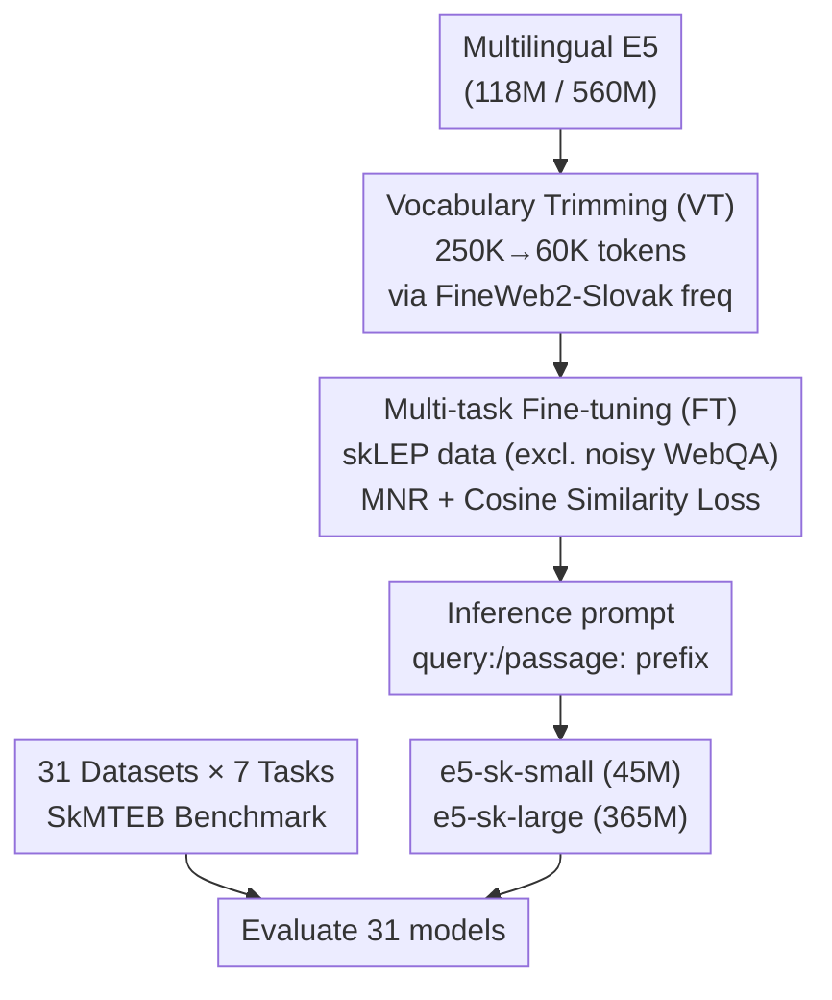

# SkMTEB: Slovak Massive Text Embedding Benchmark and Model Adaptation

**Conference**: ACL 2026  
**arXiv**: [2606.13647](https://arxiv.org/abs/2606.13647)  
**Code**: https://github.com/slovak-nlp/skmteb (includes HuggingFace collection of models and datasets)  
**Area**: Information Retrieval / Text Embeddings / Low-resource Multilingualism  
**Keywords**: Slovak, Text Embeddings, MTEB, Vocabulary Trimming, Low-resource NLP

## TL;DR
This paper establishes the first comprehensive MTEB-style text embedding benchmark for Slovak (a low-resource West Slavic language with ~5 million speakers), named SkMTEB (31 datasets, 7 task categories, approximately 4x the depth of existing multilingual coverage). The study evaluates 31 embedding models and utilizes **vocabulary trimming + targeted fine-tuning** to compress Multilingual E5 into locally deployable Slovak embedding models (45M/365M). These models reduce size by up to 62% while matching the performance of commercial APIs.

## Background & Motivation
**Background**: Text embeddings are core infrastructure for semantic search, Retrieval-Augmented Generation (RAG), clustering, and classification. The field has pursued scale, with SOTA models reaching billions of parameters (e.g., Qwen3-Embedding at 8B). However, benchmark evidence is concentrated in high-resource languages, and the strongest models are difficult to deploy with low latency or on constrained hardware.

**Limitations of Prior Work**: This "scale-efficiency" tension is particularly acute for low-resource languages. Large multilingual models nominally support hundreds of languages, but capacity is primarily allocated to high-resource languages like English and Chinese. For languages like Slovak, this results in under-representation in the vocabulary, limited training data coverage, and compromised performance. A more practical issue is the **lack of evaluation infrastructure**: MTEB catalyzed English embedding research, and C-MTEB/PL-MTEB/ruMTEB provided depth for Chinese, Polish, and Russian. However, Slovak lacked such a benchmark—existing skLEP only covers Natural Language Understanding (NLU) and excludes retrieval or semantic similarity. While MMTEB covers 250+ languages, it trades depth for breadth; Slovak has only 8 tasks in MMTEB (only 14% of English MTEB's depth and 29% of PL-MTEB), mostly consisting of subsets from multilingual datasets like SIB-200/FLORES/Tatoeba, lacking native retrieval, domain-specific, or time-anchored evaluation scenarios.

**Key Challenge**: Low-resource languages lack both deep benchmarks to diagnose model behavior and compact, efficient models for actual deployment. For these languages, the goal should not be matching the largest models on general benchmarks, but creating "practical and efficient models that serve the specific language well."

**Goal**: (1) Build a Slovak embedding benchmark with sufficient depth and breadth; (2) Demonstrate that effective Slovak embedding models can be trained using relatively modest resources (fine-tuning existing models + vocabulary trimming).

**Key Insight / Core Idea**: On the benchmark side, the authors adapt existing datasets and build new ones to reach a 31×7 coverage. On the model side, they apply **vocabulary trimming** to Multilingual E5 (since 30%–40% of multilingual model parameters are spent on the embedding matrix, with many tokens irrelevant to the target language) followed by targeted fine-tuning. Combining "removing irrelevant tokens" with "fine-tuning on high-quality native data" yields significant size reduction without performance loss.

## Method

### Overall Architecture
The paper follows two parallel lines of work. **Benchmark Line**: Organizes 7 task categories following the MTEB framework—Retrieval (5), Reranking (3), Classification (7), Clustering (5), Bitext Mining (6), Pair Classification (3), and Semantic Textual Similarity (STS) (2), totaling 31 datasets across news, government, social media, reviews, and encyclopedia domains (2000–2025). 6 datasets overlap with MMTEB (for cross-lingual comparison), while 25 are outside MMTEB, with 7 created entirely for this work. **Model Line**: Using Multilingual E5 as a base, the authors perform vocabulary trimming followed by fine-tuning on high-quality skLEP data to produce two locally deployable models: e5-sk-small (45M) and e5-sk-large (365M).

### Key Designs

**1. SkMTEB Benchmark: Filling the Depth Gap via "Adaptation + Construction"**

To address the lack of deep benchmarks for Slovak, the authors took a two-pronged approach. First, they **transformed existing datasets into new tasks** (e.g., restructuring news summarization datasets like SlovakSum/SMESum into retrieval tasks where summaries serve as queries, or using URL structures for clustering). Second, they **constructed 7 brand-new datasets** (e.g., two reranking datasets from pharmacist Q&A, NLI pairs from Demagog.sk fact-checking data, and SlovakSumSTS generated by LLMs and human-verified). The resulting 31 datasets provide nearly $4\times$ the coverage of MMTEB for Slovak, with minimal overlap (6 datasets), making SkMTEB complementary to MMTEB for in-depth language diagnosis.

**2. Vocabulary Trimming (VT): Reducing Size Without Losing Transferability**

Addressing the fact that 30%–40% of multilingual model parameters are in the embedding matrix with many tokens irrelevant to Slovak, VT removes unused tokens. Based on token frequencies from FineWeb2-Slovak, the vocabulary was reduced from 250K to 60K (a balance point between coverage and efficiency). Trimming is performed **before** fine-tuning (Pre-FT VT) to reduce both model size and training time. E5-small dropped from 118M to 45M (62% reduction), and E5-large dropped from 560M to 365M (35% reduction). Cross-lingual transferability was verified using bitext mining; F1 differences before and after trimming were minimal (max change 0.92 for small, 0.14 for large), suggesting that targeted reduction preserves Slovak-English and Slovak-Czech transfer capabilities.

**3. Multi-task Fine-tuning and Quality Control**

To train effective models with modest resources, the authors identified a pitfall in their initial strategy: using the full Slovak Web QA triples to fine-tune SlovakBERT (sturovec-base) resulted in an average score (68.99) **worse** than the un-tuned multilingual-e5-small (70.32). Analysis showed that **automatic hard negative sampling** from Web QA (randomly picking answers from the same domain) provided inconsistent contrastive signals. Consequently, they switched to fine-tuning E5 only on high-quality skLEP data (SK-SQuAD, NLI, STS, RTE). Using mean pooling, a max length of 256, and a combination of Cosine Similarity loss (STS) and Multiple Negatives Ranking (MNR) loss, the models were trained on a single H100 in under an hour. Following E5 convention, `query:`/`passage:` prefixes were added during inference.

### Loss & Training
Multi-task learning: Cosine Similarity Loss for STS tasks, and Multiple Negatives Ranking Loss (MNR; Henderson et al. 2017) for others. Training config: mean pooling, max length 256, batch 32, lr $2\times10^{-5}$ (linear warmup for 10% steps), 3 epochs, single NVIDIA H100, seed 42. Training data from skLEP: SK-SQuAD (72K pairs), translated NLI (393K pairs), GLUE STS-B (6K pairs), and GLUE RTE (2.5K pairs). Slovak Web QA (967K pairs) was excluded due to unstable negative signals.

## Key Experimental Results

### Main Results (SkMTEB Average, %, Selected from Table 1)
"All" is the weighted average across all tasks; "Type" is the unweighted average across task categories.

| Model | Parameters | All | Type | Notes |
|-------|------------|-----|------|-------|
| multilingual-e5-large-instruct | 560M | **77.49** | 78.44 | Highest score (Instruction-tuned) |
| gemini-embedding-001 | API | 77.23 | 78.07 | Commercial, close second |
| **e5-sk-large (Ours)** | 365M | 74.70 | 75.88 | 35% smaller, matches text-embedding-3-large |
| text-embedding-3-large | API | 75.07 | 75.89 | Commercial upper bound reference |
| multilingual-e5-large | 560M | 74.25 | 75.49 | Large base for this work |
| jina-embeddings-v4 | 3.8B | 72.44 | 73.87 | Larger model not necessarily better |
| **e5-sk-small (Ours)** | 45M | 70.56 | 72.01 | 62% smaller, matches text-embedding-3-small |
| text-embedding-3-small | API | 70.48 | 71.39 | Commercial |
| multilingual-e5-small | 118M | 70.32 | 71.78 | Small base for this work |

### Ablation Study (VT / FT / prompt, Table 2)

| Variant | VT | FT | prompt | Size | Avg | Δ |
|---------|----|----|--------|------|-----|---|
| mE5-small (Baseline) | | | | 118M | 70.32 | — |
| + VT | ✓ | | | 45M | 70.45 | +0.13 |
| + FT | | ✓ | | 118M | 70.58 | +0.26 |
| + VT + FT | ✓ | ✓ | | 45M | 70.56 | +0.24 |
| + VT + FT + prompt | ✓ | ✓ | ✓ | 45M | **71.07** | +0.75 |
| mE5-large (Baseline) | | | | 560M | 74.25 | — |
| + VT | ✓ | | | 365M | 74.56 | +0.31 |
| + VT + FT | ✓ | ✓ | | 365M | 74.70 | +0.45 |
| + VT + FT + prompt | ✓ | ✓ | ✓ | 365M | **74.72** | +0.47 |

### Key Findings
- **Larger is not always stronger**: While instruction-tuned multilingual-e5-large-instruct (77.49) and gemini-embedding-001 (77.23) lead, returns diminish for massive models—jina-embeddings-v4 (3.8B, 72.44) falls behind snowflake-arctic-embed-l-v2.0 (568M, 72.54) and nomic-embed-text-v2-moe (330M, 72.58).
- **Task difficulty varies significantly**: Bitext mining is nearly solved (F1 > 90 for most), while clustering is the hardest (V-measure only 17–50, indicating room for growth). STS favors models with explicit similarity training (jina-embeddings-v3 reaches 89.82).
- **Poor transfer of Slovak NLU models**: Models trained for NLU (slovakbert-skquad-mnlr, slovakbert-sts-stsb) perform significantly worse than multilingual alternatives on embedding tasks, highlighting the need for dedicated embedding development.
- **Practical equivalence to commercial APIs**: TOST equivalence tests confirmed that e5-sk-small ≈ text-embedding-3-small and e5-sk-large ≈ text-embedding-3-large (90% CI within ±2 points). These open-source models offer zero API cost, smaller footprints, and higher throughput.
- **Prompts benefit small models more**: Adding `query:`/`passage:` prefixes improved the small model by +0.51 (70.56 → 71.07) but the large model by only +0.02, suggesting models with limited capacity benefit more from explicit task cues.

## Highlights & Insights
- **"Vocabulary Trimming" is a high-leverage tool for low-resource deployment**: VT reduced the small model size by 62% while slightly increasing performance (+0.13), with verified minimal impact on cross-lingual transfer. This "trim then fine-tune" pipeline is replicable for any multilingual-to-single-language task.
- **Honest reporting of failed routes**: Reporting that sturovec-base failed due to poor hard negative sampling in Web QA provides more value than reporting only success, serving as a cautionary tale for data quality.
- **Benchmark design focusing on complementarity**: By limiting overlap with MMTEB, the authors ensure SkMTEB adds depth while MMTEB provides breadth, a strategic approach for low-resource language benchmarking.
- **Statistical rigor for "Equivalence"**: Using TOST equivalence tests instead of simple comparison adds scientific weight to the claim that these models match commercial APIs.

## Limitations & Future Work
- **Weaknesses in hard tasks**: V-measure scores (17–50) in clustering show that embeddings are far from solving Slovak clustering.
- **Limited fine-tuning data scale**: After excluding Web QA, only a few datasets were used (max SK-SQuAD 72K). High-quality Slovak contrastive data remains scarce.
- **Exclusion of decoder/generative paradigms**: The evaluation centers on encoder/bi-encoder models, leaving the newer LLM-as-embedder paradigm largely unexplored.
- **Generalizability**: While presented as a replicable path, the specific VT thresholds (60K) and data components were only validated for Slovak.

## Related Work & Insights
- **vs MTEB / C-MTEB / PL-MTEB / MMTEB**: While others focus on high-resource depth or multilingual breadth, SkMTEB fills the depth gap for Slovak specifically (31 tasks, ≈4× MMTEB).
- **vs Vocabulary Trimming (Ushio et al. 2023 / Banar et al. 2025)**: This work adopts the 60K threshold and is the first to systematically verify cross-lingual transfer preservation for Slovak, moving VT from a general compression trick to a localized embedding deployment strategy.
- **vs Multilingual E5 / BGE-M3 / Qwen-Embedding**: The paper demonstrates diminishing returns of scale for a single low-resource language, showing that 45M/365M trimmed models can match commercial APIs locally.

## Rating
- Novelty: ⭐⭐⭐⭐☆ First comprehensive Slovak embedding benchmark + systematic verification of VT cross-lingual transfer.
- Experimental Thoroughness: ⭐⭐⭐⭐⭐ 31 models, 7 task categories, detailed VT/FT/prompt ablation, and TOST equivalence testing.
- Writing Quality: ⭐⭐⭐⭐☆ Clear structure, detailed data sources, and transparent reporting of non-optimal routes.
- Value: ⭐⭐⭐⭐☆ Provides a replicable "benchmark + compress" paradigm for low-resource languages with fully open-source models, data, and code.

<!-- RELATED:START -->

## Related Papers

- [\[ACL 2026\] PL-MTEB: Polish Massive Text Embedding Benchmark](pl-mteb_polish_massive_text_embedding_benchmark.md)
- [\[ICLR 2026\] HUME: Measuring the Human-Model Performance Gap in Text Embedding Tasks](../../ICLR2026/information_retrieval/hume_measuring_the_human-model_performance_gap_in_text_embedding_tasks.md)
- [\[ACL 2026\] FLARE: Task-Agnostic Embedding Model Evaluation via Normalizing Flows](flare_task-agnostic_embedding_model_evaluation_through_a_normalization_process.md)
- [\[ACL 2026\] More Than Efficiency: Embedding Compression Improves Domain Adaptation in Dense Retrieval](more_than_efficiency_embedding_compression_improves_domain_adaptation_in_dense_r.md)
- [\[ACL 2026\] REZE: Representation Regularization for Domain-adaptive Text Embedding Pre-finetuning](reze_representation_regularization_for_domain-adaptive_text_embedding_pre-finetu.md)

<!-- RELATED:END -->
