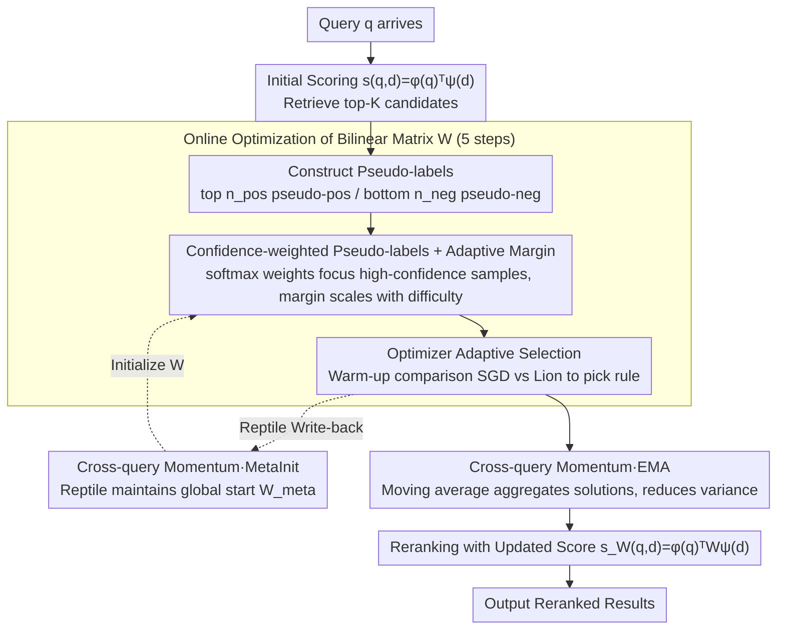

# Test-Time Training for Zero-Resource Dense Retrieval Reranking

**Conference**: ACL2026  
**arXiv**: [2606.01070](https://arxiv.org/abs/2606.01070)  
**Code**: None  
**Area**: Information Retrieval  
**Keywords**: Zero-shot Reranking, Test-Time Adaptation, Dense Retrieval, Bilinear Scoring Matrix

## TL;DR
Proposes DART, which adaptively adjusts the scoring function of dense retrievers at inference time using a bilinear matrix. By utilizing retrieval results as pseudo-labels for zero-resource unlabeled reranking, it achieves an average improvement of 2.1% NDCG@10 on the BEIR benchmark with latency kept under 10ms.

## Background & Motivation

**Background**: In modern information retrieval systems, two-stage cascade architectures have become standard: the first stage uses fast dense retrievers (bi-encoders) for candidate retrieval from the entire corpus, and the second stage uses precise but slow rerankers (cross-encoders or LLMs) for refinement. Dense retrievers are preferred for their millisecond-level latency and strong recall, but the reranking stage faces severe zero-resource challenges.

**Limitations of Prior Work**: Supervised reranking methods (cross-encoders, LLM rerankers) require expensive human-annotated data and massive computational resources. Methods like ColBERT perform well but often have latencies over 200–500ms, restricting real-time applications. In unlabeled settings, practitioners are often forced to skip reranking and use raw dense retrieval rankings, especially in vector database systems. Additionally, unsupervised PRF (pseudo-relevance feedback) shows unstable or even detrimental performance on most BEIR datasets.

**Key Challenge**: Zero-resource unlabeled reranking forces a choice between expensive supervised methods or unreliable unsupervised heuristics; achieving both efficiency and reliability is difficult.

**Goal**: Find a lightweight, cheap, fast, and reliable zero-resource reranking solution that requires neither external resources nor offline training.

**Key Insight**: A critical but overlooked signal exists: the ranked list from the retriever itself contains task-relevant information. Top-ranked documents are likely relevant (pseudo-positives), while bottom-ranked ones are likely irrelevant (pseudo-negatives). Although noisy, these pseudo-labels are query-specific and readily available.

**Core Idea**: Instead of changing query or document representations, directly personalize the scoring function for each query at inference time. This maintains the capabilities of pre-trained dense retrievers while learning query-specific adjustments. This is the first application of Test-Time Training (TTT) in retrieval reranking.

## Method

### Overall Architecture

DART models zero-resource reranking as online optimization. For each incoming query $q$, it first retrieves top-$K$ documents using an initial scoring function $s(q,d)=\phi(q)^\top\psi(d)$. Based on pseudo-labels (top $n_{\text{pos}}$ as pseudo-positives, bottom $n_{\text{neg}}$ as pseudo-negatives), it optimizes a bilinear transformation matrix $W$ via gradient steps, upgrading the scoring function to $s_W(q,d)=\phi(q)^\top W\psi(d)$. After optimization, results are reranked using the updated matrix. To enhance stability and generalization, it maintains cross-query momentum states (MetaInit and EMA).

### Key Designs

**1. Confidence-weighted pseudo-labels + Adaptive margin drive online optimization of the bilinear matrix**

Ours does not modify query or document representations but upgrades the scoring function to $s_W(q,d)=\phi(q)^\top W\psi(d)$. A learnable $d\times d$ matrix $W$ dynamically adjusts the importance of semantic dimensions for the current query, with $W$ initialized as the identity matrix $I$. To handle noisy pseudo-labels, positives are weighted by $w_i^+ = \exp(s_i/T)/\sum_{i'}\exp(s_{i'}/T)$ and negatives by $w_j^- = \exp(-s_j/T)/\sum_j\exp(-s_j/T)$, focusing gradients on high-confidence samples. Furthermore, the margin $\text{margin}(q) = \alpha_{\text{mar}} + \beta_{\text{mar}}(1-s_{\text{top1}})$ scales with query difficulty, avoiding the mismatch of fixed margins across varying query complexities.

**2. Cross-query momentum (MetaInit + EMA): Aggregating weak signals into stable directions**

With only ~100 documents per query, optimization signals are weak and prone to overfitting. DART maintains two complementary states for cross-query smoothing. MetaInit learns a global starting point $W_{\text{meta}}$ updated via Reptile: $W_{\text{meta}}^{(t)} = W_{\text{meta}}^{(t-1)} + \beta_{\text{meta}}(W^\star(t) - W_{\text{meta}}^{(t-1)})$, allowing the next query to converge faster. EMA performs a moving average of the final matrices: $W_{\text{ema}} = \alpha_{\text{ema}}W_{\text{ema}} + (1-\alpha_{\text{ema}})W^\star$, aggregating solutions across the query stream to reduce variance. EMA was found to be the most effective, providing gains across all datasets.

**3. Optimizer adaptive selection (SGD vs Lion): Picking rules based on pseudo-label quality**

Differences in dataset sparsity and domain result in varying pseudo-label quality. DART runs SGD-with-momentum and Lion in parallel for the first 50–100 queries, comparing their average pseudo-label losses. The more effective optimizer is chosen for subsequent queries: SGD is more stable for noisy data, while Lion's sign-based updates excel on cleaner labels (providing a +4.1% boost on SCIDOCS).

## Key Experimental Results

### Main Results

Evaluated on six BEIR benchmark datasets:

| Dataset | NFCorpus | SCIDOCS | FiQA | ArguAna | TREC-COVID | SciFact | Average | Avg. Relative Gain | Latency |
|--------|----------|---------|------|---------|------------|---------|------|-----------|------|
| Dense Retrieval (BGE-small) | 0.337 | 0.197 | 0.385 | 0.595 | 0.665 | 0.720 | 0.483 | 0.0% | <1ms |
| BM25 Reranking | 0.302 | 0.156 | 0.220 | 0.371 | 0.685 | 0.588 | 0.387 | −21.2% | <2ms |
| PRF-Vec (n=3) | 0.347 | 0.203 | 0.371 | 0.602 | 0.663 | 0.710 | 0.483 | +0.3% | <2ms |
| **Ours (DART)** | **0.354** | **0.205** | **0.389** | **0.605** | **0.670** | **0.719** | **0.490** | **+2.1%** | **<10ms** |

Ours surpasses the dense retrieval baseline on 5/6 datasets, with the largest gain on NFCorpus (+5.0%). Compared to unsupervised LLM methods, DART achieves peak performance with <10ms latency (over 20x faster).

### Ablation Study

| Configuration | NFCorpus | SCIDOCS | FiQA | ArguAna | Avg Gain |
|------|----------|---------|------|---------|---------|
| Dense Retrieval | 0.337 | 0.197 | 0.385 | 0.595 | 0.0% |
| Base (Confidence weight only) | 0.346 | 0.199 | 0.363 | 0.595 | +0.5% |
| + AdaMargin | 0.350 | 0.201 | 0.362 | 0.595 | +3.9% |
| + EMA | 0.351 | 0.199 | 0.378 | 0.596 | +4.0% |
| + MetaInit | 0.348 | 0.197 | 0.362 | 0.599 | +3.3% |
| + EMA + AdaMargin | 0.355 | 0.203 | 0.378 | 0.597 | +5.3% |
| + All (incl. Lion) | 0.354 | 0.205 | 0.389 | 0.605 | +5.0% |

**Key Findings**:

- **EMA is most effective**, yielding positive gains across all four datasets.
- **AdaMargin contributes most to NFCorpus**, which has a wide query difficulty distribution.
- **Lion provides a +4.1% step improvement on SCIDOCS**, confirming its advantage when pseudo-labels are clean.
- **Components are complementary**, with the full combination achieving optimal average results.

## Highlights & Insights

- **Clever Pseudo-label Reliability Design**: Instead of binary labels, soft confidence weights $\exp(s_i/T)$ are used, an approach transferable to other pseudo-label scenarios (domain adaptation, active learning).
- **Query Difficulty Adaptive Margin**: $\text{margin}(q) = \alpha_{\text{mar}} + \beta_{\text{mar}}(1-s_{\text{top1}})$ elegantly quantifies query difficulty to regulate learning intensity.
- **Discovery of Low-rank Structure**: The learned transformation matrix $\Delta W$ exhibits distinct low-rank properties (top three singular values explain 28.4% of variance), indicating the network automatically adjusts within a task-relevant subspace.
- **Practical Innovation under Strict Latency**: Achieves results using 5 gradient steps and matrix multiplication within a <10ms limit, balancing efficiency and effectiveness.
- **New Heights for Zero-resource Settings**: Achieves performance comparable to strong supervised methods in a setting with no annotations, no external resources, and no offline training.

## Limitations & Future Work

**Limitations**:

- **Warm-up Cost for Optimizer Selection**: Requires 50–100 queries; SGD is recommended as a default.
- **Scalability Bottleneck**: Current matrix optimization is $d \times d$; complexity grows quadratically with $d \geq 768$. Future work proposes low-rank parameterization ($W = I + AB^\top$).

**Personal Observation**:

- Improvement is limited where retrievers fail significantly (e.g., SciFact).
- Momentum assumes similarity in the query stream, which may fail in drastically shifting session contexts.
- Listwise loss functions were not explored.

**Future Directions**:

- Implementing low-rank parameterization for large embedding dimensions.
- Adapting to session-level or cluster-level query streams.
- Distilling $W$ into fixed parameters for systems that do not support gradients.

## Related Work & Insights

- **vs. Traditional PRF**: PRF modifies query representations; Ours keeps representations fixed and adjusts the scoring function. These are complementary.
- **vs. Unsupervised Domain Adaptation (GPL, AugTriever)**: These require offline training and synthetic data; Ours is fully online with zero offline cost.
- **vs. LLM Rerankers**: LLMs are strong but slow (200–500ms). Ours trades lightweight adaptation for low latency.
- **vs. TTT in CV**: TTT++ successfully personalizes classifications; DART represents the first successful transfer to retrieval reranking.

## Rating

- **Novelty**: ⭐⭐⭐⭐⭐ First application of Test-Time Training to retrieval reranking; clever use of retrieval results as pseudo-labels.
- **Experimental Thoroughness**: ⭐⭐⭐⭐⭐ Validation across six BEIR datasets, detailed ablations, and low-rank analysis.
- **Writing Quality**: ⭐⭐⭐⭐ Logical, well-motivated, and precise.
- **Value**: ⭐⭐⭐⭐⭐ Addresses a common industry scenario with a simple, low-cost, and stable solution.

<!-- RELATED:START -->

## Related Papers

- [\[NeurIPS 2025\] Retrieval is Not Enough: Enhancing RAG Reasoning through Test-Time Critique and Optimization](../../NeurIPS2025/information_retrieval/retrieval_is_not_enough_enhancing_rag_reasoning_through_test-time_critique_and_o.md)
- [\[ACL 2026\] CRAFT: Training-Free Cascaded Retrieval for Tabular QA](craft_training-free_cascaded_retrieval_for_tabular_qa.md)
- [\[ACL 2026\] ChunQiuTR: Time-Keyed Temporal Retrieval in Classical Chinese Annals](chunqiutr_time-keyed_temporal_retrieval_in_classical_chinese_annals.md)
- [\[ICML 2026\] BlitzRank: Principled Zero-shot Ranking Agents with Tournament Graphs](../../ICML2026/information_retrieval/blitzrank_principled_zero-shot_ranking_agents_with_tournament_graphs.md)
- [\[ACL 2026\] More Than Efficiency: Embedding Compression Improves Domain Adaptation in Dense Retrieval](more_than_efficiency_embedding_compression_improves_domain_adaptation_in_dense_r.md)

<!-- RELATED:END -->
