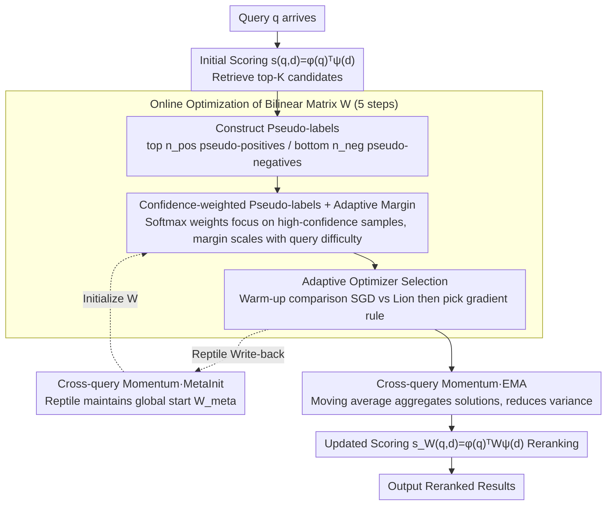

# Test-Time Training for Zero-Resource Dense Retrieval Reranking

**Conference**: ACL2026  
**arXiv**: [2606.01070](https://arxiv.org/abs/2606.01070)  
**Code**: None  
**Area**: Information Retrieval  
**Keywords**: Zero-shot Reranking, Test-Time Adaptation, Dense Retrieval, Bilinear Scoring Matrix

## TL;DR
DART is proposed to adaptively adjust the scoring function of dense retrievers using a bilinear matrix at inference time. By utilizing retrieval results as pseudo-labels for zero-shot unlabeled reranking, it achieves an average improvement of 2.1% NDCG@10 on the BEIR benchmark with latency controlled under 10ms.

## Background & Motivation

**Background**: In modern information retrieval systems, the two-stage cascaded architecture has become standard: the first stage uses a fast dense retriever (bi-encoder) for candidate retrieval from the entire corpus, and the second stage uses an accurate but slow reranker (cross-encoder or LLM) to further refine the ranking. Dense retrievers are preferred for their millisecond-level latency and strong recall, but the reranking stage faces severe zero-resource challenges.

**Limitations of Prior Work**: Supervised reranking methods (cross-encoders, LLM rerankers) require expensive human-annotated data and massive computational resources. While methods like ColBERT perform well, their latency often exceeds 200–500ms, severely restricting real-time applications. In unlabeled settings, practitioners are often forced to skip the reranking step and use the raw dense retrieval scores, which is common in vector database systems that index only vectors. Meanwhile, unsupervised PRF (Pseudo-Relevance Feedback) does not require training data but exhibits unstable performance across most BEIR datasets, sometimes even deteriorating retrieval results.

**Key Challenge**: To achieve zero-resource unlabeled reranking, one must choose between supervised methods (requiring data and time) or rely on unsupervised heuristics (unreliable), making it difficult to balance both.

**Goal**: To find a lightweight, inexpensive, fast, and reliable zero-resource reranking solution that requires neither external resources nor offline training.

**Key Insight**: A critical but overlooked signal is observed—the ranked list from the retriever itself contains task-relevant useful information: top-ranked documents are likely relevant (pseudo-positives), and bottom-ranked documents are likely irrelevant (pseudo-negatives). Although these pseudo-labels are noisy, they are query-specific and readily available.

**Core Idea**: Instead of changing query or document representations, the scoring function is personalized for each query at inference time. This preserves the capabilities of the pre-trained dense retriever while learning query-specific adjustments. This marks the first application of Test-Time Training (TTT) logic to retrieval reranking.

## Method

### Overall Architecture

DART models zero-resource reranking as an online optimization: for each incoming query $q$, it first retrieves top-$K$ documents using the initial scoring function $s(q,d)=\phi(q)^\top\psi(d)$. Based on pseudo-labels from these documents (top $n_{\text{pos}}$ as pseudo-positives, bottom $n_{\text{neg}}$ as pseudo-negatives), a bilinear transformation matrix $W$ is optimized via gradient steps, upgrading the scoring function to $s_W(q,d)=\phi(q)^\top W\psi(d)$. After optimization, the updated matrix is used to rerank the retrieval results. To enhance stability and generalization, cross-query momentum states (MetaInit and EMA) are maintained, allowing subsequent queries to benefit from the adaptation experience of prior queries.

### Key Designs

**1. Confidence-weighted Pseudo-labels + Adaptive Margin drive online optimization of the bilinear scoring matrix**

DART does not modify query or document representations; instead, it upgrades the scoring function from fixed cosine similarity to $s_W(q,d)=\phi(q)^\top W\psi(d)$. A learnable $d \times d$ matrix $W$ dynamically adjusts the weight of each semantic dimension for the current query. $W$ is initialized as the identity matrix $I$ to ensure it starts equivalent to the original retrieval. Since pseudo-labels are noisy, weighting is applied: positives are weighted by $w_i^+ = \exp(s_i/T)/\sum_{i'}\exp(s_{i'}/T)$ and negatives by $w_j^- = \exp(-s_j/T)/\sum_j\exp(-s_j/T)$. This automatically focuses gradients on high-confidence samples. Furthermore, the margin is not fixed but scales with query difficulty: $\text{margin}(q) = \alpha_{\text{mar}} + \beta_{\text{mar}}(1-s_{\text{top1}})$. High top-1 scores (easy queries) lower the requirement, while low scores (hard queries) demand larger margins and more aggressive adjustments.

**2. Cross-query Momentum (MetaInit + EMA): Aggregating weak signals into stable directions**

With only about top-100 documents per query, optimization signals are weak and prone to overfitting query-specific noise. DART maintains two complementary matrix states to smooth parameter evolution: MetaInit learns a global starting point $W_{\text{meta}}$, updated via Reptile $W_{\text{meta}}^{(t)} = W_{\text{meta}}^{(t-1)} + \beta_{\text{meta}}(W^\star(t) - W_{\text{meta}}^{(t-1)})$ after each query to accelerate convergence for the next query. EMA applies a moving average to the final reranking matrix $W_{\text{ema}} = \alpha_{\text{ema}}W_{\text{ema}} + (1-\alpha_{\text{ema}})W^\star$, aggregating solutions from multiple queries to reduce variance. Both methods turn scattered learning signals into a stable direction; experiments show EMA is most effective, providing gains across all datasets.

**3. Adaptive Optimizer Selection (SGD vs Lion): Choosing gradient rules based on pseudo-label quality**

Variations in dataset sparsity and domain result in differing pseudo-label quality. DART runs SGD-with-momentum and Lion in parallel for the first 50–100 queries, comparing their average pseudo-label loss. The one with lower loss is selected for subsequent queries: SGD is more stable for noisy datasets, while Lion's sign-based updates are superior for cleaner pseudo-labels (e.g., +4.1% in a single step on SCIDOCS). This incurs a one-time warm-up cost; the authors suggest defaulting to SGD if warm-up is not possible.

## Key Experimental Results

### Main Results

Evaluated on six BEIR benchmark datasets:

| Dataset | NFCorpus | SCIDOCS | FiQA | ArguAna | TREC-COVID | SciFact | Average | Avg. Relative Gain | Latency |
|--------|----------|---------|------|---------|------------|---------|------|-----------|------|
| Dense Retrieval (BGE-small) | 0.337 | 0.197 | 0.385 | 0.595 | 0.665 | 0.720 | 0.483 | 0.0% | <1ms |
| BM25 Reranking | 0.302 | 0.156 | 0.220 | 0.371 | 0.685 | 0.588 | 0.387 | −21.2% | <2ms |
| PRF-Vec (n=3) | 0.347 | 0.203 | 0.371 | 0.602 | 0.663 | 0.710 | 0.483 | +0.3% | <2ms |
| **DART (Ours)** | **0.354** | **0.205** | **0.389** | **0.605** | **0.670** | **0.719** | **0.490** | **+2.1%** | **<10ms** |

DART outperforms the dense retrieval baseline on 5/6 datasets, with the largest gain on NFCorpus (+5.0%). The disastrous performance of BM25 reranking (−21.2%) highlights the mismatch of lexical methods. Compared to recent unsupervised LLM methods, DART achieves top performance with <10ms latency (over 20x faster than their 200ms).

### Ablation Study

| Config | NFCorpus | SCIDOCS | FiQA | ArguAna | Average Gain |
|------|----------|---------|------|---------|---------|
| Dense Retrieval | 0.337 | 0.197 | 0.385 | 0.595 | 0.0% |
| Base (Confidence only) | 0.346 | 0.199 | 0.363 | 0.595 | +0.5% |
| + AdaMargin | 0.350 | 0.201 | 0.362 | 0.595 | +3.9% |
| + EMA | 0.351 | 0.199 | 0.378 | 0.596 | +4.0% |
| + MetaInit | 0.348 | 0.197 | 0.362 | 0.599 | +3.3% |
| + EMA + AdaMargin | 0.355 | 0.203 | 0.378 | 0.597 | +5.3% |
| + All (incl. Lion) | 0.354 | 0.205 | 0.389 | 0.605 | +5.0% |

**Key Findings**:

- **EMA is most effective**, yielding positive gains across all four datasets.
- **AdaMargin contributes most to NFCorpus**, which has a wide distribution of query difficulties.
- **Lion provides a +4.1% single-step boost on SCIDOCS**, confirming its advantage when pseudo-labels are clean.
- **The three components are complementary**, with the full combination achieving the best average gain.

## Highlights & Insights

- **Clever design for pseudo-label reliability**: Instead of hard binarization, soft confidence weights $\exp(s_i/T)$ are used for automatic weighting, a concept transferable to other pseudo-label scenarios (domain adaptation, active learning).
- **Query-difficulty adaptive margin**: $\text{margin}(q) = \alpha_{\text{mar}} + \beta_{\text{mar}}(1-s_{\text{top1}})$ elegantly quantifies query difficulty into a scalar to regulate learning intensity.
- **Discovery of low-rank structure**: The transformation matrix $\Delta W$ learned by DART exhibits significant low-rank properties (top 3 singular values explain 28.4% variance), suggesting the network automatically adjusts within a small task-relevant subspace of semantic dimensions.
- **Practical innovation under strict latency constraints**: Achieving results with only 5 gradient steps and matrix multiplication under a <10ms limit demonstrates a perfect balance between efficient computation and effectiveness.
- **New height in zero-resource settings**: Achieves performance comparable to strongly supervised methods in the absolute "forbidden zone" of no labels, no external resources, and no offline training.

## Limitations & Future Work

**Limitations acknowledged by the authors**:

- **Warm-up cost for optimizer selection**: Requires 50–100 queries to compare optimizers; SGD is recommended as the default.
- **Scalability bottleneck**: The current implementation optimizes a $d \times d$ matrix; for $d \geq 768$, memory and computation costs grow quadratically. The paper proposes a low-rank parameterization $W = I + AB^\top$ for future implementation.

**Own observations**:

- Gains are limited in domains where the retriever itself fails severely (e.g., −0.1% on SciFact) due to poor pseudo-label quality.
- Cross-query momentum assumes similarity in the query stream; it may fail in scenarios with drastic conversational topic shifts.
- Other loss function designs, such as listwise losses, have not been investigated.

**Specific improvement ideas**:

- Implement low-rank parameterization to support larger embedding dimensions.
- Study adaptation at the session or session-cluster level.
- Explore distilling knowledge from matrix $W$ into fixed parameters for edge systems that do not support gradients.

## Related Work & Insights

- **vs Traditional Pseudo-Relevance Feedback (PRF)**: PRF utilizes pseudo-relevant documents by modifying query representations, whereas DART keeps representations fixed and adjusts the scoring function. These are complementary, with DART being more precise and flexible.
- **vs Unsupervised Domain Adaptation (GPL, AugTriever)**: These require offline training and data generation; DART is entirely online with zero offline cost.
- **vs LLM Rerankers**: LLMs have strong text understanding but their 200–500ms latency is unsuitable for real-time systems. DART trades light parameter adaptation for low latency.
- **vs TTT in Vision**: TTT++ validated test-time parameter adaptation for image classification; DART successfully migrates this to retrieval ranking.

## Rating

- **Novelty**: ⭐⭐⭐⭐⭐ First application of Test-Time Training to retrieval reranking, cleverly using retrieval results as pseudo-labels for zero-resource adaptation.
- **Experimental Thoroughness**: ⭐⭐⭐⭐⭐ Cross-domain validation on six BEIR datasets, complete ablation studies, and in-depth low-rank structure analysis.
- **Writing Quality**: ⭐⭐⭐⭐ Clear logic, well-motivated, precise method descriptions, and complete algorithm pseudocode.
- **Value**: ⭐⭐⭐⭐⭐ Directly addresses a very common industrial scenario with a simple, low-overhead, and stable solution, offering high practical value.

<!-- RELATED:START -->

## Related Papers

- [\[ICLR 2026\] Reusing Pre-training Data at Test Time is a Compute Multiplier](../../ICLR2026/information_retrieval/reusing_pre-training_data_at_test_time_is_a_compute_multiplier.md)
- [\[ICLR 2026\] Robust Test-Time Video-Text Retrieval: Benchmarking and Adapting for Query Shifts](../../ICLR2026/information_retrieval/robust_test-time_video-text_retrieval_benchmarking_and_adapting_for_query_shifts.md)
- [\[ICLR 2026\] MetaEmbed: Scaling Multimodal Retrieval at Test-Time with Flexible Late Interaction](../../ICLR2026/information_retrieval/metaembed_scaling_multimodal_retrieval_at_test-time_with_flexible_late_interacti.md)
- [\[ACL 2026\] Low-Resource Language Dilemma in Multilingual Retrieval: Evidence from Amharic](the_multilingual_curse_at_the_retrieval_layer_evidence_from_amharic.md)
- [\[ACL 2026\] More Than Efficiency: Embedding Compression Improves Domain Adaptation in Dense Retrieval](more_than_efficiency_embedding_compression_improves_domain_adaptation_in_dense_r.md)

<!-- RELATED:END -->
