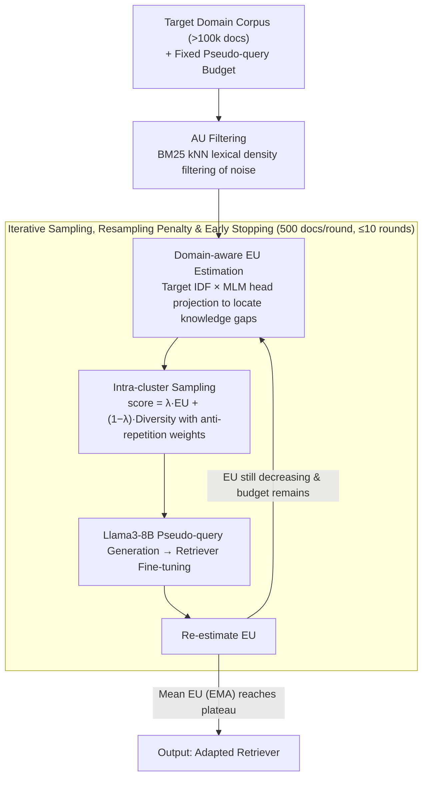

# UnIte: Uncertainty-based Iterative Document Sampling for Domain Adaptation in Information Retrieval

**Conference**: ACL2026 Findings  
**arXiv**: [2604.25142](https://arxiv.org/abs/2604.25142)  
**Code**: https://github.com/ldilab/UnIte  
**Area**: Information Retrieval  
**Keywords**: Unsupervised Domain Adaptation, Document Sampling, Retrieval Augmentation, Uncertainty Estimation, BEIR

## TL;DR
UnIte shifts the bottleneck of unsupervised domain adaptation for neural retrievers from "generating more pseudo-queries" to "smarter document selection." It first filters low-density noisy documents using aleatoric uncertainty, then iteratively samples high-value documents based on epistemic uncertainty that evolves dynamically with model training. It consistently outperforms DUQGen on large BEIR corpora while using fewer pseudo-queries.

## Background & Motivation
**Background**: Neural retrievers are typically pre-trained on source domains like MS-MARCO and suffer from significant performance degradation when applied to new domains. A mainstream approach for unsupervised domain adaptation is pseudo-query generation: generating pseudo-queries from target domain documents and then fine-tuning the retriever using these query-document pairs.

**Limitations of Prior Work**: Large-scale corpora often exceed 100k documents, making it computationally prohibitive to invoke LLMs or query generators for every document. Consequently, "which documents to sample for pseudo-query generation" becomes the core budget bottleneck. Random sampling is inefficient, and while DUQGen uses clustering to improve coverage, it primarily optimizes for diversity. This often leads to sampling from two low-value regions: low-density outlier documents and high-confidence regions where the current retriever is already certain.

**Key Challenge**: Domain adaptation requires documents that are both reliable and possess high learning value. Low-density outliers may contain noise or off-topic content, leading to negative transfer. High-confidence documents, while representing common themes, offer limited gains as the model has already mastered them. An effective sampler should simultaneously avoid high aleatoric uncertainty (AU) noise and prioritize high epistemic uncertainty (EU) knowledge gaps.

**Goal**: Under a fixed pseudo-query budget, select target domain documents with higher training value to achieve higher nDCG@10 with smaller sample sizes, while dynamically updating the sampling strategy as the retriever adapts.

**Key Insight**: The authors decompose uncertainty into data-level AU and model-level EU. AU is estimated using model-agnostic BM25 lexical kNN distances to avoid misinterpreting "unlearned content" as "data anomalies." EU is measured by the mismatch between the document representations of the current retriever and the IDF distribution of the target domain.

**Core Idea**: First, filter high-AU outliers. Subsequently, re-estimate EU after each training round and iteratively sample documents using a strategy that combines "high EU + high diversity + anti-repetitive sampling penalty" until the average EU reaches a plateau.

## Method

### Overall Architecture

UnIte addresses a budget-constrained sampling problem: given a target domain corpus exceeding 100k documents and a fixed pseudo-query budget, identify the most valuable documents for query generation and fine-tuning. The approach bifurcates document selection into data-level and model-level assessments—first using a model-agnostic AU filter to remove low-density noise, followed by an iterative cycle of "EU estimation → sampling → pseudo-query generation → retriever fine-tuning → EU re-estimation." Each training round recalculates where knowledge gaps remain, dynamically reallocating the remaining budget.

The entire loop uses the Exponential Moving Average (EMA) of the mean EU as a stopping signal: a decreasing EU indicates the model is filling knowledge gaps, while a rebound suggests new samples are becoming redundant or causing overfitting, prompting an early exit even if the budget is not exhausted.

### Key Designs

**1. AU Filtering: Model-agnostic lexical density for noise removal**

Large corpora often contain off-topic, fragmented, or marginal documents. Generating pseudo-queries from these leads to negative transfer. However, "data-level anomalies" should not be judged by the model currently being adapted—otherwise, unlearned target domain content might be mistakenly discarded. UnIte bases aleatoric uncertainty entirely on corpus statistics: for each document, it calculates the lexical distance to the $k$-th nearest neighbor $D_k(d)=1/(\epsilon + \mathrm{BM25}(d,n_k))$, followed by a modified z-score normalization. Documents with $z(d)>z_{thr}$ are identified as low-density outliers and filtered ($k=3, z_{thr}=1.5$). Since BM25 relies on term frequency co-occurrence rather than embeddings, AU remains independent of model-level uncertainty.

**2. Domain-aware EU Estimation: Locating knowledge gaps using target IDF**

After filtering noise, the most valuable documents are those the model has not yet mastered. Traditional entropy or MC-dropout only considers the model's internal prediction variance without awareness of important target domain terms. UnIte's epistemic uncertainty explicitly incorporates the target domain distribution: it pre-calculates token-level IDF in the target domain, then uses the current retriever's MLM head to project document representations into vocabulary probabilities (top-1000 tokens). It then measures the mismatch between the importance of high-IDF terms and the model's actual predicted probabilities. The less the model predicts high-IDF keywords, the higher the EU for that document, directly aligning the uncertainty signal with domain adaptation value.

**3. Iterative Sampling, Resampling Penalty, and Early Stopping**

EU is not static—a high-value cluster in the first round may be learned after a few iterations. Static one-time sampling wastes budget on these now-dominant clusters. UnIte samples only 500 documents per round for a maximum of 10 rounds. Within DUQGen-style clusters, it uses $score=\lambda \widehat{EU}+(1-\lambda)\widehat{Diversity}$ (with $\lambda=0.5$) to balance gaps and coverage. It also applies an anti-repetition weight $w_i=|C_i|/(P_i+\epsilon)$ to each cluster's budget, where $P_i$ is the number of previously sampled documents, forcing the algorithm toward remaining gaps. The process stops based on the EMA-smoothed mean EU ($\alpha=0.4$): a plateau triggers early stopping, saving samples and preventing overfitting.

### Loss & Training

UnIte is a sampling strategy and does not modify the retriever's training objective. For each selected document, Llama3-8B-Instruct generates one pseudo-query (temperature 0.8, top-p 0.9). The retriever is then fine-tuned using its native standard objectives. The experiments cover bi-encoder retrievers like DPR, coCondenser, COCO-DR, and Qwen3-Embedding-4B, using nDCG@10 on BEIR as the primary metric. Experiments were conducted on a single NVIDIA RTX 3090; DPR training with 5k samples takes approximately 10 minutes, while UnIte's early stopping often utilizes only 3-5k samples.

## Key Experimental Results

### Main Results
The authors evaluated across five large-scale BEIR datasets: TREC-COVID, Robust04, Quora, TREC-NEWS, and HotpotQA. Table 1 summarizes the average results.

| Retriever | DUQGen AVG | UnIte AVG | Gain vs DUQGen | Representative Gains |
|-----------|------------|-----------|------------------|----------------------|
| DPR | 46.61 | 49.06 | +2.45 | TREC-COVID +4.04, TREC-NEWS +5.08 |
| coCondenser | 54.94 | 55.69 | +0.75 | Robust04 +1.53, TREC-NEWS +3.14 |
| COCO-DR | 62.01 | 62.27 | +0.26 | TREC-COVID +0.86, TREC-NEWS +0.47 |
| Qwen3-Embedding-4B | 69.31 | 72.80 | +3.49 | TREC-COVID +3.00, Quora +4.72, TREC-NEWS +4.86 |

UnIte's improvements are more pronounced in smaller models (DPR) and large models (Qwen3), suggesting that the "current knowledge gap" signal scales with model capacity. While absolute gains are smaller for the already strong COCO-DR, the average improvement remains positive.

### Ablation Study
The paper emphasizes the roles of AU, EU, and the resampling penalty.

| Configuration | TC nDCG@10 | QR nDCG@10 | TN nDCG@10 | Description |
|---------------|------------|------------|------------|-------------|
| w/ Resampling Penalty | 61.73 | 74.95 | 30.39 | Full dynamic budget allocation |
| w/o Resampling Penalty | 54.39 | 73.42 | 21.83 | Static cluster budget, prone to redundant sampling |
| Gain | +7.34 | +1.53 | +8.56 | Penalty is critical for TC / TN |

| EU Estimation Method | TC | RB | TN | AVG | Conclusion |
|----------------------|----|----|----|-----|------------|
| UnIte domain-aware EU | 55.54 | 31.38 | 23.33 | 36.75 | Incorporates target IDF |
| MC-Dropout | 52.79 | 28.27 | 21.60 | 34.22 | Internal variance only, lacks domain awareness |
| Entropy | 54.10 | 25.83 | 22.70 | 34.21 | Ignores domain mismatch |

| Method | DPR $\Delta$nDCG@10 / 1k | Avg. Samples | Qwen3 $\Delta$nDCG@10 / 1k | Avg. Samples |
|--------|-----------------------|--------------|-------------------------|--------------|
| DUQGen | 3.56 | 5k | 0.83 | 5k |
| UnIte | 4.50 | 4.5k | 2.45 | 4.5k |

### Key Findings
- Diversity alone is insufficient. DUQGen samples low-density outliers and high-confidence regions; the former introduces noise while the latter provides weak learning signals.
- AU and EU must be estimated separately. BM25 kNN handles data outliers while IDF-based projection handles model knowledge gaps. Mixing these in dense embeddings leads to mutual contamination.
- Early stopping not only saves samples but also prevents overfitting. The local minimum of mean EU aligns with the peak nDCG@10 on TREC-COVID, validating the uncertainty plateau as a sound unsupervised stopping signal.
- Computational overhead is acceptable. AU filtering takes ~120s once, and EU estimation takes ~150s per round.

## Highlights & Insights
- The mapping of active learning's uncertainty taxonomy to IR domain adaptation is clean: AU is noise to be avoided, and EU represents the most valuable gap to learn.
- EU estimation goes beyond simple entropy by measuring the mismatch between "predicted vocabulary distribution" and "target domain IDF importance."
- Iterative sampling better reflects the fine-tuning process. The value of a document changes as the model trains; static selection is wasteful when the budget is tight.
- The method is transferable to RAG data construction or reranker hard-negative selection.

## Limitations & Future Work
- The approach is primarily designed for bi-encoders. For late-interaction models like ColBERT or cross-encoders like MonoT5, the authors use pooling and shared MLM heads as approximations.
- Target domain distribution is currently represented purely by IDF statistics, which may not capture complex thematic structures or entity relationships.
- While the resampling penalty reduces oversampling of dominant clusters, it does not strictly guarantee coverage of rare minority topics in highly skewed domains.
- Experiments focused on English BEIR; validation in multilingual or highly specialized domains (e.g., legal/medical) is needed.

## Related Work & Insights
- **vs GPL**: GPL relies on random document sampling and expensive cross-encoder labeling. UnIte prioritizes efficient document selection first.
- **vs DUQGen**: DUQGen uses external Contriever for diversity clustering but is unaware of the retriever's current state. UnIte adds dynamic EU and AU filtering.
- **vs Quality sampling**: Quality models judge if a document is "query-worthy" but often ignore the current model's specific knowledge gaps.
- **vs AL Uncertainty Sampling**: Traditional AL methods often mistake outliers for high-value samples; UnIte explicitly separates the two.

## Rating
- Novelty: ⭐⭐⭐⭐☆
- Experimental Thoroughness: ⭐⭐⭐⭐☆
- Writing Quality: ⭐⭐⭐⭐☆
- Value: ⭐⭐⭐⭐⭐

<!-- RELATED:START -->

## Related Papers

- [\[ACL 2026\] Domain-Specific Data Generation Framework for RAG Adaptation](domain-specific_data_generation_framework_for_rag_adaptation.md)
- [\[ACL 2026\] More Than Efficiency: Embedding Compression Improves Domain Adaptation in Dense Retrieval](more_than_efficiency_embedding_compression_improves_domain_adaptation_in_dense_r.md)
- [\[ACL 2026\] Navigating Large-Scale Document Collections: MuDABench for Multi-Document Analytical QA](navigating_large-scale_document_collections_mudabench_for_multi-document_analyti.md)
- [\[CVPR 2025\] Preserving Clusters in Prompt Learning for Unsupervised Domain Adaptation](../../CVPR2025/information_retrieval/preserving_clusters_in_prompt_learning_for_unsupervised_domain_adaptation.md)
- [\[ACL 2026\] Feedback Adaptation for Retrieval-Augmented Generation](feedback_adaptation_for_retrieval-augmented_generation.md)

<!-- RELATED:END -->
