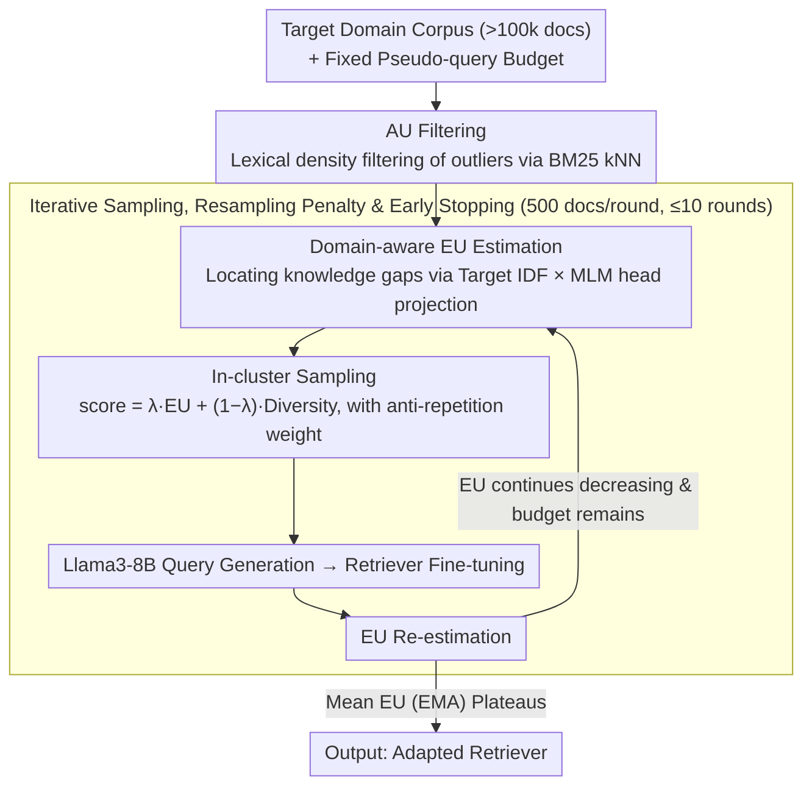

# UnIte: Uncertainty-based Iterative Document Sampling for Domain Adaptation in Information Retrieval

**Conference**: ACL2026 Findings  
**arXiv**: [2604.25142](https://arxiv.org/abs/2604.25142)  
**Code**: https://github.com/ldilab/UnIte  
**Area**: Information Retrieval  
**Keywords**: Unsupervised Domain Adaptation, Document Sampling, Retrieval Augmentation, Uncertainty Estimation, BEIR

## TL;DR
UnIte shifts the bottleneck of unsupervised domain adaptation for neural retrievers from "generating more pseudo-queries" to "selecting documents more intelligently." It uses aleatoric uncertainty to filter low-density noisy documents and epistemic uncertainty, which changes dynamically during training, to iteratively sample high-value documents. It consistently outperforms DUQGen on large BEIR corpora with fewer pseudo-queries.

## Background & Motivation
**Background**: Neural retrievers are typically pre-trained on source domains like MS-MARCO and suffer from significant generalization decline in new domains. A mainstream approach for unsupervised domain adaptation is pseudo-query generation: generating queries from target domain documents and fine-tuning the retriever on these pairs.

**Limitations of Prior Work**: Large-scale corpora often exceed 100k documents, making it impossible to call LLMs or query generators for every document. Thus, "which documents to sample for pseudo-query generation" becomes the core budget bottleneck. Random sampling is inefficient. DUQGen uses clustering to improve coverage, but it primarily optimizes diversity and tends to sample two low-value areas: low-density outlier documents and high-confidence regions where the current retriever is already certain.

**Key Challenge**: Domain adaptation requires documents that are both reliable and have high learning value. Low-density outliers may be noise or irrelevant content, leading to negative transfer. High-confidence documents represent common topics that the model has already mastered, offering limited gains from further training. An ideal sampler should simultaneously avoid noise with high aleatoric uncertainty and prioritize knowledge gaps with high epistemic uncertainty.

**Goal**: Select target domain documents with higher training value under a fixed pseudo-query budget, enabling the retriever to achieve higher nDCG@10 with a smaller sample size and dynamically updating the sampling strategy as the model adapts.

**Key Insight**: The authors decompose uncertainty into data-level aleatoric uncertainty (AU) and model-level epistemic uncertainty (EU). AU is estimated using model-agnostic BM25 lexical kNN distances to avoid misidentifying "unlearned content" as "data anomalies." EU is measured by the mismatch between the current retriever's document representations and the target domain's IDF distribution.

**Core Idea**: Filter high-AU outliers first, then re-estimate EU after each training round. Documents are sampled iteratively using a strategy of "high EU + high diversity + anti-repetition sampling penalty" until the average EU reaches a plateau.

## Method

### Overall Architecture

UnIte solves a budget-constrained sampling problem: given a target domain corpus exceeding 100k documents and a fixed pseudo-query budget, it selects the few thousand documents most worthy of generating queries for fine-tuning. The approach splits the selection into data-level and model-level judgments. It first applies model-agnostic AU filtering to remove low-density noise. It then enters an iterative cycle of "EU estimation → sampling → query generation → retriever fine-tuning → EU re-estimation." Each round re-evaluates knowledge gaps and dynamically directs the remaining budget to those areas.

The loop uses the Exponential Moving Average (EMA) of mean EU as a stopping signal: a decreasing EU indicates the model is filling gaps, while a rebound suggests redundancy or overfitting, prompting an early stop even if the 5k budget is not exhausted.

### Key Designs

**1. AU Filtering: Lexical Density for Noise Removal**

Large corpora contain irrelevant, fragmented, or peripheral documents. Using them for query generation causes negative transfer. This "data-level anomaly" should not be judged by the model currently being adapted—otherwise, unlearned target domain content might be accidentally deleted. UnIte bases aleatoric uncertainty entirely on corpus statistics: for each document, it calculates the lexical distance to the $k$-th nearest neighbor as $D_k(d)=1/(\epsilon + \mathrm{BM25}(d,n_k))$, followed by modified z-score normalization. Documents with $z(d)>z_{thr}$ are identified as low-density outliers and filtered. Settings used are $k=3$ and $z_{thr}=1.5$. BM25 relies on term frequency and is independent of embeddings, preventing the pollution of AU by model-level uncertainty.

**2. Domain-aware EU Estimation: Targeting Knowledge Gaps with IDF**

After filtering noise, the priority is to train on documents the model has not yet mastered. Traditional entropy or MC-dropout only considers internal model variance and ignores which terms are important in the target domain. UnIte's epistemic uncertainty explicitly incorporates the target domain distribution: it pre-calculates token-level IDF in the target domain, uses the current retriever's MLM head to project document representations into vocabulary probabilities (top-1000 tokens), and measures the mismatch between high-IDF term importance and actual model predictions. If the model fails to predict target-domain-specific high-IDF keywords, it indicates higher EU for that document's knowledge area, making it more valuable for training.

**3. Iterative Sampling, Resampling Penalty, and Early Stopping**

EU is not static. A high-value cluster in the first round may be mastered after several rounds. One-time static sampling wastes budget on these now-dominant clusters. UnIte samples 500 documents per round for up to 10 rounds. Within DUQGen-style clusters, it uses $score=\lambda \widehat{EU}+(1-\lambda)\widehat{Diversity}$ to balance gaps and coverage (with $\lambda=0.5$). It also applies an anti-repetition weight $w_i=|C_i|/(P_i+\epsilon)$ to each cluster's budget, where $P_i$ is the number of previously sampled documents, forcing the algorithm toward remaining gaps. The stopping condition uses EMA-smoothed mean EU ($\alpha=0.4$): an early stop at the plateau saves samples and prevents overfitting.

### Loss & Training

UnIte is a sampling strategy and does not change the retriever's training objective. For each selected document, Llama3-8B-Instruct generates one pseudo-query (temperature 0.8, top-p 0.9). Standard native objectives for each retriever are then used for fine-tuning. Experiments cover single-vector retrievers including DPR, coCondenser, COCO-DR, and Qwen3-Embedding-4B. The primary metric is nDCG@10 on BEIR. Experiments were conducted on a single NVIDIA RTX 3090; DPR training with 5k samples takes approximately 10 minutes, while UnIte's early stopping often reduces sample usage to 3-5k.

## Key Experimental Results

### Main Results
Evaluation was conducted on five large-scale BEIR datasets: TREC-COVID, Robust04, Quora, TREC-NEWS, and HotpotQA. The table below summarizes the average results from Table 1.

| Retriever | DUQGen AVG | UnIte AVG | Gain vs DUQGen | Representative Gain |
|-----------|------------|-----------|------------------|------------|
| DPR | 46.61 | 49.06 | +2.45 | TREC-COVID +4.04, TREC-NEWS +5.08 |
| coCondenser | 54.94 | 55.69 | +0.75 | Robust04 +1.53, TREC-NEWS +3.14 |
| COCO-DR | 62.01 | 62.27 | +0.26 | TREC-COVID +0.86, TREC-NEWS +0.47 |
| Qwen3-Embedding-4B | 69.31 | 72.80 | +3.49 | TREC-COVID +3.00, Quora +4.72, TREC-NEWS +4.86 |

UnIte's improvements are more pronounced in smaller models (DPR) and very large models (Qwen3), suggesting that "knowledge gap" signals scale with model capacity. While gains are smaller for the already strong COCO-DR, they remain positive on average.

### Ablation Study
The paper emphasizes the roles of AU, EU, and the resampling penalty. Visualization shows that removing EU can lead to results ~4 nDCG@10 lower than zero-shot on Robust04. Removing both AU and EU results in a drop of ~5 and ~9 nDCG@10 on TREC-COVID and Robust04, respectively.

| Configuration | TC nDCG@10 | QR nDCG@10 | TN nDCG@10 | Description |
|------|------------|------------|------------|------|
| w/ Resampling Penalty | 61.73 | 74.95 | 30.39 | Full dynamic budget allocation |
| w/o Resampling Penalty | 54.39 | 73.42 | 21.83 | Static cluster budget; oversamples dominant clusters |
| Gain | +7.34 | +1.53 | +8.56 | Penalty is critical for TC / TN |

| EU Estimation Method | TC | RB | TN | AVG | Conclusion |
|------------|----|----|----|-----|------|
| UnIte domain-aware EU | 55.54 | 31.38 | 23.33 | 36.75 | Incorporates target IDF distribution |
| MC-Dropout | 52.79 | 28.27 | 21.60 | 34.22 | Internal variance only; domain-agnostic |
| Entropy | 54.10 | 25.83 | 22.70 | 34.21 | Ignores domain mismatch |

| Method | DPR ΔnDCG@10 / 1k | Avg Samples | Qwen3 ΔnDCG@10 / 1k | Avg Samples |
|------|--------------------|------------|----------------------|------------|
| DUQGen | 3.56 | 5k | 0.83 | 5k |
| UnIte | 4.50 | 4.5k | 2.45 | 4.5k |

### Key Findings
- Diversity alone is insufficient. DUQGen samples low-density outliers (noise) and high-confidence regions (weak signal).
- AU and EU must be estimated separately. BM25 kNN handles data-level outliers, while IDF + MLM projection handles knowledge gaps; mixing them in dense embeddings causes contamination.
- Early stopping not only saves samples but also prevents overfitting. The local minimum of mean EU aligns with the nDCG@10 peak on TREC-COVID, validating the uncertainty plateau as a stopping signal.
- Computational overhead is acceptable. AU filtering takes ~120s once; EU estimation takes ~150s per round. Total time is often lower than the 5k sample baseline due to early stopping.

## Highlights & Insights
- The most valuable contribution is the precise mapping of active learning's uncertainty taxonomy to IR domain adaptation: AU identifies "do not train" noise, and EU identifies "priority learning" gaps.
- EU estimation is not just entropy; it is the mismatch between the model's predicted vocabulary distribution and target domain importance (IDF). This is a more effective adaptation signal than general model variance.
- Iterative sampling aligns better with the fine-tuning process than static sampling. As the model trains, the value of documents shifts; static selection is particularly wasteful under tight budgets.
- The method is transferable to RAG data construction or reranker hard-negative selection: filtering low-density noise before selecting samples based on the model's grasp of target domain terminology.

## Limitations & Future Work
- Primarily designed for single-vector retrievers. For late-interaction (ColBERT) or rerankers (MonoT5), the paper uses pooling and shared MLM heads as approximations, which may not perfectly align with native objectives.
- Target domain distribution currently relies on IDF statistics, which may fail to capture complex structures like topic hierarchies or entity relationships.
- The resampling penalty reduces oversampling of dominant clusters but does not strictly guarantee the coverage of rare minority topics.
- Experiments focused on English BEIR; validation is needed for cross-lingual retrieval and specialized domains (legal, medical).
- Pseudo-query quality remains dependent on Llama3-8B; generator unreliability in specific domains could limit improvements.

## Related Work & Insights
- **vs GPL**: GPL relies on random sampling followed by expensive cross-encoder labeling. UnIte focuses on making document selection more efficient rather than making labeling more accurate.
- **vs DUQGen**: DUQGen uses an external Contriever for diversity clustering. It provides good coverage but ignores the specific learner's state. UnIte adds dynamic EU and AU filtering.
- **vs Quality sampling**: Quality estimation models identify documents suitable for query generation but lack explicit consideration of domain mismatch. UnIte's signals are closer to the adaptation objective.
- **vs Active Learning**: Traditional uncertainty sampling (entropy/MC-dropout) often mistakes outliers for high-value samples. UnIte decouples AU to isolate learnable samples.

## Rating
- Novelty: ⭐⭐⭐⭐☆ Solid systemization of AU/EU taxonomy for IR sampling, though individual components draw on established IR and active learning ideas.
- Experimental Thoroughness: ⭐⭐⭐⭐☆ Covers 5 corpora and 4 retrievers with detailed ablations; multi-vector/reranker adaptation is still preliminary.
- Writing Quality: ⭐⭐⭐⭐☆ Clear motivation and well-supported claims, though some table layouts are slightly cluttered.
- Value: ⭐⭐⭐⭐⭐ Highly practical for budget-constrained IR domain adaptation; provides a reusable framework for RAG corpus selection.

<!-- RELATED:START -->

## Related Papers

- [\[ACL 2026\] Domain-Specific Data Generation Framework for RAG Adaptation](domain-specific_data_generation_framework_for_rag_adaptation.md)
- [\[ACL 2026\] More Than Efficiency: Embedding Compression Improves Domain Adaptation in Dense Retrieval](more_than_efficiency_embedding_compression_improves_domain_adaptation_in_dense_r.md)
- [\[CVPR 2025\] Preserving Clusters in Prompt Learning for Unsupervised Domain Adaptation](../../CVPR2025/information_retrieval/preserving_clusters_in_prompt_learning_for_unsupervised_domain_adaptation.md)
- [\[ACL 2026\] Feedback Adaptation for Retrieval-Augmented Generation](feedback_adaptation_for_retrieval-augmented_generation.md)
- [\[ACL 2026\] Navigating Large-Scale Document Collections: MuDABench for Multi-Document Analytical QA](navigating_large-scale_document_collections_mudabench_for_multi-document_analyti.md)

<!-- RELATED:END -->
