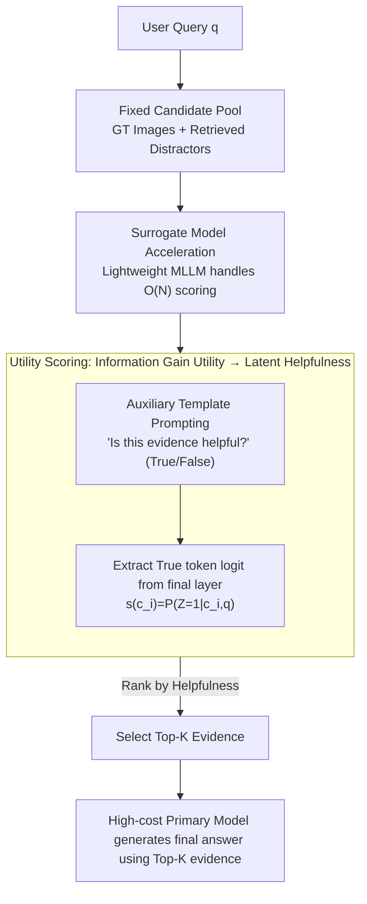

# Utility-Oriented Visual Evidence Selection for Multimodal Retrieval-Augmented Generation

**Conference**: ACL2026  
**arXiv**: [2605.13277](https://arxiv.org/abs/2605.13277)  
**Code**: https://github.com/Hcnaeg/utility-mrag  
**Area**: Information Retrieval  
**Keywords**: Multimodal RAG, Visual Evidence Selection, Information Gain, Lightweight Surrogate Model, Retrieval Reranking

## TL;DR
This paper shifts image selection in Multimodal RAG from "semantic similarity ranking" to "utility estimation" based on whether the image is helpful for the final answer. By utilizing a lightweight multimodal surrogate model to efficiently predict evidence helpfulness, it simultaneously improves answer quality and inference efficiency on MRAG-Bench and Visual-RAG.

## Background & Motivation
**Background**: Multimodal RAG typically retrieves a set of candidate images and provides the Top-K images to a Multimodal Large Language Model (MLLM) to generate an answer. Existing visual evidence selection methods mostly follow text RAG approaches, using CLIP, SigLIP, BGE-VL, or MLLM rerankers to estimate the semantic relevance between the query and the image.

**Limitations of Prior Work**: Relevant images are not necessarily helpful. For example, in dog breed identification, an image might score high due to salient attributes like "tongue sticking out" similar to the query, but it may belong to the wrong breed, failing to provide the discriminative information needed for a correct answer. Similarity-based retrieval emphasizes "how similar it looks," whereas RAG generation requires "whether it can change the model's judgment of the answer."

**Key Challenge**: Visual evidence selection faces two levels of misalignment. First, semantic relevance is inconsistent with downstream utility; relevant images might be redundant, misleading, or lack discriminative features. Second, estimating utility directly in the answer space is difficult because the output distribution of MLLMs is implicit, open-ended answers contain linguistic noise, and the cost of repeated generation or sampling is prohibitive.

**Goal**: The authors aim to establish a more principled visual evidence selection criterion that directly measures the helpfulness of candidate images for model generation. Additionally, this criterion must not rely on the expensive primary model generating answers for each candidate, as this would not scale to large candidate pools.

**Key Insight**: Starting from information theory, the paper defines evidence utility as "how much the model's uncertainty or belief regarding the answer distribution changes given the candidate evidence." Recognizing that directly computing information gain in the answer space is infeasible, the authors introduce a binary latent variable: whether the evidence is helpful.

**Core Idea**: The utility in the answer space is approximated using the latent helpfulness probability $P(Z=1|C=c,q)$. A small multimodal surrogate model performs the ranking of candidate images, and the primary model only receives the final selected evidence.

## Method
The key contribution of this paper is the redefinition of "evidence selection." Traditional retrievers answer "is this image related to the query," whereas this paper asks, "will this image make the target model more likely to answer correctly?" These are not equivalent in many multimodal scenarios, especially fine-grained recognition and visual common sense.

The authors define the ideal goal: if a candidate evidence $c$ is truly useful, the distribution of the model's output $Y$ should undergo a meaningful change after seeing it. This change is measured by information gain: $IG(Y;C=c|q)=D_{KL}(P_{Y|C=c,q}||P_{Y|q})$. However, this is only suitable for theoretical analysis because real MLLMs lack explicit output distributions, the open-ended answer space is vast, and different phrasing introduces noise into KL or uncertainty estimation.

To address this, the paper projects the answer-space utility into a smaller latent space. Latent variable $Z$ is a Bernoulli variable representing whether the evidence is helpful. Under mild assumptions—such as candidate evidence being "at least not significantly harmful" and the answer distribution changing monotonically with helpfulness—the authors prove that ranking by $IG(Z;C=c)$ preserves the optimal solution of ranking by $IG(Y;C=c)$. Furthermore, within a feasible candidate set, ranking by $IG(Z;C=c)$ is equivalent to ranking by $P(Z=1|C=c,q)$. Thus, the difficult comparison of answer distributions is transformed into a binary helpfulness scoring problem.

### Overall Architecture
The complete pipeline is retrieve-select-generate. First, the system constructs a fixed candidate pool using existing retrievers, containing ground-truth images and retrieved distractors. Second, a lightweight surrogate MLLM performs helpfulness judgment for each query-image pair, scoring and ranking candidates. Finally, the high-cost primary model generates the final answer using only the Top-K evidence.

Implementation-wise, an auxiliary question is constructed, such as "Is this evidence helpful for answering the user's question?", restricting the output space to True / False. For candidate image $c_i$, the input template $I=Template(q,c_i,q_{aux})$ combines the original query, image, and auxiliary instruction. The helpfulness score is derived from the logit of the "True" token in the final layer: $s(c_i)=\ell(v^+|I)$. This design avoids long answer generation and requires no additional training.

### Key Designs

**1. From Relevance to Information Gain Utility: Shifting the goal from "image-query similarity" to "impact on model response."**
Multimodal RAG failures often stem from images that "look relevant but are useless for the task"—e.g., a dog with its tongue out similar to the query but of the wrong breed. Similarity ranking in text RAG fails to capture this mismatch. This paper defines high-utility evidence as that which "significantly changes the model's posterior belief of the answer," using Information Gain $IG(Y;C=c|q)=D_{KL}(P_{Y|C=c,q}\|P_{Y|q})$ to characterize this change. It measures whether the evidence provides discriminative information, explaining why low-similarity images with key clues should be selected.

**2. Latent Helpfulness Variable: Dimensionality reduction of uncomputable answer-space utility into a binary judgment.**
$IG(Y;C=c|q)$ is difficult to compute directly. The paper projects answer-space utility onto a Bernoulli latent variable $Z$, where $Z=1$ indicates helpfulness. The authors prove that under mild assumptions, ranking by $IG(Z;C=c)$ is equivalent to ranking by $P(Z=1|C=c,q)$. This collapses the complex distribution comparison into a binary helpfulness score. Systemically, it uses an auxiliary prompt "Is this evidence helpful?" and extracts the "True" token logit $s(c_i)=\ell(v^+|I)$ as the score, requiring no additional training or long generation.

**3. Surrogate-accelerated Execution: Transferring $O(N)$ scoring from the large primary model to a small surrogate model.**
Real RAG candidate pools can be large; having an 8B–12B model judge or generate answers for every image is not scalable. The paper proposes the "utility transferability hypothesis": if an image is unhelpful or contradictory for a small model, it is likely unhelpful for the large model. Thus, lightweight models (e.g., Qwen3-VL-2B, Ovis2.5-2B) perform candidate ranking, and the primary model only generates once using the Top-K. Since judging helpfulness is easier than answering a question, this delegation maintains principled selection while being production-deployable.

### Loss & Training
Ours is a training-free method with no supervised training or gradient updates. The "training strategy" is essentially an inference-time scoring protocol: use a fixed candidate pool, apply an auxiliary helpfulness prompt, compare True/False logits, and pass Top-K images to the primary model. Experiments cover various primary models like Qwen3-VL, MiniCPM-V4.5, Gemma3, Ovis2.5, and InternVL3.5, comparing against CLIP-style, MLLM, answer-level uncertainty, and listwise ranking.

## Key Experimental Results

### Main Results
The main experiments evaluate Top-K evidence selection on MRAG-Bench and Visual-RAG. MRAG-Bench uses exact-match accuracy, while Visual-RAG uses LLM-as-Judge. The table below shows results for K=1, where Ours outperforms strong retrieval/reranking baselines.

| Method | Parameters | MRAG Qwen3-VL-8B | MRAG MiniCPM-V4.5 | Visual-RAG Qwen3-VL-8B | Visual-RAG Ovis2.5-9B |
| :--- | :--- | :--- | :--- | :--- | :--- |
| Zero-shot | No Image | 59.35 | 57.95 | 52.41 | 52.67 |
| GME | 2.2B | 64.38 | 65.19 | 55.88 | 67.51 |
| LamRA-Rank | 8B | 63.34 | 62.97 | 58.42 | 58.16 |
| Ours, Qwen3-VL-2B surrogate | 2.1B | 65.56 | 65.41 | 59.89 | 68.85 |
| Ours, Ovis2.5-2B surrogate | 2.6B | 64.97 | 64.08 | 61.36 | 69.12 |

Ours achieves up to +16.18 absolute improvement on Visual-RAG, often approaching the GT oracle. In some settings, it even slightly exceeds human-labeled image inputs, suggesting that "human-relevant images" are not always the most useful evidence for a specific MLLM.

### Ablation Study
The ablation focuses on latent helpfulness vs. answer-level uncertainty targets. Brackets indicate the gap between answer-level methods and Ours.

| Dataset / Main Model | Top-K | Ours | Answer-level Estimation | Gain |
| :--- | :--- | :--- | :--- | :--- |
| MRAG-Bench / Qwen3-VL-8B | Top-1 | 65.71 | 63.27 | -2.44 |
| MRAG-Bench / MiniCPM-V4.5 | Top-3 | 66.89 | 64.15 | -2.74 |
| Visual-RAG / Qwen3-VL-8B | Top-1 | 62.43 | 57.49 | -4.94 |
| Visual-RAG / Ovis2.5-9B | Top-1 | 70.05 | 54.81 | -15.24 |
| Visual-RAG / InternVL3.5-8B | Top-3 | 58.16 | 54.68 | -3.48 |

The target $Z$ is over 20x more efficient in decode FLOPs than target $Y$. In the Qwen3-VL family, discriminative estimation on a 2.1B surrogate has a decode latency of ~3 ms, compared to ~101 ms for answer-level uncertainty.

### Key Findings
- Semantic relevance is not a stable RAG target. Zero-shot sometimes outperforms retrieval-augmented baselines, showing that incorrect evidence provides negative gain.
- Latent helpfulness is better than answer-level uncertainty for evidence ranking, especially in open-ended Visual-RAG where answer-level methods are prone to generation noise.
- Lightweight surrogates and large models are highly consistent. The average gap between surrogate and main model is ~0.38 on MRAG-Bench and ~0.18 on Visual-RAG.
- Surrogate ranking scales across sizes. Qwen2.5-VL 3B/7B as surrogates for 72B show consistent GT hit rate trends.
- The method is training-free, lowering deployment costs compared to training specialized retrievers.

## Highlights & Insights
- The paper accurately identifies that retrieval should target images that change the answer, not just "similar" ones.
- Latent helpfulness is an elegant dimensionality reduction that preserves information gain theory while using cheap True/False logit scoring.
- Surrogate acceleration recognizes that judging helpfulness is simpler than answering, allowing small models to handle the heavy lifting.
- The framework is transferable to text, video, or audio evidence selection.
- Outperforming GT oracle suggests model-centric utility selection might be more adaptive to the generator than human annotations.

## Limitations & Future Work
- Theoretical assumptions are idealized; "at least not harmful" may not hold in noisy pools with misleading or adversarial samples.
- Surrogate choice is empirical; while 2B models work well, different tasks might require dynamic selection or calibration.
- Experiments focus on QA; long-form generation, dialogue, and interleaved multimodal retrieval are not yet fully validated.
- Helpfulness prompts may vary; binary judgments might become blurred in different languages or domains.
- The method selects evidence but does not fix the generator; hallucinations or ignoring evidence may still occur.

## Related Work & Insights
- **vs. CLIP / SigLIP**: These focus on similarity in embedding space and fail to understand downstream generation; Ours directly assesses helpfulness.
- **vs. MLLM Reranker**: Methods like LamRA-Rank or GME estimate matching; Ours specifically targets utility via helpfulness probes.
- **vs. Answer-level Uncertainty**: Uncertainty methods are noisy due to phrasing; Ours decouples utility from generation.
- **Insight**: This could be used in a two-stage system (similarity recall + utility reranking) or as weak supervision to distill a specialized utility model.

## Rating
- Novelty: ⭐⭐⭐⭐☆ The conversion from information gain to latent helpfulness is elegant and valuable.
- Experimental Thoroughness: ⭐⭐⭐⭐⭐ Comprehensive coverage across benchmarks, models, and efficiency analyses.
- Writing Quality: ⭐⭐⭐⭐☆ Clear motivation, though large tables require careful synthesis.
- Value: ⭐⭐⭐⭐⭐ Highly practical for production systems balancing cost and quality.

<!-- RELATED:START -->

## Related Papers

- [\[ACL 2026\] Learning to Extract Rational Evidence via Reinforcement Learning for Retrieval-Augmented Generation](learning_to_extract_rational_evidence_via_reinforcement_learning_for_retrieval-a.md)
- [\[ACL 2026\] MM-BizRAG: Rethinking Multimodal Retrieval-Augmented Generation for General Purpose Enterprise Q&A](mm-bizrag_rethinking_multimodal_retrieval-augmented_generation_for_general_purpo.md)
- [\[ICLR 2026\] RAVENEA: A Benchmark for Multimodal Retrieval-Augmented Visual Culture Understanding](../../ICLR2026/information_retrieval/ravenea_a_benchmark_for_multimodal_retrieval-augmented_visual_culture_understand.md)
- [\[NeurIPS 2025\] Windsock is Dancing: Adaptive Multimodal Retrieval-Augmented Generation](../../NeurIPS2025/information_retrieval/windsock_is_dancing_adaptive_multimodal_retrieval-augmented_generation.md)
- [\[ACL 2025\] SetR: Shifting from Ranking to Set Selection for Retrieval Augmented Generation](../../ACL2025/information_retrieval/setr_set_selection_rag.md)

<!-- RELATED:END -->
