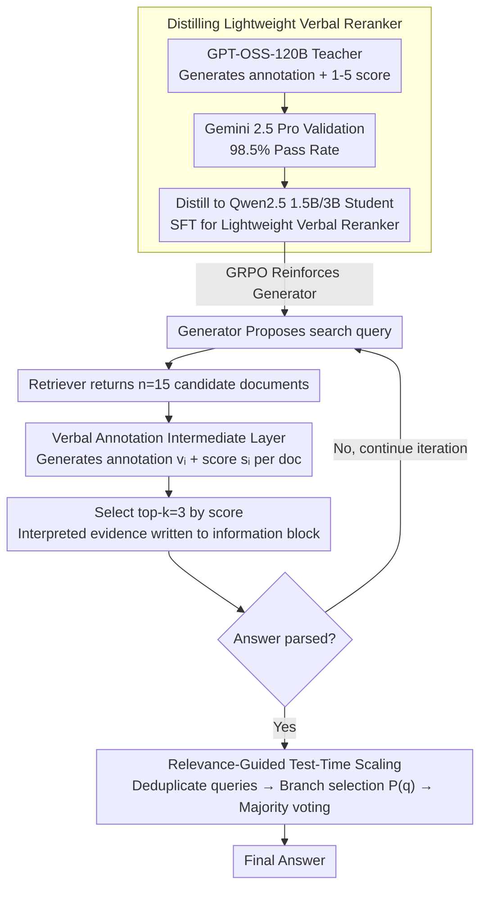

# Verbal-R3: Verbal Reranker as the Missing Bridge between Retrieval and Reasoning

**Conference**: ACL2026  
**arXiv**: [2605.01399](https://arxiv.org/abs/2605.01399)  
**Code**: https://github.com/0k9d0h1/VerbalR3  
**Area**: Information Retrieval  
**Keywords**: Retrieval-Augmented Generation (RAG), Reranking, Verbal Annotation, Reinforcement Learning, Test-time Scaling  

## TL;DR
Verbal-R3 upgrades traditional rerankers from modules that "only provide relevance scores" to bridge modules that "generate scores and explanatory Verbal Annotations." It then uses this module to train and guide RAG reasoners, simultaneously improving answer accuracy and test-time scaling efficiency in multi-hop question answering.

## Background & Motivation
**Background**: RAG systems typically retrieve candidate documents and then concatenate the raw passages into the LLM context, allowing the model to answer questions based on external information. To improve retrieval quality, many systems incorporate a reranker to reorder the documents from the first-stage retrieval and select top-k documents for the generator.

**Limitations of Prior Work**: The output of traditional rerankers is usually limited to relevance scores or document rankings. While this order helps in "selecting which documents to include," it does not inform the generator "why the document is relevant, which part supports the answer, or which content should be ignored." In multi-hop scenarios, as the retrieved context becomes longer and noisier, generators may fail to utilize documents correctly even if they contain the answer.

**Key Challenge**: The bottleneck of RAG is not just retrieval accuracy, but context utilization. While retrieval modules focus on query-document matching and reasoning modules focus on evidence chains and logical consistency, there is a lack of an intermediate representation to translate "relevant documents" into "reasoning-ready evidence."

**Goal**: The authors aim to construct a lightweight Verbal Reranker that can provide relevance scores like a traditional reranker while generating natural language analysis for the reasoner. This helps the generator filter noise, understand evidence, and prioritize computational budgets for more promising query branches during test time.

**Key Insight**: The paper conducts a motivational experiment comparing raw text, paraphrased text, and Verbal Annotations within Search-R1. Results indicate that simply paraphrasing text can even hurt performance, whereas Verbal Annotations explaining the logical relationship between the query and the document significantly improve EM/F1 and Context Utilization Efficacy. This suggests the issue is not "text smoothness," but rather whether the evidence is "explicitly structured."

**Core Idea**: To enable a reranker to output "relevance scores + reasoning-oriented verbal annotations," distill this module into a small model, and embed it into iterative RAG. This ensures retrieval results are interpreted into usable evidence before reaching the generator.

## Method
Verbal-R3 can be understood as a two-module RAG framework: the Generator handles iterative reasoning, formulates search queries, integrates information, and generates answers; the Verbal Reranker is responsible for producing Verbal Annotations and relevance scores (1 to 5) for each query-document pair. Unlike standard RAG, it does not just concatenate top-k documents into the context; instead, it provides top-k "interpreted document evidence" and uses relevance scores to control which reasoning branches deserve further expansion at test time.

### Overall Architecture
Training consists of three stages. In the first stage, GPT-OSS-120B serves as the teacher model to generate Verbal Annotations and scalar relevance scores for a large volume of query-document pairs. Gemini 2.5 Pro then verifies the quality of these synthetic labels, reporting a 98.5% pass rate. In the second stage, these synthetic triplets are distilled into Qwen2.5-Instruct 1.5B/3B student models to create a deployable lightweight Verbal Reranker. In the third stage, the Verbal Reranker is integrated into the Generator's interaction trajectories. GRPO is used for reinforcement learning on the Generator, teaching it to propose better search queries, read verbal annotations, and output final answers in a specified format.

During inference, the Generator first produces a search query based on the question; the retriever returns $n=15$ candidate documents; the Verbal Reranker generates an annotation $v_i$ and a score $s_i$ for each document. The system selects top-k (default $k=3$) based on scores and score token logits, writing the results into the Generator's context within `<information>` blocks. This process repeats until a final answer is parsed or the maximum number of rounds is reached.

### Key Designs

**1. Verbal Annotation as an Intermediate Layer: Enabling Rerankers to Provide Explanations Beyond Scores**

In multi-hop questions, as the retrieved context grows and noise increases, generators often fail to use documents correctly even if they contain the answer—the bottleneck shifts from retrieval accuracy to context utilization. Consequently, Verbal Reranker produces two types of output for each query-document pair: a natural language critique/annotation and a relevance score from 1–5. This annotation is neither a summary nor a paraphrase; it explicitly clarifies the logical connection between the document and the query, identifying noise or gaps. This effectively translates "potentially relevant text" into "reasoning-ready evidence scaffolding." Motivational experiments confirm that while paraphrasing can lead to performance drops, Verbal Annotations significantly enhance EM/F1 and Context Utilization Efficacy.

**2. Distriction from Large Model Teacher to Lightweight Verbal Reranker: Compressing 120B Judgment into 1.5B/3B for Sustainable Iterative Retrieval**

The value of Verbal Annotation stems from high-quality judgment, but iterative RAG calls the reranker in every round, making 120B models prohibitively expensive for deployment. The paper uses prompt search to make GPT-OSS-120B produce more discriminative (rather than general summary) annotations, validates them with Gemini 2.5 Pro (98.5% pass rate), and constructs a large-scale query-document-annotation-score dataset. Qwen2.5-Instruct 1.5B/3B student models undergo SFT to maximize the likelihood of the output sequence $y_{VR}=(v,s)$. This distillation allows smaller models to inherit the "why this document is useful" judgment patterns of the large model while maintaining the high throughput required for iterative RAG.

**3. Relevance-Guided Test-Time Scaling: Repurposing Reranker Scores as Value Signals for Branch Selection**

Ordinary majority voting expands all trajectories equally, wasting reranker calls on low-quality branches. Verbal-R3 utilizes relevance scores for branch scheduling: after generating multiple queries per round, it extracts unique queries to avoid redundant retrieval and takes the maximum relevance score $s_{max,q}$ among candidate documents for each query. It then selects branches for the next round based on $P(q)=(s_{max,q}/s_{best})^\alpha$ (setting $\alpha=7.5$ and total trajectory budget $N=5$), followed by majority voting on collected answers. This concentrates the computational budget on queries that have already found "good evidence," transforming the reranker from a preprocessing module into a value estimator for reasoning tree expansion.

### Loss & Training
The Verbal Reranker uses SFT: given input $x_{VR}=(i_{VR}, q, d)$ and output $y_{VR}=(v,s)$, the optimization objective is $L_{SFT}=-E_{(x,y)\sim D}\sum_t \log p_\theta(y_t|x,y_{<t})$. The reinforcement learning for the Generator follows the Search-R1/GRPO style, calculating policy gradients only for tokens generated by the Generator itself, with reranker outputs treated as environment information. Rewards are hierarchically designed: an outcome reward if the final answer is correct and formatted correctly; penalties for format errors; and partial rewards/zeroing depending on the parseability of the response. This design constrains both factual correctness and RAG trajectory format.

## Key Experimental Results

### Main Results
Experiments cover 7 QA benchmarks: single-hop (NQ, TriviaQA, PopQA) and multi-hop (2WikiMultiHopQA, Bamboogle, MuSiQue, HotpotQA). Reranking performance is also evaluated on BEIR. E5 is used as the base retriever, Qwen2.5-3B/7B as Generators, and a 3B Verbal Reranker by default (retrieving $n=15$, keeping $k=3$).

| Method/Module | Avg EM | Avg F1 | Key Conclusion |
|-----------|---------|---------|----------|
| Search-R1 3B | 38.75 | 46.31 | Strong RAG baseline using raw retrieved text |
| Search-R1 3B + Verbal Annotation | 41.92 | 49.86 | Significant gain in motivation exp with annotations |
| Verbal-R3 3B (Ours) | 45.36 | 54.66 | +17.1% EM, +18.0% F1 relative to Search-R1 3B |
| Verbal-R3 7B (Ours) | 48.30 | 57.28 | +15.3% EM, +14.3% F1 relative to Search-R1 7B |
| Ours 1.5B/3B VR (Single-shot) | 30.19 | 38.84 | Outperforms MonoT5/RankLLaMA/Rank1 in single-round QA |

### Ablation Study

| Configuration | Key Metrics | Note |
|------|---------|------|
| Search-R1 w/o VA | EM 38.75, F1 46.31, CUE-R 64.77, CUE-L 69.04 | Raw context only, limited evidence utilization |
| Search-R1 w/ VA | EM 41.92, F1 49.86, CUE-R 70.76, CUE-L 74.10 | Small retrieval accuracy change, but higher utilization |
| Verbal-R3 w/o VA | EM 42.73, F1 51.75, CUE-R 65.21, CUE-L 69.76 | Only reranking/filtering improves retrieval quality |
| Verbal-R3 Full | EM 45.36, F1 54.66, CUE-R 67.54, CUE-L 71.64 | Annotation further enhances evidence utilization |

### Key Findings
- The primary gain of Verbal Annotation is not increasing "retrieval probability of the answer," but increasing "utilization efficiency once retrieved." Gains in CUE-R/CUE-L are more pronounced than in RA.
- The 3B Verbal Reranker outperforms larger traditional reranker baselines in single-round RAG, indicating that natural language explanation provides additional inherent value.
- Gains are larger on multi-hop tasks: Verbal-R3 3B achieves a ~26.91% F1 improvement on multi-hop tasks, significantly higher than the 9.67% on single-hop tasks. This aligns with the intuition that multi-hop retrieval accumulates more noise and requires better evidence filtering.
- Relevance-guided scaling reduces reranker calls by 45.2%/53.8% compared to naive majority voting (on 3B/7B respectively) while maintaining or improving performance.

## Highlights & Insights
- The paper's most inspiring contribution is redefining the reranker interface: scores resolve "ranking," while annotations resolve "usability." This is closer to the ultimate goal of RAG, as generators require reasoning-ready evidence rather than just relevant documents.
- The motivational experiments solidly distinguish between paraphrasing and verbal annotation. The former is just style transfer, while the latter is logical bridging that tells the model *why* the text supports the query.
- Repurposing relevance scores for test-time scaling is an elegant resource scheduling design. The reranker ceases to be just a preprocessing module and becomes a value estimator for reasoning tree expansion.

## Limitations & Future Work
- Training the Verbal Reranker depends on GPT-OSS-120B for annotations and Gemini 2.5 Pro for validation; despite using small models for deployment, the data construction phase relies heavily on strong teachers.
- Annotations increase token count per reranker output (avg. 990 tokens for $n=15$). Further compression of annotation length is needed for low-latency scenarios.
- Tasks are primarily RAG/QA benchmarks; the stability of verbal annotations for open-ended generation or specialized domains (legal/medical) remains to be explored.
- Verbal Annotations themselves may contain hallucinations; if a reranker provides a plausible-sounding but incorrect annotation for a wrong document, the generator might be misled.

## Related Work & Insights
- **vs. Standard RAG**: Standard RAG concatenates raw passages; Verbal-R3 adds an interpretation layer, making the context resemble an "evidence manual."
- **vs. MonoT5 / RankLLaMA / Rank1**: These optimize for relevance ranking; Verbal Reranker generates both scores and annotations to serve both ranking and reasoning.
- **vs. Search-R1**: While Search-R1 performs iterative retrieval and reasoning, it uses raw results; Verbal-R3 plugs in the Verbal Reranker and adapts the Generator to this format.
- **vs. Majority Voting**: Standard majority voting expands trajectories blindly; this work uses reranker scores to decide which branches are worth the computational budget.

## Rating
- Novelty: ⭐⭐⭐⭐⭐ Redefining the reranker as an "explanatory evidence bridge" and using scores for test-time scaling is highly innovative.
- Experimental Thoroughness: ⭐⭐⭐⭐☆ Covers diverse QA, reranker baselines, and scaling; however, more detail on real-world latency and annotation error propagation would be beneficial.
- Writing Quality: ⭐⭐⭐⭐☆ Solid progression from motivation to method; the method section is somewhat dense with symbols and training details.
- Value: ⭐⭐⭐⭐⭐ Extremely practical for RAG systems, especially for solving "retrieved but failed to use" problems in multi-hop QA and agentic retrieval.

<!-- RELATED:START -->

## Related Papers

- [\[ICLR 2026\] Embedding-Based Context-Aware Reranker](../../ICLR2026/information_retrieval/embedding-based_context-aware_reranker.md)
- [\[ACL 2025\] Gumbel Reranking: Differentiable End-to-End Reranker Optimization](../../ACL2025/information_retrieval/gumbel_reranking.md)
- [\[ACL 2026\] ChatR1: Reinforcement Learning for Conversational Reasoning and Retrieval Augmented Question Answering](chatr1_reinforcement_learning_for_conversational_reasoning_and_retrieval_augment.md)
- [\[ACL 2026\] A Survey of Reasoning-Intensive Retrieval: Progress and Challenges](a_survey_of_reasoning-intensive_retrieval_progress_and_challenges.md)
- [\[ACL 2026\] Agentic Conversational Search with Contextualized Reasoning via Reinforcement Learning](agentic_conversational_search_with_contextualized_reasoning_via_reinforcement_le.md)

<!-- RELATED:END -->
