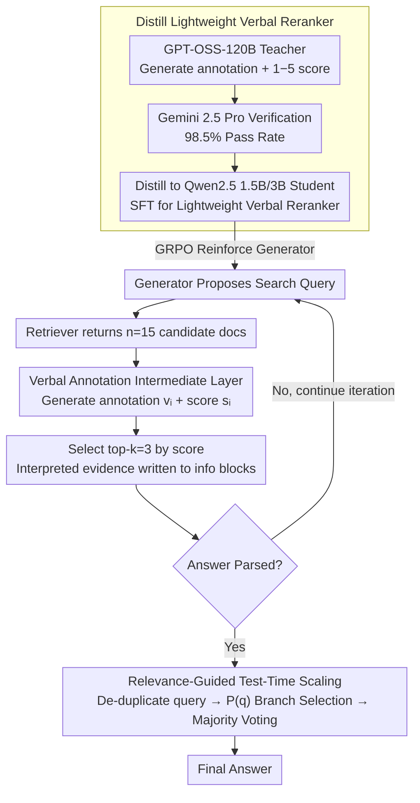

# Verbal-R3: Verbal Reranker as the Missing Bridge between Retrieval and Reasoning

**Conference**: ACL2026  
**arXiv**: [2605.01399](https://arxiv.org/abs/2605.01399)  
**Code**: https://github.com/0k9d0h1/VerbalR3  
**Area**: Information Retrieval  
**Keywords**: Retrieval-Augmented Generation, Reranking, Verbal Annotation, Reinforcement Learning, Test-time Scaling  

## TL;DR
Verbal-R3 upgrades the traditional reranker from a module that "only provides relevance scores" to a bridging module that "provides scores and generates explanatory Verbal Annotations." This module is then used to train and guide RAG reasoners, simultaneously improving answer accuracy and test-time scaling efficiency in multi-hop question answering.

## Background & Motivation
**Background**: RAG systems typically retrieve candidate documents and concatenate raw passages into the LLM context, allowing the model to answer questions based on external information. To improve retrieval quality, many systems add a reranker to reorder documents retrieved in the first stage and select the top-k documents for the generator.

**Limitations of Prior Work**: The output of traditional rerankers is usually limited to relevance scores or document rankings. While this ranking helps in "selecting which documents to use," it does not inform the generator "why a document is relevant, which part supports the answer, or what content should be ignored." In multi-hop scenarios, raw retrieval contexts become increasingly long and noisy; even if the generator receives documents containing the answer, it may fail to utilize them correctly.

**Key Challenge**: The bottleneck of RAG is not just retrieval accuracy, but context utilization. Retrieval modules focus on query-document matching, while reasoning modules focus on evidence chains and question logic. There is a missing intermediate representation between the two that translates "relevant documents" into "reasoning-ready evidence."

**Goal**: The authors aim to construct a lightweight Verbal Reranker that can provide relevance scores like a standard reranker while generating natural language analysis for the reasoner. This helps the generator filter noise, understand evidence, and prioritize the computation budget toward promising query branches during test-time.

**Key Insight**: The paper conducts a motivational experiment comparing raw text, paraphrased text, and Verbal Annotations within Search-R1. Results show that simply paraphrasing text can even hurt performance, while Verbal Annotations that explain the logical relationship between the query and the document significantly improve EM/F1 and Context Utilization Efficacy. This suggests the issue is not "text smoothness," but whether "evidence is explicitly structured."

**Core Idea**: Enable the reranker to output "relevance scores + reasoning-oriented verbal annotations," then distill this module into a small model and embed it into an iterative RAG framework, ensuring retrieval results are interpreted as usable evidence before reaching the generator.

## Method
Verbal-R3 can be understood as a two-module RAG framework: the Generator handles iterative reasoning, proposed search queries, information integration, and answer generation; the Verbal Reranker is responsible for producing Verbal Annotations and 1-to-5 relevance scores for each query-document pair. Compared to standard RAG, it does not just concatenate top-k documents into the context, but instead concatenates top-k "interpreted document evidence" and uses relevance scores to control which reasoning branches are worth expanding at test-time.

### Overall Architecture
Training consists of three stages. In the first stage, a GPT-OSS-120B teacher model is used to generate Verbal Annotations and scalar relevance scores for a large number of query-document pairs; Gemini 2.5 Pro then verifies the quality of these synthetic labels, with a reported pass rate of 98.5%. In the second stage, these synthetic triplets are distilled into Qwen2.5-Instruct 1.5B/3B student models to obtain a deployable lightweight Verbal Reranker. In the third stage, the Verbal Reranker is integrated into the Generator's interaction trajectories. GRPO is applied to the Generator to perform reinforcement learning, teaching it to propose better search queries, read verbal annotations, and output final answers in the specified format.

During inference, the Generator first produces a search query based on the question; the retriever returns $n=15$ candidate documents; the Verbal Reranker generates an annotation $v_i$ and a score $s_i$ for each document; the system selects the top-k (default $k=3$) based on scores and score token logits, writing the results into the Generator's context within `<information>` blocks. This process continues until a final answer is parsed or the maximum number of iterations is reached.

### Key Designs

**1. Verbal Annotation as an Intermediate Layer between Retrieval and Reasoning: Making the reranker provide an explanation of "why it's relevant, which part supports the answer, and what to ignore" rather than just a score.**

In multi-hop questions, retrieval contexts grow longer and more noisy. Even when the generator receives documents containing the answer, it often fails to use them correctly—the bottleneck is not retrieval accuracy, but context utilization. The Verbal Reranker therefore produces two types of output for every query-document pair: a natural language critique/annotation and a 1–5 relevance score. This annotation is neither a summary nor a paraphrase; it explicitly states the logical relationship between the document and query while pointing out noise or gaps, effectively translating "potentially relevant text" into "reasoning evidence scaffolds." Motivational experiments confirm this: injecting paraphrases into Search-R1 can lead to performance drops, whereas injecting Verbal Annotations significantly improves EM/F1 and Context Utilization Efficacy—the issue was never the smoothness of the text, but the lack of explicit structuring of the evidence.

**2. Distillation from Large Model Teacher to Lightweight Verbal Reranker: Compressing the 120B judgment capability into 1.5B/3B to make iterative retrieval affordable.**

The value of Verbal Annotation stems from high-quality judgment, but iterative RAG requires calling the reranker every round, making 120B calls unfeasible for deployment. The paper first uses prompt search to have GPT-OSS-120B produce more discriminative (rather than generic) annotations, then uses Gemini 2.5 Pro to verify synthetic label quality (98.5% pass rate). Based on this, a large-scale query-document-annotation-score dataset is constructed to perform SFT on Qwen2.5-Instruct 1.5B/3B students. The training objective is to maximize the likelihood of the output sequence $y_{VR}=(v,s)$. Distillation allows the small model to inherit the "reasoning for why a document is useful" judgment patterns of the large model while maintaining the high throughput required for iterative RAG.

**3. Relevance-Guided Test-Time Scaling: Reusing reranker scores as value signals for "which branch is worth continuing."**

Standard majority voting expands all trajectories equally, wasting reranker calls on low-quality branches. Verbal-R3 allows relevance scores to serve as branch schedulers: after generating multiple queries per round, unique queries are extracted to avoid redundant retrieval. For each query, the maximum relevance score $s_{max,q}$ of its candidate documents is taken, and the branch for the next round is selected based on $P(q)=(s_{max,q}/s_{best})^\alpha$ (the paper uses $\alpha=7.5$ and a total trajectory budget $N=5$). Finally, majority voting is performed on the collected answers. This concentrates the limited computational budget on queries that have "already found good evidence," transforming the reranker from a preprocessing module into a value estimator for reasoning tree expansion.

### A Full Example: Walking Through a Two-Hop Question

Consider a two-hop question like "In which country was the director of [Movie Name] born?". The Generator first produces the first-hop search query ("Who is the director of [Movie Name]"); the retriever returns $n=15$ candidate documents. The Verbal Reranker generates an annotation $v_i$ and a 1–5 score $s_i$ for each—the document identifying the director's name is given 5 points with a note "This confirms the identity of the director," while pages only mentioning the cast list are given low scores with notes like "Irrelevant to the director." The system takes the top-$k=3$ based on scores and writes these "interpreted evidences" back into the Generator context within `<information>` blocks. The second hop follows the same logic to retrieve the director's birthplace. If the Generator poses multiple queries in one round, the system de-duplicates them and prioritizes the limited $N=5$ trajectory budget for branches with high-score evidence using $P(q)=(s_{max,q}/s_{best})^{7.5}$; branches with maximum scores of only 2 or 3 are largely abandoned. Finally, majority voting is performed on the resulting answers. Throughout the pipeline, the relevance score performs two tasks: selecting top-k documents and selecting branches worth continuing.

### Loss & Training
The Verbal Reranker employs SFT: given input $x_{VR}=(i_{VR}, q, d)$, it outputs $y_{VR}=(v,s)$, with the optimization goal $L_{SFT}=-E_{(x,y)\sim D}\sum_t \log p_\theta(y_t|x,y_{<t})$. The reinforcement learning for the Generator follows the Search-R1/GRPO style, calculating policy gradients only for tokens generated by the Generator itself, while reranker outputs are written into the trajectory as environmental information. Rewards are hierarchically designed: a final answer that is both correct and correctly formatted receives an outcome reward; a correct answer with incorrect formatting is penalized; an incorrect answer with correct formatting receives a format reward; if the format cannot be parsed, an answer reward or 0 is given depending on the case. This design constrains both factual correctness and RAG trajectory formatting.

## Key Experimental Results

### Main Results
Experiments cover 7 QA benchmarks: single-hop NQ, TriviaQA, PopQA, and multi-hop 2WikiMultiHopQA, Bamboogle, MuSiQue, HotpotQA; standalone reranking capability is evaluated on BEIR. E5 is used as the base retriever, Qwen2.5-3B/7B as the Generator, with a default 3B Verbal Reranker, retrieving $n=15$ and keeping $k=3$.

| Method/Module | Avg EM | Avg F1 | Key Conclusion |
|-----------|---------|---------|----------|
| Search-R1 3B | 38.75 | 46.31 | Strong RAG baseline, but uses raw retrieval text |
| Search-R1 3B + Verbal Annotation | 41.92 | 49.86 | Significant improvement after adding annotations in motivational trials |
| Verbal-R3 3B | 45.36 | 54.66 | Relative to Search-R1 3B: EM +17.1%, F1 +18.0% |
| Verbal-R3 7B | 48.30 | 57.28 | Relative to Search-R1 7B: EM +15.3%, F1 +14.3% |
| Ours 3B Verbal Reranker Single-round RAG | 30.19 | 38.84 | Superior to MonoT5/RankLLaMA/Rank1 in single-round QA reranking |

### Ablation Study

| Configuration | Key Metrics | Description |
|------|---------|------|
| Search-R1 w/o VA | EM 38.75, F1 46.31, CUE-R 64.77, CUE-L 69.04 | Uses only raw retrieval context; efficiency of evidence utilization is limited |
| Search-R1 w/ VA | EM 41.92, F1 49.86, CUE-R 70.76, CUE-L 74.10 | Retrieval accuracy remains similar, but context utilization improves significantly |
| Verbal-R3 w/o VA | EM 42.73, F1 51.75, CUE-R 65.21, CUE-L 69.76 | Retaining only reranking/filtering still improves retrieval quality |
| Verbal-R3 Full | EM 45.36, F1 54.66, CUE-R 67.54, CUE-L 71.64 | Annotation further enhances evidence utilization and final answer quality |

| Test-time Scaling Strategy | Verbal-R3 3B Avg EM/F1 | 3B Reranker Calls | Verbal-R3 7B Avg EM/F1 | 7B Reranker Calls |
|----------------|----------------------|----------------|----------------------|----------------|
| No M.V. | 45.36 / 54.66 | 2.27 | 48.30 / 57.28 | 1.82 |
| Naive M.V. w/o U.Q.E. | 47.26 / 56.33 | 11.28 | 49.93 / 59.02 | 9.11 |
| Naive M.V. w/ U.Q.E. | 46.69 / 55.88 | 6.52 | 49.23 / 58.35 | 4.63 |
| Relevance-Guide | 47.18 / 56.45 | 6.18 | 50.12 / 59.25 | 4.21 |

### Key Findings
- The primary gain of Verbal Annotation is not increasing the probability of "whether the answer is retrieved," but increasing the probability of "using it correctly once retrieved." The improvements in CUE-R/CUE-L are more significant than the improvement in RA.
- The 3B Verbal Reranker outperforms larger traditional reranker baselines in single-round RAG settings, indicating that the natural language explanatory output itself provides additional value.
- Multi-hop tasks see greater benefits: the paper reports an average F1 gain of approximately 26.91% for Verbal-R3 3B on multi-hop tasks, significantly higher than the 9.67% gain on single-hop tasks. This aligns with the intuition that multi-hop retrieval accumulates more noise and thus requires annotation for evidence filtering.
- Relevance-guided scaling reduces reranker calls by 45.2% for 3B and 53.8% for 7B compared to naive majority voting without deduplication, while maintaining or improving average performance.

## Highlights & Insights
- The most inspiring aspect of this paper is the redefinition of the reranker interface: scores solve "ranking," while annotations solve "usability." This is closer to the ultimate goal of RAG than simply chasing nDCG, as generators need reasoning-ready evidence, not just relevant documents.
- The motivational experiments solidly distinguish between paraphrasing and verbal annotation. The former is just style transfer and may lose evidence; the latter is a logical bridge that explicitly tells the model why a text supports the current query.
- Reusing relevance scores for test-time scaling is a elegant resource scheduling design. The reranker is no longer just a preprocessing module but becomes a value estimator for reasoning tree expansion.

## Limitations & Future Work
- Training the Verbal Reranker relies on GPT-OSS-120B for annotation generation and Gemini 2.5 Pro for quality validation; although the deployment uses small models, the data construction phase has strong teacher dependence.
- Annotations increase the tokens produced per reranker call; the paper mentions an average of 990 reranker tokens per call when $n=15$. Although relevance-guided scaling saves calls, low-latency scenarios may require further compression of annotation length.
- The tasks are primarily QA/RAG benchmarks; it is unclear if verbal annotation is as stable for open-ended long-form generation, legal/medical evidence reasoning, or multimodal RAG.
- Verbal Annotations are model-generated and may contain misleading explanations; if the reranker provides a plausible-sounding annotation for an incorrect document, the generator may trust it more.

## Related Work & Insights
- **vs Standard RAG**: Standard RAG directly concatenates retrieved passages; Verbal-R3 adds an interpretation layer before documents enter the generator, making the context resemble an "evidence manual."
- **vs MonoT5 / RankLLaMA / Rank1**: These rerankers mainly optimize relevance ranking; Verbal Reranker generates both relevance scores and annotations, serving both ranking and reasoning objectives.
- **vs Search-R1**: Search-R1 is already capable of iterative retrieval and reasoning but uses raw retrieval results; Verbal-R3 integrates a Verbal Reranker into this search-based framework and trains the Generator to adapt to this evidence format.
- **vs Majority Voting**: Ordinary majority voting expands multiple trajectories blindly; this work uses reranker scores to decide which branches are worth continuing, concentrating the computational budget.

## Rating
- Novelty: ⭐⭐⭐⭐⭐ Turning the reranker into an "explanatory evidence bridge" and using scores for test-time scaling is highly inspiring.
- Experimental Thoroughness: ⭐⭐⭐⭐☆ Covers various QA types, reranker baselines, ablations, and scaling; however, details on real-world latency/cost and annotation error propagation could be more granular.
- Writing Quality: ⭐⭐⭐⭐☆ The flow from motivational experiments to the main methodology is smooth; some math notation and training details in the method section are dense.
- Value: ⭐⭐⭐⭐⭐ Extremely practical for RAG systems, especially for solving "retrieved but failed to use" problems in multi-hop QA and agentic retrieval.

<!-- RELATED:START -->

## Related Papers

- [\[ICLR 2026\] Beyond Sequential Reranking: Reranker-Guided Search Improves Reasoning Intensive Retrieval](../../ICLR2026/information_retrieval/beyond_sequential_reranking_reranker-guided_search_improves_reasoning_intensive_.md)
- [\[ICLR 2026\] Embedding-Based Context-Aware Reranker](../../ICLR2026/information_retrieval/embedding-based_context-aware_reranker.md)
- [\[ACL 2026\] A Survey of Reasoning-Intensive Retrieval: Progress and Challenges](a_survey_of_reasoning-intensive_retrieval_progress_and_challenges.md)
- [\[ICLR 2026\] Retro*: Optimizing LLMs for Reasoning-Intensive Document Retrieval](../../ICLR2026/information_retrieval/retro_optimizing_llms_for_reasoning-intensive_document_retrieval.md)
- [\[ACL 2026\] ChatR1: Reinforcement Learning for Conversational Reasoning and Retrieval Augmented Question Answering](chatr1_reinforcement_learning_for_conversational_reasoning_and_retrieval_augment.md)

<!-- RELATED:END -->
