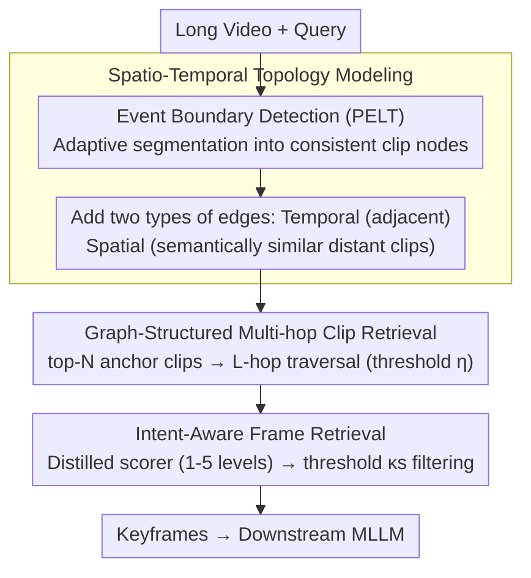

# VideoStir: Understanding Long Videos via Spatio-Temporally Structured and Intent-Aware RAG

**Conference**: ACL 2026  
**arXiv**: [2604.05418](https://arxiv.org/abs/2604.05418)  
**Code**: [https://github.com/RomGai/VideoStir](https://github.com/RomGai/VideoStir)  
**Area**: Information Retrieval  
**Keywords**: Long video understanding, Retrieval-augmented generation, Spatio-temporal graph structure, Intent-aware retrieval, Multi-hop reasoning

## TL;DR

VideoStir proposes a structured and intent-aware long video RAG framework. By modeling videos as spatio-temporal graphs for multi-hop clip retrieval and training an intent-relevance scorer for frame-level filtering, it achieves performance comparable to SOTA long video RAG methods without relying on auxiliary text tools.

## Background & Motivation

**Background**: Long video understanding is a core frontier task in multimodal intelligence. Current methods either extend context windows with uniform sampling (which may miss key details or be overwhelmed by redundancy) or use RAG to retrieve key segments to compress context.

**Limitations of Prior Work**:
- **Spatio-Temporal Decoupling**: Existing RAG methods flatten videos into independent segments, destroying the inherent spatio-temporal structure. This prevents contextually related events scattered across different time points from being retrieved together.
- **Insufficient Intent Modeling**: Mainstream methods rely on contrastive embeddings (e.g., CLIP) for semantic similarity, matching content that "looks similar" rather than what is "truly important for answering the query intent" (e.g., for "What does the narrator do with the printer?", semantic retrieval selects frames of the printer instead of scenes related to the actual purpose).

**Key Challenge**: Flattened retrieval loses structure $\rightarrow$ missing contextual evidence; semantic matching biases toward surface similarity $\rightarrow$ missing key clues that are intent-relevant but semantically non-overlapping.

**Goal**: Improve long video RAG from two dimensions: (1) From flattened to structured: reconstructing video spatio-temporal topology; (2) From semantic to intent: moving beyond surface semantic matching to model the alignment between query intent and visual clues.

**Key Insight**: Analogous to human episodic memory—first coarse-grained localization of relevant episodes (clip retrieval), then fine-grained examination of details (frame retrieval). Use graph structures at the clip level to maintain spatio-temporal associations, and MLLM reasoning at the frame level for intent relevance.

**Core Idea**: Model the video as a spatio-temporal graph (nodes = semantically consistent clips, edges = temporal proximity/spatial similarity) and aggregate structured evidence via multi-hop traversal, followed by fine-grained filtering at the frame level using an intent-relevance scorer trained via distillation.

## Method

### Overall Architecture

VideoStir addresses long video QA: given a long video and a query, it outputs a small number of keyframes for the downstream MLLM. It decomposes the human recall process of "coarse localization then fine observation" into two stages. First, the video is constructed into a graph that preserves spatio-temporal topology (nodes are semantically consistent clips). Multi-hop traversal aggregates contextually relevant evidence across timelines and semantic spaces at the clip level. Second, a distilled intent-relevance scorer distinguishes between frames that "look similar" and those "truly useful for answering the query" at the frame level. The entire pipeline does not rely on auxiliary text tools like OCR or caption generation, using only native visual input.

### Key Designs

**1. Spatio-Temporal Topology Modeling: Restructuring Flattened Clips into a Graph**

Flattening long videos into independent segments breaks their inherent spatio-temporal structure. VideoStir uses an event boundary detector (PELT change-point detection on frame embeddings) to adaptively segment the video into semantically consistent clip nodes, forming a graph $\mathcal{G}=(\mathcal{V}, \mathcal{E})$. It then adds two types of edges: temporal edges connecting adjacent clips to maintain narrative continuity, and spatial edges connecting distant clips based on cosine similarity of clip embeddings. These edges re-link the spatio-temporal context, allowing multi-hop retrieval to expand along both the timeline and semantic space.

**2. Graph-Structured Multi-hop Clip Retrieval: Recovering Context Missed by Direct Matching**

A query often directly hits only a small part of an event, while full reasoning requires surrounding temporal and semantic context. VideoStir selects top-$N$ (default 3) anchor clips most similar to the query, then performs an $L$-hop (default 2) traversal on the graph. Weak connections are filtered by an edge weight threshold $\eta$ (default 0.4), collecting the entire spatio-temporal neighborhood. This multi-hop traversal recovers evidence missed by point-to-point matching—a capability flattened retrieval lacks.

**3. Intent-Aware Frame Retrieval + IR-600K Dataset: Upgrading from "Semantic Similarity" to "Intent Relevance"**

Contrastive models like CLIP optimize for semantic alignment. For the query "What does the narrator do with the printer?", it matches printer frames rather than scenes answering the purpose, often selecting "related-looking but useless" frames. MLLMs possess the reasoning ability to judge a frame's contribution to a query intent, but direct inference is too slow. VideoStir employs a distillation route: using Qwen2.5-VL-72B as a teacher to label 605,000 query-frame pairs with 1-5 levels of intent relevance, distilling a Qwen2.5-VL-3B student scorer with only 3.7M LoRA parameters (forming the IR-600K dataset). During inference, an expected score is calculated for each candidate frame, retaining only those exceeding threshold $\kappa_s$.

### Loss & Training

The scorer is trained via cross-entropy, optimizing only LoRA parameters:

$$\mathcal{L}_{CE} = -\sum_{\ell=1}^{5} \mathbf{1}[\ell=y_t] \log P_\theta(\ell\mid q, x_t, \mathcal{P}_{intent})$$

where $\ell$ iterates through 1-5 relevance levels, $y_t$ is the teacher's label, and $\mathcal{P}_{intent}$ is the intent prompt. The AdamW optimizer (lr=5e-5) with a cosine schedule is used for 1 epoch with a batch size of 128.

## Key Experimental Results

### Main Results

| Backbone MLLM | Method | LV-Bench | MLVU | Video-MME-Long |
|---------|------|----------|------|------------|
| LLaVA-Video 7B | Native | 56.6 | 70.8 | - |
| LLaVA-Video 7B | +Video-RAG | 58.7 (+3.7%) | 72.4 (+2.3%) | - |
| LLaVA-Video 7B | **+VideoStir** | **60.3 (+6.5%)** | **73.1 (+3.2%)** | - |
| LLaVA-Video 72B | Native | 61.9 | 73.1 | 61.5 |
| LLaVA-Video 72B | +Video-RAG | 65.4 (+5.7%) | 73.8 (+1.0%) | 62.3 (+1.3%) |
| LLaVA-Video 72B | **+VideoStir** | **66.0 (+6.6%)** | **74.1 (+1.4%)** | 62.1 (+1.0%) |

### Ablation Study

| Configuration | Overall↑ | Retrieval Acc.↑ | Description |
|------|---------|----------------|------|
| Full | **64.5** | **92.2** | Complete model |
| w/o Intent Scorer (using PE) | 58.1 | 79.8 | Semantic matching is insufficient |
| w/o Prob-Weighted Expectation | 54.2 | 71.6 | Distributed scoring beats discrete scores |
| w/o Spatio-Temporal Graph | 56.4 | 74.8 | Flat retrieval loses structural info |
| w/o Spatial Edges | 57.2 | 79.3 | Distant semantic clips are missed |
| w/o Temporal Edges | 59.8 | 83.4 | Narrative continuity is broken |

### Key Findings
- VideoStir achieves SOTA performance using only native visual input without any auxiliary text tools (OCR, captions).
- The intent scorer provides a 6.4%/12.4% gain (Overall/Retrieval Acc.) over strongest semantic matching (PE), showing intent modeling is critical.
- LoRA fine-tuning (3.7M parameters) nearly matches the performance of full fine-tuning (3.0B parameters), demonstrating distillation efficiency.
- Both spatial and temporal edges contribute, though removing spatial edges has a larger impact, highlighting the importance of long-range semantic associations.

## Highlights & Insights
- The paradigm shift "from semantic matching to intent awareness" accurately identifies a core issue: semantic similarity $\neq$ utility for answering. This insight is broadly applicable to RAG systems.
- The Spatio-temporal Graph + Multi-hop Retrieval design is elegant, reconstructing the video's intrinsic topology rather than relying on brute-force search, mimicking human episodic memory.
- The IR-600K dataset is a significant contribution: the first dataset for "intent-level frame-query alignment," reusable for future research.
- The distillation strategy is practical: moving from a 72B teacher to a 3B student with only 3.7M LoRA parameters maintains quality while remaining deployment-friendly.

## Limitations & Future Work
- Graph construction and multi-hop retrieval introduce additional system latency; end-to-end optimizations are needed.
- The quality of the event boundary detector directly impacts the graph structure and may not be robust for complex interleaved narratives.
- On Video-MME-Long, VideoStir's improvement is less pronounced than Video-RAG on certain MLLMs, suggesting auxiliary text still has value in specific scenarios.
- Evaluation is currently limited to QA tasks; applicability to video summarization or temporal localization remains to be verified.

## Related Work & Insights
- **vs Video-RAG**: Video-RAG uses auxiliary text tools; VideoStir relies only on native visual input, offering a simpler yet comparable alternative.
- **vs DrVideo/Vgent (Agent methods)**: Agent methods have high reasoning overhead; VideoStir is more efficient via its graph structure and lightweight scorer.
- **vs AKS (Keyframe selection)**: AKS optimizes for semantic similarity and temporal uniformity; VideoStir introduces intent-level frame filtering.

## Rating
- Novelty: ⭐⭐⭐⭐ The combination of spatio-temporal graphs and intent scoring addresses two core pain points of long video RAG.
- Experimental Thoroughness: ⭐⭐⭐⭐ Multiple benchmarks, various MLLM backbones, detailed ablation, and scorer training analysis.
- Writing Quality: ⭐⭐⭐⭐ Clear narrative structure moving from problem analysis through two gaps to two shifts.

<!-- RELATED:START -->

## Related Papers

- [\[ACL 2026\] All Languages Matter: Understanding and Mitigating Language Bias in Multilingual RAG](all_languages_matter_understanding_and_mitigating_language_bias_in_multilingual_.md)
- [\[ACL 2026\] Disco-RAG: Discourse-Aware Retrieval-Augmented Generation](disco-rag_discourse-aware_retrieval-augmented_generation.md)
- [\[ICLR 2026\] Beyond RAG vs. Long-Context: Learning Distraction-Aware Retrieval for Efficient Knowledge Grounding](../../ICLR2026/information_retrieval/beyond_rag_vs_long-context_learning_distraction-aware_retrieval_for_efficient_kn.md)
- [\[ACL 2026\] S2G-RAG: Structured Sufficiency and Gap Judging for Iterative Retrieval-Augmented QA](s2g-rag_structured_sufficiency_and_gap_judging_for_iterative_retrieval-augmented.md)
- [\[ACL 2025\] The Distracting Effect: Understanding Irrelevant Passages in RAG](../../ACL2025/information_retrieval/the_distracting_effect_understanding_irrelevant_passages_in_rag.md)

<!-- RELATED:END -->
