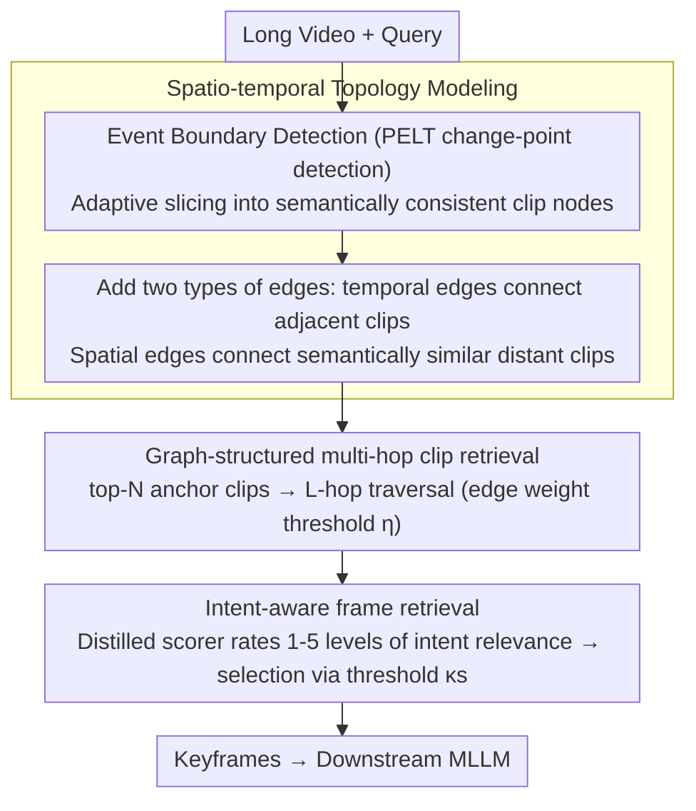

# VideoStir: Understanding Long Videos via Spatio-Temporally Structured and Intent-Aware RAG

**Conference**: ACL 2026  
**arXiv**: [2604.05418](https://arxiv.org/abs/2604.05418)  
**Code**: [https://github.com/RomGai/VideoStir](https://github.com/RomGai/VideoStir)  
**Area**: Information Retrieval  
**Keywords**: Long video understanding, Retrieval-augmented generation, Spatio-temporal graph structure, Intent-aware retrieval, Multi-hop reasoning

## TL;DR

VideoStir proposes a structured and intent-aware long video RAG framework. It models videos as spatio-temporal graphs for multi-hop clip retrieval and trains an intent relevance scorer for frame-level filtering. It achieves performance comparable to SOTA long video RAG methods without relying on auxiliary text tools.

## Background & Motivation

**Background**: Long video understanding is a core frontier task in multimodal intelligence. Current methods either expand the contextual window for uniform sampling (prone to missing key details or being overwhelmed by redundancy) or use RAG to retrieve key clips to compress the context.

**Limitations of Prior Work**:
- **Spatio-temporal Structure Decoupling**: Existing RAG methods flatten videos into independent clips, destroying the inherent spatio-temporal structure. Consequently, contextually related events scattered across different time points cannot be associatively retrieved.
- **Insufficient Intent Modeling**: Mainstream methods rely on contrastive embeddings like CLIP for semantic similarity. These only match content that "looks similar" rather than content "truly important to the query intent" (e.g., for the query "What does the narrator do with the printer?", semantic retrieval selects frames of the printer rather than scenes related to the actual purpose).

**Key Challenge**: Flattened retrieval loses structure $\rightarrow$ missing contextual evidence; semantic matching favors surface similarity $\rightarrow$ missing key clues that are intent-relevant but lack semantic overlap.

**Goal**: Improve long video RAG from two dimensions—(1) From flattened to structured: reconstructing the spatio-temporal topology of videos; (2) From semantic to intent: moving beyond surface semantic matching to model the alignment between query intent and visual cues.

**Key Insight**: Analogous to human episodic memory—first identifying relevant episodes at a coarse grain (clip retrieval), then examining details at a fine grain (frame retrieval). Graph structures maintain spatio-temporal associations at the clip level, while MLLMs reason about intent relevance at the frame level.

**Core Idea**: Model the video as a spatio-temporal graph (nodes = semantically consistent clips, edges = temporal proximity/spatial similarity). Aggregate structured evidence via multi-hop traversal, then use a distillation-trained intent relevance scorer for fine-grained selection at the frame level.

## Method

### Overall Architecture

VideoStir addresses long video QA: given a long video and a query, it outputs a small number of keyframes for a downstream MLLM. It decomposes the human-like recall process of "coarse localization followed by fine-grained inspection" into two stages. First, it constructs a graph preserving spatio-temporal topology (where nodes are semantically consistent clips), performing multi-hop traversal along the timeline and semantic space to aggregate contextually related evidence. Second, it employs a distilled intent relevance scorer to distinguish between "visually similar" frames and frames "truly useful for answering the query." The entire pipeline does not rely on auxiliary text tools like OCR or captioning, utilizing only native visual input.

### Key Designs

**1. Spatio-temporal Topology Modeling: Re-weaving Flattened Clips into a Graph**

Flattening long videos into independent fragments destroys their inherent spatio-temporal structure, preventing contextually related events from being retrieved together. VideoStir uses an event boundary detector (PELT change-point detection on frame embeddings) to adaptively slice the video into semantically consistent clip nodes, forming a graph $\mathcal{G}=(\mathcal{V}, \mathcal{E})$. It adds two types of edges: temporal edges connect adjacent clips to maintain narrative continuity, while spatial edges connect clips distant in time but similar in semantic embedding. These edges re-bind the spatio-temporal context, allowing multi-hop retrieval to expand along both the timeline and semantic space rather than just sliding windows on a 1D axis.

**2. Graph-structured Multi-hop Clip Retrieval: Recovering Context Missed by Direct Matching**

A query often directly hits only a small part of an event, but complete reasoning requires surrounding context. VideoStir first selects top-$N$ (default 3) anchor clips most similar to the query, then performs an $L$-hop (default 2) traversal on the graph from these anchors. It filters weak connections using an edge weight threshold $\eta$ (default 0.4) to collect the spatio-temporal neighborhood. Levering pre-established associations between clips, multi-hop traversal recovers evidence missed by single-point semantic matching—something flattened retrieval cannot achieve.

**3. Intent-aware Frame Retrieval + IR-600K Dataset: Upgrading from "Semantic Similarity" to "Intent Relevance"**

Contrastive models like CLIP optimize for semantic alignment; thus, for the query "What does the narrator do with the printer?", it matches printer visuals rather than scenes answering the actual intent, often selecting frames that look related but are useless for answering. While MLLMs can reason about intent, direct inference is too slow. VideoStir uses a distillation approach: with Qwen2.5-VL-72B as the teacher, it labels 605,000 query-frame pairs with 1-5 levels of intent relevance to train a Qwen2.5-VL-3B student scorer with only 3.7M LoRA parameters (this dataset is the IR-600K dataset). At inference, it computes the probability-weighted expected score for each candidate frame and retains only those exceeding threshold $\kappa_s$, filtering semantically similar but intent-irrelevant clues at the frame level.

### Loss & Training

The scorer is trained using cross-entropy, optimizing only the LoRA parameters:

$$\mathcal{L}_{CE} = -\sum_{\ell=1}^{5} \mathbf{1}[\ell=y_t] \log P_\theta(\ell\mid q, x_t, \mathcal{P}_{intent})$$

where $\ell$ iterates through 1-5 levels of relevance, $y_t$ is the teacher label, and $\mathcal{P}_{intent}$ is the intent prompt. The optimizer is AdamW (lr=5e-5) with a cosine schedule, training for 1 epoch with a batch size of 128.

## Key Experimental Results

### Main Results

| Base MLLM | Method | LV-Bench | MLVU | Video-MME-Long |
|---------|------|----------|------|------------|
| LLaVA-Video 7B | Native | 56.6 | 70.8 | - |
| LLaVA-Video 7B | +Video-RAG | 58.7 (+3.7%) | 72.4 (+2.3%) | - |
| LLaVA-Video 7B | **+VideoStir** | **60.3 (+6.5%)** | **73.1 (+3.2%)** | - |
| LLaVA-Video 72B | Native | 61.9 | 73.1 | 61.5 |
| LLaVA-Video 72B | +Video-RAG | 65.4 (+5.7%) | 73.8 (+1.0%) | 62.3 (+1.3%) |
| LLaVA-Video 72B | **+VideoStir** | **66.0 (+6.6%)** | **74.1 (+1.4%)** | 62.1 (+1.0%) |

### Ablation Study

| Configuration | Overall↑ | Retrieval Acc.↑ | Description |
|------|---------|----------------|------|
| Full | **64.5** | **92.2** | Complete model |
| w/o Intent Scorer (using PE) | 58.1 | 79.8 | Semantic matching is insufficient for intent |
| w/o Prob-weighted Expectation | 54.2 | 71.6 | Discrete scores are inferior to distributional ratings |
| w/o Spatio-temporal Graph | 56.4 | 74.8 | Flattened retrieval loses structural information |
| w/o Spatial Edges | 57.2 | 79.3 | Semantically related distant clips are missed |
| w/o Temporal Edges | 59.8 | 83.4 | Narrative continuity is broken |

### Key Findings
- VideoStir achieves SOTA performance using only native visual inputs without any auxiliary text tools (OCR, captioning, etc.).
- The intent scorer provides a 6.4%/12.4% gain (Overall/Retrieval Acc.) over the strongest semantic matching (PE), proving intent modeling is critical.
- LoRA fine-tuning (3.7M parameters) nearly matches the performance of full-parameter fine-tuning (3.0B parameters), demonstrating the efficiency of the distillation strategy.
- Both spatial and temporal edges in the graph contribute, but removing spatial edges has a greater impact, indicating that long-distance semantic associations are vital.

## Highlights & Insights
- The paradigm shift from "semantic matching to intent awareness" is accurately positioned—semantic similarity $\neq$ utility for answering; this insight is instructive for all RAG systems.
- The design of the spatio-temporal graph + multi-hop retrieval is elegant: it reconstructs the intrinsic topology of the video rather than performing brute-force search, analogous to the human episodic memory recall process.
- The IR-600K dataset is a contribution in itself: the first dataset focused on "intent-level frame-query alignment," reusable for future research.
- The scorer distillation strategy is practical: moving from a 72B teacher to a 3B student with only 3.7M LoRA parameters maintains quality while being suitable for deployment.

## Limitations & Future Work
- Spatio-temporal graph construction and multi-hop retrieval introduce additional system latency; optimizing end-to-end latency is an important direction.
- The quality of the event boundary detector directly impacts the graph structure and may not be robust for complex intercut narratives.
- On Video-MME-Long, VideoStir's improvement is less significant than Video-RAG (on certain MLLMs), suggesting that auxiliary text information still holds value in some scenarios.
- Currently only evaluated on QA tasks; the applicability to other tasks like video summarization or temporal localization needs verification.

## Related Work & Insights
- **vs Video-RAG**: Video-RAG enhances retrieval with auxiliary text tools; VideoStir relies solely on native visual input, being more concise while achieving comparable performance.
- **vs DrVideo/Vgent (Agent methods)**: Agent methods involve high reasoning overhead; VideoStir is more efficient through graph structures + lightweight scorers.
- **vs AKS (Keyframe selection)**: AKS optimizes for semantic similarity and temporal uniformity; VideoStir introduces intent-level frame filtering.

## Rating
- Novelty: ⭐⭐⭐⭐ The combination of spatio-temporal graphs and intent scorers addresses two core pain points of long video RAG.
- Experimental Thoroughness: ⭐⭐⭐⭐ Multiple benchmarks, various MLLM backbones, detailed ablations, and analysis of scorer training strategies.
- Writing Quality: ⭐⭐⭐⭐ Powerful narrative structure moving from problem analysis through two gaps to two shifts.

<!-- RELATED:START -->

## Related Papers

- [\[ACL 2026\] All Languages Matter: Understanding and Mitigating Language Bias in Multilingual RAG](all_languages_matter_understanding_and_mitigating_language_bias_in_multilingual_.md)
- [\[ACL 2026\] Disco-RAG: Discourse-Aware Retrieval-Augmented Generation](disco-rag_discourse-aware_retrieval-augmented_generation.md)
- [\[ICLR 2026\] Long-Document QA with Chain-of-Structured-Thought and Fine-Tuned SLMs](../../ICLR2026/information_retrieval/long-document_qa_with_chain-of-structured-thought_and_fine-tuned_slms.md)
- [\[ICLR 2026\] Beyond RAG vs. Long-Context: Learning Distraction-Aware Retrieval for Efficient Knowledge Grounding](../../ICLR2026/information_retrieval/beyond_rag_vs_long-context_learning_distraction-aware_retrieval_for_efficient_kn.md)
- [\[ACL 2025\] The Distracting Effect: Understanding Irrelevant Passages in RAG](../../ACL2025/information_retrieval/the_distracting_effect_understanding_irrelevant_passages_in_rag.md)

<!-- RELATED:END -->
