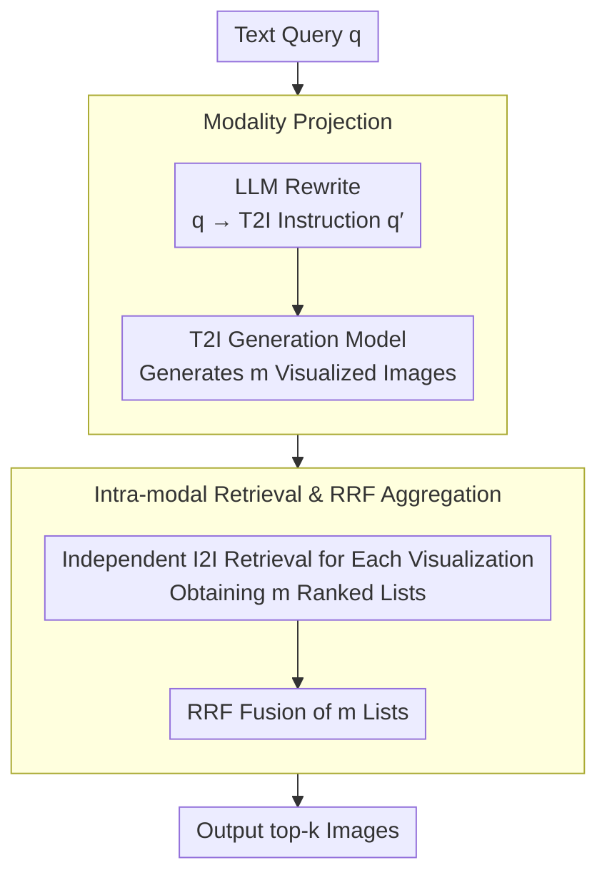

# VisRet: Visualization Improves Knowledge-Intensive Text-to-Image Retrieval

**Conference**: ACL 2026  
**arXiv**: [2505.20291](https://arxiv.org/abs/2505.20291)  
**Code**: [GitHub](https://github.com/xiaowu0162/Visualize-then-Retrieve)  
**Area**: Image Generation  
**Keywords**: Text-to-Image Retrieval, Visualized Query, Cross-modal Alignment, Retrieval-Augmented Generation, Modality Projection

## TL;DR

This paper proposes Visualize-then-Retrieve (VisRet), a new paradigm that first visualizes a text query into images using a T2I generation model and then performs retrieval within the image modality. It achieves an average gain of 0.125 (CLIP) and 0.121 (E5-V) in nDCG@30 across four benchmarks, and improves downstream VQA accuracy by 15.7% on Visual-RAG-ME.

## Background & Motivation

**Background**: Text-to-image (T2I) retrieval is a critical component for knowledge-intensive applications. Common methods embed text queries and candidate images into a shared representation space and rank them by similarity. Despite continuous improvements in cross-modal embedding models (e.g., CLIP, E5-V), cross-modal similarity alignment remains a fundamental challenge.

**Limitations of Prior Work**: Cross-modal embeddings often operate as "bags of concepts," failing to capture structured visual relationships such as poses, perspectives, and spatial layouts. For example, when querying "a Bar-headed Goose with wings spread," embedding models can match the species type but fail to recognize subtle visual features like wing posture and low-angle perspective. Existing improvement methods (query rewriting, multi-stage re-ranking) are still limited by the inherent difficulty of cross-modal alignment.

**Key Challenge**: Text is inherently insufficient to exhaustively describe complex visual-spatial relationships, and cross-modal retrievers have an inherent weakness in identifying subtle visual-spatial features. Encoding all visual requirements into a text query may actually harm retrieval performance due to the limitations of embedding quality.

**Goal**: To propose a retrieval paradigm that bypasses the weaknesses of cross-modal similarity matching by projecting text queries into the image modality, leveraging the superior performance of retrievers in intra-modal search.

**Key Insight**: Visualization provides a more intuitive and expressive medium than text for conveying compositional concepts (entity + pose + spatial relationship). Performing retrieval within the image modality avoids the pitfalls of cross-modal retrievers and utilizes their stronger intra-modal capabilities.

**Core Idea**: Decompose T2I retrieval into two stages: "Text $\rightarrow$ Image Modality Projection" and "Image $\rightarrow$ Image Intra-modal Retrieval." The text query is visualized via a T2I generation model, followed by direct image-to-image retrieval using the generated visual samples.

## Method

### Overall Architecture

VisRet aims to circumvent the long-standing issue of cross-modal retrieval where text queries and candidate images are ranked by similarity in a shared space, where cross-modal embeddings often degrade into "bags of concepts" that lose structured relations. The mechanism avoids direct competition in the cross-modal space by using an LLM to rewrite the original text query into T2I instructions, then using a generative model to "paint" several images. The retrieval is then conducted entirely within the image modality through image-to-image search, and the results from multiple visualizations are fused into a final ranking. This process is training-free and does not modify existing image embedding indices.

### Key Designs

**1. Modality Projection: Visualizing Text Queries to Explicitize Visual Requirements**

Text is naturally limited in describing complex visual-spatial relationships. Forcing entities, poses, and perspectives into a single query can be bottlenecked by cross-modal embedding quality. VisRet uses an LLM to draft a T2I instruction $q'$ from the original query $q$, describing an image that might satisfy the implicit feature requirements of $q$. A T2I model (e.g., Stable Diffusion) then projects $q'$ into $m$ images $\{v_1,\ldots,v_m\} \equiv \mathcal{T}(q)$. A single visualization can simultaneously render the required entities, poses, and perspectives, which would otherwise be constrained by text-based encoding. Multiple samplings further introduce query diversity.

**2. Intra-modal Retrieval and RRF Aggregation: Retrieving within Image Modality**

Once the query is transformed into images, retrieval occurs entirely within the image modality, bypassing the weaknesses of cross-modal retrievers and leveraging their higher efficacy in intra-modal tasks. Each generated image $v_i$ independently retrieves a ranked list $\mathcal{R}(v_i, \mathcal{I})$, which are then merged using Reciprocal Rank Fusion (RRF):

$$\text{score}_{\text{RRF}}(r) = \sum_{i=1}^{m} \frac{1}{\lambda + \text{rank}_i(r)}$$

where $\lambda$ controls the influence of lower-ranked items. The final top-$k$ are selected based on the fused scores. Aggregating multiple images allows different visualizations to cover different aspects of the query, making it more robust than a single image.

**3. Visual-RAG-ME Benchmark Construction: Evaluating Multi-entity Visual Feature Comparison**

Most existing benchmarks focus on single-entity retrieval and lack scenarios requiring the comparison of visual features across multiple entities, which is a key challenge for T2I retrieval. VisRet extends Visual-RAG to include questions comparing visual features of two biologically similar entities (e.g., "which has a lighter color or smoother surface"). Candidates are first identified via BM25, followed by manual construction of comparative questions and retrieval labels from iNaturalist, resulting in 50 high-quality queries. This benchmark provides a quantifiable evaluation for reasoning about "subtle visual-spatial features."

### Loss & Training

VisRet is a training-free, plug-and-play method. It neither modifies the retriever nor rebuilds pre-computed image embedding indices. It only requires a one-time call to an LLM for T2I instruction generation and a T2I model for visualization during the query phase.

## Key Experimental Results

### Main Results

**nDCG@30 across four benchmarks (CLIP Retriever)**

| Method | Visual-RAG | Visual-RAG-ME | INQUIRE-Rerank-Hard | COCO-Hard |
|------|------|------|------|------|
| Original Query | 0.385 | 0.435 | 0.412 | 0.042 |
| LLM Rewriting | 0.395 | 0.572 | 0.407 | 0.093 |
| Corpus Captioning (BLIP) | 0.271 | 0.371 | 0.401 | 0.153 |
| VISA Reranking | 0.388 | 0.457 | 0.000 | 0.000 |
| **Ours (VisRet)** | **0.438** | **0.605** | **0.455** | **0.108** |

**nDCG@30 across four benchmarks (E5-V Retriever)**

| Method | Visual-RAG | Visual-RAG-ME | INQUIRE-Rerank-Hard | COCO-Hard |
|------|------|------|------|------|
| Original Query | 0.407 | 0.486 | 0.407 | 0.178 |
| LLM Rewriting | 0.391 | 0.566 | 0.412 | 0.182 |
| **Ours (VisRet)** | **0.461** | **0.622** | **0.425** | **0.205** |

### Ablation Study

**Impact of T2I Models on Visual-RAG-ME Performance (CLIP Retriever)**

| T2I Model | N@1 | N@10 | N@30 |
|------|------|------|------|
| Stable Diffusion 3.5 | 0.270 | 0.467 | 0.484 |
| FLUX.1-dev | 0.320 | 0.501 | 0.494 |
| DALL-E 3 | 0.346 | 0.554 | 0.553 |
| gpt-image-1 (high quality) | **0.460** | **0.632** | **0.605** |

**Multi-image Aggregation vs. Single Image (CLIP Retriever)**

| Benchmark | 3 Images N@30 | 1 Image N@30 |
|------|------|------|
| Visual-RAG | 0.438 | 0.425 |
| Visual-RAG-ME | 0.605 | 0.602 |

### Key Findings

- VisRet achieves an average Gain of 0.109 in nDCG@10 (38%↑) with CLIP and 0.078 (23%↑) with E5-V.
- Downstream VQA accuracy: top-1 retrieval improves by 3.8% on Visual-RAG and 15.7% on Visual-RAG-ME.
- T2I model quality is a performance bottleneck: gpt-image-1 significantly outperforms Stable Diffusion 3.5; failure modes include lack of focus, factual errors, and poor instruction following.
- Single-image visualization only slightly degrades performance; the benefit of multi-image aggregation comes from increased query diversity.
- Visualized queries improve retrieval but cannot replace real images as independent knowledge sources.

## Highlights & Insights

- **Novel and Practical POV**: Bypasses the fundamental difficulties of cross-modal alignment through "visualize-then-retrieve," presenting a clean and powerful strategy.
- **Training-free, Plug-and-play**: Does not require retraining retrievers or modifying infrastructure; directly utilizes existing image embedding indices.
- **Visual-RAG-ME Benchmark**: Fills the gap in evaluating multi-entity visual feature comparison in retrieval.
- **Lower Latency**: VisRet's operational latency is lower than VISA re-ranking (approx. 5× faster) because VISA requires an LVLM to process top-k candidates.

## Limitations & Future Work

- Performance strongly depends on the quality of the T2I generation model; weaker models (e.g., Stable Diffusion) provide limited gains.
- Generated images may contain factual errors (e.g., inaccurate species appearance), affecting retrieval quality.
- Evaluation is currently focused on natural species; effectiveness in other knowledge-intensive domains (e.g., medical, architectural) remains to be verified.
- The computational cost of T2I generation is higher than simple query rewriting.

## Related Work & Insights

- **vs. LLM Query Rewriting**: Query rewriting still matches in the text-image cross-modal space; VisRet transitions fully to the image modality, avoiding cross-modal weaknesses.
- **vs. VISA Reranking**: VISA relies on LVLM to process top-k candidates with costs scaling linearly with k and is limited by initial retrieval quality; VisRet fundamentally changes the query modality.
- **vs. Corpus Captioning**: Converting images to text results in information loss, which is particularly detrimental in knowledge-intensive scenarios.

## Rating

- Novelty: ⭐⭐⭐⭐⭐ Elegant reformulation of T2I retrieval as "visualization + intra-modal retrieval."
- Experimental Thoroughness: ⭐⭐⭐⭐ Comprehensive evaluation across four benchmarks, two retrievers, various ablations, and downstream VQA.
- Writing Quality: ⭐⭐⭐⭐ Clear motivation, concise methodology, and intuitive visualizations.
- Value: ⭐⭐⭐⭐ Establishes a new paradigm for knowledge-intensive T2I retrieval; training-free and plug-and-play features enhance utility.

<!-- RELATED:START -->

<!-- RELATED:END -->

## Related Papers

- [\[ACL 2026\] ReasonEmbed: Enhanced Text Embeddings for Reasoning-Intensive Document Retrieval](reasonembed_enhanced_text_embeddings_for_reasoning-intensive_document_retrieval.md)
- [\[ACL 2026\] A Survey of Reasoning-Intensive Retrieval: Progress and Challenges](a_survey_of_reasoning-intensive_retrieval_progress_and_challenges.md)
- [\[ACL 2026\] More Than Efficiency: Embedding Compression Improves Domain Adaptation in Dense Retrieval](more_than_efficiency_embedding_compression_improves_domain_adaptation_in_dense_r.md)
- [\[AAAI 2026\] Knowledge Completes the Vision: A Multimodal Entity-aware Retrieval-Augmented Generation Framework for News Image Captioning](../../AAAI2026/information_retrieval/knowledge_completes_the_vision_a_multimodal_entity-aware_retrieval-augmented_gen.md)
- [\[ICLR 2026\] RefTool: Reference-Guided Tool Creation for Knowledge-Intensive Reasoning](../../ICLR2026/information_retrieval/reftool_reference-guided_tool_creation_for_knowledge-intensive_reasoning.md)

<!-- RELATED:END -->
