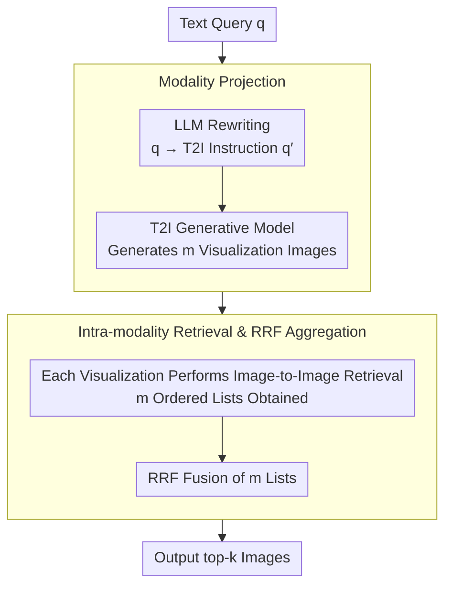

# VisRet: Visualization Improves Knowledge-Intensive Text-to-Image Retrieval

**Conference**: ACL 2026  
**arXiv**: [2505.20291](https://arxiv.org/abs/2505.20291)  
**Code**: [GitHub](https://github.com/xiaowu0162/Visualize-then-Retrieve)  
**Area**: Image Generation  
**Keywords**: Text-to-image retrieval, visualized queries, cross-modal alignment, retrieval-augmented generation, modality projection

## TL;DR

This paper proposes Visualize-then-Retrieve (VisRet), a new paradigm that converts text queries into visual images via T2I generation models before performing retrieval within the image modality. It achieves an average nDCG@30 improvement of 0.125 (CLIP) and 0.121 (E5-V) across four benchmarks, and increases downstream VQA accuracy by 15.7% on Visual-RAG-ME.

## Background & Motivation

**Background**: Text-to-image (T2I) retrieval is a critical component for knowledge-intensive applications. Common methods embed text queries and candidate images into a shared representation space and rank them by similarity. Despite continuous improvements in cross-modal embedding models (e.g., CLIP, E5-V), cross-modal similarity alignment faces fundamental challenges.

**Limitations of Prior Work**: Cross-modal embeddings often behave as "bags of concepts," failing to capture structured visual relationships such as pose, perspective, and spatial layout. For example, when querying "a bar-headed goose with wings spread," embedding models can match the species but struggle to identify subtle visual features like wing pose or a low-angle perspective. Existing improvements (query rewriting, multi-stage reranking) remain constrained by the inherent difficulty of cross-modal similarity alignment.

**Key Challenge**: Text is inherently insufficient to exhaustively describe complex visual-spatial relationships, and cross-modal retrievers have intrinsic weaknesses in identifying fine-grained visual-spatial features. Encoding all visual requirements into a text query may actually harm retrieval performance due to the limitations of embedding quality.

**Goal**: To propose a retrieval paradigm that bypasses the weaknesses of cross-modal similarity matching by projecting text queries into the image modality, thereby leveraging the superior capabilities of retrievers in unimodal retrieval.

**Key Insight**: Visualization provides a more intuitive and expressive medium than text for conveying compositional concepts (entity + pose + spatial relations). Performing retrieval within the image modality avoids cross-modal retriever weaknesses and utilizes their stronger performance in unimodal settings.

**Core Idea**: Decompose T2I retrieval into two stages: "text-to-image modality projection" and "image-to-image intra-modality retrieval." A T2I generation model visualizes the text query, followed by direct image-to-image retrieval using the generated images.

## Method

### Overall Architecture

VisRet aims to circumvent the long-standing issue of cross-modal retrieval where cross-modal embeddings often degrade into "bags of concepts." The approach avoids direct matching in cross-modal space. Instead, an LLM rewrites the original text query into T2I instructions, a generative model "paints" these into several images, and retrieval is conducted entirely within the image modality (image-to-image). Finally, the retrieval results from multiple visualizations are fused into a single ranked list. This process is training-free and does not require modifying existing image embedding indices.

### Key Designs

**1. Modality Projection: "Painting" Text Queries into Images to Explicitize Visual Requirements**

Text is naturally limited in describing complex visual-spatial relationships. Forcing entities, poses, and perspectives into a single query can be limited by cross-modal embedding quality. VisRet uses an LLM to draft the original query $q$ into a T2I instruction $q'$, describing an image that satisfies the implicit features of $q$. A T2I method (e.g., Stable Diffusion) then projects $q'$ into $m$ images $\{v_1,\ldots,v_m\} \equiv \mathcal{T}(q)$. A single visualization can simultaneously depict the required entity, pose, and perspective, while multiple samplings introduce query diversity.

**2. Intra-modality Retrieval and RRF Aggregation: Retrieval and Fusion in the Image Modality**

Once the query is transformed into images, retrieval occurs entirely within the image modality, leveraging the strengths of retrievers in unimodal tasks. Each generated image $v_i$ independently retrieves a ranked list $\mathcal{R}(v_i, \mathcal{I})$, which are then fused using Reciprocal Rank Fusion (RRF):

$$\text{score}_{\text{RRF}}(r) = \sum_{i=1}^{m} \frac{1}{\lambda + \text{rank}_i(r)}$$

where $\lambda$ controls the influence of lower-ranked items. The final top-$k$ results are selected based on the fusion scores. Multi-image aggregation is more robust than a single image as different visualizations cover different facets of the query.

**3. Visual-RAG-ME Benchmark Construction: Evaluating Visual Feature Comparison across Multiple Entities**

Most existing benchmarks focus on single-entity retrieval and lack scenarios requiring visual feature comparison across multiple entities. VisRet extends Visual-RAG to create Visual-RAG-ME, which includes questions comparing visual features of two biologically similar entities (e.g., which one has a lighter color or smoother surface). Candidates are identified via BM25, comparative questions are manually constructed, and retrieval labels are sourced from iNaturalist annotations, resulting in 50 high-quality queries.

### Loss & Training

VisRet is a training-free, plug-and-play method. it requires no modifications to the retriever or reconstruction of pre-computed image embedding indices. It only involves a one-time call to an LLM for T2I instructions and a T2I model for visualization generation at query time.

## Key Experimental Results

### Main Results

**nDCG@30 across four benchmarks (CLIP Retriever)**

| Method | Visual-RAG | Visual-RAG-ME | INQUIRE-Rerank-Hard | COCO-Hard |
|------|------|------|------|------|
| Original Query | 0.385 | 0.435 | 0.412 | 0.042 |
| LLM Rewriting | 0.395 | 0.572 | 0.407 | 0.093 |
| Corpus Captioning (BLIP) | 0.271 | 0.371 | 0.401 | 0.153 |
| VISA Reranking | 0.388 | 0.457 | 0.000 | 0.000 |
| **VisRet** | **0.438** | **0.605** | **0.455** | **0.108** |

**nDCG@30 across four benchmarks (E5-V Retriever)**

| Method | Visual-RAG | Visual-RAG-ME | INQUIRE-Rerank-Hard | COCO-Hard |
|------|------|------|------|------|
| Original Query | 0.407 | 0.486 | 0.407 | 0.178 |
| LLM Rewriting | 0.391 | 0.566 | 0.412 | 0.182 |
| **VisRet** | **0.461** | **0.622** | **0.425** | **0.205** |

### Ablation Study

**Impact of T2I Generation Models on Visual-RAG-ME Performance (CLIP Retriever)**

| T2I Model | N@1 | N@10 | N@30 |
|------|------|------|------|
| Stable Diffusion 3.5 | 0.270 | 0.467 | 0.484 |
| FLUX.1-dev | 0.320 | 0.501 | 0.494 |
| DALL-E 3 | 0.346 | 0.554 | 0.553 |
| gpt-image-1 (high quality) | **0.460** | **0.632** | **0.605** |

**Multi-image Aggregation vs. Single Image (CLIP Retriever)**

| Benchmark | 3 Images N@30 | 1 Image N@30 |
|------|------|------|
| Visual-RAG | 0.438 | 0.425 |
| Visual-RAG-ME | 0.605 | 0.602 |

### Key Findings

- VisRet improves nDCG@10 by an average of 0.109 (38%↑) for the CLIP retriever and 0.078 (23%↑) for E5-V.
- Downstream VQA accuracy: top-1 retrieval improved by 3.8% on Visual-RAG and 15.7% on Visual-RAG-ME.
- T2I model quality is a critical bottleneck: `gpt-image-1` significantly outperforms Stable Diffusion 3.5. Failure modes include lack of focus, factual errors, and poor instruction following.
- Single-image visualization only slightly reduces performance; the gain from multi-image aggregation stems from increased query diversity.
- While visualized queries improve retrieval, they cannot replace real images as independent knowledge sources.

## Highlights & Insights

- **Novel and Practical Perspective**: Bypasses the fundamental difficulty of cross-modal alignment through "visualize-then-retrieve," offering a simple yet powerful approach.
- **Training-free & Plug-and-play**: Does not require retraining retrievers or modifying existing infrastructure; directly leverages current image embedding indices.
- **Benchmark Contribution**: The Visual-RAG-ME benchmark fills the gap in evaluating retrieval for multi-entity visual feature comparison.
- **Efficiency**: VisRet's practical latency is lower than VISA reranking (approximately 5× faster) because VISA requires an LVLM to process top-k candidates.

## Limitations & Future Work

- Performance is heavily dependent on the quality of the T2I generation model; weaker models (e.g., Stable Diffusion) provide limited gains.
- Generated images may contain factual errors (e.g., inaccurate species appearance), affecting retrieval quality.
- Currently primarily evaluated in the natural species domain; effectiveness in other knowledge-intensive fields (e.g., medicine, architecture) remains to be verified.
- The computational cost of T2I generation is higher than simple query rewriting.

## Related Work & Insights

- **vs. LLM Query Rewriting**: Query rewriting still matches within the text-image cross-modal space. VisRet transitions entirely to the image modality, avoiding cross-modal weaknesses.
- **vs. VISA Reranking**: VISA relies on LVLM to process top-k candidates, with costs scaling linearly with k, and is limited by initial retrieval quality. VisRet fundamentally changes the query modality.
- **vs. Corpus Captioning**: Converting images to text results in information loss, which is particularly detrimental in knowledge-intensive scenarios.

## Rating

- Novelty: ⭐⭐⭐⭐⭐ Architecting T2I retrieval as "visualization + image-to-image retrieval" is a unique and elegant perspective.
- Experimental Thoroughness: ⭐⭐⭐⭐ Comprehensive evaluation across four benchmarks, two retrievers, multiple ablations, and downstream VQA tests.
- Writing Quality: ⭐⭐⭐⭐ Clear motivation, concise methodology, and intuitive visualizations.
- Value: ⭐⭐⭐⭐ Provides a new paradigm for knowledge-intensive T2I retrieval; its training-free nature enhances practical utility.

<!-- RELATED:START -->

## Related Papers

- [\[ACL 2026\] ReasonEmbed: Enhanced Text Embeddings for Reasoning-Intensive Document Retrieval](reasonembed_enhanced_text_embeddings_for_reasoning-intensive_document_retrieval.md)
- [\[ACL 2026\] A Survey of Reasoning-Intensive Retrieval: Progress and Challenges](a_survey_of_reasoning-intensive_retrieval_progress_and_challenges.md)
- [\[ICLR 2026\] Beyond Sequential Reranking: Reranker-Guided Search Improves Reasoning Intensive Retrieval](../../ICLR2026/information_retrieval/beyond_sequential_reranking_reranker-guided_search_improves_reasoning_intensive_.md)
- [\[ACL 2026\] More Than Efficiency: Embedding Compression Improves Domain Adaptation in Dense Retrieval](more_than_efficiency_embedding_compression_improves_domain_adaptation_in_dense_r.md)
- [\[ICML 2026\] LARE: Low-Attention Region Encoding for Text–Image Retrieval](../../ICML2026/information_retrieval/lare_low-attention_region_encoding_for_text-image_retrieval.md)

<!-- RELATED:END -->
