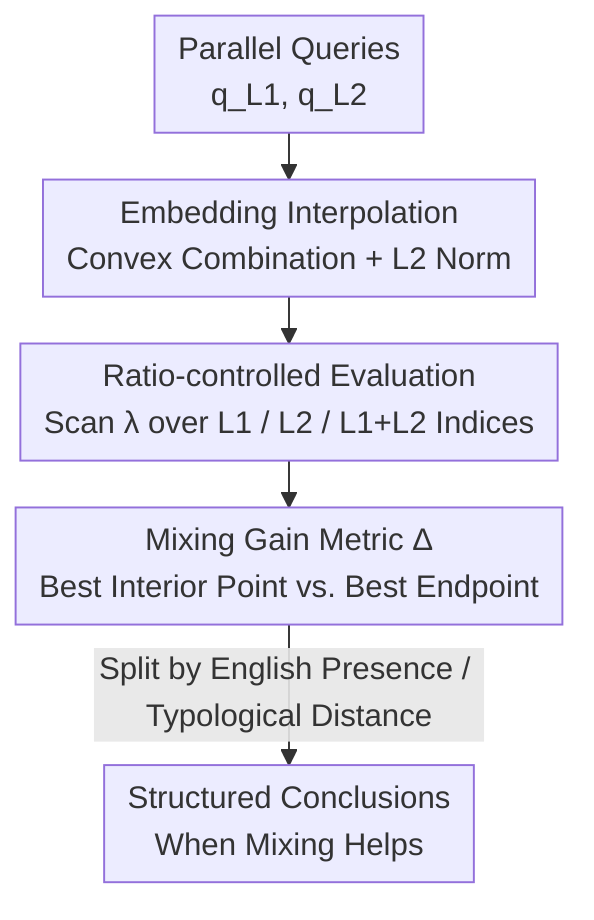

# When Does Mixing Help? Analyzing Query Embedding Interpolation in Multilingual Dense Retrieval

**Conference**: ACL2026  
**arXiv**: [2606.13537](https://arxiv.org/abs/2606.13537)  
**Code**: https://github.com/tongyao-zhu/query-embedding-mix  
**Area**: Information Retrieval / Multilingual NLP  
**Keywords**: Multilingual Dense Retrieval, Code-mixed Queries, Embedding Interpolation, mMARCO, English Dominance

## TL;DR
This paper employs "embedding-level interpolation" as a controllable proxy to investigate the sensitivity of multilingual dense retrieval to mixed-language queries. By systematically varying the mixing ratio of two parallel queries on mMARCO, the study finds that the optimal mixing ratio outperforms the best monolingual query in 88/105 settings. This gain is highly structured: English plays the role of the "strongest mixing partner" and an "asymmetric hegemon" within the vector space.

## Background & Motivation
**Background**: In multilingual communities, users frequently mix multiple languages within a single query (code-mixing/code-switching). However, dense retrievers (e.g., BGE-M3) are almost exclusively developed and evaluated under the assumption of "monolingual queries"—either monolingual retrieval or cross-lingual retrieval (translating the entire query). The behavior of mixed queries remains largely unexplored in standard benchmarks.

**Limitations of Prior Work**: Investigating whether "mixing is beneficial" requires three concurrent elements: precise control over mixing ratios, parallel queries, and evaluation across different document language compositions. Generating word-level code-mixed queries using LLMs is prohibitively expensive (requiring separate prompts for each ratio), produces unstable quality (incomplete sentences, failure to adhere to ratios), and introduces noise from Language Identification (LID) and tokenization.

**Key Challenge**: The core question is whether retrieval performance is capped by the "better monolingual endpoint" as mixing ratios vary continuously between two languages, or if intermediate mixed states can surpass both. The "ratio controllability" needed to answer this is precisely what text-based mixing struggles to provide.

**Goal**: To map the "mixing ratio $\to$ retrieval performance" curve across large-scale language pairs and identify the factors determining gains (document language, presence of English, typological distance, etc.).

**Key Insight**: The authors observe that embeddings of word-level mixed queries in the encoder space approximately lie on the line connecting the two monolingual endpoints (experimentally shown to move linearly along the EN$\to$ZH axis with minimal off-axis deviation). Consequently, rather than laboriously generating text, one can **directly interpolate vectors** of two monolingual queries in the embedding space.

**Core Idea**: Use "embedding-level interpolation" (embed-mix) as a controllable, scalable proxy with zero generation noise to precisely scan the impact of mixing ratios on dense retrieval across 35 language pairs and 3 document language settings.

## Method
Ours does not propose a new retriever but rather a **controllable measurement protocol**: by fixing the documents and retrieval pipeline and only varying the "query representation," the "language mixing ratio" variable is cleanly isolated for observation.

### Overall Architecture
Given two parallel translations of a query $q_{L_1}, q_{L_2}$, they are first encoded by a fixed multilingual encoder to obtain $\mathbf{e}_{L_1}, \mathbf{e}_{L_2}$. A convex combination is applied to the two embeddings based on a target ratio $\lambda$, followed by L2 normalization to produce a "mixed query vector." This vector is used to retrieve the top-$K$ passages directly from a FAISS index to calculate nDCG@10. For each language pair $(L_1, L_2)$, the process is repeated under three document language index settings: $L_1$ documents only, $L_2$ documents only, and $L_1{+}L_2$ bilingual documents. The output is a family of curves showing "nDCG@10 vs. $\lambda$" and a summary metric $\Delta$.

### Key Designs

**1. Embedding Interpolation (embed-mix): Replacing "Text Generation" with "Linear Trajectories"**

To address the high cost and noise of LLM-based text mixing, the authors perform a convex combination of monolingual query embeddings. Given a mixing weight $\lambda \in [0, 100]$ (interpreted as the percentage of $L_2$), the mixed query embedding is defined as a normalized linear interpolation:

$$\tilde{\mathbf{e}}(\lambda)=\frac{(1-\lambda/100)\,\mathbf{e}_{L_1}+(\lambda/100)\,\mathbf{e}_{L_2}}{\bigl\lVert(1-\lambda/100)\,\mathbf{e}_{L_1}+(\lambda/100)\,\mathbf{e}_{L_2}\bigr\rVert}$$

The experiments scan $\lambda \in \{0,10,30,50,70,90,100\}$, where $\mathcal{E}=\{0,100\}$ represent monolingual endpoints and $\mathcal{M}=\{10,30,50,70,90\}$ represent internal mixed points. During retrieval, $\tilde{\mathbf{e}}(\lambda)$ is used to query the index **without re-invoking the encoder**, allowing a single encoding pass to cover all ratios. This is a valid proxy because geometric diagnosis confirms that word-level mixed embeddings fall near the $\mathbf{e}_{L_1}\to\mathbf{e}_{L_2}$ line: defining normalized position $r$ and off-axis distance $\delta$, the authors find $r$ increases linearly with the target ratio while $\delta$ remains minimal.

**2. Controllable Ratios × Triple Document Settings: Decoupling Mixing Factors**

To move beyond "mixing" as a binary attribute, the authors scan $\lambda$ across three index types ($L_1$ only, $L_2$ only, $L_1{+}L_2$) for each language pair. Only the query representation changes; documents and pipelines remain fixed. This separates two often-confused effects: "query-document language matching" (alignment effect) and "complementary semantics from the other language" (cross-lingual gain). Using 14 languages from mMARCO, 35 language pairs, and 1,484 long queries, the main experiment involves indices of 8.8 million passages using BGE-M3.

**3. Mixing Gain Metric $\Delta$: Quantifying the "Profit" of Mixing**

To condense the curves into a comparable scalar, $\Delta$ is defined for each (language pair, document language) setting: $\texttt{endpoint\_best}=\max_{\lambda\in\mathcal{E}}\mathrm{nDCG@10}(\lambda)$, $\texttt{best\_mid}=\max_{\lambda\in\mathcal{M}}\mathrm{nDCG@10}(\lambda)$, and $\Delta = \texttt{best\_mid} - \texttt{endpoint\_best}$. $\Delta > 0$ indicates that an intermediate mixing ratio outperforms any monolingual query. This metric is cross-validated with MRR@10 and Recall@10.

**4. Language Pair Metadata: Explaining "When Mixing is More Valuable"**

The authors annotate each language pair with four factors: script overlap, linguistic family distance, typological distance (glot_tree and lang2vec_knn from DistaL), and resource level (High H vs. Low L). After accounting for the dominant "English-in-document" effect, typological distance shows a moderate negative correlation with mixing gains ($\Delta$).

## Key Experimental Results

### Main Results
Using the BGE-M3 encoder on 8.8M mMARCO passages across 105 settings (35 pairs × 3 index types):

| Metric | Avg. $\Delta$ | $\#(\Delta>0)$ | $\#(\Delta<0)$ |
|------|--------------|----------------|----------------|
| nDCG@10 | +0.7037 | 88 | 17 |
| MRR@10 | +0.5844 | 88 | 17 |
| Recall@10 | +1.2021 | 98 | 7 |

The optimal mixing ratio exceeds the best monolingual query in 88/105 (83.8%) settings. The median $\Delta$ is +0.65 (range: −0.34 to +2.92). The largest gain occurs for EN–AR on AR documents ($\Delta=+2.92, \lambda^*=50$). The significant improvement in Recall@10 suggests mixing primarily helps retrieve more relevant passages into the top-10 rather than just re-ranking the very top.

### English Effect and Optimal Ratios

| Dimension | Phenomenon | Avg. $\Delta$ |
|----------|------|--------------|
| Documents without English | $\Delta > 0$ in all settings; mixing is universally helpful | +0.95 |
| Documents with English (EN-only/EN+X) | $\Delta$ near zero; mixing rarely helps | −0.04 |
| Non-EN pairs, Monolingual Docs | Peak often at $p_{\text{doc}}(\lambda^*)\approx 70$ (35/44) | — |
| EN pairs, Monolingual EN Docs | Optimal is usually no mixing ($\lambda^*=0$) | — |

### Key Findings
- **English as an Asymmetric Hegemon**: Adding English to a non-English query improves non-English document retrieval (e.g., adding EN to a ZH query for ZH documents, $\Delta=+1.72$). Conversely, adding other languages to an English query does not improve English document retrieval.
- **English as the Strongest Mixing Partner**: For all 13 non-English document languages, pairing the query with English yields the largest $\Delta$, significantly leading the second-best partner. This is attributed to the dominance of English in pre-training corpora, creating a dense, robust semantic subspace that acts as a "universal anchor."
- **Alignment vs. Gain Trade-off**: In monolingual document settings, a higher proportion of the document's language in the query is generally better, but not linearly. A 50% mixture often matches 100% monolingual performance, with the "sweet spot" at 70%, suggesting a balance between document alignment and complementary cross-lingual signals.
- **Weak Secondary Factors**: Excluding English effects, typological distance has a moderate negative correlation (Spearman $\rho=-0.405$) with gains. Script, family, and resource levels show only weak, non-monotonic trends.

## Highlights & Insights
- **Embedding Interpolation as a Proxy**: This is a brilliant methodological step. It converts a "per-ratio LLM generation" problem into an "encode once, scan all" experiment, supported by geometric evidence ($r$ linearity, small $\delta$).
- **Transferable "English Hegemon" Insight**: Provides actionable guidance for multilingual RAG/retrieval—simply mixing English into queries for non-English documents is often beneficial, but the reverse may be detrimental for English documents.
- **Structured Problem Formulation**: The study proves that mixing sensitivity is not random noise but is structured by factors like English presence, document alignment, and typological distance, which holds across different model families and scales.

## Limitations & Future Work
- **Interpolation $\neq$ Real Code-mixing**: While a valid proxy, embed-mix yields higher absolute nDCG than word-level mixing (by avoiding tokenization/LID noise). Conclusions apply to "ratio trends" rather than absolute performance on raw text.
- **Lack of Extremely Low-resource Languages**: mMARCO (bands 3–5) lacks band 0–2 languages. While appendix tests on band 0–2 support the findings, broader coverage is needed.
- **Parallel Query Assumption**: Real-world mixed queries rarely consist of strict parallel translations. Mixing can occur at the pragmatic or lexical level rather than just semantic-ratio level.
- **Future Directions**: Developing lightweight strategies to adaptively select mixing ratios based on document language or presence of English, or introducing code-switched data during training to mitigate English asymmetric bias.

## Related Work & Insights
- **vs. Word-level Code-mixed Generation (Kim et al., 2025)**: While they reported inconsistent behaviors using LLM-generated queries, Ours uses embedding interpolation to scan ratios precisely, showing that the underlying trends are structured once generation noise is removed.
- **vs. Standard Multilingual Benchmarks (mMARCO / MIRACL)**: These assume monolingual or fully translated queries; Ours addresses the neglected dimension of mixed-language inputs.
- **vs. Code-mixing Diagnostic Suites (LinCE / GLUECoS)**: Those focus on LID and segmentation errors; Ours quantifies the effects of "Language Pair × Ratio" in IR scenarios as a complementary diagnostic.

## Rating
- Novelty: ⭐⭐⭐⭐ The proxy method and "Asymmetric Hegemon" insight are solid, though it is an analytical rather than algorithmic study.
- Experimental Thoroughness: ⭐⭐⭐⭐⭐ 105 settings, multiple metrics, bootstrap intervals, and cross-model validation.
- Writing Quality: ⭐⭐⭐⭐ Problem-driven with logical progression, though some factor analysis is quite dense.
- Value: ⭐⭐⭐⭐ Provides actionable insights for handling mixed-language user inputs in multilingual IR/RAG.

<!-- RELATED:START -->

## Related Papers

- [\[ICLR 2026\] A Dense Subset Index for Collective Query Coverage](../../ICLR2026/information_retrieval/a_dense_subset_index_for_collective_query_coverage.md)
- [\[ACL 2026\] More Than Efficiency: Embedding Compression Improves Domain Adaptation in Dense Retrieval](more_than_efficiency_embedding_compression_improves_domain_adaptation_in_dense_r.md)
- [\[ACL 2026\] Enhancing Multilingual RAG Systems with Debiased Language Preference-Guided Query Fusion](enhancing_multilingual_rag_systems_with_debiased_language_preference-guided_quer.md)
- [\[ACL 2026\] Test-Time Training for Zero-Resource Dense Retrieval Reranking](test-time_training_for_zero-resource_dense_retrieval_reranking.md)
- [\[ACL 2026\] When Retrieval is Ineffective in Biomedical RAG: A Large-Scale Empirical Study](when_retrieval_doesnt_help_a_large-scale_study_of_biomedical_rag.md)

<!-- RELATED:END -->
