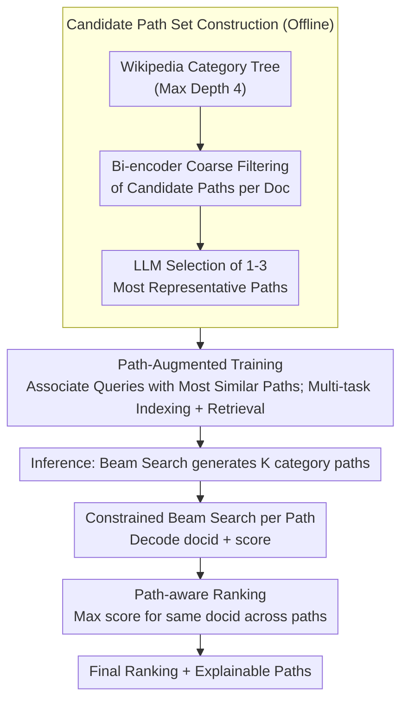

# Why These Documents? Explainable Generative Retrieval with Hierarchical Category Paths

**Conference**: ACL 2026 Findings  
**arXiv**: [2411.05572](https://arxiv.org/abs/2411.05572)  
**Code**: [GitHub](https://augustinlib.github.io/HyPE/)  
**Area**: Information Retrieval  
**Keywords**: Generative Retrieval, Explainable Retrieval, Hierarchical Category Paths, Document Identifiers, Path-aware Ranking

## TL;DR
The HyPE framework is proposed to provide query-relevant explainable paths by first generating hierarchical category paths (e.g., "Government >> Government by cities") before decoding document identifiers in generative retrieval, while simultaneously improving retrieval accuracy.

## Background & Motivation

**Background** Generative Retrieval (GR) directly decodes document identifiers (docids) to respond to queries using a single generative model, achieving end-to-end optimization and reducing dependence on external indices. Existing methods have explored two main categories for docid design: semantic (numeric clustering indices) and lexical (titles, keywords, substrings).

**Limitations of Prior Work** Regardless of whether semantic or lexical docids are used, existing generative retrieval methods cannot answer "why this document was retrieved." For instance, for a document about "Dubai," different queries might focus on "Dubai Economy" or "Dubai Government," yet the retrieval system returns the same docid, failing to explain the correspondence between the retrieval decision and the query intent.

**Key Challenge** Explainability is crucial in retrieval—a lack of explanation undermines user trust in results and hinders the exploration of relevant information. However, current explainable retrieval methods are either limited to keyword attribution (lacking semantic context) or rely on LLM-generated natural language explanations (high inference latency, unsuitable for real-time retrieval).

**Goal** To design an explainable generative retrieval framework that provides clear and reasonable explanations during the retrieval process while maintaining or even enhancing retrieval performance.

**Key Insight** Structured hierarchical category paths (e.g., Wikipedia category trees) serve as an ideal explanation medium. They offer more semantic structure than keywords and are more compact and efficient than natural language (averaging only 13.5 tokens vs. 61 tokens for natural language). Furthermore, different explanatory paths can be generated for the same document based on different queries.

**Core Idea** A hierarchical category path is a "just right" form of explanation. It guides the model to better locate relevant documents through a coarse-to-fine reasoning process.

## Method

### Overall Architecture
HyPE integrates the "explain before retrieve" paradigm into the decoding process of generative retrieval. Before outputting the document identifier (docid), the model step-by-step generates a hierarchical category path from coarse to fine (e.g., "Government >> Government by cities"). this provides an explanation for the retrieval decision and narrows the search space through coarse-to-fine reasoning. The framework consists of three stages: offline construction of candidate category path sets for each document; path-augmented training where queries are paired with the most relevant paths to learn both "indexing" and "retrieval" tasks; and inference where beam search generates multiple paths, followed by docid decoding under each path, finally aggregated via path-aware ranking.

### Key Designs

**1. Candidate Path Set Construction: Encoder filtering + LLM selection to assign 1-3 semantic paths per document**

For explanations to be reliable, each document must be associated with semantically appropriate hierarchical paths. HyPE utilizes the Wikipedia category tree as the skeleton structure (limited to a depth of 4). Since the tree contains thousands of paths, putting them all into an LLM would exceed the context length. Thus, a two-stage process is used: a bi-encoder first filters a candidate path set $\hat{\mathcal{P}}_D$ for each document based on semantic similarity, and then an LLM selects up to 3 paths that best represent the document content. The encoder reduces the candidate volume while the LLM ensures quality, balancing cost and relevance.

**2. Path-Augmented Training: Inserting paths before docids to enable coarse-to-fine pseudo-reasoning**

To train the model to determine categories before documents, HyPE selects the path most semantically similar to the query from the document's candidate paths for each query-document pair in the training set, forming a path-augmented set $\mathcal{X}^+ = \{(q, p^q, D, d)\}$. The model optimizes two tasks simultaneously: an indexing task $\mathcal{M}^\theta(p^q, d \mid D)$ mapping documents to "path + docid," and a retrieval task $\mathcal{M}^\theta(p^q, d \mid q)$ mapping queries to "path + docid." Generating a path before the docid forces the decoding to identify the semantic category first, which aligns better with human retrieval reasoning than jumping directly to a docid.

**3. Path-aware Ranking: Aggregating decoding results from multiple paths to cover multiple semantic facets of a query**

A single path may only capture one semantic aspect of a query. HyPE therefore uses beam search during inference to generate $K_p$ category paths. For each path, constrained beam search decodes $m$ docid-score pairs. The framework then retains only the maximum score for each docid across all paths and sorts them in descending order: $\tilde{Y} = \{(d, s) \mid s = \max\{s' \mid (d, s') \in Y_j\}\}$. Taking the maximum score ensures that if a document scores high in any relevant topic dimension, it can be ranked highly, preventing multi-topic documents from being missed by a single path.

### Function
Using the query "How does Dubai's government work" as an example: the model first uses beam search to generate several category paths, such as "Government >> Government by cities." Under this path, constrained beam search decodes valid docids like "Dubai" and their scores using a prefix trie. If another path is "Economy >> Economy by city," it would favor decoding documents related to the Dubai economy. Finally, path-aware ranking aggregates the highest scores for the same docid across paths. Since the query intent focuses on "government," the "Dubai" document under the "Government" path receives a higher score and is ranked at the top. This demonstrates why the same document can provide different explanatory paths and rankings for different queries.

### Loss & Training
The model uses T5-base as the backbone, employing standard seq2seq cross-entropy loss for multi-task learning of indexing and retrieval. The indexing task uses FirstP (the first $k$ tokens of a document) as the document representation, supplemented by 5 synthetic queries to mitigate the distribution gap between indexing and retrieval. Inference employs constrained beam search with a prefix trie to ensure that generated docids are always valid.

## Key Experimental Results

### Main Results

| Docid Type | Dataset | Metric R@10 | Baseline | + HyPE | Gain |
|-----------|--------|----------|----------|--------|------|
| Title | NQ320K Full | R@10 | 78.7 | **83.5** | +6.1% |
| Title | NQ320K Unseen | R@10 | 68.9 | **73.6** | +6.8% |
| Summary | NQ320K Full | R@10 | 78.8 | **79.6** | +1.0% |
| Keyword | MS MARCO | R@10 | 61.2 | **62.7** | +2.5% |
| Atomic | MS MARCO | R@10 | 73.6 | **74.6** | +1.4% |

### Ablation Study

| Analysis Dimension | Results | Description |
|---------|------|------|
| Path Count K=1 vs K=3 | K=1 outperforms no path; K=3 is significantly better | Multi-path strategy effectively captures multi-topic dimensions. |
| Path Quality (GPT-5 Eval) | 94.6% of paths judged relevant | High quality of path generation; low risk of error propagation. |
| Human Re-ranking Experiment | R@1 improved by 23.7% with paths; confidence increased by 12% | Path explanations genuinely assist users in making better decisions. |
| Inference Latency | Increase of only ~0.1s/sample | Explainability barely impacts efficiency. |
| Token Efficiency | Path 13.5 tokens vs. Natural Language 61 tokens | 4.5x more efficient. |

### Key Findings
- HyPE can be applied orthogonally to all docid types (title, keyword, summary, atomic), demonstrating high versatility.
- Title docids benefit most from HyPE because titles encode coarse-grained semantics that match the coarse-to-fine structure of hierarchical paths.
- It remains effective on non-Wikipedia corpora (MS MARCO), proving that the method's generalization does not depend on a common source between the corpus and the category tree.
- Even when paths are not perfectly accurate (5.4% judged irrelevant), retrieval performance does not drop significantly, indicating robustness to path errors.

## Highlights & Insights
- The design of hierarchical category paths as a form of explanation is ingenious: structured, compact, automatically generated, and dynamically adjusted based on the query.
- The "explain before retrieve" paradigm transforms explainability from a post-hoc attribution into an organic part of the retrieval process.
- The path-aware ranking strategy cleverly utilizes multiple paths to cover the various semantic facets of a query.
- Human re-ranking experiments (R@1 improvement of 23.7%) strongly prove the value of explainability for actual users.

## Limitations & Future Work
- The current skeletal hierarchy is based on the Wikipedia category tree; domain-specific taxonomies might be required for specialized fields like medicine or law.
- It is not applicable to semantic docids (which already have built-in hierarchical structures), limiting its scope.
- Path depth is fixed at 4 layers, which might be insufficient for extremely fine-grained retrieval needs.
- Future work could explore allowing the model to automatically construct hierarchies rather than depending on external category trees.

## Related Work & Insights
- Compared to free-text explanation methods, category paths offer a 4.5x advantage in token efficiency with almost no increase in latency.
- Orthogonal to generative retrieval methods like DSI and NCI, it can serve as a plug-and-play enhancement module.
- It provides a new paradigm for retrieval system explainability: driving retrieval through explainable intermediate steps rather than post-hoc explanations.

## Rating
- Novelty: ⭐⭐⭐⭐ Hierarchical paths as an intermediary for explainable retrieval is a novel idea.
- Experimental Thoroughness: ⭐⭐⭐⭐⭐ Includes two datasets, four docid types, human evaluation, LLM evaluation, and efficiency analysis.
- Writing Quality: ⭐⭐⭐⭐⭐ Clear logical chain and intuitive case studies.
- Value: ⭐⭐⭐⭐ Significant implications for both explainable retrieval and generative retrieval.

<!-- RELATED:START -->

## Related Papers

- [\[ACL 2026\] From Relevance to Authority: Authority-aware Generative Retrieval in Web Search Engines](from_relevance_to_authority_authority-aware_generative_retrieval_in_web_search_e.md)
- [\[ACL 2025\] On Synthetic Data Strategies for Domain-Specific Generative Retrieval](../../ACL2025/information_retrieval/on_synthetic_data_strategies_for_domain-specific_generative_retrieval.md)
- [\[ACL 2026\] Hybrid-Vector Retrieval for Visually Rich Documents: Combining Single-Vector Efficiency and Multi-Vector Accuracy](hybrid-vector_retrieval_for_visually_rich_documents_combining_single-vector_effi.md)
- [\[ICLR 2026\] ZeroGR: A Generalizable and Scalable Framework for Zero-Shot Generative Retrieval](../../ICLR2026/information_retrieval/zerogr_a_generalizable_and_scalable_framework_for_zero-shot_generative_retrieval.md)
- [\[ACL 2026\] GLIER: Generative Legal Inference and Evidence Ranking for Legal Case Retrieval](glier_generative_legal_inference_and_evidence_ranking_for_legal_case_retrieval.md)

<!-- RELATED:END -->
