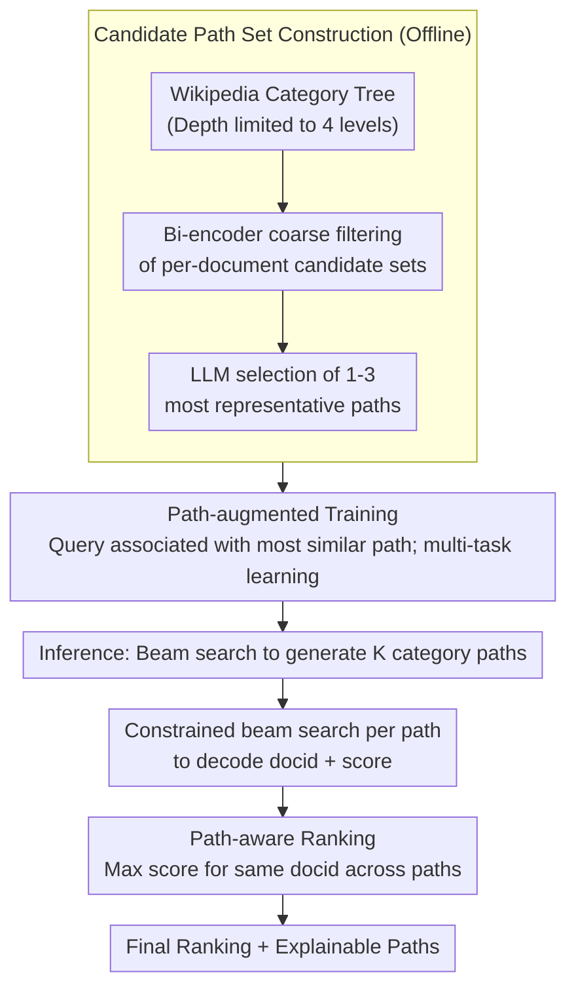

# Why These Documents? Explainable Generative Retrieval with Hierarchical Category Paths

**Conference**: ACL 2026 Findings  
**arXiv**: [2411.05572](https://arxiv.org/abs/2411.05572)  
**Code**: [GitHub](https://augustinlib.github.io/HyPE/)  
**Area**: Information Retrieval  
**Keywords**: Generative Retrieval, Explainable Retrieval, Hierarchical Category Paths, Document Identifiers, Path-aware Ranking

## TL;DR
The HyPE framework is proposed to enhance generative retrieval by first generating a hierarchical category path (e.g., "Government >> Government by cities") before decoding document identifiers. This provides query-relevant explainable paths while simultaneously improving retrieval accuracy.

## Background & Motivation

**Background** Generative Retrieval (GR) responds to queries by directly decoding document identifiers (docids) through a single generative model, enabling end-to-end optimization and reducing dependence on external indices. Existing methods explore two main categories of docid design: semantic (numeric clustering indices) and lexical (titles, keywords, substrings).

**Limitations of Prior Work** Regardless of whether semantic or lexical docids are used, current generative retrieval systems cannot answer "why a specific document was retrieved." For instance, for the document "Dubai," different queries might focus on the "Economy of Dubai" or the "Government of Dubai," but the system returns the same docid, failing to explain the correspondence between retrieval decisions and query intent.

**Key Challenge** Interpretability is crucial in retrieval—a lack of explanation weakens user trust and hinders the exploration of related information. However, existing explainable retrieval methods are either limited to keyword attribution (lacking semantic context) or rely on LLMs to generate natural language explanations (high inference latency, unsuitable for real-time retrieval).

**Goal** To design an explainable generative retrieval framework that provides clear and reasonable explanations during the retrieval process while maintaining or even enhancing retrieval performance.

**Key Insight** Structured hierarchical category paths (such as the Wikipedia category tree) serve as effective explanation carriers. By progressively generating semantic category paths from coarse to fine before decoding docids, the system provides an explanation for the retrieval decision and guides the model to better locate relevant documents through a coarse-to-fine reasoning process.

**Core Idea** Hierarchical category paths represent a "just-right" form of explanation—more semantically structured than keywords and more compact than natural language (averaging 13.5 tokens vs. 61 tokens for natural language). Furthermore, they allow for the generation of different explanatory paths for the same document based on varying queries.

## Method

### Overall Architecture
HyPE integrates an "explain-then-retrieve" paradigm into the generative retrieval decoding flow. Before outputting a document identifier (docid), the model generates a hierarchical category path from coarse to fine (e.g., "Government >> Government by cities"). This provides an explanation for the retrieval decision while narrowing the search space through coarse-to-fine reasoning. The framework consists of three coupled segments: offline construction of candidate path sets for each document, path-augmented training where queries are bound to the most relevant paths for joint "indexing" and "retrieval" learning, and inference where multiple paths are generated via beam search followed by docid decoding and path-aware ranking to aggregate final results.

### Key Designs

**1. Candidate Path Set Construction: Encoder filtering + LLM selection for 1-3 semantic paths per document**

For explanations to be reliable, each document must be associated with semantically appropriate hierarchical paths. HyPE utilizes the Wikipedia category tree as the backbone structure (limited to 4 levels). Since the tree contains tens of thousands of paths, a two-stage process is employed: a bi-encoder first filters a candidate set $\hat{\mathcal{P}}_D$ based on semantic similarity, and an LLM then selects up to 3 paths that best represent the document content. This approach balances cost and path quality.

**2. Path-augmented Training: Inserting paths before docids for coarse-to-fine pseudo-reasoning**

To train the model to determine categories before documents, HyPE associates each query-document pair in the training set with the candidate path most semantically similar to the query, forming the augmented set $\mathcal{X}^+ = \{(q, p^q, D, d)\}$. The model optimizes two tasks simultaneously: an indexing task $\mathcal{M}^\theta(p^q, d \mid D)$ mapping documents to "path + docid," and a retrieval task $\mathcal{M}^\theta(p^q, d \mid q)$ mapping queries to "path + docid." Generating a path before the docid aligns the decoding process with human-like retrieval reasoning.

**3. Path-aware Ranking: Aggregating results across multiple paths to cover semantic facets**

Since a single path may only capture one semantic aspect of a query, HyPE generates $K_p$ category paths during inference via beam search. For each path, constrained beam search decodes $m$ docid-score pairs. The framework then retains only the highest score for a single docid across all paths for the final ranking: $\tilde{Y} = \{(d, s) \mid s = \max\{s' \mid (d, s') \in Y_j\}\}$. This ensures that documents scoring highly in any relevant topic dimension are ranked appropriately.

### Mechanism Example
Consider the query "How the government of Dubai works." The model first uses beam search to generate paths, such as "Government >> Government by cities." Under this path, constrained beam search with a prefix trie decodes valid docids like "Dubai" along with their scores. If another path like "Economy >> Economy by city" is generated, it would favor docids related to the economy. Path-aware ranking then takes the maximum score for "Dubai"—likely from the "Government" path—placing it at the top. This demonstrates how the same document can provide different explanatory paths based on the query.

### Loss & Training
The model uses T5-base as the backbone and is trained with standard seq2seq cross-entropy loss for multi-task learning (indexing and retrieval). The indexing task uses FirstP (the first $k$ tokens) as the document representation, supplemented by 5 synthetic queries to mitigate the distribution gap between indexing and retrieval. Constrained beam search with a prefix trie is used during inference to ensure valid docid generation.

## Key Experimental Results

### Main Results

| Docid Type | Dataset | Metric R@10 | Baseline | + HyPE | Gain |
|-----------|--------|----------|----------|--------|------|
| Title | NQ320K Full | R@10 | 78.7 | **83.5** | +6.1% |
| Title | NQ320K Unseen | R@10 | 68.9 | **73.6** | +6.8% |
| Summary | NQ320K Full | R@10 | 78.8 | **79.6** | +1.0% |
| Keyword | MS MARCO | R@10 | 61.2 | **62.7** | +2.5% |
| Atomic | MS MARCO | R@10 | 73.6 | **74.6** | +1.4% |

### Ablation Study

| Dimension | Result | Description |
|---------|------|------|
| Path Count K=1 vs K=3 | K=1 beats baseline; K=3 is significantly better | Multi-path strategy effectively captures topic dimensions |
| Path Quality (GPT-5 Eval) | 94.6% of paths judged relevant | High quality minimizes risk of error propagation |
| Human Reranking | R@1 improved by 23.7%, Confidence +12% | Path explanations help users make better decisions |
| Inference Overhead | Increase of ~0.1s/sample | Interpretability added with negligible efficiency impact |
| Token Efficiency | Path 13.5 tokens vs. NL 61 tokens | 4.5x more efficient than natural language |

### Key Findings
- HyPE can be applied orthogonally to all docid types (title, keyword, summary, atomic), demonstrating high versatility.
- Title docids benefit most as they encode coarse-grained semantics that match the coarse-to-fine structure of hierarchical paths.
- Effectiveness on non-Wikipedia corpora (MS MARCO) proves that the method's generalization does not depend on a shared source between the corpus and the taxonomy.
- Performance remains robust even when paths are not perfectly accurate (5.4% irrelevant), indicating resilience to path errors.

## Highlights & Insights
- The design of hierarchical category paths as an explanation form is elegant: structured, compact, automatically generated, and dynamically adjustable.
- The "explain-then-retrieve" paradigm shifts interpretability from post-hoc attribution to an organic part of the retrieval process.
- The path-aware ranking strategy cleverly utilizes multiple paths to cover various semantic facets of a query.
- Human reranking experiments (23.7% R@1 improvement) provide strong evidence for the practical value of interpretability for end-users.

## Limitations & Future Work
- The current backbone structure relies on the Wikipedia category tree; specific domains (e.g., medical, legal) may require domain-specific taxonomies.
- It is less applicable to semantic docids (which have inherent hierarchical structures), somewhat limiting its scope.
- Fixed path depth (4 levels) may be insufficient for extremely fine-grained retrieval needs.
- Future work could explore automatic structure construction rather than relying on external taxonomies.

## Related Work & Insights
- Compared to free-text explanation methods, category paths offer a 4.5x advantage in token efficiency with almost no increase in latency.
- Orthogonal to generative retrieval methods like DSI and NCI, acting as a plug-and-play enhancement module.
- Introduces a new paradigm for system interpretability: driving retrieval through explainable intermediate steps rather than justifying results after the fact.

## Rating
- Novelty: ⭐⭐⭐⭐ Hierarchical paths as intermediaries for explainable retrieval is a novel concept.
- Experimental Thoroughness: ⭐⭐⭐⭐⭐ Comprehensive evaluation across datasets, docid types, human assessment, and efficiency.
- Writing Quality: ⭐⭐⭐⭐⭐ Clear logical chain with intuitive case studies.
- Value: ⭐⭐⭐⭐ Highly insightful for both explainable AI and generative retrieval communities.

<!-- RELATED:START -->

## Related Papers

- [\[ACL 2026\] From Relevance to Authority: Authority-aware Generative Retrieval in Web Search Engines](from_relevance_to_authority_authority-aware_generative_retrieval_in_web_search_e.md)
- [\[ACL 2025\] On Synthetic Data Strategies for Domain-Specific Generative Retrieval](../../ACL2025/information_retrieval/on_synthetic_data_strategies_for_domain-specific_generative_retrieval.md)
- [\[ACL 2026\] Hybrid-Vector Retrieval for Visually Rich Documents: Combining Single-Vector Efficiency and Multi-Vector Accuracy](hybrid-vector_retrieval_for_visually_rich_documents_combining_single-vector_effi.md)
- [\[ACL 2026\] Why Mean Pooling Works: Quantifying Second-Order Collapse in Text Embeddings](why_mean_pooling_works_quantifying_second-order_collapse_in_text_embeddings.md)
- [\[ACL 2026\] GLIER: Generative Legal Inference and Evidence Ranking for Legal Case Retrieval](glier_generative_legal_inference_and_evidence_ranking_for_legal_case_retrieval.md)

<!-- RELATED:END -->
