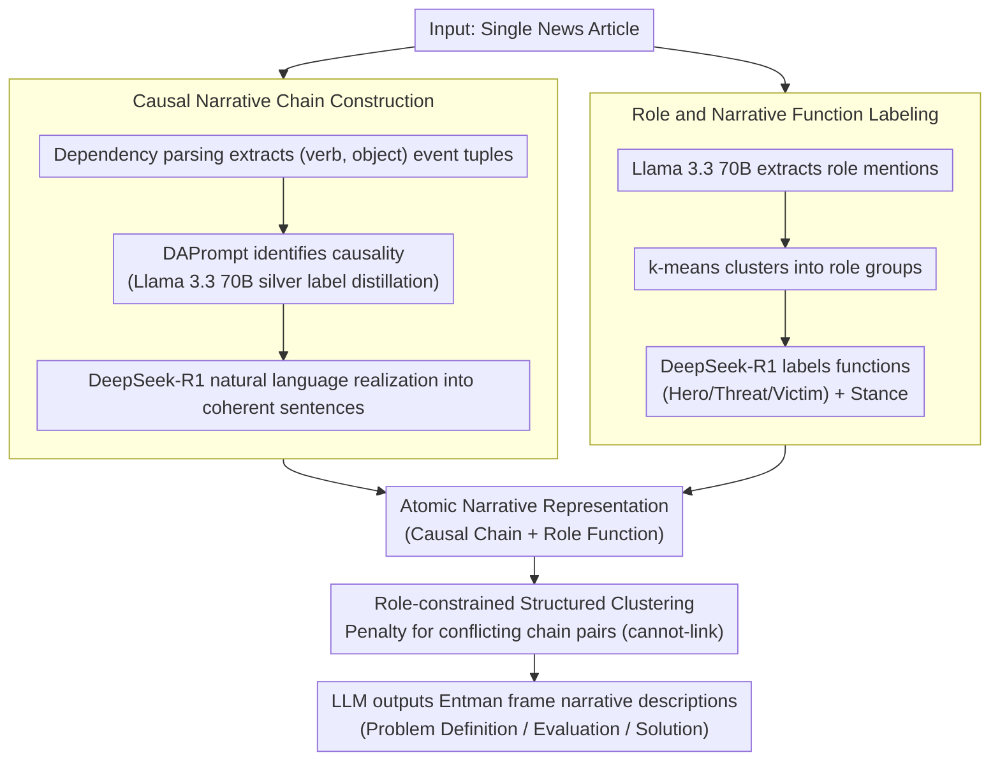

# A Structured Clustering Approach for Inducing Media Narratives

**Conference**: ACL 2026  
**arXiv**: [2604.10368](https://arxiv.org/abs/2604.10368)  
**Code**: Yes (mentioned in paper)  
**Area**: Interpretability  
**Keywords**: Media narratives, structured clustering, causal event chains, role analysis, framing theory

## TL;DR
The paper proposes a framework to automatically induce media narrative patterns from large-scale news corpora. By jointly modeling causal event chains and role information (Hero/Threat/Victim), it utilizes a role-constrained clustering algorithm to organize narrative chains into semantically coherent patterns. It generates interpretable narrative patterns consistent with framing theory in the domains of immigration and gun control.

## Background & Motivation

**Background**: Media narratives exert significant influence in shaping public opinion. NLP research on media analysis has accumulated through two main approaches: (1) coarse-grained labeling (e.g., "Left/Right" stance, "Political/Economic/Security" thematic frames), which is scalable but loses nuances of narrative structure; (2) domain-specific taxonomies (e.g., specialized labels for immigration or economic issues), which capture nuances but lack cross-domain generalization.

**Limitations of Prior Work**: Coarse-grained methods ignore the delicate narrative structures emphasized in communication studies—how readers are guided toward specific conclusions through role settings and causal constructions. Domain-specific methods require extensive manual annotation and cannot scale to new domains. The fragmentation between these two approaches limits consistent narrative analysis across domains.

**Key Challenge**: The contradiction between scalability and depth of interpretation—either sacrificing narrative detail for scale or sacrificing scale for depth.

**Goal**: Design a narrative induction framework that maintains deep narrative structure (event causality + functional role positioning) while scaling to large corpora without requiring domain-specific taxonomies.

**Key Insight**: Drawing from the Narrative Policy Framework (NPF) in communication science, this work views roles (Hero/Threat/Victim) as key structural elements of narrative analysis. Role constraints are used to distinguish event chains that share surface similarities but possess different narrative meanings.

**Core Idea**: Construct atomic narrative representations using causal event chains and role labels, then automatically induce high-level narrative patterns across articles via role-constrained clustering (cannot-link constraints).

## Method

### Overall Architecture

The framework aims to automatically induce semantically coherent and interpretable narrative patterns from large-scale news corpora without relying on domain taxonomies. Taking a single article as input, it first decomposes the text into causal event chains expressed in natural language. It then labels the narrative functions of roles (Hero/Threat/Victim) within the chains. These two signals are combined into atomic narrative representations. Subsequently, role-constrained clustering organizes thousands of narrative chains into several high-level patterns. Finally, an LLM outputs narrative descriptions (issue definition, evaluation, solution) for each cluster according to Entman’s framing theory, resulting in a list of interpretable narrative patterns.

### Key Designs

**1. Causal Narrative Chain Construction: Compressing articles into "Because X, therefore Y" atomic units**

Pure event sequences only show what happened, missing the core manipulation in media narratives: causal construction—guiding readers to specific conclusions through the logic of "Because X, therefore Y." First, dependency parsing extracts $(verb, object)$ event tuples. Then, the DAPrompt method identifies causal relationships between event pairs. To manage the cost of large-scale LLM calls, Llama 3.3 70B generates silver labels for 20K event pairs, which are then distilled into a lightweight DAPrompt model. Once causal triples are obtained, DeepSeek-R1 realizes them into coherent natural language sentences, allowing subsequent clustering to utilize both structural information and semantic representations.

**2. Role and Narrative Function Labeling: Key signals determining narrative ideological direction**

In identical event chains, different role assignments can convey opposite messages—"immigrant=victim, officer=threat" versus "immigrant=threat, officer=hero" involve the same entities but point to opposing stances. To capture this, Llama 3.3 70B extracts role mentions under a 5-shot setting, which are then clustered into groups (e.g., "Immigrants," "Law Enforcement") via k-means. Subsequently, DeepSeek-R1 labels each role with its narrative function (Hero/Threat/Victim) and overall stance (Support/Oppose) in a zero-shot manner. This layer explicates the evaluative dimension of the narrative, serving as the basis for constrained clustering.

**3. Role-constrained Structured Clustering: Forcing the separation of "same topic, opposing narrative" chains**

Clustering based solely on textual similarity might group "immigrants are victims" and "immigrants are threats" together since both discuss immigration. To prevent this, cannot-link constraints are generated for chain pairs with conflicting role function configurations (where the same role group is assigned different functions). The k-means objective function is modified to $\mathcal{R} = \frac{1}{2}\sum \|x_i - \mu_{l_i}\|^2 + \sum w_c \mathbf{1}[l_i = l_j]$, imposing a penalty $w_c$ on same-cluster assignments that violate constraints. Initialization is replaced with a constraint-aware k-means++ variant to prevent conflicting chains from falling into the same cluster from the start. These constraints ensure clusters are consistent in narrative structure, not just topical similarity.

## Key Experimental Results

### Main Results (Structured Clustering vs. Standard k-means)

| Domain | Method | Frame F1 | Exact Match Purity | Avg. Role Purity |
|------|------|----------|-------------------|-----------------|
| Immigration | k-means | 41.19 | 26.90 | 80.79 |
| Immigration | **Ours** | **42.32** | **32.79** | **81.48** |
| Gun Control | k-means | 37.65 | 29.22 | 81.18 |
| Gun Control | **Ours** | **41.68** | **36.66** | **82.90** |

### Ablation Study (Top 25% chains closest to centroid)

| Domain | Method | Frame F1 | Exact Match Purity |
|------|------|----------|--------------------|
| Immigration | k-means | 33.22 | 32.31 |
| Immigration | Ours | **36.96** | **37.83** |
| Gun Control | k-means | 32.86 | 35.16 |
| Gun Control | Ours | **36.45** | **42.71** |

### Key Findings
- **Structured clustering consistently outperforms standard k-means across all metrics**, particularly in Exact Match Purity (gain of +7.44pp in Gun Control).
- **Role constraints are vital for distinguishing nuanced narrative differences**: In Gun Control, narratives of "police as heroes protecting the public" and "police as threats violating rights" were successfully separated.
- **Natural language realization of causal chains is of high quality**: 3.3/4 for Immigration, 3.49/4 for Gun Control.
- **Role labeling accuracy is excellent**: 4.73/5 for Gun Control, 4.0/5 for Immigration.
- **Quality is higher for chains near the cluster centers** (purity metrics are better for Top 25%), suggesting that clustering identifies meaningful core structures.

## Highlights & Insights
- **Using narrative functions (Hero/Threat/Victim) as clustering constraints** serves as an ingenious bridge connecting communication theory and computational methods. This ensures clusters share structural consistency rather than just topical overlap.
- **The pipeline design balances cost and quality effectively**: Using large models to generate silver labels followed by distillation to lightweight models for inference results in only a 15% performance loss in causality prediction while significantly reducing costs.
- **Domain-agnosticism** is a major advantage: Only minimal role group labeling (at the cluster level rather than sample level) is required to extend the method to new domains.

## Limitations & Future Work
- Evaluation was limited to two English policy domains (Immigration, Gun Control); generalization across more languages and domains remains to be verified.
- The F1 for causal relationship prediction is only 58.46, which may cause error propagation to downstream clustering.
- Role group identification still requires minor manual labeling (cluster-level); fully unsupervised role discovery is a possible future direction.
- Temporal dynamics are not considered—how narrative patterns evolve over time (e.g., shifts before and after elections).
- Choosing the number of clusters $k$ remains an open problem.

## Related Work & Insights
- **vs. Chambers & Jurafsky (2008)**: Classical narrative schema induction focuses on event sequences without considering the evaluative dimension of roles. This work adds role function labeling, aligning more closely with communication science theories.
- **vs. Frame Detection (Card et al., 2015)**: Frame detection uses coarse-grained labels; this work achieves more granular and interpretable narrative patterns through structured clustering.
- **vs. LLM-based Analysis**: While direct LLM analysis is an end-to-end solution, it lacks interpretability and structure. This pipeline allows for validation and explanation at every step.

## Rating
- Novelty: ⭐⭐⭐⭐ Solid theoretical motivation by using role narrative functions as clustering constraints.
- Experimental Thoroughness: ⭐⭐⭐⭐ Includes human evaluation and multiple metrics, though limited to two domains.
- Writing Quality: ⭐⭐⭐⭐⭐ Clear motivation, intuitive diagrams, and complete methodological flow.
- Value: ⭐⭐⭐⭐ Practical value for computational communication and media analysis; the method is transferable.

<!-- RELATED:START -->

## Related Papers

- [\[NeurIPS 2025\] SpEx: A Spectral Approach to Explainable Clustering](../../NeurIPS2025/interpretability/spex_a_spectral_approach_to_explainable_clustering.md)
- [\[ACL 2026\] Interpretable Semantic Gradients in SSD: A PCA Sweep Approach and a Case Study on AI Discourse](interpretable_semantic_gradients_in_ssd_a_pca_sweep_approach_and_a_case_study_on.md)
- [\[ICLR 2026\] Inducing Dyslexia in Vision Language Models](../../ICLR2026/interpretability/inducing_dyslexia_in_vision_language_models.md)
- [\[ACL 2026\] Style over Story: Measuring LLM Narrative Preferences via Structured Selection](style_over_story_measuring_llm_narrative_preferences_via_structured_selection.md)
- [\[ICLR 2026\] Explainable K-means Neural Networks for Multi-view Clustering](../../ICLR2026/interpretability/explainable_k_-means_neural_networks_for_multi-view_clustering.md)

<!-- RELATED:END -->
