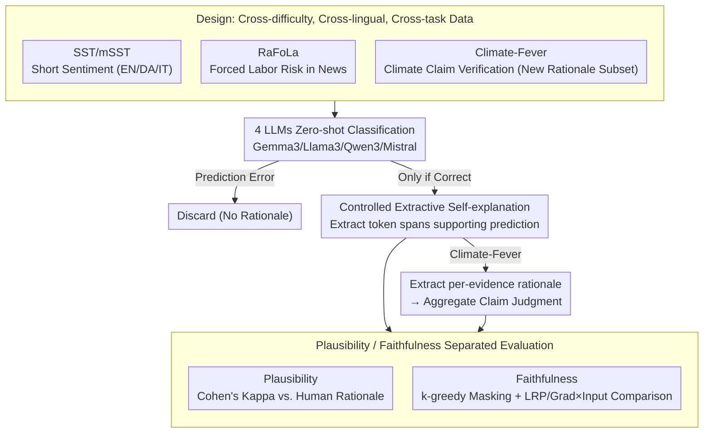

# A Systematic Comparison between Extractive Self-Explanations and Human Rationales in Text Classification

**Conference**: ACL2026  
**arXiv**: [2410.03296](https://arxiv.org/abs/2410.03296)  
**Code**: https://github.com/oeberle/self_explanations_human_rationales  
**Area**: Interpretability  
**Keywords**: LLM self-explanation, input rationale, human annotation, interpretability evaluation, attribution methods  

## TL;DR
This paper systematically compares the differences between extractive self-explanations generated by four open-source instruction-tuned LLMs across three types of text classification tasks, human rationales, and post-hoc attribution methods. The study finds that the consistency between self-explanations and human annotations is strongly influenced by text length and task complexity; however, in perturbation-based faithfulness evaluations, self-explanations often identify a subset of tokens more critical to the model's prediction.

## Background & Motivation
**Background**: LLMs have been widely deployed in classification, summarization, question answering, and decision support scenarios. Users are increasingly accustomed to models providing natural language explanations or extracting evidence snippets from inputs to justify "why" a prediction was made. These explanations do not require additional training of explainers or user understanding of complex gradient-based attribution or mechanistic interpretability tools.

**Limitations of Prior Work**: The issue is that a self-explanation looking like an explanation does not guarantee it is a good one. A rationale must pass at least two tests: first, plausibility, which measures how much it resembles a human-selected reason; and second, faithfulness, which assesses whether it truly touches upon the information the model relied on for its prediction. Existing work often focuses only on short-text sentiment classification or compares self-explanations only with simple saliency methods, lacking a systematic comparison across tasks, languages, and post-hoc attribution methods.

**Key Challenge**: Users want explanations to be both "aligned with human intuition" and "faithful to the model's internal decision-making," but these two goals are not always consistent. Human rationales may lean towards narrative and semantic evidence, while model self-explanations might favor explicit snippets usable for the task. Meanwhile, gradient attribution methods might emphasize system prompts or formatting tokens that are computationally important but unnatural to humans. Treating any single type of explanation as the absolute truth obscures information on the other side.

**Goal**: The authors aim to answer three specific questions: the degree of consistency between LLM-generated extractive self-explanations and human rationales across different text classification tasks; whether these rationales truly change model predictions after masking input tokens; and what token selection strategies are employed by self-explanations versus human explanations compared to post-hoc attribution methods like LRP and Gradient×Input.

**Key Insight**: The paper focuses on extractive explanations rather than free-text explanations. The advantage is that explanations are strictly anchored in the input text, allowing them to be converted into token-level rationales for direct comparison with human token annotations, post-hoc attribution scores, and perturbation-based faithfulness curves.

**Core Idea**: By placing LLM self-explanations, human rationales, and post-hoc attributions into a single token-level evaluation framework, the distinction between "looking reasonable" and "effectively influencing the model" is dissected through the lenses of plausibility, faithfulness, and language statistics.

## Method
This paper does not propose a new classification model but designs a controlled evaluation pipeline. The authors first select text classification data with human rationales and annotate a new subset of Climate-Fever rationales. Next, four open-source instruction-tuned LLMs perform classification in a zero-shot setting, and the model is asked to extract input snippets supporting its prediction only when its prediction is correct. Finally, different explanation sources are systematically compared regarding plausibility, faithfulness, alignment with post-hoc attribution, and token statistics.

### Overall Architecture
The overall pipeline is divided into five steps.

First, task and human rationale preparation. The paper covers sentiment classification, forced labor risk detection, and climate claim verification: SST/mSST provides short-sentence sentiment and multilingual rationales; RaFoLa provides rationales for forced labor indicators in long news articles; for Climate-Fever, which lacked original token-level rationales, the authors collected a new human rationale subset.

Second, model classification. The authors utilize Gemma3-12B, Llama3.1-8B, Qwen3-8B, and Mistral-7B-Instruct-v0.3 to perform zero-shot classification. SST/mSST is binary sentiment classification; RaFoLa is converted to binary classification for specific risk indicators; Climate-Fever requires evidence judgment followed by claim label aggregation.

Third, model rationale extraction. Only when the model classifies correctly do the authors prompt it to extract the input snippets supporting its judgment. This is critical: if the prediction is wrong, discussing whether the explanation is faithful to a correct decision would conflate classification errors with explanation errors.

Fourth, plausibility evaluation. Human rationales serve as the reference for human-acceptable explanations. Sample-wise Cohen's Kappa is used to measure the agreement between model rationales and human token annotations. Compared to F1, Kappa corrects for the influence of class imbalance (selected vs. unselected tokens) and random agreement, making it more robust for rationale agreement.

Fifth, faithfulness and strategy analysis. Post-hoc attributions are generated using Gradient×Input and LRP. Faithfulness is measured by masking important tokens and observing the change in the probability difference between the model's correct answer token and the alternative token. To rank binary human/model rationales, the paper adopts $k$-greedy importance ordering: tokens are selected step-by-step to maximize the reduction in the prediction probability difference, with $k=1$ for short SST texts and $k=3$ for longer datasets.

### Key Designs

**1. Cross-difficulty, Cross-lingual, and Cross-task Data Design: Preventing conclusions from being limited to short-sentence sentiment classification.**

Explanation quality is easily dominated by dataset attributes: in short sentences, a single sentiment word can determine the label, making it easy for models and humans to agree. In long texts with multi-sentence, ambiguous, or conflicting evidence, the limitations of self-explanation are exposed. Thus, the authors intentionally selected three levels of difficulty—SST/mSST for short sentiment (covering English, Danish, and Italian), RaFoLa for forced labor risk in long news articles (implicit evidence), and Climate-Fever for climate claim verification (non-standard claims and fuzzy semantic relationships).

Since Climate-Fever lacked token-level rationales, the authors collected a subset of 104 claims and 520 evidence rationales. These three tasks demonstrate that explanation quality is not a single property of the model but a result of the interaction between the model, task, text structure, and annotation protocol.

**2. Controlled Extractive Self-explanation: Converging "model's ability to provide reasons" into measurable token rationales.**

While free-text explanations are closer to real user scenarios, evaluating whether they are "human-like" or "impact predictions" lacks a clean unit of alignment—explanations might incorporate external knowledge or reasoning chains. The authors restrict explanations to token snippets extracted from the input: the LLM outputs the classification result, and **only for correctly predicted samples**, it is asked to extract the spans supporting that result. This bypasses the confounding of classification and explanation errors.

For the structural Climate-Fever task, the authors followed the claim-evidence structure: generating rationales for 5 evidences separately before aggregating into a claim judgment. This ensures that model explanations, human annotations, and post-hoc attributions are all compressed into the same token-level granularity.

**3. Plausibility and Faithfulness Separated Evaluation: Separating "Human-like" from "Effectively influencing the model."**

An explanation might be highly consistent with human annotations but not be the information the model truly relies on. Conversely, it might be critical for prediction but unnatural to humans due to the inclusion of formatting tokens or system hints. Conflating these leads to misidentifying "readability" as "faithfulness." Therefore, the authors used two independent sets of metrics. For plausibility, sample-wise Cohen's Kappa compares the agreement between model and human rationales.

For faithfulness, token masking is used: tokens are incrementally masked to observe if the probability difference between the correct and alternative answers drops rapidly. To rank binary rationales, $k$-greedy importance ordering is used, selecting the token that maximizes the probability drop at each step ($k=1$ for SST, $k=3$ for others). Post-hoc attributions from LRP and Gradient×Input serve as a third-party control to see which token types are preferred by natural language evidence versus gradient attribution.

### Loss & Training
Ours does not involve training a new classification model or proposing a new optimization loss. Experiments utilize zero-shot prompting with open-weight instruction-tuned LLMs. Generation settings are based on `transformers`, with a repetition penalty of 1.0 and maximum generation lengths adjusted per task. To ensure stability, three random seeds were used, and mean results are reported; standard deviations for SST/mSST/RaFoLa were below 0.01.

At the evaluation level, the core "training strategy" can be viewed as two alignment processes: one binary-aligning human and model rationales to compute Cohen's Kappa, and another ranking rationale tokens for recursive masking to measure faithfulness. While gradient-based rankings are used for post-hoc attribution, ranking for human/model rationales is obtained via $k$-greedy intervention.

## Key Experimental Results

### Main Results
The paper first reports the classification performance of each model. Generally, short-sentence sentiment classification is easy (SST/mSST macro-F1: 0.84–1.00). RaFoLa long-news tasks are significantly harder (macro-F1: 0.25–0.79). Climate-Fever claim verification is the most challenging (best claim-level macro-F1: 0.45).

| Task / Dataset | Gemma3 | Llama3 | Qwen3 | Mistral | Major Observation |
|---|---:|---:|---:|---:|---|
| SST | 0.98 | 0.98 | 0.98 | 0.99 | Almost all models solve short sentiment sentences |
| mSST-EN | 1.00 | 0.98 | 0.99 | 0.98 | EN multi-annotator subset is also near saturation |
| mSST-DA | 0.94 | 0.84 | 0.96 | 0.96 | Danish remains high, though Llama3 is lower |
| mSST-IT | 1.00 | 0.95 | 1.00 | 0.97 | Italian performance is close to English |
| RaFoLa #1 | 0.25 | 0.47 | 0.38 | 0.57 | "Abuse of vulnerability" is difficult |
| RaFoLa #2 | 0.37 | 0.60 | 0.47 | 0.58 | "Deception" remains difficult |
| RaFoLa #5 | 0.79 | 0.73 | 0.74 | 0.60 | "Excessive overtime" has explicit keywords, higher perf |
| RaFoLa #8 | 0.65 | 0.76 | 0.67 | 0.73 | "Physical/Sexual Violence" is also easier to trigger |
| Climate-Fever Claim | 0.45±0.04 | 0.33±0.04 | 0.38±0.02 | 0.24±0.01 | Gemma3 is best, but claim verification is difficult |
| Climate-Fever Evidence | 0.54±0.02 | 0.40±0.03 | 0.46±0.00 | 0.45±0.02 | Evidence 3-class is slightly better than claim level |

### Ablation Study
Rather than traditional module ablation, this study compares explanation sources: human rationale, model self-explanation, LRP, Gradient×Input, and random baselines in terms of agreement, faithfulness, and token statistics.

| Comparison | Key Metric/Result | Description |
|---|---|---|
| Human-Model Plausibility: SST/mSST | EN subset mostly 0.4-0.6 Kappa; Exceptions: Mistral-DA 0.32, Mistral-IT 0.31 | Model and human rationales have moderate agreement in short sentiment tasks |
| Human-Model Plausibility: RaFoLa | #1: 0.12-0.17, #2: 0.19-0.27, #5: 0.21-0.48, #8: 0.27-0.41 | Agreement in long texts depends on indicators; higher for explicit keywords (#5/#8) |
| Human-Model Plausibility: Climate-Fever | Gemma3 at 0.24, others 0.12-0.18 | Lowest agreement due to vague claim-evidence relations |
| Faithfulness: self-explanation | $k$-greedy ranked model rationales cause steepest drops in first 5-10% tokens | Self-explanations might not be human-like but find tokens sensitive to model predictions |
| Faithfulness: post-hoc attribution | LRP generally outperf Grad×Input, but initial perturbation is less effective than $k$-greedy model/human rationales | Post-hoc methods capture structural and formatting tokens rather than semantic snippets |
| Rationale Strategy: RaFoLa top 5% faithful tokens | Human TTR 29-44%, stopwords 34-39%; Model TTR 28-47%, stopwords 35-38%; Post-hoc stopwords 12-25% | Human/model focus on natural language evidence; post-hoc focus on isolated tokens/structure |

### Key Findings
- Text length and task complexity are primary variables for explanation consistency. SST averages ~20.86 tokens, RaFoLa ~944.89, and Climate-Fever ~199.86; human-model agreement is significantly lower for long news and claim verification.
- The plausibility of self-explanations is unstable, but their faithfulness is not weak. Especially when masking the top 5-10% of tokens, $k$-greedy ranked model rationales often weaken correct prediction probabilities faster than human rationales or post-hoc attributions.
- Indicators in RaFoLa vary drastically. #5 and #8 contain explicit keywords like "hours" or "violence," leading to higher classification performance and rationale agreement than #1 or #2.
- Low agreement in Climate-Fever cannot be solely attributed to surface complexity. Corpus statistics show its dependency depth is lower than SST/RaFoLa; the difficulty lies in vague semantic relations and automated evidence retrieval.
- Post-hoc attribution employs different strategies from natural language explanations. LRP/Gradient×Input emphasize structural tokens like `<|begin_of_text|>`, URLs, or dates; these are important for model processing but are not semantic evidence accepted by humans.

## Highlights & Insights
- The greatest highlight is refocusing self-explanation from "model-generated reasons" back to a measurable token-level problem, using objective plausibility and faithfulness metrics.
- The data selection is valuable. SST, RaFoLa, and Climate-Fever represent sharp contrasts in evidence types, showing that explanation quality is a joint outcome of model, task, and text structure.
- The study clearly demonstrates that "human-like" and "faithful to the model" are not synonyms. Post-hoc attributions might look unnatural yet reflect low-level processing; self-explanations look like natural evidence but may involve post-hoc rationalization.
- For tool design, this suggests future systems should not just output pretty natural language reasons or raw gradients, but translate attribution patterns into natural language while retaining the underlying evidence chain.

## Limitations & Future Work
- The authors acknowledge that human rationales themselves are not unbiased ground truths. Annotator count and expertise varied across datasets.
- The study only examines extractive rationales. While this allows for controlled variables, real users often see generative explanations, which might include external knowledge or reasoning not found in the input.
- Human-model agreement is not the sole goal of explanation. Low Kappa does not necessarily mean an explanation is useless, nor does high Kappa guarantee faithfulness.
- Zero-shot performance on SST might be influenced by data contamination. The authors note that SST is likely included in model training corpora.
- Faithfulness evaluation depends on token masking, which might shift the input distribution. Non-linear drops in longer texts (RaFoLa) indicate that evidence interaction is more complex than simple token summation.

## Related Work & Insights
- **vs. Huang et al. (2023)**: While Huang studied self-explanation on SST with ChatGPT, this work expands to 3 tasks, 3 languages, and 4 open models, uncovering the impact of task complexity.
- **vs. Randl et al. (2025)**: Randl compared extractive explanations and saliency but omitted complex gradient methods. Ours uses LRP and Gradient×Input to show why post-hoc rationales lean toward formatting tokens.
- **vs. ERASER/Rationale Benchmarks**: Ours inherits the token-level evaluation logic but adds that human consistency is insufficient; it must be paired with predictive impact (faithfulness).
- **Insight**: For downstream applications, self-explanations can be viewed as "candidate semantic evidence," while attribution provides "model computation clues." A reliable interface should highlight both and flag inconsistencies between them.

## Rating
- Novelty: ⭐⭐⭐⭐☆ Systematic task-based comparison of these specific methods provides significant empirical value.
- Experimental Thoroughness: ⭐⭐⭐⭐☆ Covers diverse models, tasks, and metrics, though faithfulness remains limited by masking protocols.
- Writing Quality: ⭐⭐⭐⭐☆ Clear motivation and organized results, though some detail recovery requires cross-referencing tables and appendices.
- Value: ⭐⭐⭐⭐⭐ Practical for assessing LLM explanation reliability, reminding us not to mistake "human-like" for "faithful."

<!-- RELATED:START -->

## Related Papers

- [\[ACL 2026\] Dual Alignment Between Language Model Layers and Human Sentence Processing](dual_alignment_between_language_model_layers_and_human_sentence_processing.md)
- [\[ICLR 2026\] Adaptive Concept Discovery for Interpretable Few-Shot Text Classification](../../ICLR2026/interpretability/adaptive_concept_discovery_for_interpretable_few-shot_text_classification.md)
- [\[ACL 2026\] Aligning What LLMs Do and Say: Towards Self-Consistent Explanations](aligning_what_llms_do_and_say_towards_self-consistent_explanations.md)
- [\[CVPR 2025\] Why Does It Look There? Structured Explanations for Image Classification](../../CVPR2025/interpretability/why_does_it_look_there_structured_explanations_for_image_classification.md)
- [\[ICML 2026\] Learn from A Rationalist: Distilling Intermediate Interpretable Rationales](../../ICML2026/interpretability/learn_from_a_rationalist_distilling_intermediate_interpretable_rationales.md)

<!-- RELATED:END -->
