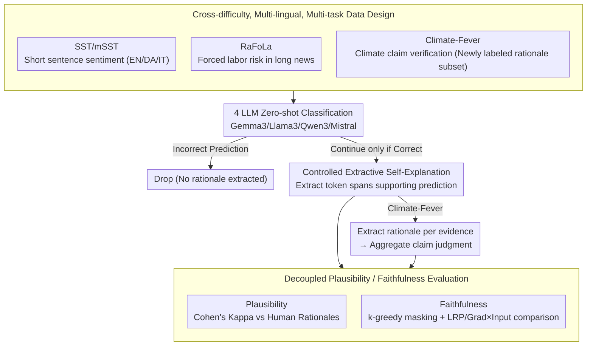

# A Systematic Comparison between Extractive Self-Explanations and Human Rationales in Text Classification

**Conference**: ACL2026  
**arXiv**: [2410.03296](https://arxiv.org/abs/2410.03296)  
**Code**: https://github.com/oeberle/self_explanations_human_rationales  
**Area**: Interpretability  
**Keywords**: LLM self-explanation, input rationale, human annotation, interpretability evaluation, attribution methods  

## TL;DR
This paper systematically compares the differences between extractive self-explanations generated by four open-source instruction-tuned LLMs across three types of text classification tasks and human rationales, as well as post-hoc attribution methods. It finds that the consistency between self-explanations and human annotations is strongly influenced by text length and task complexity, but in perturbation-based faithfulness evaluations, self-explanations often select token subsets that are more critical to the model's predictions.

## Background & Motivation
**Background**: LLMs have been extensively used in classification, summarization, Q&A, and decision-support scenarios. Users are increasingly accustomed to models providing "why" alongside their answers. These explanations are typically natural language descriptions or evidence snippets extracted from the input by the model itself, requiring no additional interpreter training or user understanding of complex gradient attribution or mechanistic interpretability tools.

**Limitations of Prior Work**: The problem is that while a self-explanation looks like an explanation, it is not necessarily a good one. A rationale must withstand at least two types of scrutiny: first, plausibility, i.e., whether it resembles a reason a human would choose; and second, faithfulness, i.e., whether it truly touches upon the information the model relied on to make that prediction. Existing work often only studies short-text sentiment classification or only compares self-explanation with simple saliency methods, lacking a systematic comparison across tasks, languages, and post-hoc attribution methods.

**Key Challenge**: Users want explanations to be both "intuitive to humans" and "faithful to the model's internal decision-making," but these two goals are not always aligned. Human rationales may lean toward narrative and semantic evidence, model self-explanations may favor explicit snippets available for the task, while gradient attribution methods may emphasize system prompts or formatting tokens that are computationally important for the model but unnatural to humans. Treating any single type of explanation as the absolute truth obscures information on the other side.

**Goal**: The authors aim to answer three specific questions: how consistent LLM-generated extractive self-explanations are with human rationales across different text classification tasks; whether these rationales truly change model predictions after masking the input tokens; and what token selection strategies self-explanations and human explanations employ compared to post-hoc attribution methods like LRP and Gradient×Input.

**Key Insight**: The paper chooses extractive explanations instead of free-text explanations. The advantage is that the explanations are strictly anchored in the input text, allowing them to be converted into token-level rationales and directly compared with human token annotations, post-hoc attribution scores, and perturbation-based faithfulness curves.

**Core Idea**: Placing LLM self-explanations, human rationales, and post-hoc attributions into a single token-level evaluation framework to decouple the differences between "looking plausible" and "being effective for the model" through the lenses of plausibility, faithfulness, and linguistic statistics.

## Method
This paper does not propose a new classification model but rather designs a controlled evaluation pipeline. The authors first select text classification data with human rationales and supplement it by labeling a new Climate-Fever rationale subset. Four open-source instruction-tuned LLMs complete the classification in a zero-shot setting, and only when the model predicts correctly is it asked to extract input snippets supporting that prediction. Finally, different explanation sources are systematically compared from the perspectives of plausibility, faithfulness, post-hoc attribution alignment, and token statistics.

### Overall Architecture
The overall pipeline can be divided into five steps.

The first step is preparing tasks and human rationales. The paper covers three tasks: sentiment classification (SST/mSST providing short-text sentiment sentences and multilingual rationales), forced labor risk detection (RaFoLa providing indicator rationales in longer news articles), and climate claim verification (Climate-Fever, where the authors collected a new human rationale subset).

The second step is model classification. The authors utilize Gemma3-12B, Llama3.1-8B, Qwen3-8B, and Mistral-7B-Instruct-v0.3 to perform task classification in a zero-shot setting.

The third step is model rationale extraction. Only when the model classifies correctly do the authors request the model to extract input snippets supporting its judgment. This is crucial: if the model's prediction is incorrect, discussing whether the explanation is faithful to a correct decision would confuse classification errors with explanation errors.

The fourth step is plausibility evaluation. The authors use human rationales as the reference for human-acceptable explanations, measuring the consistency between model rationales and human token annotations using sample-wise Cohen's Kappa. Compared to F1, Kappa corrects for the effects of class imbalance ("selected vs. unselected tokens") and random agreement, making it more robust for rationale agreement.

The fifth step is faithfulness and strategy analysis. The authors use Gradient×Input and LRP to generate post-hoc attributions and measure faithfulness by observing the change in the probability difference between the model's correct answer token and alternative answer tokens after masking important tokens. To enable ranking for binary human/model rationales, the paper adopts $k$-greedy importance ordering: tokens are selected step-by-step to maximize the reduction in the prediction probability difference, with $k=1$ for short-text SST and $k=3$ for longer datasets.

### Key Designs

**1. Cross-difficulty, multi-lingual, multi-task data design: Not limiting conclusions to short-sentence sentiment**

Explanation quality is easily dominated by dataset attributes: in short sentences, a sentiment word can determine a label, making it easy for models and humans to align. However, once moved to long texts where evidence spans multiple sentences or is ambiguous or conflicting, the limitations of self-explanation are exposed. To this end, the authors deliberately create three difficulty levels—SST/mSST for short-sentence sentiment (mSST also covers English, Danish, and Italian), RaFoLa for forced labor risk detection in long news articles (longer text, often implicit evidence), and Climate-Fever for climate claim verification (unstandardized claims, vague semantic relations between evidence and claims).

**2. Controlled extractive self-explanation: Converging "model's ability to provide reasons" into measurable token rationales**

While free-text explanations are closer to real user scenarios, they lack a clean alignment unit for evaluating "human-likeness" or "predictive impact"—explanations might incorporate background knowledge and reasoning chains external to the input. Ours limits explanations to token snippets extracted from the input: the LLM outputs a classification result first, and **only for correctly predicted samples** is it asked to extract the input span supporting that result. This ensures classification errors do not contaminate explanation quality analysis.

**3. Decoupled evaluation of plausibility and faithfulness: Separating "being human-like" from "being effective for the model"**

An explanation might be highly consistent with human annotations but not be the information the model truly relies on; conversely, it might be critical for prediction but include low-level processing cues like formatting characters that are non-intuitive to humans. Conflating these leads to misidentifying "readability" as "faithfulness." Thus, the authors use two independent sets of metrics. For plausibility, sample-wise Cohen's Kappa is used. For faithfulness, token masking is employed to observe whether the probability difference between the correct and alternative answers drops rapidly.

### Loss & Training
This paper does not train a new classification model or propose new optimization losses. The experiments use zero-shot prompting with open-weight instruction-tuned LLMs. Generation settings are based on `transformers`, with a repetition penalty of 1.0. To improve stability, 3 random seeds were used, and average results were reported; for SST/mSST/RaFoLa, standard deviations did not exceed 0.01.

At the evaluation level, the core "training strategy" can be understood as two alignment processes: one for binarizing human and model rationales to calculate Cohen's Kappa, and another for ranking rationale tokens for step-by-step masking to measure faithfulness via probability difference curves.

## Key Experimental Results

### Main Results
The paper first reports the classification performance of each model. Generally, short-text sentiment classification is very easy, with macro-F1 for SST/mSST largely between 0.84 and 1.00. The long-news task RaFoLa is significantly harder, with macro-F1 ranging from 0.25 to 0.79. Climate-Fever is the most difficult, with the best claim-level macro-F1 reaching only 0.45.

| Task / Dataset | Gemma3 | Llama3 | Qwen3 | Mistral | Main Observations |
|---|---:|---:|---:|---:|---|
| SST | 0.98 | 0.98 | 0.98 | 0.99 | Almost all models solve short-sentence sentiment |
| mSST-EN | 1.00 | 0.98 | 0.99 | 0.98 | English multi-annotator subset is also near saturation |
| mSST-DA | 0.94 | 0.84 | 0.96 | 0.96 | High in Danish, but Llama3 is notably lower |
| mSST-IT | 1.00 | 0.95 | 1.00 | 0.97 | Italian performance is close to English |
| RaFoLa #1 | 0.25 | 0.47 | 0.38 | 0.57 | "Abuse of vulnerability" is hard, max 0.57 |
| RaFoLa #5 | 0.79 | 0.73 | 0.74 | 0.60 | "Excessive overtime" has explicit keywords, higher performance |
| Climate-Fever Claim | 0.45±0.04 | 0.33±0.04 | 0.38±0.02 | 0.24±0.01 | Gemma3 is best; 4-class verification is overall difficult |

### Ablation Study
Rather than traditional module ablation, this study compares explanation sources: human rationale, model self-explanation, LRP, Gradient×Input, and random baselines across agreement, faithfulness, and token statistics.

| Comparison Dimension | Key Metrics / Results | Description |
|---|---|---|
| Human-Model Plausibility: SST/mSST | Cohen's Kappa 0.4-0.6 for EN | Models and humans show moderate agreement in short sentiment tasks |
| Human-Model Plausibility: RaFoLa | 0.12-0.48 across indicators | Agreement strongly depends on the specific risk indicator and keyword clarity |
| Human-Model Plausibility: Climate-Fever | Gemma3 0.24, others 0.12-0.18 | Lowest consistency due to 3-class rationales and vague claim-evidence relations |
| Faithfulness: Self-explanation | Most steep probability drop in top 5-10% tokens | Self-explanations find token subsets highly sensitive to model predictions |
| Faithfulness: Post-hoc attribution | LRP > Gradient×Input | Post-hoc methods are more likely to capture structural and formatting tokens |
| Rationale Strategy: RaFoLa top 5% | Model Stopwords 35-38%; Post-hoc Stopwords 12-25% | Human/Model prefer natural language evidence; post-hoc prefers isolated tokens/structural cues |

### Key Findings
- Text length and task complexity are key variables for explanation consistency. Human-model agreement in short-text sentiment is significantly higher than in long news and claim verification.
- Self-explanation plausibility is unstable, but faithfulness is not weak. Especially when masking the top 5-10% of tokens, $k$-greedy ranked model rationales often weaken correct prediction probabilities faster than human rationales or post-hoc attributions.
- Indicators in RaFoLa vary significantly. Indicators with explicit keywords (e.g., #5 "Excessive overtime") show higher classification performance and rationale agreement.
- Low agreement in Climate-Fever cannot be attributed solely to surface text complexity; claim ambiguity and semantic relationship vagueness hinder rationale alignment.
- Post-hoc attribution strategies differ from natural language explanations. LRP/Gradient×Input emphasize structural or formatting tokens (e.g., `<bos>`, URLs), which may be important for model processing but are not accepted as semantic evidence by humans.

## Highlights & Insights
- The biggest highlight is pulling self-explanation back into a measurable token-level problem. Instead of subjective evaluation, the paper places multiple sources into a single plausibility/faithfulness framework.
- The data selection is valuable. The spectrum from explicit short-text evidence to implicit long-text evidence and vague claim-evidence reasoning proves that explanation quality is a collective property of the model, task, and text structure.
- Ours clearly demonstrates that "human-like" and "faithful to the model" are not synonyms. Post-hoc attributions might look unnatural but reflect low-level processing, whereas self-explanations look natural but may involve post-hoc rationalization.
- For interpretability tool design, future systems should likely translate attribution/activation patterns into natural language while preserving underlying evidence chains rather than choosing one over the other.

## Limitations & Future Work
- The authors acknowledge that human rationales themselves are not unbiased ground truth, as they are affected by annotator numbers, instructions, and expertise.
- The study only evaluates extractive rationales. Real users see natural language explanations, which might include reasoning chains and concepts not present in the input.
- High zero-shot performance on SST might be influenced by data contamination; its results should not be over-extrapolated.
- Faithfulness evaluation via masking is a proxy; masking may shift the input distribution or break semantic coherence.
- Future work could extend to free-text explanations and study how to generate explanations that combine activation/attribution patterns with natural language.

## Related Work & Insights
- **vs Huang et al. (2023)**: While Huang et al. studied ChatGPT on SST, this paper extends to three task types, three languages, and four open-source LLMs, revealing the impact of task complexity on explanation quality.
- **vs Randl et al. (2025)**: Randl et al. compared extractive self-explanations and saliency but lacked complex gradient methods. This paper uses Transformer-specific LRP and Gradient×Input to show why post-hoc rationales favor structural tokens.
- **vs ERASER traditional rationale benchmarks**: Ours inherits the token-level evaluation logic but uniquely points out that human consistency alone is insufficient—one must also verify if the rationale impacts model predictions when masked.

## Rating
- Novelty: ⭐⭐⭐⭐☆
- Experimental Thoroughness: ⭐⭐⭐⭐☆
- Writing Quality: ⭐⭐⭐⭐☆
- Value: ⭐⭐⭐⭐⭐

<!-- RELATED:START -->

## Related Papers

- [\[ACL 2026\] Dual Alignment Between Language Model Layers and Human Sentence Processing](dual_alignment_between_language_model_layers_and_human_sentence_processing.md)
- [\[ACL 2026\] Aligning What LLMs Do and Say: Towards Self-Consistent Explanations](aligning_what_llms_do_and_say_towards_self-consistent_explanations.md)
- [\[CVPR 2025\] Why Does It Look There? Structured Explanations for Image Classification](../../CVPR2025/interpretability/why_does_it_look_there_structured_explanations_for_image_classification.md)
- [\[ICML 2026\] Learn from A Rationalist: Distilling Intermediate Interpretable Rationales](../../ICML2026/interpretability/learn_from_a_rationalist_distilling_intermediate_interpretable_rationales.md)
- [\[ACL 2026\] Diffusion-CAM: Faithful Visual Explanations for dMLLMs](diffusion-cam_faithful_visual_explanations_for_dmllms.md)

<!-- RELATED:END -->
