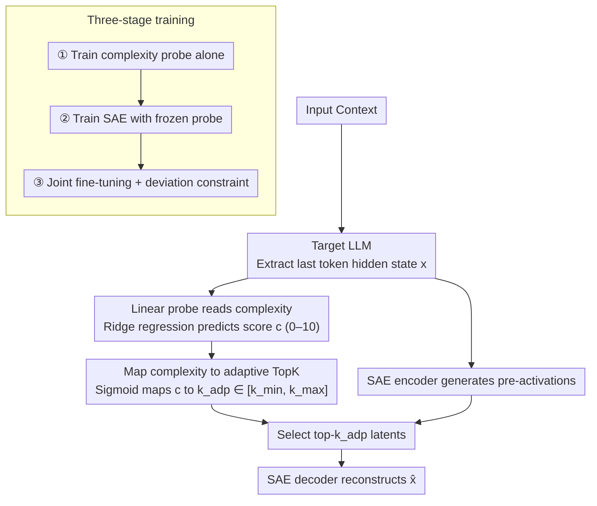

# AdaptiveK: Complexity-Driven Sparse Autoencoders for Interpretable Language Model Representations

**Conference**: ACL 2026  
**arXiv**: [2508.17320](https://arxiv.org/abs/2508.17320)  
**Code**: https://github.com/hiyukie/adaptiveK  
**Area**: Model Interpretability / Sparse Autoencoder  
**Keywords**: Sparse Autoencoder, Mechanistic Interpretability, Linear Probe, Adaptive Sparsity, Representation Complexity  

## TL;DR
AdaptiveK proposes a Sparse Autoencoder driven by input semantic complexity, allowing simple text to activate fewer features and complex text to activate more. Across experiments on eight autoregressive LLMs and additional architectures, it improves reconstruction quality, conceptual decoupling, and training efficiency while reducing the need for repetitive hyperparameter tuning common in fixed TopK approaches.

## Background & Motivation
**Background**: Sparse Autoencoders (SAEs) have become essential tools for interpreting the internal representations of LLMs. They decompose model activations into a higher-dimensional but sparse latent dictionary, aiming for each latent to correspond to a monosemantic, interpretable concept, thereby mitigating challenges posed by polysemanticity and superposition. Recent methods like TopK SAE, BatchTopK, Gated SAE, JumpReLU, P-anneal, and Matryoshka SAE focus on improving the balance between reconstruction fidelity and sparsity.

**Limitations of Prior Work**: Most SAEs impose uniform sparsity constraints across all inputs. For instance, TopK fixes the number of active features per sample, while $L_1$, Gated, and P-anneal methods exert similar sparsity pressure regardless of the input. However, textual complexity varies significantly: a simple short concept might require only a few features to explain, whereas specialized long contexts with multiple entities and complex logic require more representational capacity. Uniform constraints cause simple samples to waste features and complex samples to be under-represented.

**Key Challenge**: SAE training typically treats sparsity as a global hyperparameter, but the actual demand for representational capacity is locally varying. A fixed $k$ suitable for complex samples sacrifices the sparsity of simple ones; maintaining overall sparsity leads to insufficient reconstruction of complex samples. Furthermore, researchers often must train multiple models with different $k$ or sparsity penalty settings to find an appropriate Pareto trade-off.

**Goal**: This work aims to address three specific questions: First, whether "contextual complexity" is linearly encoded within LLM activations; second, whether this complexity signal can dynamically determine the number of active SAE features; and third, whether such adaptive sparsity outperforms fixed sparsity baselines in terms of reconstruction, interpretability, and training efficiency.

**Key Insight**: The paper draws from observations in linear probing research: many high-level attributes (e.g., sentiment, political stance, spatiotemporal information, truthfulness) can be extracted via linear directions in the LLM activation space. The authors hypothesize that while text complexity is multidimensional, it is also linearly encoded. If a low-cost probe can extract this complexity, it can be mapped to a dynamic $k$ for the SAE.

**Core Idea**: Use a linear probe to predict input complexity and map it to a sample-specific TopK value. This replaces "one-size-fits-all" fixed sparsity with a mechanism where "complex inputs receive more features and simple inputs receive fewer."

## Method
AdaptiveK can be viewed as a standard TopK SAE augmented with a "complexity controller." This controller does not read the raw text but rather the LLM's hidden activations. It outputs a continuous complexity score, which is mapped via a sigmoid function to the number of latents the sample should retain. The SAE dictionary, encoder, and decoder remain standard, but the activation function shifts from fixed TopK to sample-adaptive TopK.

### Overall Architecture
The pipeline consists of four steps. First, the input context is fed into the target LLM to extract the hidden state $x$ of the last token at a selected layer. Second, a pre-trained linear probe predicts the complexity $c$. Third, $c$ is mapped to an adaptive sparsity $k_{adp}$ within the range $[k_{min}, k_{max}]$. Fourth, after the SAE encoder generates latent pre-activations, only the top-$k_{adp}$ activations are kept for reconstruction by the decoder.

The core intuition is that the last token representation aggregates preceding contextual information and serves as a readout point for "contextual complexity." Main experiments use the pile-uncopyrighted dataset to construct 250,000 training and 10,000 testing contexts, with GPT-4.1-mini providing multi-dimensional complexity ratings.

### Key Designs

**1. Reading Contextual Complexity via Linear Probe: The AdaptiveK Control Signal**

If complexity prediction required a complex non-linear model, AdaptiveK would simply use one black box to control another. A linear probe is naturally compatible with the "linear representation" hypothesis in mechanistic interpretability and ensures the complexity signal itself is interpretable. The authors use GPT-4.1-mini to score text (0–10) across dimensions like lexical complexity, syntactic complexity, and logic. A ridge regression model then predicts this score from hidden states, minimizing $L(w,b)=\frac{1}{n}\sum_i(y_i-(w^Tx_i+b))^2+\frac{\lambda}{2}\|w\|_2^2$.

**2. Mapping Complexity to Adaptive TopK: Per-Input Feature Budgets**

To avoid excessive sensitivity to extreme complexity values while ignoring fixed constraints, a sigmoid function maps complexity $c$ to $[k_{min}, k_{max}]$: $k_{adp}=k_{min}+\sigma(s((c-c_{min})/(c_{max}-c_{min})-0.5))(k_{max}-k_{min})$, where $s$ controls curvature. The default configuration uses $k_{min}=20$, base $k=80$, and $k_{max}=320$.

**3. Three-Stage Training for Stable Coupling: Preventing Semantic Drift**

To prevent the probe from deviating from its complexity semantics solely to minimize SAE reconstruction error, a three-stage process is used: (1) Train the complexity probe individually; (2) Freeze the probe and train the SAE with $L_{SAE}=L_{recon}+\alpha L_{sparsity}+\beta L_{aux}$; (3) Jointly fine-tune both using a deviation penalty to keep the probe near its pre-trained parameters, balancing semantic stability with task adaptation.

### Loss & Training
The joint fine-tuning objective is $L_{joint}=L_{SAE}+\gamma(L_{probe}+\delta L_{deviation})$, with $\gamma=0.9$ and $\delta$ dynamically adjusted between 0.01 and 0.5. Optimization uses Adam with a $1e^{-3}$ learning rate and linear decay after 70% of training.

## Key Experimental Results

### Main Results
Experiments cover 8 LLMs (e.g., Pythia, Gemma-2, Llama-3.1, Qwen-3, Phi-4). Using a dictionary size of 16,384, AdaptiveK is compared against 7 baselines (ReLU, TopK, Gated, etc.). Pareto curves indicate that AdaptiveK achieves lower L2 loss, lower unexplained variance, and lower $1-\cos$ at equivalent sparsity levels.

| Complexity Predictor | RMSE ↓ | Pearson ↑ | Spearman ↑ | Conclusion |
|--------------|--------|-----------|------------|------|
| Linear probe | 1.41 | 0.72 | 0.76 | Close to non-linear models; better interpretability |
| MLP | 1.37 | 0.74 | 0.77 | Slightly better metrics but less transparent |
| XGBoost | 1.42 | 0.71 | 0.74 | Did not outperform linear probe |

### Ablation Study
Ablations on the $k$ mapping range show that increasing $k_{max}$ consistently improves reconstruction while increasing the average number of active features, following the standard capacity-sparsity trade-off.

| $k$ Range Setting | Test min $k$ | Test max $k$ | Avg $k$ | Explained Var ↑ | Cosine Sim ↑ | L2 Ratio |
|--------------|----------------|----------------|----------|-----------------|--------------|----------|
| $k_{min}=20,k_{max}=320$ | 96 | 291 | 214 | 0.743 | 0.909 | 0.921 |
| $k_{min}=20,k_{max}=480$ | 132 | 435 | 313 | 0.768 | 0.919 | 0.926 |
| $k_{min}=20,k_{max}=640$ | 170 | 579 | 415 | 0.789 | 0.926 | 0.935 |

### Key Findings
- **Complexity is Linearly Decodable**: Linear probes achieved Pearson correlations up to 0.814 (e.g., layer 22 of Gemma-2-2B), comparable to non-linear alternatives.
- **Superior Pareto Performance**: AdaptiveK consistently outperforms fixed sparsity baselines across L2 loss and cosine similarity; some baselines require $10\times$ higher sparsity to match its reconstruction quality.
- **Improved Efficiency**: On Gemma-2-2B, AdaptiveK requires fewer total training minutes than a single fixed TopK run due to faster convergence, and significantly avoids the $6\times$ overhead of training multiple sparsity levels for tuning.
- **Enhanced Interpretability**: RAVEL scores for disentanglement and cause/isolation are strong (~0.60-0.65). Top-1 latents capture approximately 82% of the full SAE representation information.

## Highlights & Insights
- **Operationalizing Intuition**: The work transforms the intuitive idea that "different samples need different capacity" into a measurable, trainable signal via linear probes.
- **Elegant Capacity Allocation**: Rather than merely increasing dictionary size or global $k$ (which adds noise to simple samples), AdaptiveK moves capacity where it is needed.
- **Restrained Controller Design**: Using ridge regression instead of a black-box MLP keeps the mechanism aligned with the linear assumptions of mechanistic interpretability.
- **Holistic Evaluation**: By using MaxAct and VocabProj, the authors demonstrate that AdaptiveK latents are more semantically focused (e.g., focusing on technical terms rather than functional words in specialized contexts).

## Limitations & Future Work
- **Reliance on LLM Labeling**: Complexity scores depend on GPT-4.1-mini, which may introduce biases or costs that limit scaling.
- **Context Length Consistency**: Discrepancies in the reported context lengths (1024 vs 2048 tokens) between sections suggest a need for clarification to aid replication.
- **Scope of Complexity**: While semantic complexity is a strong signal, other "explanation-difficult" factors (e.g., safety guardrails, specific factual edits) may require additional capacity signals beyond simple complexity scores.

## Related Work & Insights
- **vs. TopK / BatchTopK SAE**: AdaptiveK maintains the clear selection mechanism of TopK but evolves $k$ from a global hyperparameter to a sample-specific variable.
- **vs. Matryoshka SAE**: While Matryoshka focuses on feature hierarchies, AdaptiveK focuses on sample-level activation budgets; the two could potentially be combined.
- **Future Directions**: This approach suggests that SAE hyperparameters can be dynamically controlled by linear properties inherent in model activations, which could be extended to multimodal or code-specific models.

## Rating
- Novelty: ⭐⭐⭐⭐☆
- Experimental Thoroughness: ⭐⭐⭐⭐☆
- Writing Quality: ⭐⭐⭐⭐☆
- Value: ⭐⭐⭐⭐⭐

<!-- RELATED:START -->

## Related Papers

- [\[ICLR 2026\] Temporal Sparse Autoencoders: Leveraging the Sequential Nature of Language for Interpretability](../../ICLR2026/interpretability/temporal_sparse_autoencoders_leveraging_the_sequential_nature_of_language_for_in.md)
- [\[ICML 2026\] Sparse Autoencoders are Topic Models](../../ICML2026/interpretability/sparse_autoencoders_are_topic_models.md)
- [\[NeurIPS 2025\] Transformer Key-Value Memories Are Nearly as Interpretable as Sparse Autoencoders](../../NeurIPS2025/interpretability/transformer_key-value_memories_are_nearly_as_interpretable_as_sparse_autoencoder.md)
- [\[ICLR 2026\] Toward Faithful Retrieval-Augmented Generation with Sparse Autoencoders](../../ICLR2026/interpretability/toward_faithful_retrieval-augmented_generation_with_sparse_autoencoders.md)
- [\[ICML 2026\] Ensembling Sparse Autoencoders](../../ICML2026/interpretability/ensembling_sparse_autoencoders.md)

<!-- RELATED:END -->
