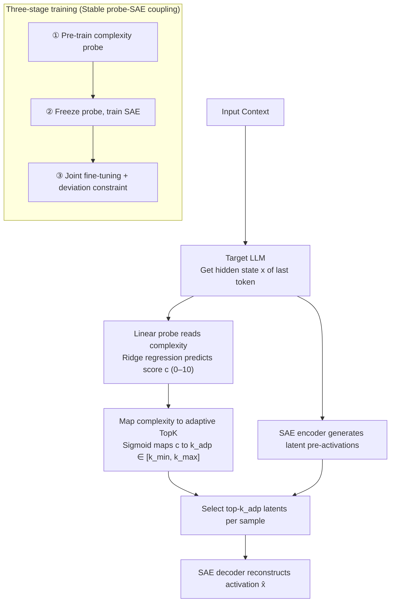

# AdaptiveK: Complexity-Driven Sparse Autoencoders for Interpretable Language Model Representations

**Conference**: ACL 2026  
**arXiv**: [2508.17320](https://arxiv.org/abs/2508.17320)  
**Code**: https://github.com/hiyukie/adaptiveK  
**Area**: Model Interpretability / Sparse Autoencoder  
**Keywords**: Sparse Autoencoders, Mechanistic Interpretability, Linear Probes, Adaptive Sparsity, Representational Complexity  

## TL;DR
AdaptiveK proposes a Sparse Autoencoder driven by input semantic complexity, allowing simple texts to activate fewer features and complex texts to activate more. Across 8 autoregressive LLMs and additional architectural experiments, it improves reconstruction quality, conceptual disentanglement, and training efficiency while reducing the need for repeated hyperparameter tuning of fixed TopK values.

## Background & Motivation
**Background**: Sparse Autoencoders (SAEs) have become essential tools for interpreting internal LLM representations. They decompose model activations into a higher-dimensional but sparse latent dictionary, aiming for each latent to correspond to a monosemantic and understandable concept, thereby mitigating challenges posed by polysemanticity and superposition. Recent methods like TopK SAE, BatchTopK, Gated SAE, JumpReLU, P-anneal, and Matryoshka SAE primarily focus on improving the Pareto trade-off between reconstruction fidelity and sparsity.

**Limitations of Prior Work**: Most existing SAEs impose a uniform sparsity constraint on all inputs. For instance, TopK fixes the number of active features per sample, while $L_1$ / Gated / P-anneal methods apply similar sparsity pressure across diverse inputs. However, text complexity varies: simple concepts might require only a few features, whereas specialized, long contexts with multiple entities and complex logic demand more representational capacity. Uniform constraints waste features on simple samples and under-represent complex ones.

**Key Challenge**: SAE training usually treats sparsity as a global hyperparameter, but the demand for representational capacity is locally variant. A fixed $k$ suitable for complex samples sacrifices the sparsity of simple ones, while maintaining overall sparsity leads to insufficient reconstruction for complex inputs. Furthermore, researchers often must train multiple SAEs with different $k$ or sparsity penalties to find the optimal trade-off.

**Goal**: The authors aim to address three questions: first, whether "contextual complexity" is linearly encoded in LLM activations; second, whether this complexity signal can dynamically determine the number of active features in an SAE; and third, whether such adaptive sparsity outperforms fixed sparsity baselines in reconstruction, interpretability, and efficiency.

**Key Insight**: Drawing from linear probe research, many high-level attributes (sentiment, politics, truthfulness) can be read from LLM activation spaces via linear directions. The authors hypothesize that although complexity is multidimensional, it is also linearly encoded. By reading complexity with a low-cost probe, it can be transformed into a dynamic $k$ for the SAE.

**Core Idea**: Use a linear probe to predict input complexity and map it to a sample-specific TopK value. This replaces a "one-size-fits-all" fixed sparsity with a mechanism where "complex inputs receive more features, and simple inputs receive fewer."

## Method
AdaptiveK can be viewed as a standard TopK SAE supplemented with a "complexity controller." This controller reads the LLM's hidden activations rather than the raw text, outputting a continuous complexity score mapped via a sigmoid function to determine the number of active latents. The dictionary, encoder, and decoder remain standard, but the activation function transitions from a fixed TopK to a sample-adaptive TopK.

### Overall Architecture
The pipeline consists of four steps. First, the input context is fed into the target LLM to extract the last-token hidden state $x$ of a selected layer. Second, a pre-trained linear probe predicts a complexity score $c$. Third, $c$ is mapped to an adaptive sparsity value $k_{adp}$ within the range $[k_{min}, k_{max}]$. Fourth, the SAE encoder produces latent pre-activations, retains only the top-$k_{adp}$ activations, and the decoder reconstructs the original activation.

The key intuition is that the last-token representation aggregates preceding contextual information, serving as a readout point for complexity. Main experiments use 250,000 training and 10,000 test contexts from *pile-uncopyrighted*, labeled with multidimensional complexity scores via GPT-4.1-mini.

### Key Designs

**1. Reading Contextual Complexity with a Linear Probe**

Using a linear probe ensures the control signal is compatible with the "linear representation" hypothesis in mechanistic interpretability. Texts are scored (0–10) by GPT-4.1-mini across dimensions like vocabulary, syntax, and logic. A ridge regression model targets these scores: 
$$L(w,b)=\frac{1}{n}\sum_i(y_i-(w^Tx_i+b))^2+\frac{\lambda}{2}\|w\|_2^2$$
The resulting continuous score $c$ serves as the sole control variable for latent activation.

**2. Mapping Complexity to Adaptive TopK**

To map complexity $c$ to a bounded interval $[k_{min}, k_{max}]$, the authors use a sigmoid function: 
$$k_{adp}=k_{min}+\sigma(s((c-c_{min})/(c_{max}-c_{min})-0.5))(k_{max}-k_{min})$$
where $s$ controls the curve steepness (default $k_{min}=20$, base $k=80$, $k_{max}=320$). This avoids over-activating for simple samples and under-representing complex ones.

**3. Three-Stage Training for Stable Coupling**

Direct joint training might cause the probe to deviate from complexity semantics to minimize SAE reconstruction error. The three-stage process includes: (1) Pre-training the probe; (2) Freezing the probe to train the SAE with $L_{SAE}=L_{recon}+\alpha L_{sparsity}+\beta L_{aux}$; (3) Jointly fine-tuning the probe and SAE with a deviation penalty $L_{deviation}$ to ensure the probe remains anchored to its pre-trained semantic meaning.

### Loss & Training
The probe uses ridge regression with 5-fold cross-validation to select $\lambda=100.0$. During the SAE stage, reconstruction loss targets $\hat{x} \approx x$, with normalized $L_1$ sparsity $\|z\|_1/\|x\|_2$ and an auxiliary loss for dead features. The joint loss is:
$$L_{joint}=L_{SAE}+\gamma(L_{probe}+\delta L_{deviation})$$
with $\gamma=0.9$ and $\delta$ dynamically adjusted (0.01 to 0.5). Adam optimizer is used with a $1e^{-3}$ learning rate and linear decay.

## Key Experimental Results

### Main Results
Experiments cover 8 LLMs (Pythia, Gemma-2, Llama-3.1, Qwen-3, Phi-4). With a dictionary size of 16,384, AdaptiveK is compared against 7 baselines (ReLU, TopK, Gated, etc.). Pareto curves show AdaptiveK achieves lower L2 loss and unexplained variance at equivalent sparsity levels.

The linear complexity probe performance on Pythia-70M confirms complexity can be read linearly:

| Complexity Predictor | RMSE ↓ | Pearson ↑ | Spearman ↑ | Conclusion |
|----------------------|--------|-----------|------------|------------|
| Linear probe         | 1.41   | 0.72      | 0.76       | Close to non-linear models; better interpretability |
| MLP                  | 1.37   | 0.74      | 0.77       | Slightly better but introduces a black box |
| XGBoost              | 1.42   | 0.71      | 0.74       | Does not outperform the linear probe |

### Ablation Study
Ablations focus on the mapping range and steepness ($s$). Expanding $k_{max}$ consistently improves reconstruction at the cost of higher average activation counts.

| $k$ Range Setting            | Test min $k$ | Test max $k$ | Avg $k$ | Explained Var ↑ | Cosine Sim ↑ | L2 Ratio |
|------------------------------|--------------|--------------|---------|-----------------|--------------|----------|
| $k_{min}=20, k_{max}=320$    | 96           | 291          | 214     | 0.743           | 0.909        | 0.921    |
| $k_{min}=20, k_{max}=480$    | 132          | 435          | 313     | 0.768           | 0.919        | 0.926    |
| $k_{min}=20, k_{max}=640$    | 170          | 579          | 415     | 0.789           | 0.926        | 0.935    |

### Key Findings
- **Complexity is Linearly Readable**: On Gemma-2-2B (layer 22), the probe achieves a Pearson correlation of 0.814 and RMSE of 1.18.
- **Superior Pareto Frontier**: AdaptiveK consistently outperforms fixed sparsity baselines across L2 loss and cosine similarity; some baselines require $10\times$ more sparsity to match AdaptiveK's reconstruction.
- **Cross-Architecture Scalability**: Validated on BERT-340M and T5 (both encoder and decoder).
- **Training Efficiency**: Training a single AdaptiveK model is faster than training a single TopK baseline (due to faster convergence), and significantly more efficient than training multiple TopK models for hyperparameter sweeps.
- **Interpretability Gains**: RAVEL scores for disentanglement and cause-isolation are high (~0.62–0.65). Top-1 latents capture ~82% of the full representation information.

## Highlights & Insights
- **Turning Intuition into a Training Signal**: While it's intuitive that sample difficulty varies, AdaptiveK is the first to operationalize this via a measurable linear probe.
- **Elegance over Brute Force**: Instead of simply increasing dictionary size, AdaptiveK shifts capacity to where it is needed, adhering to the "minimal necessary concepts" principle of interpretability.
- **Restrained Controller Design**: Using ridge regression rather than a complex non-linear controller maintains the narrative of linear features in mechanistic interpretability.
- **Semantic Focus**: MaxAct analysis reveals that AdaptiveK focuses on professional terminology in specialized contexts (e.g., biomedical), whereas TopK often mixes in semantically weak functional words to fill its fixed budget.

## Limitations & Future Work
- **GPT-4.1-mini Dependency**: Complexity labels carry the potential bias of the annotator model and may be inconsistent for non-English or code-heavy text.
- **Context Length Consistency**: There is a minor discrepancy in the reported context lengths (1024 vs 2048) in the paper text.
- **Curve-Heavy Results**: The paper relies extensively on Pareto curves; more detailed numerical tables for per-model comparisons would be beneficial.
- **Complexity $\neq$ All Interpretability Difficulty**: Complexity governs "how many" features are needed, but doesn't necessarily explain the mechanical complexity of specific tokens (e.g., safety refusals).

## Related Work & Insights
- **vs. TopK / BatchTopK**: AdaptiveK retains the clarity of TopK but upgrades $k$ from a global hyperparameter to a sample-specific variable.
- **vs. Gated / P-anneal**: While these mitigate $L_1$ shrinkage, they still apply uniform sparsity pressure. AdaptiveK adapts pressure to content.
- **vs. Matryoshka SAE**: Matryoshka handles feature hierarchies; AdaptiveK handles capacity allocation. These approaches are potentially complementary.

## Rating
- **Novelty**: ⭐⭐⭐⭐☆ Solid innovation in determining sparsity through input complexity.
- **Experimental Thoroughness**: ⭐⭐⭐⭐☆ Broad coverage across LLMs and baselines, though numerical tables are sparse.
- **Writing Quality**: ⭐⭐⭐⭐☆ Clear motivation and logic, despite minor inconsistencies in setup descriptions.
- **Value**: ⭐⭐⭐⭐⭐ Highly practical for reducing tuning costs while maintaining high semantic concentration.

<!-- RELATED:START -->

## Related Papers

- [\[ICLR 2026\] Temporal Sparse Autoencoders: Leveraging the Sequential Nature of Language for Interpretability](../../ICLR2026/interpretability/temporal_sparse_autoencoders_leveraging_the_sequential_nature_of_language_for_in.md)
- [\[ICML 2026\] Sparse Autoencoders are Topic Models](../../ICML2026/interpretability/sparse_autoencoders_are_topic_models.md)
- [\[NeurIPS 2025\] Transformer Key-Value Memories Are Nearly as Interpretable as Sparse Autoencoders](../../NeurIPS2025/interpretability/transformer_key-value_memories_are_nearly_as_interpretable_as_sparse_autoencoder.md)
- [\[ICLR 2026\] Toward Faithful Retrieval-Augmented Generation with Sparse Autoencoders](../../ICLR2026/interpretability/toward_faithful_retrieval-augmented_generation_with_sparse_autoencoders.md)
- [\[ICML 2026\] On the Relationship Between Activation Outliers and Feature Death in Sparse Autoencoders](../../ICML2026/interpretability/on_the_relationship_between_activation_outliers_and_feature_death_in_sparse_auto.md)

<!-- RELATED:END -->
