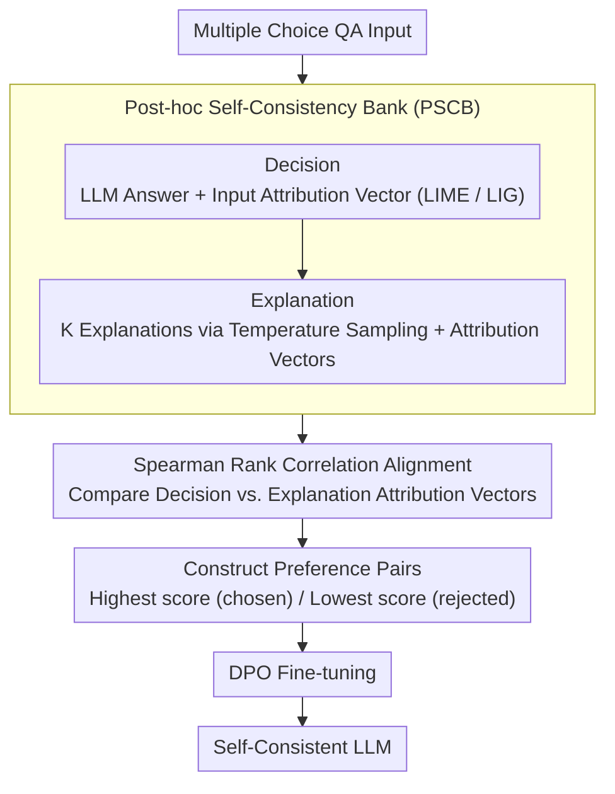

# Aligning What LLMs Do and Say: Towards Self-Consistent Explanations

**Conference**: ACL 2026 Findings  
**arXiv**: [2506.07523](https://arxiv.org/abs/2506.07523)  
**Code**: [GitHub](https://github.com/saharad1/ConstLLM)  
**Area**: Interpretability  
**Keywords**: Self-consistency, Feature attribution, Explanation faithfulness, DPO optimization, Attribution alignment

## TL;DR

Constructed the Post-hoc Self-Consistency Bank (PSCB, 85K decisions × 428K explanations) to quantify the feature attribution gap between LLM answers and their natural language explanations. Improved attribution consistency through DPO optimization without compromising model accuracy.

## Background & Motivation

**Background**: LLMs are often required to generate natural language explanations to justify their answers. However, these post-hoc explanations are frequently inconsistent with the input features that actually drive the answer—there is a discrepancy between what the model says and what it does.

**Limitations of Prior Work**: (1) Existing faithfulness measurement methods (such as counterfactual interventions) are computationally expensive and difficult to apply at scale; (2) Methods like CC-SHAP have only been evaluated on approximately 100 samples, limiting the reliability of their conclusions; (3) There has been no prior demonstration of how to mitigate this attribution inconsistency.

**Key Challenge**: LLM explanations may be fluent and plausible but fail to describe the actual reasoning process (rationalization). The disconnect between the input features prioritized in the explanation versus the decision poses a fundamental threat to Trustworthy AI.

**Goal**: (1) Quantify the attribution consistency between answers and explanations at scale; (2) Propose methods to improve this alignment.

**Key Insight**: Feature attribution vectors are calculated separately for each QA decision and its corresponding multiple explanations. The alignment between them is then measured. DPO is utilized on attribution-based preference data to improve consistency.

**Core Idea**: Spearman rank correlation is more effective than cosine similarity in distinguishing between high- and low-quality explanations. DPO optimization based on attribution preferences successfully enhances self-consistency and generalizes across domains.

## Method

### Overall Architecture

PSCB Construction Pipeline: (1) Calculate feature attribution vectors for QA decisions; (2) Generate $K$ diverse explanations for each decision and calculate their respective attribution vectors; (3) Use an alignment function to measure the attribution consistency between the decision and the explanations; (4) Select the best and worst explanations to construct preference pairs for DPO optimization. The first two steps populate the PSCB benchmark, while the latter two steps perform alignment measurement and preference optimization based on the library.

### Key Designs

**1. Post-hoc Self-Consistency Bank (PSCB): Scaling Evaluation from Hundreds to Hundreds of Thousands**

Previous works like CC-SHAP could only evaluate attribution consistency on roughly 100 samples, which restricted the reliability of conclusions and hindered systematic research. PSCB expands the scale to 85K decisions × 5 explanations each = 428K explanation-attribution pairs. It utilizes two attribution methods, LIME and Layer Integrated Gradients (LIG), covering 4 QA datasets and 2 LLMs, providing an attribution-augmented benchmark for large-scale quantification and DPO optimization.

**2. Spearman Rank Correlation as an Alignment Metric: Better Discriminative Power than Cosine Similarity**

Cosine similarity exhibits highly overlapping distributions and weak discriminative power when distinguishing between good and bad explanations because it is sensitive to attribution magnitudes. This paper adopts Spearman rank correlation $CC_{sp} = 1 - \frac{6\sum(r(\phi_i^{dec}) - r(\phi_i^{exp}))^2}{m(m^2-1)}$, which focuses on the consistency of feature priority rankings between the decision and explanation vectors. This avoids magnitude interference and clearly separates explanations of varying quality.

**3. Attribution-based DPO Optimization: Improving Self-Consistency Without Damaging Accuracy**

SFT struggles to learn the subtle differences in attribution preferences on the same data. This paper adopts preference learning: constructing pairs by selecting the explanation with the highest self-consistency as "chosen" and the lowest as "rejected" from PSCB. DPO fine-tuning then guides the LLM to favor producing explanations more consistent with the decision attribution while maintaining task accuracy.

### Loss & Training

A standard DPO objective function is used for training on PSCB preference pairs. Explanations are generated via temperature sampling ($p=0.9, T=0.7$), with 5 explanations per decision. The best and worst are selected to build the preference pairs.

## Key Experimental Results

### Main Results

| Model | Dataset | CC-Sp (Pre-optimization) | CC-Sp (Post-DPO) | Accuracy Change |
|------|--------|-------------|-------------|----------|
| LLaMA3.1-8B | ECQA | 18.47 (mean) | Significant Improvement | No Decrease |
| LLaMA3.2-3B | ECQA | 9.75 (mean) | Significant Improvement | No Decrease |

### Ablation Study

| Configuration | Key Metric | Description |
|------|---------|------|
| DPO vs SFT | DPO significantly outperforms SFT | SFT fails to learn attribution preferences |
| LIME vs LIG | Improvements do not generalize across methods | Different attribution methods capture different dimensions |
| Cross-domain Generalization | Effective | Improvements from ECQA training generalize to ARC, etc. |
| Correct vs Incorrect Answers | Orthogonal | Self-consistency is largely independent of accuracy |

### Key Findings
- Self-consistency and accuracy are largely orthogonal—inconsistent explanations can accompany correct answers, and consistent explanations can accompany incorrect ones.
- Spearman rank correlation provides significantly better discriminative power than cosine similarity.
- Improvements in self-consistency via DPO optimization generalize across domains but do not transfer across different attribution methods.
- Different attribution methods (LIME vs. LIG) capture fundamentally different concepts of input relevance.

## Highlights & Insights
- The finding that "self-consistency and accuracy are orthogonal" is crucial—accurate models do not necessarily provide faithful explanations.
- Reveals a practical contradiction: DPO can improve LIME-based consistency but not LIG-based, indicating that "faithful explanation" is a multi-dimensional concept.
- PSCB serves as a large-scale resource with long-term value for the interpretability community.

## Limitations & Future Work
- Validated only on multiple-choice QA; applicability to open-ended generation tasks remains unknown.
- LIME and LIG have their own limitations; more advanced attribution methods might yield different conclusions.
- Self-consistency remains a proxy for faithfulness and is not identical to the actual interpretability of the decision process.
- Future work could extend to larger models and more diverse task types.

## Related Work & Insights
- **vs. CC-SHAP**: Expanded the evaluation scale from 100 samples to 85K and demonstrated the first improvement method.
- **vs. Counterfactual Intervention Methods**: Replaced expensive counterfactual testing with attribution vector comparison, significantly reducing costs.
- **vs. RLHF**: Extended preference learning from "human preference" to "attribution consistency preference," representing a new dimension of alignment.

## Rating
- Novelty: ⭐⭐⭐⭐⭐ Attribution-based DPO optimization is a brand-new direction.
- Experimental Thoroughness: ⭐⭐⭐⭐ Large-scale benchmark, cross-domain generalization, and DPO vs. SFT comparison.
- Writing Quality: ⭐⭐⭐⭐ Rigorous formalization and clear experimental design.
- Value: ⭐⭐⭐⭐⭐ Significant implications for LLM interpretability and Trustworthy AI.

<!-- RELATED:START -->

## Related Papers

- [\[ACL 2026\] A Systematic Comparison between Extractive Self-Explanations and Human Rationales in Text Classification](a_systematic_comparison_between_extractive_self-explanations_and_human_rationale.md)
- [\[ACL 2026\] Do LLMs Know Tool Irrelevance? Demystifying Structural Alignment Bias in Tool Invocations](do_llms_know_tool_irrelevance_demystifying_structural_alignment_bias_in_tool_inv.md)
- [\[ACL 2026\] Do LLMs Capture Embodied Cognition and Cultural Variation? Cross-Linguistic Evidence from Demonstratives](do_llms_capture_embodied_cognition_and_cultural_variation_cross-linguistic_evide.md)
- [\[AAAI 2026\] LLM Circuit Analyses Are Consistent Across Training and Scale](../../AAAI2026/interpretability/llm_circuit_analyses_consistent_across_training_and_scale.md)
- [\[ACL 2025\] Llama See, Llama Do: A Mechanistic Perspective on Contextual Entrainment and Distraction in LLMs](../../ACL2025/interpretability/llama_see_llama_do_entrainment.md)

<!-- RELATED:END -->
