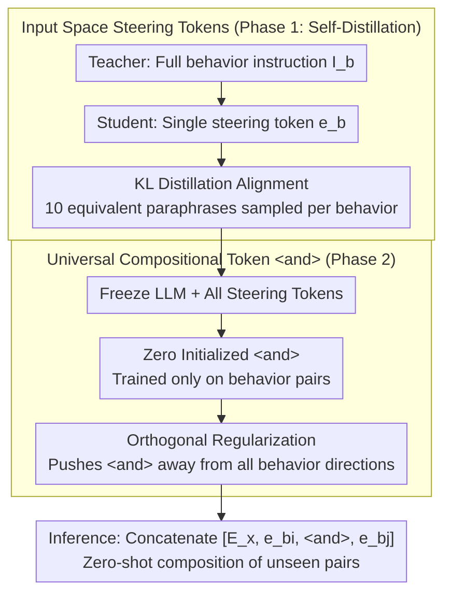

# Compositional Steering of Large Language Models with Steering Tokens

**Conference**: ACL 2026  
**arXiv**: [2601.05062](https://arxiv.org/abs/2601.05062)  
**Code**: None  
**Area**: Model Compression  
**Keywords**: Compositional steering, steering tokens, self-distillation, multi-behavior control, zero-shot composition

## TL;DR

This paper proposes compositional steering tokens, which compress behavior instructions into embedding vectors in the input space via self-distillation. By training a dedicated compositional token `<and>` to capture the universal concept of "composition," the method demonstrates strong generalization capabilities across unseen behavior combinations, unseen behaviors, and an unseen number of combined behaviors.

## Background & Motivation

**Background**: LLM deployment requires satisfying multiple behavioral constraints simultaneously (e.g., language, length, format). While fine-tuning is computationally expensive and potentially destructive to general capabilities, the arbitrary combination of $N$ behaviors implies $2^N$ possible fine-tuning configurations. Instruction prompting is flexible but fragile—semantically equivalent prompts often produce inconsistent behaviors.

**Limitations of Prior Work**: (1) Activation-space steering methods (e.g., CAA) combine behaviors through vector addition, but directly combining independently trained modules is destructive; (2) Gist tokens only handle single-behavior compression and do not address composition; (3) Existing compositional steering lacks rigorous evaluation—most provide only anecdotal evidence or lack baseline comparisons.

**Key Challenge**: Independently trained behavior representations interfere with each other when combined. However, training for every possible combination leads to a combinatorial explosion. There is a need for a representation that learns the concept of "composition" itself rather than every specific combination.

**Goal**: Learn a universal compositional token `<and>` that generalizes to unseen behavior combinations, including unseen behaviors and unseen numbers of combinations.

**Key Insight**: Placing behavior representations in the input space (rather than the activation space) supports better zero-shot composition. Freezing the behavior tokens while training the compositional token forces `<and>` to learn a behavior-agnostic composition function.

**Core Idea**: Composition = a learnable universal operator, rather than a specific adjustment for every behavior pair.

## Method

### Overall Architecture

The method decomposes the task of "satisfying multiple behavioral constraints" into a two-stage training process: first, learning a steering token for each individual behavior, and then learning a universal compositional token `<and>` to stitch any two behaviors together. The first stage employs self-distillation, where a teacher model processes the full instruction text and a student model processes only a single steering token, forcing the student to compress the instruction semantics into the input embedding space. In the second stage, the LLM and all behavior tokens are frozen, and `<and>` is trained solely on behavior pairs to force it to learn the "composition" operation itself rather than memorizing specific cases. During inference, inputs are concatenated as $[\mathbf{E}_x, \mathbf{e}_{b_i}, \mathbf{e}_{\text{<and>}}, \mathbf{e}_{b_j}]$ for zero-shot composition of unseen behavior pairs.

### Key Designs

**1. Input-Space Steering Tokens: Compressing Instructions into Composable Embeddings**

Activation-space methods (like CAA) combine behaviors via vector addition, but adding independently trained directions causes mutual interference, often leading to near-zero success rates. This paper places behavior representations back into the model's input embedding space—each behavior corresponds to a steering token $\mathbf{e}_b \in \mathbb{R}^d$. This is learned via self-distillation: minimizing $\text{KL}(P_{\text{teacher}}(y|x, I_b) \| P_{\text{student}}(y|x, \texttt{<b>}))$, forcing the student (seeing only one token) to reproduce the teacher's distribution (seeing the full instruction $I_b$). During training, 10 semantically equivalent paraphrases are sampled for each behavior to prevent the token from overfitting to a specific wording. The input space advantage is that representations naturally traverse standard forward computation, making them easier for a subsequent compositional token to coordinate than forced addition in the activation space.

**2. Universal Compositional Token <and>: Learning "Composition" as a Behavior-Agnostic Operator**

Tuning parameters for every behavior pair would lead to combinatorial explosion ($2^N$ combinations for $N$ behaviors). The key decision is to learn a single shared `<and>` token and freeze all behavior tokens during the second stage. This prevents `<and>` from taking "shortcuts" by modifying individual behaviors, forcing it to learn the universal function of "how to combine two behaviors." The `<and>` token is zero-initialized (biased toward no existing behavior) and used with orthogonal regularization to prevent collapse into the subspace spanned by behavior tokens. Because it learns an operation rather than specific cases, it generalizes to unseen combinations, combinations with unseen behaviors, and even 3-behavior compositions despite being trained only on pairs.

**3. Orthogonal Regularization: Preventing Representation Collapse**

Zero-initialized `<and>` tokens can be pulled toward high-frequency behavior tokens during training, degenerating into a "behavior vector with a different name" and losing universality. To counter this, a squared cosine similarity penalty is applied between `<and>` and each seen behavior token: $\mathcal{L}_{\text{orth}} = \sum_{b \in \mathcal{B}_{\text{seen}}} \left(\frac{\mathbf{e}_{\text{<and>}} \cdot \mathbf{e}_b}{\|\mathbf{e}_{\text{<and>}}\| \cdot \|\mathbf{e}_b\|}\right)^2$. This pushes it toward a position orthogonal to all behavior directions. The final loss is $\mathcal{L} = \mathcal{L}_{\text{dist}} + \lambda \cdot \mathcal{L}_{\text{orth}}$. Ablations show that without this term, performance on seen combinations drops slightly while unseen combinations drop significantly, proving orthogonality is the key to zero-shot generalization.

### Loss & Training

The overall objective comprises self-distillation loss and orthogonal regularization. The LLM remains frozen throughout; trainable parameters consist of only $|\mathcal{B}|+1$ vectors of dimension $d$ (one per behavior plus one `<and>`). A distillation temperature of $T=10.0$ is used to encourage the student to match the teacher's full probability distribution rather than just aligning the argmax. Behavior tokens are initialized semantically (mean of the instruction token embeddings), while the compositional token is zero-initialized, which together with the orthogonal constraint ensures generalizable composition capabilities.

## Key Experimental Results

### Main Results

**2-Behavior Composition Accuracy on Qwen3-8B (%)**

| Method | Seen Combos | Unseen Combos | Order Var.↓ |
|------|---------|---------|----------|
| CAA (Activation) | 1.6 | 0.5 | - |
| LM-Steer | 18.1 | 13.4 | - |
| LoRA DARE | 81.5 | 44.8 | - |
| Instruction | 86.2 | 67.3 | 12.3 |
| **Steering Token** | **90.5** | **75.5** | **4.8** |
| **Steering Token + Instr.** | **92.0** | **80.3** | **3.5** |

### Ablation Study

| Configuration | Seen Combos | Unseen Combos | Note |
|------|---------|---------|------|
| No <and> token (direct concat) | Decrease | Sharp Decrease | Compositional token is critical |
| No Orthogonal Reg. | Slight Decrease | Significant Decrease | Orthogonality vital for generalization |
| Randomly Initialized <and> | Slight Decrease | Decrease | Zero initialization is superior |
| 2-Behavior Training only | - | Generalizes to 3-behavior | Composition concept is generalizable |

### Key Findings

- Steering tokens significantly outperform activation-space methods on both seen and unseen combinations (CAA: 1.6% vs Steering Tokens: 90.5%).
- The compositional token successfully generalizes to: unseen behavior combinations, combinations containing unseen behaviors, and 3-behavior compositions (despite only being trained on 2-behavior pairs).
- The hybrid approach (Steering Tokens + Instructions) is optimal across all settings, showing complementarity.
- Accuracy and robustness improve with model scale (4B → 8B → 14B).
- Steering tokens exhibit much lower order variance than instruction prompting, indicating more stable behavior representations.

## Highlights & Insights

- The concept of "learning a compositional operator rather than every combination" is simple yet powerful—akin to learning a function vs. memorizing a table.
- Freezing behavior tokens during `<and>` training is a critical design decision that ensures generalization over overfitting.
- The complementarity between steering tokens and instructions is surprising—compressed representations and natural language provide different types of control signals.

## Limitations & Future Work

- Evaluation is limited to automatically verifiable constraints (length, format, language); subjective behaviors (style, tone) are not covered.
- Each behavior requires independent steering token training; training costs scale linearly with the number of behaviors.
- The compositional token was only trained on 2-behavior pairs; efficacy may decrease for compositions involving many more behaviors.
- Dependency on self-distillation quality—if the teacher (instruction prompting) fails to follow instructions, the student cannot learn effectively.

## Related Work & Insights

- **vs. CAA/Rimsky et al.**: Activation-space steering suffers from severe interference during composition (1.6%), while input-space steering tokens perform significantly better.
- **vs. Gist tokens**: Gist tokens only compress single instructions and do not address the composition problem.
- **vs. LoRA merging**: LoRA DARE is competitive on seen combinations (81.5%) but generalizes poorly to unseen ones (44.8%).

## Rating

- Novelty: ⭐⭐⭐⭐⭐ The concept of a universal compositional operator and the frozen training design are highly original.
- Experimental Thoroughness: ⭐⭐⭐⭐⭐ Extremely comprehensive: seven models, 15 behaviors, multiple compositional settings, and over 1 million evaluations.
- Writing Quality: ⭐⭐⭐⭐⭐ Clear motivation, elegant method, and rigorous experimental design.
- Value: ⭐⭐⭐⭐⭐ Provides a simple and effective new paradigm for multi-behavior controllable generation.

<!-- RELATED:START -->

## Related Papers

- [\[ACL 2026\] FineSteer: A Unified Framework for Fine-Grained Inference-Time Steering in Large Language Models](finesteer_a_unified_framework_for_fine-grained_inference-time_steering_in_large_.md)
- [\[ACL 2026\] From Weights to Activations: Is Steering the Next Frontier of Adaptation?](from_weights_to_activations_is_steering_the_next_frontier_of_adaptation.md)
- [\[CVPR 2026\] Language Models Can Explain Visual Features via Steering](../../CVPR2026/interpretability/language_models_can_explain_visual_features_via_steering.md)
- [\[ACL 2026\] Knowledge Vector of Logical Reasoning in Large Language Models](knowledge_vector_of_logical_reasoning_in_large_language_models.md)
- [\[ACL 2026\] Experiments or Outcomes? Probing Scientific Feasibility in Large Language Models](experiments_or_outcomes_probing_scientific_feasibility_in_large_language_models.md)

<!-- RELATED:END -->
