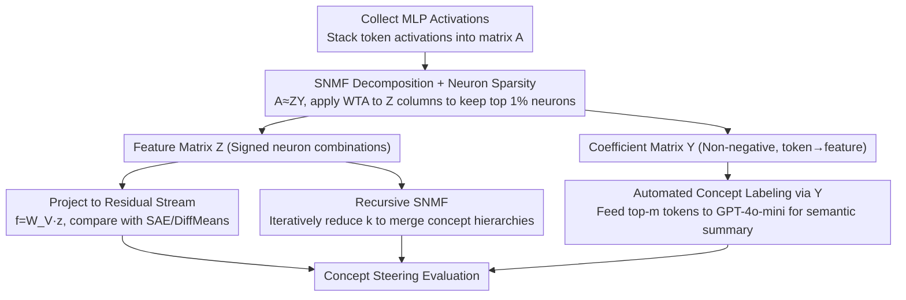

# Constructing Interpretable Features from Compositional Neuron Groups

**Conference**: ACL 2026  
**arXiv**: [2506.10920](https://arxiv.org/abs/2506.10920)  
**Code**: <https://github.com/ordavid-s/snmf-mlp-decomposition>  
**Area**: Interpretability / Mechanistic Interpretability / LLM Internal Representations  
**Keywords**: SNMF, MLP Decomposition, Concept Steering, Sparse Autoencoders, Concept Hierarchy

## TL;DR
The authors utilize Semi-Nonnegative Matrix Factorization (SNMF) to directly decompose MLP activations into "sparse neuron groups × non-negative coefficients," yielding interpretable features that map back to activation contexts and combine across layers. Evaluations of concept steering on Llama-3.1-8B / Gemma-2-2B / GPT-2 comprehensively outperform the latest SAEs (Llamascope / Gemmascope) and the strongly supervised baseline, DiffMeans.

## Background & Motivation

**Background**: A core problem in mechanistic interpretability is "what units to use to explain LLMs." Early research focused on individual neurons, but these are known to be polysemantic. Recent consensus has shifted toward "directions in activation space," with Sparse Autoencoders (SAE) being the mainstream approach to learn a "feature dictionary" from the residual stream.

**Limitations of Prior Work**: SAEs frequently fail in causal evaluations—directly intervening on SAE features often fails to directionally change model behavior. Furthermore, the directions learned by SAEs are not strictly constrained to the model's original representation space nor tied to specific MLP computations, causing their "interpretability" to rely heavily on posterior natural language labeling.

**Key Challenge**: Learning a set of directions from scratch vs. discovering neuron combinations inherent to the model—the former is flexible but detached from mechanisms, while the latter has natural mechanical anchors but requires unsupervised methods to extract them.

**Goal**: To provide an unsupervised method where the discovered "features" satisfy: (1) being sparse linear combinations of MLP neurons, (2) possessing an inherent backward mapping from features to activation contexts, and (3) enabling directional changes in generation under causal intervention.

**Key Insight**: MLP output is essentially $\sum_i a_i \mathbf{v}_i$ (neuron activations weighting vector columns). Similar inputs should activate similar neuron groups. As long as these "co-activation patterns" can be decomposed from the activation matrix $A$, the features naturally possess mechanistic anchors.

**Core Idea**: Use SNMF to decompose MLP activations as $A \approx Z Y$, where $Z$ is the "feature matrix" allowing positive/negative values (linear combinations of neurons) and $Y$ is a constrained non-negative "coefficient matrix" (indicating which tokens trigger a feature). Non-negative $Y$ encourages parts-based additive representations, while signed $Z$ accommodates the bidirectional semantics of MLP activations.

## Method

### Overall Architecture

The core idea is that MLP output is $\sum_i a_i \mathbf{v}_i$, a weighted superposition of neurons. Similar inputs trigger similar neuron combinations; decomposing these co-activation patterns from the activation matrix anchors features to the model's real computation. Specifically, for an MLP layer of a pretrained LLM, activation vectors $\mathbf{a} \in \mathbb{R}^{d_a}$ for each token are collected into matrix $A \in \mathbb{R}^{d_a \times n}$. SNMF decomposes $A \approx Z Y$ into $k$ MLP features $\mathbf{z}_i$ ($d_a$-dimensional neuron-weighted directions) and a non-negative coefficient matrix $Y$. Each feature is projected back to the residual stream via $W_V$ as $\mathbf{f}_i = W_V \mathbf{z}_i$ for fair comparison with SAE/DiffMeans. $Y$ identifies which tokens strongly activate each feature, providing the "activation context" labels often missing in SAEs.

### Key Designs

**1. SNMF Decomposition + Neuron Sparsity: Sparse signed linear combinations of neurons**

SAEs use non-negative regularization to encourage parts-based representations, but MLP activations possess both positive and negative values corresponding to concept facilitation or inhibition. Forcing non-negative features discards half the semantics. SNMF relaxes the non-negative constraint on features while retaining it for coefficients. Using Multiplicative Updates (Ding et al.), $Z$ is updated via $Z \leftarrow A Y^\top (Y Y^\top + \lambda I)^{-1}$ (allowing signs) and $Y$ is updated with a signed-decomposition multiplicative rule to maintain non-negativity. This preserves bidirectional semantics while ensuring additive interpretability on the coefficient side. After each iteration, a hard winner-take-all (WTA) is applied to each column of $Z$, keeping only the top $p\%=1\%$ neurons by absolute value—an $\ell_0$ constraint scheme (Peharz & Pernkopf 2012) ensuring features consist of very few neurons. 1% significantly outperforms 5%/10%.

**2. Automated Concept Labeling via $Y$: Built-in attribution loop**

SAE feature descriptions rely on third-party pipelines like Neuronpedia/autointerp, which attach labels based on raw activation rankings. In contrast, the SNMF coefficient matrix $Y$ encodes which tokens trigger which feature. For feature $\mathbf{z}_i$, the top-$m$ tokens are sampled from the $i$-th row of $Y$, and their contexts are fed to GPT-4o-mini to summarize the semantic pattern. Shallow layers use "activation input" descriptions, while deeper layers use logit lens style "output token" descriptions (Gur-Arieh 2025). This built-in attribution makes the method self-contained and explains why SNMF leads in concept detection—its feature log-ratio $S_{CD} := \log \bar{a}_{\text{act}} / \bar{a}_{\text{neutral}}$ is higher, meaning activations are more concentrated in relevant contexts.

**3. Recursive SNMF: Exposing "Concrete → Abstract" concept hierarchies**

Repeatedly decomposing MLP features with decreasing $k$ naturally grows a hierarchical tree. Multi-level SNMF is run with $k=[400, 200, 100, 50]$, followed by joint fine-tuning via gradient descent to minimize $\mathcal{L} = \frac{1}{2}\|A - Z_L Y_L \cdots Y_1 Y_0\|_F^2$. This yields merging trajectories such as "Monday/Tuesday → Weekday/Weekend → Day of the week." Binarizing $Z$ to compute $M = \bar{Z}\bar{Z}^\top$ visualizes neuron overlap between synonymous concepts. This is the inverse of SAE feature splitting—whereas SAEs split one feature into many as the dictionary grows, SNMF merges multiple features into an abstract concept as $k$ shrinks. Causal interventions on "Weekday base neurons" vs "Monday-only exclusive neurons" prove the model builds concepts using a "core + specific" compositional approach.

### Loss & Training

SNMF minimizes the Frobenius reconstruction error $\|A - ZY\|_F^2$, with non-negativity constraints on $Y$ and WTA sparsity on $Z$ columns. In terms of initialization, random initialization ($Y \sim \mathcal{U}(0,1)$, $Z \sim \mathcal{N}(0,1)$) performs similarly to SVD/K-Means but converges slower (3325 vs 1484/2474 iterations). All experiments use $k \in \{100, 200, 300, 400\}$ and $p=1\%$ (5% for GPT-2).

## Key Experimental Results

### Main Results (Concept steering + fluency harmonic mean, higher is better)

| Model / Layer | SAE-out | SAE-act (Same Capacity) | DiffMeans (Supervised) | SNMF (Ours) |
|---------------|---------|-------------------------|------------------------|-------------|
| Llama-3.1-8B L23 | ≈0.35 | ≈0.37 | ≈0.40 | **0.45** |
| Llama-3.1-8B L31 | ≈0.20 | ≈0.25 | ≈0.27 | **0.31** |
| Gemma-2-2B L18 | Lower | Medium | Medium | **Highest** |
| GPT-2 Small | Similar trend | Similar trend | Similar trend | **Leading** |

> On Concept Detection, SNMF is roughly on par with SAE-out and significantly better than SAE-act of the same capacity (>75% of features have $S_{CD} > 0$), but its decisive advantage lies in Concept Steering.

### Ablation Study (Llama-3.1-8B, SNMF $k=100$)

| Configuration | Concept Detection (L0) | Concept Steering+Fluency (L23) | Note |
|---------------|------------------------|--------------------------------|------|
| Random init | 2.99 ± 1.55 | 0.45 ± 0.32 | Default |
| SVD init | 2.76 ± 1.79 | 0.41 ± 0.31 | Comparable but faster convergence |
| K-Means init | 2.55 ± 1.51 | 0.47 ± 0.33 | Converges in 1484 iterations |
| WTA = 1% | 2.99 / 1.67 / 0.81 / 2.35 / 1.89 / 0.48 | 0.45 ± 0.32 | Paper default, best |
| WTA = 5% | Slightly lower across | 0.41 ± 0.30 | Decreased sparsity |
| WTA = 10% | Slightly lower across | 0.34 ± 0.30 | Further degradation |

Hierarchy Experiment (GPT-2 Large causal intervention, selection from Table 2):

| Intervened Neuron Group | Monday logit | Tuesday | Friday | Sunday |
|-------------------------|--------------|---------|--------|--------|
| Monday-exclusive | **+2.0** | -0.8 | -0.8 | -0.1 |
| Friday-exclusive | -2.9 | -2.8 | **+1.3** | -2.6 |
| Sunday-exclusive | -0.4 | -1.7 | -0.8 | **+2.6** |
| **Core Weekday (base)** | **+5.8** | **+5.7** | **+6.0** | **+4.7** |

### Key Findings
- SNMF consistently outperforms SAE-out and DiffMeans in concept steering, proving that "neuron combinations embedded in MLP weights" are the true steerable units, while directions learned by SAEs often fail to steer behavior directionally.
- The hierarchical structure exposed by recursive SNMF (Individual day → Weekend/Weekday → Day of week) and the dual-layer mechanism of "Weekday base + Daily exclusive neurons" provide a mechanistic explanation for "SAE feature splitting"—splitting is not an SAE training byproduct but a reflection of the model constructing refined concepts via neuron combinations.
- 1% WTA sparsity + random initialization provides the best trade-off; performance is robust to initialization, though K-Means accelerates convergence.
- High concept detection scores in shallow layers (layer 0/1) suggest that activations not yet mixed by attention are easier to deconstruct into monosemantic features.

## Highlights & Insights
- SNMF is the "correct" choice for non-negative regularization: since MLP activations correspond to concept facilitation vs. inhibition, forcing features to be non-negative (like NMF) loses half the information.
- The coefficient matrix $Y$ provides an inherent token-to-feature backward mapping, bypassing third-party pipelines like Neuronpedia and making the method self-contained.
- Reinterpreting SAE "feature splitting" as "the inverse projection of the model's own feature merging" is a paradigm-shifting insight—it unifies "finding features" and "understanding how models build concepts with neurons" into the same task.
- The causal evidence of the dual-layer "core base + exclusive neurons" (core activates all related tokens, exclusive only activates itself and inhibits siblings) is elegant and can be transferred to other linear structured concepts like months, seasons, or grammatical attributes.

## Limitations & Future Work
- Experiments use $k < 500$; scalability to massive dictionaries (like millions of SAE features) is not yet verified. Multiplicative Updates are difficult to regularize; projected gradient descent may be needed.
- In some layers (Gemma-2-2B layer 12), performance drops as $k$ increases, suggesting the number of meaningful concepts is fewer than $k$, requiring automated $k$-selection strategies.
- Evaluation depends heavily on GPT-4o-mini as a judge (validated with human Spearman ρ=0.8), which may still be prompt-sensitive.
- Fluency drops significantly during layer 0 interventions; the "propagation side effects" of shallow steering are not yet systematically modeled.

## Related Work & Insights
- **vs SAE (Bricken et al. / Gemmascope / Llamascope)**: SAEs learn directions from residual streams and scale well but fail causally; SNMF decomposes MLP activations directly, is small-scale but causally robust. They are complementary—SAE provides breadth, SNMF provides mechanistic anchors.
- **vs DiffMeans (Supervised baseline)**: DiffMeans uses positive/negative mean differences to get directions but is heavily affected by noise from unrelated concepts; SNMF significantly outperforms it, especially in shallow layers.
- **vs Yun et al. 2021 (Residual stream NMF)**: They used NMF on the residual stream for linguistic analysis; this paper applies SNMF to MLP activations, anchors features to neuron groups, and introduces causal evaluation.
- **vs Cao et al. 2025 (NeurFlow)**: Also concerned with functional clustering of neuron groups; this paper places it in the context of LLM MLPs and unsupervised causal scenarios.

## Rating
- Novelty: ⭐⭐⭐⭐⭐ The combination of SNMF + WTA + recursive hierarchy + token-to-feature mapping is a fresh perspective in the LLM interpretability community.
- Experimental Thoroughness: ⭐⭐⭐⭐ Covers three models × multiple layers × multiple $k$ × causal + detection axes, though $k$ is small and lacks direct comparison with large benchmarks like RAVEL/MIB.
- Writing Quality: ⭐⭐⭐⭐⭐ Clear formulas, detailed appendices (initialization, sparsity, hierarchical datasets), and comprehensive case studies.
- Value: ⭐⭐⭐⭐⭐ Provides an "MLP-embedded feature" route for the mechanistic interpretability community with open-source code, offering high actionable value for future research.

<!-- RELATED:START -->

## Related Papers

- [\[ACL 2026\] Compositional Steering of Large Language Models with Steering Tokens](compositional_steering_of_large_language_models_with_steering_tokens.md)
- [\[ICLR 2026\] SAE as a Crystal Ball: Interpretable Features Predict Cross-domain Transferability of LLMs without Training](../../ICLR2026/interpretability/sae_as_a_crystal_ball_interpretable_features_predict_cross-domain_transferabilit.md)
- [\[ACL 2026\] DPN-LE: Dual Personality Neuron Localization and Editing for Large Language Models](dpn-le_dual_personality_neuron_localization_and_editing_for_large_language_model.md)
- [\[AAAI 2026\] CrossCheck-Bench: Diagnosing Compositional Failures in Multimodal Conflict Resolution](../../AAAI2026/interpretability/crosscheck-bench_diagnosing_compositional_failures_in_multim.md)
- [\[ICLR 2026\] Neuron-Level Analysis of Cultural Understanding in Large Language Models](../../ICLR2026/interpretability/neuron-level_analysis_of_cultural_understanding_in_large_language_models.md)

<!-- RELATED:END -->
