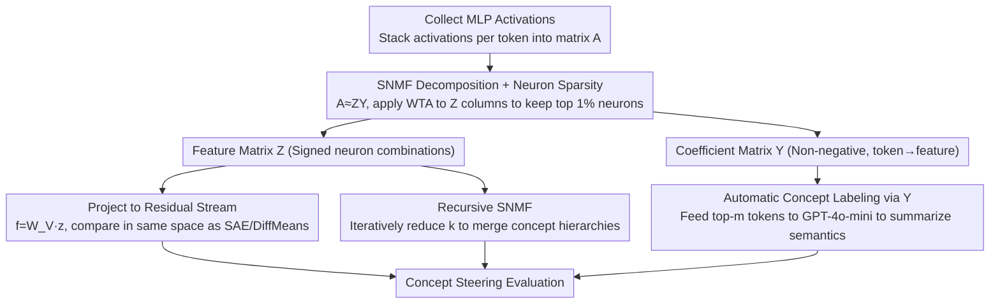

# Constructing Interpretable Features from Compositional Neuron Groups

**Conference**: ACL 2026  
**arXiv**: [2506.10920](https://arxiv.org/abs/2506.10920)  
**Code**: <https://github.com/ordavid-s/snmf-mlp-decomposition>  
**Area**: Interpretability / Mechanistic Interpretability / LLM Internal Representations  
**Keywords**: SNMF, MLP Decomposition, Feature Steering, Sparse Autoencoders, Concept Hierarchy

## TL;DR
The authors utilize Semi-Nonnegative Matrix Factorization (SNMF) to directly decompose MLP activations into "sparse neuron groups $\times$ non-negative coefficients." This yields interpretable features that map back to activation contexts and combine across layers. Causal concept steering evaluations on Llama-3.1-8B, Gemma-2-2B, and GPT-2 comprehensively outperform the latest Sparse Autoencoders (Llamascope / Gemmascope) and the strong supervised baseline DiffMeans.

## Background & Motivation

**Background**: A central problem in mechanistic interpretability is determining which units are best for explaining LLMs. Early research focused on individual neurons, but these are known to be polysemantic. Current consensus has shifted toward "directions in activation space," with Sparse Autoencoders (SAEs) as the mainstream method for learning a "feature dictionary" from the residual stream.

**Limitations of Prior Work**: SAEs frequently fail in causal evaluations; direct intervention on SAE features often fails to directionally change model behavior. Furthermore, the directions learned by SAEs are not explicitly constrained to the model's original representation space, nor are they linked to specific MLP computations. Consequently, their "interpretability" relies heavily on posterior natural language labeling.

**Key Challenge**: The choice between learning a set of directions from scratch versus discovering neuron combinations that already exist within the model—the former is flexible but detached from mechanisms, while the latter naturally possesses mechanistic anchors but requires unsupervised methods for extraction.

**Goal**: To provide an unsupervised method so that discovered "features" satisfy: (1) being a sparse linear combination of MLP neurons, (2) providing a bidirectional mapping from features to activation contexts, and (3) enabling directional changes in generation under causal intervention.

**Key Insight**: MLP output is fundamentally $\sum_i a_i \mathbf{v}_i$ (neuron activations weighting vector columns). Similar inputs should activate similar neuron groups. By decomposing these "co-activation patterns" from the activation matrix $A$, features naturally possess mechanistic anchors.

**Core Idea**: Use SNMF to decompose MLP activations $A \approx Z Y$, where $Z$ is a "feature matrix" (linear combination of neurons) allowing both positive and negative values, and $Y$ is a constrained non-negative "coefficient matrix" (indicating which tokens trigger which features). The non-negativity of $Y$ encourages parts-based additive representations, while the signed $Z$ accommodates the bidirectional semantics of MLP activations.

## Method

### Overall Architecture

The core premise is that MLP output is a weighted superposition of neurons. Similar inputs should trigger similar neuron combinations; by decomposing these co-activation patterns from the activation matrix, features are naturally anchored to the model's actual computation. Specifically, for an MLP layer of a pretrained LLM, activation vectors $\mathbf{a} \in \mathbb{R}^{d_a}$ for each token are collected into a matrix $A \in \mathbb{R}^{d_a \times n}$. SNMF is then used to solve $A \approx Z Y$, yielding $k$ MLP features $\mathbf{z}_i$ ($d_a$-dimensional weighted neuron directions) and a non-negative coefficient matrix $Y$. Each feature is projected back to the residual stream via $W_V$ as $\mathbf{f}_i = W_V \mathbf{z}_i$ to ensure fair comparison with SAEs / DiffMeans. $Y$ directly identifies which tokens strongly activate each feature, providing the "activation context" labeling that SAEs often lack.

### Key Designs

**1. SNMF Decomposition + Neuron Sparsity: Features as signed linear combinations of few neurons**

SAEs encourage parts-based representations with non-negative regularization, but MLP activations have both positive and negative values corresponding to concept promotion and inhibition. Forcing features to be non-negative loses half the semantics. SNMF relaxes the "feature non-negativity" constraint while keeping "coefficient non-negativity": using Multiplicative Updates (Ding et al.) to alternately update $Z$ (closed form $Z \leftarrow A Y^\top (Y Y^\top + \lambda I)^{-1}$, allowing signs) and $Y$ (multiplicative updates with positive/negative decomposition to maintain non-negativity). After each iteration, a hard winner-take-all (WTA) is applied to each column of $Z$, keeping only the top $p\%=1\%$ neurons by absolute value—an $\ell_0$ constraint scheme from Peharz & Pernkopf 2012 forcing each feature to consist of very few neurons. Experiments show 1% significantly outperforms 5% or 10%.

**2. Automatic Concept Labeling via $Y$: Turning token-to-feature attribution into a built-in loop**

SAE feature descriptions rely on third-party pipelines like Neuronpedia or autointerp to attach labels based on activation sorting. In contrast, the SNMF coefficient matrix $Y$ already encodes "which tokens trigger which feature." For feature $\mathbf{z}_i$, the top-$m$ tokens are sampled from the $i$-th row of $Y$, and their contexts are fed to GPT-4o-mini to summarize semantic patterns: using "active inputs" for shallow layers and logit lens-style "output tokens" for deep layers (Gur-Arieh 2025). This built-in attribution makes the method self-contained and explains why SNMF leads in concept detection—its features have a higher mean log-ratio $S_{CD} := \log \bar{a}_{\text{act}} / \bar{a}_{\text{neutral}}$.

**3. Recursive SNMF: Exposing "Concrete → Abstract" concept hierarchies with decreasing $k$**

Learned MLP features can be repeatedly decomposed using smaller $k$ to grow a hierarchy tree. Multiple SNMF stages are run with $k=[400,200,100,50]$, followed by joint fine-tuning via gradient descent to minimize $\mathcal{L} = \frac{1}{2}\|A - Z_L Y_L \cdots Y_1 Y_0\|_F^2$. This yields merging trajectories such as "Monday/Tuesday → Weekday/Weekend → Day of Week." Binarizing $Z$ to calculate $M = \bar{Z}\bar{Z}^\top$ visualizes neuron overlap between synonymous concepts. This is the inverse of SAE feature splitting—whereas SAEs split one feature into many as the dictionary grows, SNMF merges multiple features into abstract concepts as $k$ shrinks.

### Loss & Training

SNMF minimizes the Frobenius reconstruction error $\|A - ZY\|_F^2$, subject to non-negativity on $Y$ and WTA sparsity on columns of $Z$. Regarding initialization, random initialization $Y \sim \mathcal{U}(0,1)$, $Z \sim \mathcal{N}(0,1)$ performs comparably to SVD or K-Means but converges slower (3325 vs. 1484 / 2474 iterations). All experiments use $k \in \{100, 200, 300, 400\}$ and $p=1\%$ (5% for GPT-2).

## Key Experimental Results

### Main Results (Harmonic mean of concept steering + fluency, higher is better)

| Model / Layer | SAE-out | SAE-act (Same k) | DiffMeans (Supervised) | SNMF (Ours) |
|-----------|---------|-------------------|-------------------|--------------|
| Llama-3.1-8B L23 | ≈0.35 | ≈0.37 | ≈0.40 | **0.45** |
| Llama-3.1-8B L31 | ≈0.20 | ≈0.25 | ≈0.27 | **0.31** |
| Gemma-2-2B L18 | Lower | Medium | Medium | **Highest** |
| GPT-2 Small | Similar trend | Similar trend | Similar trend | **Leading** |

### Ablation Study (Llama-3.1-8B, SNMF $k=100$)

| Config | Concept Detection (L0) | Concept Steering+Fluency (L23) | Description |
|------|------------------------|-------------------------------|------|
| Random init | 2.99 ± 1.55 | 0.45 ± 0.32 | Default |
| SVD init | 2.76 ± 1.79 | 0.41 ± 0.31 | Comparable perf |
| K-Means init | 2.55 ± 1.51 | 0.47 ± 0.33 | Faster convergence |
| WTA = 1% | 2.99 / 1.67 / 0.81 | 0.45 ± 0.32 | Paper default, best |
| WTA = 5% | Lower | 0.41 ± 0.30 | Decreased sparsity |
| WTA = 10% | Lower | 0.34 ± 0.30 | Further degradation |

### Key Findings
- SNMF consistently outperforms SAE-out and DiffMeans in concept steering, proving that "neuron combinations embedded in MLP weights" are the true steerable units.
- The hierarchical structure exposed by recursive SNMF and the "core base + exclusive neuron" architecture provide a mechanistic explanation for the "SAE feature splitting" phenomenon.
- 1% WTA sparsity + random initialization is the optimal trade-off; performance is robust to initialization.
- Shallow layers show higher concept detection scores, suggesting that activations not yet mixed by attention are easier to deconstruct.

## Highlights & Insights
- SNMF correctly places non-negative regularization only on coefficients; as MLP activations are signed, forcing features to be non-negative loses semantic information.
- The coefficient matrix $Y$ provides built-in token-to-feature mapping, ensuring the method is self-contained.
- Reinterpreting SAE "feature splitting" as an inverse projection of the model's own "feature merging" is a paradigm-level insight that unites feature discovery with structural understanding.
- Causal evidence for "core base + exclusive neuron" architecture is elegant and transferable to other linear concept structures like seasons or grammatical attributes.

## Limitations & Future Work
- Scalability to massive dictionaries ($k > 500$) is not yet verified; multiplicative updates may need to be replaced by projected gradient descent for better regularization.
- Automated selection of $k$ is needed, as some layers show performance decreases when $k$ is too large.
- Evaluation relies on LLM-based judging, which may be sensitive to prompts.
- Fluency drops significantly during interventions in layer 0, indicating that shallow steering propagation is not yet systemically modeled.

## Related Work & Insights
- **vs. SAEs**: SAEs learn directions from the residual stream at scale but lack causal steering; SNMF decomposes MLP activations at smaller scales with strong causal alignment.
- **vs. DiffMeans**: DiffMeans uses mean differences for supervised directions; SNMF significantly outperforms it, especially in shallow layers without needing supervision.
- **vs. Yun et al. 2021**: Their work focused on residual stream NMF for linguistics; this work anchors features to specific neuron combinations and introduces causal steering.

## Rating
- Novelty: ⭐⭐⭐⭐⭐
- Experimental Thoroughness: ⭐⭐⭐⭐
- Writing Quality: ⭐⭐⭐⭐⭐
- Value: ⭐⭐⭐⭐⭐

## Related Papers

- [\[ACL 2026\] Compositional Steering of Large Language Models with Steering Tokens](compositional_steering_of_large_language_models_with_steering_tokens.md)
- [\[ACL 2026\] DPN-LE: Dual Personality Neuron Localization and Editing for Large Language Models](dpn-le_dual_personality_neuron_localization_and_editing_for_large_language_model.md)
- [\[CVPR 2026\] Language Models Can Explain Visual Features via Steering](../../CVPR2026/interpretability/language_models_can_explain_visual_features_via_steering.md)
- [\[CVPR 2026\] CI-ICE: Intrinsic Concept Extraction Based on Compositional Interpretability](../../CVPR2026/interpretability/ciice_intrinsic_concept_extraction_compositional.md)
- [\[ACL 2026\] Model Internal Sleuthing: Finding Lexical Identity and Inflectional Features in Modern Language Models](model_internal_sleuthing_finding_lexical_identity_and_inflectional_features_in_m.md)

<!-- RELATED:END -->

<!-- RELATED:START -->

## Related Papers

- [\[ACL 2026\] Compositional Steering of Large Language Models with Steering Tokens](compositional_steering_of_large_language_models_with_steering_tokens.md)
- [\[ACL 2026\] DPN-LE: Dual Personality Neuron Localization and Editing for Large Language Models](dpn-le_dual_personality_neuron_localization_and_editing_for_large_language_model.md)
- [\[ACL 2026\] Model Internal Sleuthing: Finding Lexical Identity and Inflectional Features in Modern Language Models](model_internal_sleuthing_finding_lexical_identity_and_inflectional_features_in_m.md)
- [\[ACL 2026\] AdaptiveK: Complexity-Driven Sparse Autoencoders for Interpretable Language Model Representations](adaptivek_complexity-driven_sparse_autoencoders_for_interpretable_language_model.md)
- [\[ACL 2026\] Preference Heads in Large Language Models: A Mechanistic Framework for Interpretable Personalization](preference_heads_in_large_language_models_a_mechanistic_framework_for_interpreta.md)

<!-- RELATED:END -->
