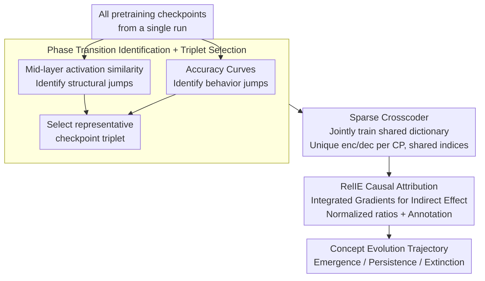

# Crosscoding Through Time: Tracking Emergence & Consolidation Of Linguistic Representations Throughout LLM Pretraining

**Conference**: ACL 2026  
**arXiv**: [2509.05291](https://arxiv.org/abs/2509.05291)  
**Code**: [github.com/bayazitdeniz/crosscoding-through-time](https://github.com/bayazitdeniz/crosscoding-through-time)  
**Area**: LLM Interpretability / Training Dynamics / Representation Learning  
**Keywords**: sparse crosscoder, pretraining dynamics, RelIE, causal attribution, syntax concept emergence

## TL;DR
By training a shared feature dictionary across multiple pretraining checkpoints of the same LLM using a sparse crosscoder, this work proposes the Relative Indirect Effect (RelIE) to measure how the causal importance of individual features "emerges, persists, or vanishes" over token counts. This study provides the first observation of the concept-level evolutionary trajectory in Pythia, OLMo, and BLOOM—from "specific subword detectors" to "internalized abstract syntactic/cross-lingual detectors."

## Background & Motivation

**Background**: Understanding "when an LLM learns what capability" primarily relies on two approaches: (a) monitoring performance curves on proxy tasks like BLiMP to observe phase transitions; (b) analyzing changes in activation or parameter space similarity. Recently, Sparse Autoencoders (SAEs) have been used to decompose dense activations of a single checkpoint into interpretable sparse feature dictionaries, providing fine-grained characterizations of mechanisms such as subject-verb agreement and parenthesis matching.

**Limitations of Prior Work**:

1. Accuracy or activation similarity only indicates *when* a change occurs but fails to explain *what* concept-level transformations happen inside the model.
2. Training a separate SAE for each checkpoint results in non-commensurable feature spaces, making it impossible to determine if feature 17 in checkpoint A represents the same concept as feature 17 in checkpoint B.
3. While crosscoder frameworks have been proposed to learn shared feature spaces across models, they have been restricted to post-training comparisons (e.g., pretrained vs. instruction-tuned) rather than the pretraining time dimension.

**Key Challenge**: To track exactly when a concept emerges and stabilizes during pretraining, an interpreter that allows direct feature comparison across checkpoints is required. Furthermore, a "shared feature dictionary" alone only indicates structural similarity (e.g., which checkpoint has a larger decoder norm for a feature) but does not reveal the actual causal contribution to a task. These two pieces of information must be obtained orthogonally.

**Goal**:

- Sub-problem 1: Can a shared sparse feature dictionary be trained across multiple pretraining checkpoints (remaining robust even for early, near-random checkpoints)?
- Sub-problem 2: Within this shared dictionary, how can the causal contribution of each feature be measured independently for each checkpoint to track "emergence-maintenance-extinction" trajectories?

**Key Insight**: This work extends the crosscoder framework from Lindsey et al. 2024 from "two post-trained models" to "triplet checkpoints from the same pretraining run." It also designs a new normalized metric, RelIE, based on existing integrated-gradients-based indirect effect tools in the SAE community to fully decouple structural relativity from causal relativity.

**Core Idea**: **Crosscoder + RelIE = Concept-level causal attribution on the timeline**. Use the crosscoder to solve "feature alignment across checkpoints" and RelIE to determine "at which checkpoint a feature's contribution actually occurs."

## Method

### Overall Architecture

The objective is to track when a linguistic concept emerges and stabilizes during pretraining. The difficulty lies in the fact that feature spaces from independent SAEs are not commensurable. The method bypasses this with a three-step pipeline: first, identify 3-4 representative checkpoints (triplets) where "concepts truly change" by combining accuracy curves with mid-layer activation similarity heatmaps; second, train a sparse crosscoder on this triplet to enforce a shared set of feature indices; finally, calculate the causal importance of each feature using integrated gradients and normalize the results with the proposed RelIE, allowing for the mapping of "emergence-persistence-extinction" trajectories through manual annotation of linguistic functions.

### Key Designs

**1. Phase Transition Identification + Checkpoint Triplet Selection: Strategic Compute Allocation**

Training crosscoders' for every checkpoint pair is prohibitively expensive. Therefore, the first step is to locate critical nodes by parallelly tracking two signals: (a) accuracy curves on target benchmarks to find behavioral jumps; (b) pairwise cosine similarity heatmaps of **mid-layer** activations across checkpoints to find structural shifts. Mid-layers are chosen because they capture higher-level linguistic/cross-lingual abstractions, whereas early and late layers are tied to input/output. These signals are often asynchronous; for example, OLMo's accuracy stabilizes after 33B, but activation similarity continues to change until 3T. This "accuracy saturation but representation refinement" zone is precisely where crosscoders are most valuable. The dual-signal strategy ensures chosen triplets contain both behavioral and structural jumps (e.g., Pythia: {128M, 1B, 4B, 286B}).

**2. Sparse Crosscoder: A Shared Sparse Feature Dictionary Across Checkpoints**

The second step addresses feature alignment. Traditional SAE feature spaces are single-point and non-commensurable. A crosscoder provides each checkpoint $c$ with unique encoder/decoder weights $W_{\text{enc}}^c, W_{\text{dec}}^c$ while sharing the same feature activation vector: $\mathbf{f}=\text{ReLU}(\sum_c W_{\text{enc}}^c \mathbf{x}_c + \mathbf{b}_{\text{enc}})$. Thus, "feature $i$ of checkpoint A" and "feature $i$ of checkpoint B" naturally refer to the same conceptual slot. The loss is the sum of reconstruction errors for each checkpoint plus an aggregated sparsity penalty $\sum_c \sum_i \mathbf{f}_i \lVert W_{\text{dec},i}^c \rVert_2$. This aggregated sparsity translates "shared vs. unique features" into readable signals (decoder norm magnitudes), making temporal evolution comparable and robust for early checkpoints (§6.2 verifies ΔCE < 0.35).

**3. Relative Indirect Effect (RelIE): Decoupling Causal Importance from Structural Relativity**

A shared dictionary only indicates where a feature is encoded strongly (structure), but a strongly learned feature might have zero causal impact on a task. RelIE performs attribution by linking features to task performance: for each feature $f_i$ and checkpoint $c$, integrated gradients approximate its indirect effect (change in $m$ upon zero-ablation) on the task metric $m(x) = \log p(t_{\text{wrong}}|x) - \log p(t_{\text{correct}}|x)$. The ratio is calculated as $\text{RelIE}_{2\text{-way},i} = |\hat{\text{IE}}_{ig,i}^{c_2}| / (|\hat{\text{IE}}_{ig,i}^{c_1}| + |\hat{\text{IE}}_{ig,i}^{c_2}|)$. A RelIE near 1 indicates the feature is causal almost exclusively for $c_2$, while 0.5 indicates a shared causal contribution. This is orthogonal to Lindsey et al.'s RelDec (decoder norm ratio), which only reflects structural strength. Appendix E confirms RelIE filters task-agnostic noise and exposes truly behavior-driving features.

### Loss & Training

The Crosscoder loss combines reconstruction error across checkpoints with aggregated sparsity. The dictionary size is fixed at $2^{14}$. Training data is sampled (400M tokens) from Pile, Dolma, and mC4 subsets corresponding to each model. Attribution uses integrated gradients to approximate IE with zero-ablation. Pythia-1B is used for emergence (dense early checkpoints), OLMo-1B for maintenance (long training), and BLOOM-1B for cross-lingual abstraction.

## Key Experimental Results

### Main Results

The table below summarizes core qualitative results (Table 1) for the Pythia-1B triplet (1B↔4B↔286B):

| Category | RelIE [1B, 4B, 286B] | Feature Example | Meaning |
|---|---|---|---|
| 1B-4B Shared | [0.53, 0.33, 0.15] | Subword -ans detector | Early specific token detector |
| 1B-286B Shared | [0.52, 0.01, 0.46] | "man" detector | Persistent lexical feature |
| 4B Exclusive | [0.00, 1.00, 0.00] | Scientific compound nouns | Transient mid-stage abstraction |
| 4B Exclusive | [0.02, 0.68, 0.30] | Plural personal nouns (people) | Emergence of group-level abstraction |
| 286B Exclusive | [0.00, 0.18, 0.82] | Nominalized nouns (reactions) | Syntactic abstractions stabilized late |
| 286B Exclusive | [0.00, 0.01, 0.99] | Preposition detector | Function word detection after accuracy plateau |

Cross-lingual extension (BLOOM-1B on CLAMS): At 6B, language-specific subword detectors (e.g., "év" in fra/por/spa) exist; at the 55B-341B stage, these evolve into a shared "multilingual relative pronoun detector" (que/that/who/aladhi), clearly demonstrating a "language-specific → cross-lingual abstraction" merger.

Quantitatively: Pythia-1B BLiMP accuracy jumps from ~50% to >90% between 128M and 4B tokens. Subsequently, from 4B to 286B, accuracy is stable, but mid-layer activation similarity continues to shift, proving RelIE captures concept-level evolution even during accuracy plateaus.

### Ablation Study

| Configuration | ΔCE / Key Observation | Meaning |
|---|---|---|
| Crosscoder on trained triplets | ΔCE < 0.2 | Excellent reconstruction for mid-to-late checkpoints |
| Crosscoder on early + late mix | ΔCE ≈ 0.35 (slight increase + dead features) | Sparse dictionaries are learnable even for near-random checkpoints |
| RelDec only (Appendix E) | Exposes many task-irrelevant features | Limitation of purely structural relativity |
| RelIE (Ours) | Significantly narrows down to task-driving features | Validates the necessity of causal normalization |
| Top-100 IE features pairwise vs triplet | Consistent trends | Triplet training does not introduce extra bias |

### Key Findings

- **Concept evolution follows a "concrete → abstract" trajectory**: Top features at 1B are subword detectors; at 4B, they become compound/group nouns; at 286B, they include prepositions and nominalizations—matching the "memorize tokens, then learn structure" hypothesis.
- **Accuracy plateau ≠ representational stasis**: OLMo accuracy saturates at 33B, but mid-layer similarity shifts until 3T. New features (e.g., plural nouns for professions) prove the LLM reorganizes internal representations even after benchmark scores peak.
- **Cross-lingual abstractions merge late in pretraining**: BLOOM's early language-specific detectors merge into multilingual relative pronoun detectors by 341B—the first direct observation of the "language-specific → cross-lingual shared" feature compression process.
- **Early checkpoints are coverable by sparse dictionaries**: Unlike traditional SAEs that fail on random models, Crosscoders' aggregated sparsity allows for interpretable dictionaries even at 128M tokens, expanding the scope of mechanistic interpretability.

## Highlights & Insights

- **The decoupling of RelDec and RelIE** is the most significant methodological contribution: separating "structural relativity" (which checkpoint encodes more strongly) from "causal relativity" (which checkpoint's behavior is actually affected). This can be applied to RLHF, continual learning, or distillation.
- **Dual signals (Accuracy + Activation Similarity)** for phase transition identification is a key technique: many works only look at accuracy and miss critical representation shifts that occur during performance plateaus.
- **The subword-to-preposition trajectory** provides a vivid picture of AI language learning: models don't learn grammar all at once; they first build rough co-occurrence patterns of tokens and then reorganize them into syntactic categories—a strong parallel to "item-based → schema-based" theories in child language acquisition.

## Limitations & Future Work

- Dictionary size is fixed at $2^{14}$; whether this needs to scale for larger models or if training compute becomes prohibitive for larger triplets needs verification.
- Tasks are focused on subject-verb agreement (BLiMP/CLAMS); whether other phenomena (anaphora resolution, long-range dependencies) follow the same trajectory remains to be seen.
- RelIE relies on zero-ablation as a patch; since zero activations are not always in-distribution, future work could test mean-ablation or distribution-matched ablation.
- The paper covers 1B-scale models; verifying if 70B+ models exhibit even more dramatic representation evolution after accuracy saturation is a valuable extension.

## Related Work & Insights

- **vs. Lindsey et al. 2024 (Original Crosscoder)**: They applied crosscoders to post-training comparisons; this work extends it to the pretraining timeline, shifting from "cross-model" to "cross-time."
- **vs. Kangaslahti et al. 2025 (POLCA)**: POLCA identifies *when* phase transitions occur via loss patterns; this work identifies *what* the specific representational roles are.
- **vs. Marks et al. 2025 / Hanna & Mueller 2025**: These works analyze final checkpoints; this work adds the temporal dimension to see how mechanisms form.
- **vs. Wu et al. 2020 / Saphra & Lopez 2019**: Traditional dynamics work looks at activation/parameter changes but cannot bind them to interpretable concepts; Crosscoder + RelIE bridge "dynamics" and "interpretable concepts."

## Rating

- Novelty: ⭐⭐⭐⭐⭐ High methodological contribution in decoupling structure vs. causality over time.
- Experimental Thoroughness: ⭐⭐⭐⭐ Solid cross-model verification; however, task scope is limited to syntax.
- Writing Quality: ⭐⭐⭐⭐ Intuitive visuals (Fig 1, Fig 4), high information density.
- Value: ⭐⭐⭐⭐ Provides a tool for the timeline dimension of mechanistic interpretability and evidence for sub-benchmark representation evolution.

<!-- RELATED:START -->

## Related Papers

- [\[ICLR 2026\] Grokking in LLM Pretraining? Monitor Memorization-to-Generalization without Test](../../ICLR2026/interpretability/grokking_in_llm_pretraining_monitor_memorization-to-generalization_without_test.md)
- [\[ACL 2026\] Rhetorical Questions in LLM Representations: A Linear Probing Study](rhetorical_questions_in_llm_representations_a_linear_probing_study.md)
- [\[ACL 2026\] Do LLMs Capture Embodied Cognition and Cultural Variation? Cross-Linguistic Evidence from Demonstratives](do_llms_capture_embodied_cognition_and_cultural_variation_cross-linguistic_evide.md)
- [\[ICML 2026\] Memorization Dynamics of Fill-in-the-Middle Pretraining](../../ICML2026/interpretability/memorization_dynamics_of_fill-in-the-middle_pretraining.md)
- [\[ICML 2026\] CorrSteer: Generation-Time LLM Steering via Correlated Sparse Autoencoder Features](../../ICML2026/interpretability/corrsteer_generation-time_llm_steering_via_correlated_sparse_autoencoder_feature.md)

<!-- RELATED:END -->
