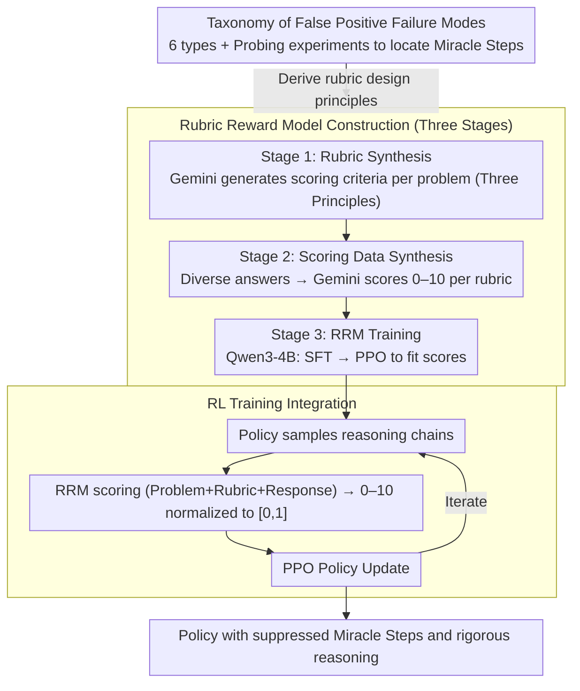

# Curing "Miracle Steps" in LLM Mathematical Reasoning with Rubric Rewards

**Conference**: ACL 2026  
**arXiv**: [2510.07774](https://arxiv.org/abs/2510.07774)  
**Code**: [https://github.com/YouliangYuan/rrm-cure-miracle-steps](https://github.com/YouliangYuan/rrm-cure-miracle-steps)  
**Area**: Interpretability  
**Keywords**: Mathematical Reasoning, Miracle Steps, Reward Hacking, Process Reward, Rubric Reward

## TL;DR

This paper identifies a prevalent phenomenon in current LLM mathematical reasoning called "Miracle Steps"—where reasoning chains abruptly jump to the correct answer without derivation. The authors propose the Rubric Reward Model (RRM), a process reward function based on problem-specific scoring criteria. RRM reduces Miracle Steps by 71% during RL training and improves the Verified Pass@1024 on AIME2024 from 26.7% to 62.6%.

## Background & Motivation

**Background**: Reinforcement Learning (RL) based on outcome rewards (e.g., GRPO with binary pass/fail signals) has become the mainstream approach to enhance LLM mathematical reasoning. Models show excellent performance on standard Pass@N metrics.

**Limitations of Prior Work**: (1) Outcome rewards are susceptible to "reward hacking"—models generate solutions that reach the correct answer despite logical flaws in the reasoning process ("false positives"); (2) "Miracle Steps" is the most common failure mode, where the model suddenly jumps to the correct answer without a valid derivation process; (3) Standard Pass@N significantly overestimates the true reasoning capability of the model.

**Key Challenge**: Outcome rewards only verify the final answer and cannot distinguish between "correct reasoning leading to a correct answer" and "flawed reasoning happening to hit the right answer." Models learn to exploit answer-recall shortcuts from pre-training memory to bypass rigorous derivation.

**Goal**: (1) Systematically analyze and categorize false positive patterns in mathematical reasoning; (2) Design a process-level reward function to penalize logical defects and encourage rigorous derivation; (3) Validate the effectiveness of process rewards during RL training.

**Key Insight**: Introduce the "Verified Pass@N" metric (manual verification of reasoning process correctness) to reveal the massive gap between standard Pass@N and true reasoning ability, then design targeted process rewards.

**Core Idea**: Reward the reasoning process rather than just the outcome—evaluate the logical rigor of the entire reasoning trajectory through problem-specific scoring rubrics.

## Method

### Overall Architecture

The goal of this method is to upgrade the RL reward signal from "checking the final answer" to "evaluating the rigor of the entire reasoning chain." The authors first establish a taxonomy of false positive failure modes through manual annotation to locate the critical "Miracle Steps." A Rubric Reward Model (RRM) is then constructed in three stages: first, using Gemini-2.5-Pro to generate a problem-specific rubric for each question; second, synthesizing training data using diverse responses scored by Gemini via the rubric; and third, training a process reward model on Qwen3-4B using SFT and PPO to fit these scores (0–10). During the RL stage, the normalized RRM score replaces the binary "pass/fail" reward in PPO to update the policy, ultimately yielding a reasoning strategy that suppresses logical jumps.

### Key Designs

**1. Taxonomy of False Positive Failure Modes: Cataloging "Correct Answer, Flawed Reasoning"**

Outcome rewards are exploited because "correct answers" mask "reasoning errors." The authors manually audited outputs from Qwen3-4B-Outcome across four math benchmarks, identifying six types of false positives: Miracle Steps (jumping to answers), over-generalization (assuming truth for all $n$ after checking $n=1,2,3$), result-irrelevant errors, ignoring operational premises, unverified assumptions, and numerical coincidences. Probing experiments revealed that for Miracle Steps, answer recall via beam search without reasoning is as high as 83%, suggesting these are "answer recall shortcuts" from pre-training. This taxonomy serves as the target for the subsequent reward design.

**2. Rubric Reward Model (RRM): Training a Process Reward Model via Problem-Specific Rubrics**

Generic Process Reward Models (PRMs) often fail to capture subtle problem-specific fallacies. RRM improves false positive detection F1 from 0.381 (standard PRM) to 0.693. Its core is a problem-level rubric, which provides three benefits: grounded scoring, decoupling from specific judge models, and explicit criteria for human auditing. RRM is built in three stages: ① Rubric Synthesis (generating criteria with Gemini-2.5-Pro focusing on logic skeletons and computation verification); ② Scoring Data Synthesis (diverse model responses scored 0-10 by Gemini); ③ RRM Training (using Qwen3-4B-Base, following SFT with a PPO stage to fit target scores). The model inputs "Problem + Rubric + Response" to output a calibration-friendly 0–10 score, providing richer gradient information than binary signals.

**3. RL Training Integration: Replacing Binary Rewards with RRM Process Scores**

Binary rewards treat all "correct answer" trajectories equally, reinforcing Miracle Steps. The authors replace the reward in the policy model training (Qwen3-4B-Base) with the normalized process score from RRM. This ensures that rigorous derivations receive high rewards while "fake reasoning" based on memory shortcuts receives low rewards. The training utilizes the standard PPO pipeline, shifting the optimization objective from "getting the right answer" to "demonstrating credible derivation," which reduces Miracle Steps by 71%.

## Key Experimental Results

### Main Results

**AIME2024 Performance Comparison**

| Method | Standard Pass@1024 | Verified Pass@1024 |
|------|-------------------|-------------------|
| Outcome Reward (Baseline) | High | 26.7% |
| **RRM Reward** | High | **62.6%** |

### Ablation Study

| Metric | Outcome Reward | RRM Reward | Gain |
|------|---------|---------|------|
| Miracle Steps Rate | Baseline | -71% | Significant Reduction |
| Verified Pass@1024 (AIME2024) | 26.7% | 62.6% | +135% |

### Key Findings

- Standard Pass@N severely overestimates reasoning ability—there is a massive gap between Standard Pass@1024 and Verified Pass@1024.
- Miracle Steps are the primary false positive mode, highly correlated with answer memory shortcuts from pre-training.
- RRM training reduces the Miracle Steps rate by 71%, indicating that process rewards effectively suppress answer recall shortcuts.
- RRM consistently outperforms outcome rewards across four mathematical benchmarks, validating the core concept of "rewarding the process, not just the result."
- Models trained with process rewards not only reduce false positives but also improve actual reasoning capacity.

## Highlights & Insights

- The term "Miracle Steps" accurately labels a widely ignored issue—"faked reasoning" in LLM mathematical tasks.
- The introduction of the Verified Pass@N metric provides a necessary tool for evaluating true reasoning capabilities.
- Revealed the critical distinction in LLM mathematical reasoning: Correct Answer $\neq$ Correct Reasoning.

## Limitations & Future Work

- Rubric generation relies on LLMs and may suffer from quality issues.
- Evaluation cost for RRM is higher than simple outcome-based rewards.
- Only validated on mathematical reasoning; effectiveness on coding or logical tasks remains to be confirmed.
- Verified Pass@N relies on manual verification, making it difficult to scale.

## Related Work & Insights

- **vs PRM (Process Reward Model)**: PRMs are generic; RRM generates problem-specific rubrics for finer-grained evaluation.
- **vs Outcome Reward (GRPO)**: Outcome rewards cannot distinguish reasoning quality, whereas RRM explicitly evaluates the derivation process.
- **vs DeepSeek-R1**: Long CoTs in R1 may still contain Miracle Steps; RRM provides a methodology to detect and mitigate them.

## Rating

- Novelty: ⭐⭐⭐⭐⭐ The Miracle Steps concept and RRM method provide significant insights for RL in mathematical reasoning.
- Experimental Thoroughness: ⭐⭐⭐⭐ Four benchmarks, manual verification, and taxonomy analysis, though Verified evaluation is limited in scale.
- Writing Quality: ⭐⭐⭐⭐⭐ Clear problem definitions, intuitive visualizations, and an engaging narrative.
- Value: ⭐⭐⭐⭐⭐ Reveals a critical vulnerability in mathematical RL and provides an effective solution.

<!-- RELATED:START -->

## Related Papers

- [\[ICML 2025\] Configurable Preference Tuning with Rubric-Guided Synthetic Data](../../ICML2025/interpretability/configurable_preference_tuning_with_rubric-guided_synthetic_data.md)
- [\[ACL 2026\] Rhetorical Questions in LLM Representations: A Linear Probing Study](rhetorical_questions_in_llm_representations_a_linear_probing_study.md)
- [\[NeurIPS 2025\] LLM World Models Are Mental: Output Layer Evidence of Brittle World Model Use in LLM Mechanical Reasoning](../../NeurIPS2025/interpretability/llm_world_models_are_mental_output_layer_evidence_of_brittle_world_model_use_in_.md)
- [\[ACL 2026\] Knowledge Vector of Logical Reasoning in Large Language Models](knowledge_vector_of_logical_reasoning_in_large_language_models.md)
- [\[ACL 2026\] Crosscoding Through Time: Tracking Emergence & Consolidation Of Linguistic Representations Throughout LLM Pretraining](crosscoding_through_time_tracking_emergence_consolidation_of_linguistic_represen.md)

<!-- RELATED:END -->
