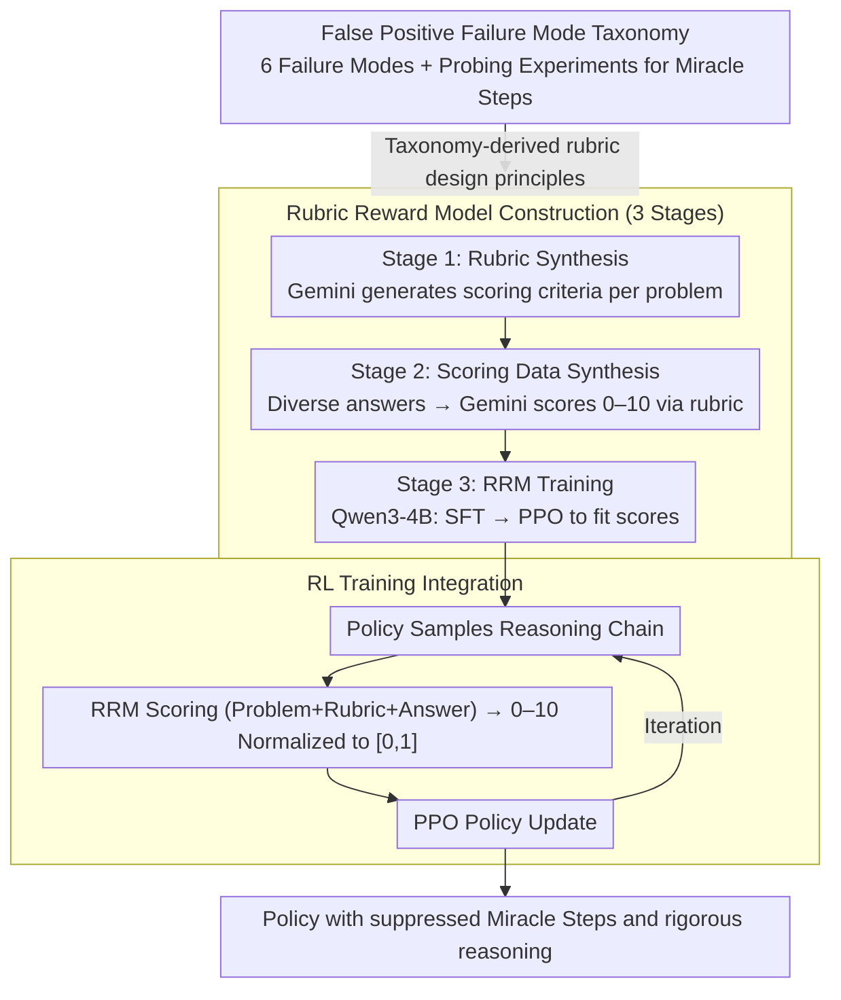

# Curing "Miracle Steps" in LLM Mathematical Reasoning with Rubric Rewards

**Conference**: ACL 2026  
**arXiv**: [2510.07774](https://arxiv.org/abs/2510.07774)  
**Code**: [https://github.com/YouliangYuan/rrm-cure-miracle-steps](https://github.com/YouliangYuan/rrm-cure-miracle-steps)  
**Area**: Interpretability  
**Keywords**: Mathematical Reasoning, Miracle Steps, Reward Hacking, Process Rewards, Rubric Rewards

## TL;DR

This paper identifies the widespread presence of "Miracle Steps"—phenomena where reasoning chains leap to the correct answer without derivation—in current LLM mathematical reasoning. It proposes the Rubric Reward Model (RRM), a process-based reward function using problem-specific scoring rubrics. During RL training, RRM significantly reduces Miracle Steps by 71% and improves the Verified Pass@1024 on AIME2024 from 26.7% to 62.6%.

## Background & Motivation

**Background**: RL training based on outcome rewards (e.g., GRPO with binary pass/fail signals) has become the mainstream approach to enhance LLM mathematical reasoning. Models show strong performance on standard Pass@N metrics.

**Limitations of Prior Work**: (1) Outcome rewards are susceptible to "reward hacking," where models generate solutions that reach the correct answer despite logic flaws ("false positives"); (2) "Miracle Steps" are the most common failure mode, characterized by sudden jumps to the answer without effective derivation; (3) Standard Pass@N significantly overestimates the true reasoning capability of models.

**Key Challenge**: Outcome rewards only verify the final answer and cannot distinguish between "correct reasoning yielding a correct answer" and "incorrect reasoning happening to yield a correct answer." Models learn to exploit memorized answers from pre-training to bypass rigorous reasoning—an "answer recall shortcut."

**Goal**: (1) Systematically analyze and categorize false positive patterns in mathematical reasoning; (2) Design a process-level reward function to penalize logic flaws and encourage rigorous derivation; (3) Validate the effectiveness of process rewards during RL training.

**Key Insight**: By introducing the "Verified Pass@N" metric (manual verification of reasoning process correctness), the authors reveal the massive gap between standard Pass@N and actual reasoning ability, then design targeted process rewards.

**Core Idea**: Reward the reasoning process rather than just the outcome—evaluating the logical rigor of the entire reasoning trajectory through problem-specific scoring rubrics.

## Method

### Overall Architecture

The goal of the framework is to upgrade the RL reward signal from "checking the final answer" to "checking the rigor of the reasoning chain." The authors first establish a taxonomy of false positive failure modes via manual annotation to locate critical Miracle Steps. The core is a Rubric Reward Model (RRM) constructed in three stages: first, using Gemini-2.5-Pro to generate a problem-specific rubric for each question; then, synthesizing training data using diverse responses scored by Gemini; and finally, training a process reward model on Qwen3-4B via SFT + PPO to score trajectories from 0–10. In the RL stage, the normalized RRM score replaces the original binary signal in PPO to update the policy, ultimately resulting in a strategy that suppresses logical leaps.

### Key Designs

**1. False Positive Failure Mode Taxonomy: Cataloging before curing**

Outcome rewards are exploited because a "correct answer" masks "incorrect reasoning." The authors manually audited outputs from Qwen3-4B-Outcome across four benchmarks, identifying six types of false positives: Miracle Steps (jumps to the answer without derivation), Inductive Overgeneralization (asserting universal truth from $n=1,2,3$), Irrelevant Errors (calculation errors that don't affect the final answer), Ignoring Operational Premising, Unverified Assumptions, and Numerical Coincidence. Probing experiments showed that for Miracle Steps, the answer recall rate was 83% even without reasoning, suggesting these steps are "answer recall shortcuts" likely from pre-training memory.

**2. Rubric Reward Model (RRM): Problem-specific process reward model**

Generic Process Reward Models (PRMs) often fail to capture subtle problem-specific fallacies. RRM improves the false positive detection F1 score from 0.381 (generic) to 0.693. It utilizes a per-problem rubric that makes scoring grounded, decoupled from specific judge models, and human-interpretable. RRM is built in three stages: ① Rubric Synthesis (generating criteria with specific checks for failure modes and a general proof skeleton); ② Scoring Data Synthesis (diverse model outputs scored by Gemini); ③ RRM Training (Qwen3-4B-Base backbone with SFT and PPO to fit scores). The RRM outputs a continuous, well-calibrated signal (0–10), providing richer gradient information than binary signals.

**3. RL Training Integration: Driving PPO with RRM process scores**

Standard binary outcome rewards treat all "correct answer" trajectories equally, reinforcing the root cause of Miracle Steps. The authors replaced the binary reward for the policy model (Qwen3-4B-Base) with the normalized process score from RRM. While keeping other hyperparameters identical to the baseline, the optimization target shifted from "getting the right answer" to "demonstrating a credible derivation."

## Key Experimental Results

### Main Results

**AIME2024 Performance Comparison**

| Method | Standard Pass@1024 | Verified Pass@1024 |
|------|-------------------|-------------------|
| Outcome Reward (Baseline) | High | 26.7% |
| **RRM (Ours)** | High | **62.6%** |

### Ablation Study

| Metric | Outcome Reward | RRM Reward | Gain |
|------|---------|---------|------|
| Miracle Steps Rate | Baseline | -71% | Significant Decrease |
| Verified Pass@1024 (AIME2024) | 26.7% | 62.6% | +135% |

### Key Findings

- Standard Pass@N severely overestimates reasoning ability—a huge gap exists between Standard and Verified metrics.
- Miracle Steps are the primary false positive mode, highly correlated with answer memorization shortcuts from pre-training.
- RRM training reduces Miracle Steps by 71%, demonstrating that process rewards effectively inhibit answer recall shortcuts.
- RRM consistently outperforms outcome rewards across four benchmarks, validating the core idea of "rewarding the process."
- Models trained with process rewards not only reduce false positives but also improve actual reasoning quality.

## Highlights & Insights

- The concept of "Miracle Steps" precisely names a widely ignored issue—"pretend reasoning" in LLMs.
- The introduction of Verified Pass@N provides a necessary tool for assessing authentic reasoning ability.
- It highlights the critical distinction: Correct Answer $\neq$ Correct Reasoning.

## Limitations & Future Work

- Rubric generation depends on LLMs and may have quality issues.
- Evaluation cost for RRM is higher than simple outcome verification.
- Validated only on mathematical reasoning; effectiveness in coding or logic tasks is yet to be confirmed.
- Verified Pass@N relies on manual verification, making it difficult to scale.

## Related Work & Insights

- **vs PRM (Process Reward Model)**: PRMs are generic; RRM generates problem-specific rubrics for finer-grained evaluation.
- **vs Outcome Reward (GRPO)**: Outcome rewards cannot distinguish reasoning quality; RRM explicitly evaluates the logical chain.
- **vs DeepSeek-R1**: While R1 uses long CoT, it may still contain Miracle Steps; RRM offers a method to detect and mitigate them.

## Rating

- Novelty: ⭐⭐⭐⭐⭐ The "Miracle Steps" concept and RRM method provide significant insights for RL in reasoning.
- Experimental Thoroughness: ⭐⭐⭐⭐ Extensive benchmarks and manual analysis, though "Verified" evaluation scale is limited.
- Writing Quality: ⭐⭐⭐⭐⭐ Clear problem definition and engaging narrative.
- Value: ⭐⭐⭐⭐⭐ Identifies a critical vulnerability in reasoning RL and provides an effective solution.

<!-- RELATED:START -->

## Related Papers

- [\[ICML 2025\] Configurable Preference Tuning with Rubric-Guided Synthetic Data](../../ICML2025/interpretability/configurable_preference_tuning_with_rubric-guided_synthetic_data.md)
- [\[ACL 2026\] Rhetorical Questions in LLM Representations: A Linear Probing Study](rhetorical_questions_in_llm_representations_a_linear_probing_study.md)
- [\[NeurIPS 2025\] LLM World Models Are Mental: Output Layer Evidence of Brittle World Model Use in LLM Mechanical Reasoning](../../NeurIPS2025/interpretability/llm_world_models_are_mental_output_layer_evidence_of_brittle_world_model_use_in_.md)
- [\[ACL 2026\] Knowledge Vector of Logical Reasoning in Large Language Models](knowledge_vector_of_logical_reasoning_in_large_language_models.md)
- [\[ACL 2026\] METER: Evaluating Multi-Level Contextual Causal Reasoning in Large Language Models](meter_evaluating_multi-level_contextual_causal_reasoning_in_large_language_model.md)

<!-- RELATED:END -->
