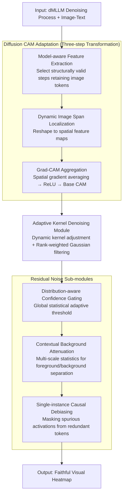

# Diffusion-CAM: Faithful Visual Explanations for dMLLMs

**Conference**: ACL 2026  
**arXiv**: [2604.11005](https://arxiv.org/abs/2604.11005)  
**Code**: [GitHub](https://github.com/ZzzzzZhhmm/Diffusion-CAM)  
**Area**: Image Restoration  
**Keywords**: Diffusion Multimodal Large Language Models, Class Activation Mapping, Visual Explanation, Explainable AI, Parallel Generation

## TL;DR
Diffusion-CAM is proposed as the first interpretability method specifically designed for diffusion-based Multimodal Large Language Models (dMLLMs). By extracting structurally valid intermediate representations from denoising trajectories and employing four post-processing modules (Adaptive Kernel Denoising, Distribution-aware Confidence Gating, Contextual Background Attenuation, and Single-instance Causal Debiasing), it significantly outperforms autoregressive CAM baselines on COCO Caption and GranDf.

## Background & Motivation

**Background**: Multimodal LLMs are undergoing a paradigm shift from autoregressive architectures (LLaVA, Qwen-VL) to diffusion-based architectures (LaViDa, LLaDA-V, MMaDA). Diffusion models generate entire sentences through parallel masked denoising, improving generation speed and global coherence.

**Limitations of Prior Work**: (1) Existing CAM methods (e.g., LLaVA-CAM, TAM) rely on the sequential, attention-rich nature of autoregressive models to track token generation—however, dMLLMs lack explicit token-level attention weights and a left-to-right causal structure. (2) Directly applying traditional CAM to dMLLMs results in diffuse, non-specific heatmaps. (3) The parallel denoising process of dMLLMs produces smooth, distributed activation patterns that are fundamentally different from the local, sequential dependencies of autoregressive models.

**Key Challenge**: The architectural advantages of dMLLMs (parallel generation, global planning) are precisely the obstacles for traditional interpretability tools, which assume sequential dependence while the former is parallel.

**Goal**: To design the first visual explanation method adapted for diffusion-based multimodal models.

**Key Insight**: Identify "structurally valid" intermediate steps in the denoising trajectory where image-conditioned spatial information is still preserved and can be linked to the final prediction via gradients.

**Core Idea**: Extract Gradient CAM from the structurally valid steps of the denoising process and utilize four diffusion-specific post-processing modules to address issues such as spatial noise, background diffusion, and redundant token correlation.

## Method

### Overall Architecture

Diffusion-CAM addresses the fundamental misalignment where "traditional CAM assumes sequential attention, while dMLLMs perform parallel denoising." It first places hooks in the intermediate transformer blocks of the dMLLM to identify "structurally valid steps" from the denoising trajectory that still retain complete image conditioning information. Image token features and gradients are extracted from these steps. The final response score is then backpropagated to the image regions, aggregating a base heatmap via the Grad-CAM approach. Finally, it chains four post-processing modules designed for diffusion noise characteristics to refine this diffuse, artifact-laden coarse map into a faithful visual explanation with accurate localization and clean backgrounds. The input is the dMLLM denoising process and the image-text pair; the intermediate stage is gradient attribution on valid steps; the output is a faithful visual heatmap.

### Key Designs

**1. Diffusion CAM Adaptation (Three-step Transformation): Making gradient attribution compatible with non-autoregressive denoising generation**

Since dMLLMs have neither a left-to-right causal structure nor explicit token-level attention weights, applying CAM directly fails. This is resolved using a universal feasibility criterion. The first step is model-aware feature extraction—selecting only those denoising steps in the hidden state sequences that still fully contain the image token span, ensuring attribution comes from intermediate states that have not yet lost image conditioning information. The second step is dynamic image span localization, parsing image token boundaries from info4cam metadata to reshape corresponding features into spatial feature maps. The third step is Grad-CAM aggregation, which performs spatial averaging of gradients to obtain channel weights, followed by a weighted sum and ReLU to produce the base CAM. This process does not assume fixed image token positions or specific denoising steps; instead, it adaptively selects steps based on the feasibility criterion, which is key to its transferability across different dMLLMs.

**2. Adaptive Kernel Denoising Module: Dynamically adjusting kernels based on denoising state to suppress high-frequency artifacts in self-attention**

Transformer self-attention leaves high-frequency architectural artifacts on the heatmap, and fixed-size filtering kernels cannot adapt to the varying noise characteristics across different denoising steps and image contents. This module uses a dynamically scaled filter kernel size $k_{\text{adaptive}}$, considering three factors: the number of denoising steps (larger kernels for more steps), spatial variance (larger kernels when noise is high), and resolution (to ensure scale invariance). Furthermore, it employs rank-weighted Gaussian filtering—assigning weights based on the magnitude of activation values rather than spatial distance—to smooth artifacts while preserving the structure of high-activation semantic regions.

**3. Distribution-aware Confidence Gating + Contextual Background Attenuation + Single-instance Causal Debiasing: Three sub-modules each clearing a specific type of residual noise**

The multi-step denoising of diffusion models accumulates various noise sources. This design uses three complementary sub-modules for final refinement. Distribution-aware Confidence Gating adaptively determines thresholds based on global statistics to differentiate between high and low-confidence regions, suppressing high-variance activation artifacts. Contextual Background Attenuation defines separation boundaries for foreground/background using multi-scale statistical integration (thresholds such as $\delta_\sigma$ and $\delta_\mu$) to eliminate diffuse residual signals in the background. Single-instance Causal Debiasing detects duplicate tokens and masks their abnormally high activations, removing redundant responses. All three are essential—ablation shows that if any module is absent, the heatmap degrades regarding a specific category of noise.

## Key Experimental Results

### Main Results (COCO Caption + GranDf)

| Method | Localization Accuracy | Background Suppression | Visual Fidelity |
|------|---------|---------|---------|
| LLaVA-CAM | Baseline | Weak | Weak |
| Grad-CAM (Direct) | Poor | Poor | Poor |
| **Diffusion-CAM** | **SOTA** | **SOTA** | **SOTA** |

### Ablation Study

| Module | Contribution |
|------|------|
| Adaptive Kernel Denoising | Suppresses high-frequency artifacts, improves heatmap smoothness |
| Confidence Gating | Distinguishes between semantic regions and noise |
| Background Attenuation | Eliminates diffuse background responses |
| Causal Debiasing | Eliminates redundant activations caused by duplicate tokens |
| **All Four Combined** | **Optimal; modules are complementary** |

### Key Findings
- **Directly applying autoregressive CAM to dMLLMs fails completely**, producing diffuse and uninterpretable heatmaps.
- **The four post-processing modules each solve a specific problem and are indispensable.**
- **Selection of denoising steps is critical**: meaningful visual attribution can only be extracted from structurally valid steps.
- **Diffusion-CAM significantly outperforms all baselines** in localization accuracy and visual fidelity.

## Highlights & Insights
- **First to reveal the fundamental interpretability challenges of dMLLMs**: the conflict between parallel generation and sequential dependence. This issue will grow in importance as diffusion architectures gain popularity.
- **The concept of "structurally valid steps"** provides a general principle—in non-autoregressive models, attribution should be extracted from intermediate states that preserve the spatial information of the input conditioning.
- **The four-module design**, while seemingly engineering-oriented, is grounded in clear theoretical motivations regarding noise analysis.

## Limitations & Future Work
- Currently only validated on the LaViDa series; compatibility with other dMLLMs (e.g., LLaDA-V, MMaDA) remains to be confirmed.
- Hyperparameters for the four modules (e.g., $\delta_\sigma$, $\delta_\mu$) may require adjustment depending on the model.
- The gradient backpropagation path may not be unique in parallel denoising, requiring deeper analysis of attribution's causal validity.
- Computational overhead is higher than autoregressive CAM due to the need to store intermediate denoising states.
- Attribution at the text-token level has not yet been explored (currently focused on visual region attribution).

## Related Work & Insights
- **vs. LLaVA-CAM**: Designed for autoregressive models, it performs poorly on dMLLMs. Diffusion-CAM is a necessary alternative.
- **vs. DAAM (Tang et al.)**: DAAM performs attribution for text-to-image diffusion models, but its goals and methods differ from multimodal reasoning.
- **vs. Attention Visualization**: dMLLMs lack explicit autoregressive attention weights, making standard attention methods inapplicable.

## Rating
- Novelty: ⭐⭐⭐⭐ First dMLLM interpretability method, though core concepts (Grad-CAM + post-processing) are established.
- Experimental Thoroughness: ⭐⭐⭐⭐ Two benchmarks plus ablation and comparison, though the dMLLM ecosystem is still small.
- Writing Quality: ⭐⭐⭐⭐ Clear motivation and well-organized four-module design.
- Value: ⭐⭐⭐⭐ Importance of this work will grow as dMLLMs become more prevalent.

<!-- RELATED:START -->

## Related Papers

- [\[ICLR 2026\] Patronus: Interpretable Diffusion Models with Prototypes](../../ICLR2026/interpretability/patronus_interpretable_diffusion_models_with_prototypes.md)
- [\[ICLR 2026\] Learning for Highly Faithful Explainability](../../ICLR2026/interpretability/learning_for_highly_faithful_explainability.md)
- [\[ACL 2026\] Evian: Towards Explainable Visual Instruction-tuning Data Auditing](evian_towards_explainable_visual_instruction-tuning_data_auditing.md)
- [\[ICLR 2026\] Toward Faithful Retrieval-Augmented Generation with Sparse Autoencoders](../../ICLR2026/interpretability/toward_faithful_retrieval-augmented_generation_with_sparse_autoencoders.md)
- [\[CVPR 2026\] Making the Classification Explanation Faithful to the Confidence Score](../../CVPR2026/interpretability/making_the_classification_explanation_faithful_to_the_confidence_score.md)

<!-- RELATED:END -->
