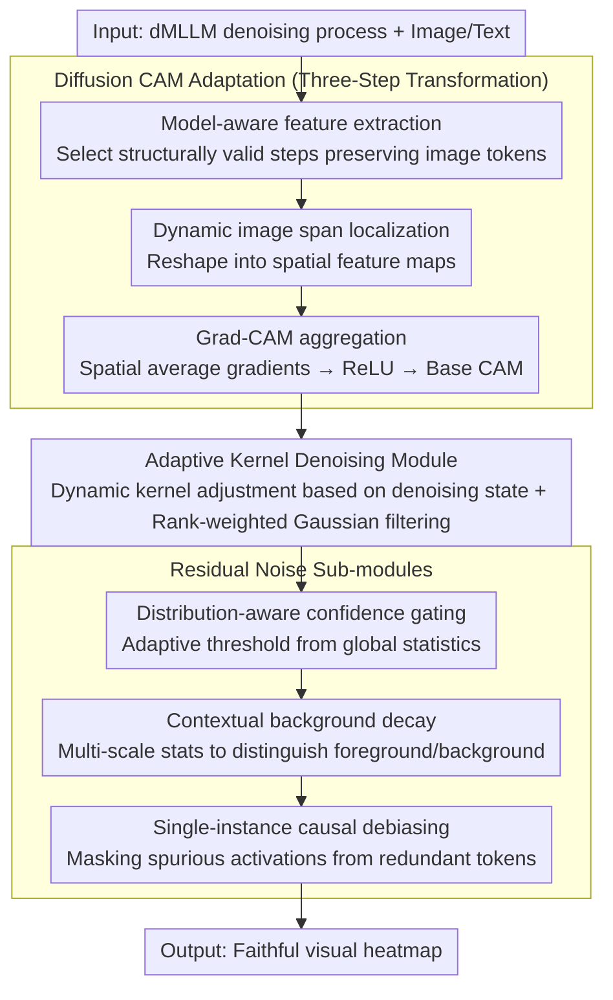

# Diffusion-CAM: Faithful Visual Explanations for dMLLMs

**Conference**: ACL 2026  
**arXiv**: [2604.11005](https://arxiv.org/abs/2604.11005)  
**Code**: [GitHub](https://github.com/ZzzzzZhhmm/Diffusion-CAM)  
**Area**: Image Restoration  
**Keywords**: Diffusion Multimodal Models, Class Activation Mapping, Visual Explanation, Explainable AI, Parallel Generation

## TL;DR
Diffusion-CAM is proposed as the first explainability method specifically designed for Diffusion-based Multimodal Large Language Models (dMLLMs). By extracting structurally valid intermediate representations from the denoising trajectory and employing four post-processing modules (Adaptive Kernel Denoising, Distribution-Aware Confidence Gating, Contextual Background Decay, and Single-Instance Causal Debiasing), it significantly outperforms autoregressive CAM baselines on COCO Caption and GranDf.

## Background & Motivation

**Background**: Multimodal LLMs are undergoing a paradigm shift from autoregressive architectures (LLaVA, Qwen-VL) to diffusion-based architectures (LaViDa, LLaDA-V, MMaDA). Diffusion models generate entire sentences through parallel mask denoising, enhancing generation speed and global coherence.

**Limitations of Prior Work**: (1) Existing CAM methods (e.g., LLaVA-CAM, TAM) rely on the sequential, attention-rich nature of autoregressive models to track token generation—whereas dMLLMs lack explicit token-level attention weights and a left-to-right causal structure. (2) Directly applying traditional CAM to dMLLMs produces diffused, non-specific heatmaps. (3) The parallel denoising process of dMLLMs generates smooth, distributed activation patterns, which differ fundamentally from the localized, sequential dependencies of autoregressive models.

**Key Challenge**: The architectural advantages of dMLLMs (parallel generation, global planning) are precisely the obstacles for traditional explainability tools, which assume sequential dependency while the former is parallel.

**Goal**: Design the first visual explanation method adapted for diffusion-based multimodal models.

**Key Insight**: Identify "structurally valid" intermediate steps in the denoising trajectory—where image-conditioned spatial information is still preserved and can be linked to the final prediction via gradients.

**Core Idea**: Extract Gradient CAM from structurally valid steps of the denoising process and employ four diffusion-specific post-processing modules to address issues such as spatial noise, background diffusion, and redundant token correlation.

## Method

### Overall Architecture

Diffusion-CAM addresses the fundamental misalignment where "traditional CAM assumes sequential attention, while dMLLMs perform parallel denoising." It first hooks into the intermediate transformer blocks of the dMLLM to identify "structurally valid steps" from the denoising trajectory that still retain complete image conditioning information. Image token features and gradients are extracted at these steps. Subsequently, the final response score is backpropagated to image regions to aggregate a base heatmap via Grad-CAM. Finally, four post-processing modules designed for diffusion noise characteristics are concatenated to refine this diffused, artifact-laden coarse map into a faithful visual explanation with accurate localization and a clean background. The input is the dMLLM denoising process and image-text pairs; the intermediate stage is gradient attribution on valid steps; the output is a faithful visual heatmap.

### Key Designs

**1. Diffusion CAM Adaptation (Three-Step Transformation): Making gradient attribution compatible with non-autoregressive denoising generation**

Since dMLLMs lack a left-to-right causal structure and explicit token-level attention weights, applying CAM directly fails. This is adapted using a universal feasibility criterion. The first step is model-aware feature extraction—selecting only those denoising steps where the hooked hidden state sequences still fully contain the image token span, ensuring attribution comes from intermediate states that haven't lost image conditioning. The second step is dynamic image span localization, parsing image token boundaries from info4cam metadata to reshape features into spatial maps. The third step is Grad-CAM aggregation, spatially averaging gradients to obtain channel weights, which are then used for weighted summation followed by ReLU to get the base CAM. This process adaptively selects steps rather than pre-setting fixed token positions, which is key to its transferability across different dMLLMs.

**2. Adaptive Kernel Denoising Module: Dynamic kernel adjustment to suppress high-frequency artifacts from self-attention**

Transformer self-attention leaves high-frequency architectural artifacts on heatmaps, and fixed-size filters cannot adapt to varying noise features across different denoising steps and image contents. This module uses a dynamically scaled filter size $k_{\text{adaptive}}$, considering three factors: the number of denoising steps (larger kernels for more steps), spatial variance (larger kernels when noise is high), and resolution (to ensure scale invariance). Furthermore, it employs rank-weighted Gaussian filtering—assigning weights based on activation magnitude rankings rather than spatial distance—to preserve the structure of high-activation semantic regions while smoothing artifacts.

**3. Distribution-Aware Confidence Gating + Contextual Background Decay + Single-Instance Causal Debiasing: Three sub-modules addressing specific residual noise**

The multi-step denoising of diffusion models accumulates various noise sources. This design uses three complementary sub-modules. Distribution-Aware Confidence Gating adaptively determines thresholds based on global statistics to differentiate high/low confidence regions, suppressing high-variance artifacts. Contextual Background Decay uses multi-scale statistical integration (with thresholds like $\delta_\sigma, \delta_\mu$) to define foreground/background boundaries, eliminating diffused residual signals in the background. Single-Instance Causal Debiasing detects duplicate tokens and masks their abnormally high activations, removing spurious responses from redundant tokens. All three are essential; ablation shows that without any one module, the heatmap degrades under a specific type of noise.

## Key Experimental Results

### Main Results (COCO Caption + GranDf)

| Method | Localization Accuracy | Background Suppression | Visual Fidelity |
|------|---------|---------|---------|
| LLaVA-CAM | Baseline | Weak | Weak |
| Grad-CAM (Direct) | Poor | Poor | Poor |
| **Diffusion-CAM** | **SOTA** | **SOTA** | **SOTA** |

### Ablation Study

| Module | Contribution |
|------|------|
| Adaptive Kernel Denoising | Suppresses high-freq artifacts, improves smoothness |
| Confidence Gating | Distinguishes semantic regions from noise |
| Background Decay | Eliminates diffused background responses |
| Causal Debiasing | Removes redundant activations from duplicate tokens |
| **Four-module Joint** | **Optimal, modules are complementary** |

### Key Findings
- **Direct application of autoregressive CAM to dMLLMs fails completely**, producing diffused and uninterpretable heatmaps.
- **The four post-processing modules each solve a specific problem and are indispensable.**
- **The choice of denoising steps is critical**: meaningful visual attribution can only be extracted from structurally valid steps.
- **Diffusion-CAM significantly outperforms all baselines** in localization accuracy and visual fidelity.

## Highlights & Insights
- **First to reveal the fundamental challenge of dMLLM explainability**: the conflict between parallel generation and sequential dependency. This issue grows in importance as diffusion architectures gain popularity.
- **The concept of "structurally valid steps"** provides a general principle—attribution in non-autoregressive models should be extracted from intermediate states that preserve input-conditioned spatial information.
- **The four-module design**, while appearing engineering-oriented, is grounded in clear theoretical motivations (noise analysis).

## Limitations & Future Work
- Currently validated only on the LaViDa series; compatibility with other dMLLMs (e.g., LLaDA-V, MMaDA) remains to be confirmed.
- Hyperparameters for the four modules (e.g., $\delta_\sigma, \delta_\mu$) may require per-model adjustment.
- Gradient backpropagation paths may not be unique in parallel denoising; the causal validity of attribution requires deeper analysis.
- Computational overhead is higher than autoregressive CAM due to the need to store intermediate denoising states.
- Text token-level attribution has not yet been explored (currently limited to visual regions).

## Related Work & Insights
- **vs. LLaVA-CAM**: Designed for autoregressive models, it performs poorly on dMLLMs. Diffusion-CAM is a necessary alternative.
- **vs. DAAM (Tang et al.)**: DAAM performs attribution for text-to-image diffusion models, but the target and method differ from multimodal reasoning.
- **vs. Attention Visualization**: dMLLMs lack explicit autoregressive attention weights, making standard attention methods inapplicable.

## Rating
- Novelty: ⭐⭐⭐⭐ First dMLLM explainability method, though the core concept (Gradient CAM + post-processing) is an extension of existing ideas.
- Experimental Thoroughness: ⭐⭐⭐⭐ Two benchmarks plus ablation and comparison, though the dMLLM ecosystem is still small.
- Writing Quality: ⭐⭐⭐⭐ Clear motivation and well-organized four-module design.
- Value: ⭐⭐⭐⭐ Importance of this work will grow as dMLLMs become more prevalent.

<!-- RELATED:START -->

## Related Papers

- [\[ACL 2026\] Evian: Towards Explainable Visual Instruction-tuning Data Auditing](evian_towards_explainable_visual_instruction-tuning_data_auditing.md)
- [\[CVPR 2026\] Towards Faithful Multimodal Concept Bottleneck Models](../../CVPR2026/interpretability/towards_faithful_multimodal_concept_bottleneck_models.md)
- [\[ICLR 2026\] Toward Faithful Retrieval-Augmented Generation with Sparse Autoencoders](../../ICLR2026/interpretability/toward_faithful_retrieval-augmented_generation_with_sparse_autoencoders.md)
- [\[AAAI 2026\] Using Certifying Constraint Solvers for Generating Step-wise Explanations](../../AAAI2026/interpretability/using_certifying_constraint_solvers_for_generating_step-wise_explanations.md)
- [\[CVPR 2026\] Making the Classification Explanation Faithful to the Confidence Score](../../CVPR2026/interpretability/making_the_classification_explanation_faithful_to_the_confidence_score.md)

<!-- RELATED:END -->
