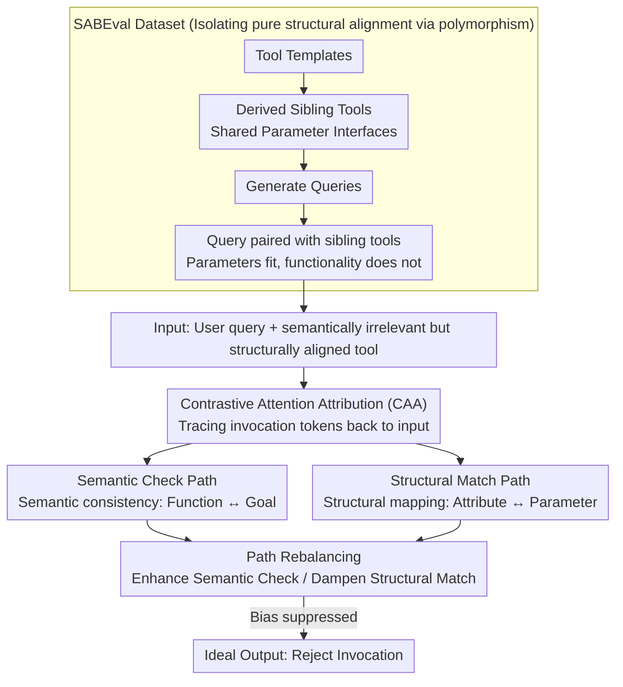

# Do LLMs Know Tool Irrelevance? Demystifying Structural Alignment Bias in Tool Invocations

**Conference**: ACL 2026  
**arXiv**: [2604.11322](https://arxiv.org/abs/2604.11322)  
**Code**: [GitHub](https://github.com/along-l/irrelevant-tool)  
**Area**: Interpretability  
**Keywords**: Tool invocation, Structural alignment bias, Irrelevant tool rejection, Interpretability, Attention attribution

## TL;DR
This paper discovers and formalizes "Structural Alignment Bias" (SAB) in LLM tool invocation—where LLMs tend to invoke a tool whenever query attributes can be effectively mapped to tool parameters, even if the tool's functionality is irrelevant to the user's goal. The authors construct the SABEval dataset to decouple structural alignment from semantic relevance, reveal the internal competition between semantic check and structural match paths using Contrastive Attention Attribution (CAA), and propose a rebalancing strategy that achieves an 80% relative error reduction.

## Background & Motivation

**Background**: The ability of LLMs to use external tools has become a critical capability. However, in practical scenarios, models frequently encounter tools irrelevant to user queries—where the correct behavior is to reject the invocation.

**Limitations of Prior Work**: (1) LLMs exhibit an overlooked systematic flaw: even when tool functionality does not match the user's goal (semantically irrelevant), the model tends to invoke the tool as long as query attributes can be effectively filled into tool parameters (structurally aligned); (2) Existing evaluations construct irrelevant scenarios by randomly pairing queries and tools, but such constructions typically introduce structural misalignment, confounding results—the model might reject simply because parameters cannot be filled, rather than truly understanding semantic irrelevance.

**Key Challenge**: Do LLMs truly understand that "semantic relevance" is a necessary condition for tool invocation, or do they merely rely on "structural alignment" as a shortcut for decision-making?

**Goal**: (1) Identify and formalize Structural Alignment Bias; (2) Construct a dataset to decouple these two factors; (3) Reveal the underlying internal mechanisms; (4) Propose mitigation methods.

**Key Insight**: Borrowing the polymorphism principle from object-oriented programming—where different services can share a unified interface (i.e., structurally aligned but semantically distinct)—to construct evaluation data for realistic scenarios.

**Core Idea**: Structural Alignment Bias is a systematic shortcut where LLMs treat "parameters can be filled" as "the tool should be called." By revealing two competing internal information flows (semantic check vs. structural match), the authors propose path rebalancing to mitigate this bias.

## Method

### Overall Architecture
The paper decomposes the problem of whether an LLM should invoke an irrelevant tool into controllable research objects: first, the SABEval dataset creates pure structural alignment scenarios where "parameters fit, but functionality is useless" to quantify model susceptibility; second, CAA decomposes the internal information flow during decision-making into competing "semantic check" and "structural match" paths; finally, rebalancing is performed on these two paths to suppress bias. The input is a user query and a semantically irrelevant but structurally aligned tool; the ideal output is a rejection of the invocation.

### Key Designs

**1. SABEval Dataset: Isolating pure structural alignment via polymorphism.** Existing evaluations use random pairing to create "irrelevant tools," but random pairings often fail even at the parameter level. Thus, model rejection could stem from "understanding semantic irrelevance" or simply "parameter misalignment." SABEval borrows the concept of polymorphism from software engineering—where different services share the same interface—to create structurally aligned but semantically distinct sibling tools. Sibling tools are derived from a tool template and share the same parameter interface (e.g., "Nintendo Game Search" and "PlayStation Game Search" both accept `$game_title$ + $region$`). Queries generated for one tool are then paired with its sibling tools. This ensures that parameters can be filled but the functionality is irrelevant, making any invocation an error. The dataset contains 101 tool templates, 5 queries per tool, and 10 sibling combinations, totaling 5,050 samples where no valid tool is available.

**2. Contrastive Attention Attribution (CAA): Decomposing information flow into competing paths.** To explain why models are misled, counterfactual attribution is typically used. However, traditional counterfactual analysis requires token-level correspondence between compared inputs, which is impossible in tool invocation due to varying lengths of tool descriptions and queries. CAA bypasses this by directly tracing attention attribution from tool invocation tokens back to input tokens, identifying two competing paths: the **Semantic Check Path**, which focuses on the semantic consistency between tool descriptions and query goals, and the **Structural Match Path**, which focuses on the structural mapping between query attributes and tool parameters. Whether a tool is invoked depends on the relative strength of these two paths; SAB occurs when the structural match path overpowers the semantic check path.

**3. Path Rebalancing: Precise intervention on the competition mechanism.** Since the bias stems from an imbalance between the two paths, mitigation does not require retraining the entire model. Instead, interventions are applied to the mechanisms identified by CAA: enhancing the relative strength of the semantic check path or dampening the influence of the structural match path. This inference-time intervention achieves approximately an 80% relative reduction in errors and, because it only affects competing paths without altering model weights, essentially preserves normal tool-use capabilities.

## Key Experimental Results

### Main Results (5 Tool-Augmented LLMs)

| Model | Random Pairing TIR↓ | SABEval TIR↓ | Δ |
|------|-------------|-------------|-----|
| Qwen3-4B | 0.16% | 40.04% | +39.88 |
| Qwen3-8B | 0.04% | 34.26% | +34.22 |
| Qwen3-14B | ~0.1% | ~35% | ~+35 |
| ToolACE-2.5-8B | ~0.1% | ~42% | ~+42 |
| Watt-Tool-8B | ~0.2% | ~45% | ~+45 |

### Alignment Degree Experiment

| Structural Alignment Degree | Error Invocation Rate |
|------------|---------|
| No Alignment (Random Pairing) | <0.2% |
| Basic Alignment (SABEval D0) | 41.9% |
| Stronger Alignment (+4 Parameters) | **90.4%** |

### Key Findings
- **Structural Alignment Bias is severe**: Error rates are <0.2% without alignment but spike to 41.9% with structural alignment and reach 90.4% with stronger alignment.
- **All 5 mainstream tool-augmented LLMs are affected**, indicating a systematic issue.
- **Counterfactual analysis confirms causality**: There is a strong causal link between structural alignment and erroneous invocation.
- **CAA successfully identifies two competing paths**: The semantic check path and the structural match path.
- **Path rebalancing achieves 80% relative error reduction** without compromising normal tool usage.

## Highlights & Insights
- The **discovery and formalization of "Structural Alignment Bias"** is the primary contribution—revealing a widespread but overlooked safety risk with direct implications for deploying tool-augmented LLMs.
- The **SABEval construction methodology** (based on the OOP polymorphism principle) is ingenious—borrowing from software engineering to design realistic evaluation data.
- The **complete chain from behavioral analysis to internal mechanism to mitigation** demonstrates an interpretability-driven paradigm for safety improvement.

## Limitations & Future Work
- SABEval construction relies on GPT-4o for generating additional parameters, which may introduce bias.
- The effectiveness of path rebalancing may vary across different model architectures.
- Verified only on 5 models; the performance of larger-scale models (70B+) remains unknown.
- Multi-tool selection scenarios were not considered (the focus was on single-tool judgment).
- The root of the bias likely lies in pre-training data, where most tool invocation examples are positive instances.

## Related Work & Insights
- **vs. Patil et al. (2025) / Existing Benchmarks**: Existing benchmarks confound structural alignment with semantic relevance; this work is the first to decouple them.
- **vs. Tool Selection Research**: Tool selection focuses on "which tool to choose," while this work focuses on "whether any tool should be invoked."
- **vs. Attention Attribution Methods**: Traditional methods require token-level correspondence between counterfactual pairs; CAA relaxes this constraint.

## Rating
- Novelty: ⭐⭐⭐⭐⭐ Problem identification + formalization + dataset + mechanism analysis + mitigation; full-chain innovation.
- Experimental Thoroughness: ⭐⭐⭐⭐⭐ 5 models + causal analysis + degree experiments + rebalancing validation.
- Writing Quality: ⭐⭐⭐⭐⭐ Clear problem definition and rigorous experimental design.
- Value: ⭐⭐⭐⭐⭐ Direct guiding significance for the secure deployment of tool-augmented LLMs.

<!-- RELATED:START -->

## Related Papers

- [\[ACL 2026\] Aligning What LLMs Do and Say: Towards Self-Consistent Explanations](aligning_what_llms_do_and_say_towards_self-consistent_explanations.md)
- [\[ACL 2026\] Do LLMs Capture Embodied Cognition and Cultural Variation? Cross-Linguistic Evidence from Demonstratives](do_llms_capture_embodied_cognition_and_cultural_variation_cross-linguistic_evide.md)
- [\[ACL 2026\] Dual Alignment Between Language Model Layers and Human Sentence Processing](dual_alignment_between_language_model_layers_and_human_sentence_processing.md)
- [\[NeurIPS 2025\] Distributional Autoencoders Know the Score](../../NeurIPS2025/interpretability/distributional_autoencoders_know_the_score.md)
- [\[AAAI 2026\] Hypothesis Generation via LLM-Automated Language Bias for ILP](../../AAAI2026/interpretability/hypothesis_generation_via_llm-automated_language_bias_for_ilp.md)

<!-- RELATED:END -->
