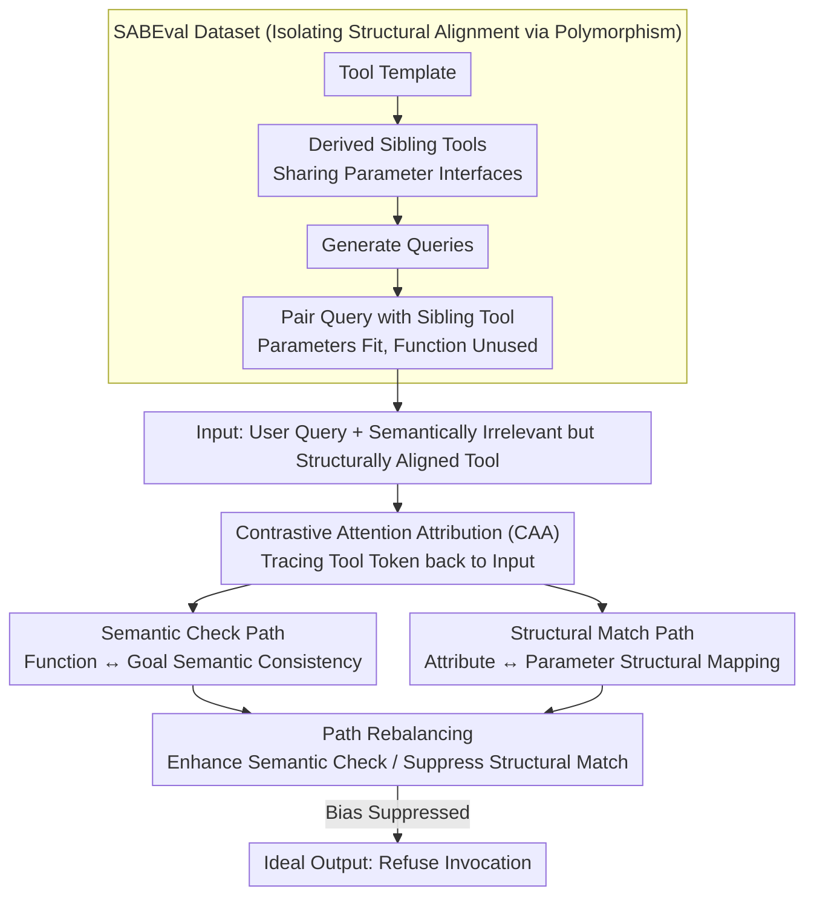

# Do LLMs Know Tool Irrelevance? Demystifying Structural Alignment Bias in Tool Invocations

**Conference**: ACL 2026  
**arXiv**: [2604.11322](https://arxiv.org/abs/2604.11322)  
**Code**: [GitHub](https://github.com/along-l/irrelevant-tool)  
**Area**: Interpretability  
**Keywords**: Tool invocation, Structural Alignment Bias, Irrelevant tool rejection, Interpretability, Attention attribution

## TL;DR
This paper identifies and formalizes "Structural Alignment Bias" in LLM tool invocation—a phenomenon where LLMs tend to call a tool when query attributes can be effectively mapped to tool parameters, even if the tool's function is irrelevant to the user's goal. The authors construct the SABEval dataset to decouple structural alignment from semantic relevance. Using Contrastive Attention Attribution, they reveal the existence of two competing internal paths: semantic check and structural matching. A proposed rebalancing strategy achieves an 80% relative error reduction.

## Background & Motivation

**Background**: The ability of LLMs to utilize external tools has become a critical capability. However, in real-world scenarios, models frequently encounter tools that are irrelevant to the user query—in which case the correct behavior is to refuse invocation.

**Limitations of Prior Work**: (1) LLMs possess an overlooked systematic flaw: even when tool functions do not match user goals (semantic irrelevance), models tend to call the tool as long as query attributes can be filled into the tool parameters (structural alignment); (2) Existing evaluations construct irrelevant scenarios by randomly pairing queries and tools, but such constructions typically introduce structural misalignment, confounding the evaluation results—models might refuse simply because parameters cannot be filled, rather than truly understanding semantic irrelevance.

**Key Challenge**: Do LLMs truly understand that "semantic relevance" is a necessary condition for tool invocation, or do they merely rely on "structural alignment" as a shortcut for decision-making?

**Goal**: (1) Identify and formalize Structural Alignment Bias; (2) Build a dataset to decouple these two factors; (3) Reveal internal mechanisms; (4) Propose mitigation methods.

**Key Insight**: Borrowing the polymorphism principle from object-oriented programming—where different services can share a unified interface (i.e., structurally aligned but semantically distinct)—to construct evaluation data for realistic scenarios.

**Core Idea**: Structural Alignment Bias occurs when LLMs treat "parameters can be filled" as a systematic shortcut for "the tool should be called." By revealing two competing internal information flows (semantic check vs. structural match), the authors propose path rebalancing to mitigate this bias.

## Method

### Overall Architecture
The paper decomposes the problem of whether an LLM should call an irrelevant tool into controllable research objects. First, the SABEval dataset creates "pure structural alignment" scenarios where parameters fit but functionality is useless, quantifying how easily models are misled. Second, Contrastive Attention Attribution (CAA) decomposes internal information flows during decision-making into competing "semantic check" and "structural match" paths. Finally, rebalancing is performed on these two paths to suppress bias. The input is a user query and a semantically irrelevant but structurally aligned tool; the ideal output is a refusal to call.

### Key Designs

**1. SABEval Dataset: Isolating structural alignment via polymorphism.** Existing evaluations use random pairing to create "irrelevant tools," but random pairs often fail even at the parameter level. Thus, a model's refusal could stem from "understanding semantic irrelevance" or simply "parameter mismatch." SABEval draws on the polymorphism concept in OOP—different services sharing the same interface—to create sibling tools that are structurally aligned but semantically distinct. Sibling tools sharing the same parameter interface (e.g., "Nintendo Game Query" and "PlayStation Game Query" both taking `game_title` + `region`) are derived from a template. Queries are generated for each tool and then paired with their siblings. Every sample ensures parameters can be filled but the function is irrelevant; any invocation is an error. The dataset contains 101 tool templates, 5 queries per tool, and 10 sibling combinations, totaling 5050 samples.

**2. Contrastive Attention Attribution (CAA): Decomposing decision flows into competing paths.** To explain why models are misled, counterfactual attribution is naturally considered. However, traditional counterfactual analysis requires strictly corresponding tokens between contrasted inputs, which is impossible in tool invocation due to differing lengths of tool descriptions and queries. CAA bypasses this by directly tracing the attention attribution from tool invocation tokens back to input tokens. It identifies two competing paths: the **Semantic Check Path**, which focuses on the semantic consistency between tool descriptions and query goals, and the **Structural Match Path**, which focuses on the structural mapping between query attributes and tool parameters. The final decision depends on the tug-of-war between these paths; Structural Alignment Bias is essentially the structural match path overpowering the semantic check path.

**3. Path Rebalancing: Precise intervention on the competitive mechanism.** Since the bias stems from an imbalance between the two paths, mitigation does not require retraining the entire model. Instead, "surgery" is performed on the mechanisms identified by CAA: enhancing the relative strength of the semantic check path or suppressing the influence of the structural match path to make "semantic irrelevance" the dominant signal. This inference-time intervention achieves approximately 80% relative error reduction and, because it only affects competing paths rather than model weights, basic tool-using capabilities remain largely intact.

## Key Experimental Results

### Main Results (5 Tool-Augmented LLMs)

| Model | Random Pairing TIR↓ | SABEval TIR↓ | Δ |
|-------|---------------------|--------------|---|
| Qwen3-4B | 0.16% | 40.04% | +39.88 |
| Qwen3-8B | 0.04% | 34.26% | +34.22 |
| Qwen3-14B | ~0.1% | ~35% | ~+35 |
| ToolACE-2.5-8B | ~0.1% | ~42% | ~+42 |
| Watt-Tool-8B | ~0.2% | ~45% | ~+45 |

### Structural Alignment Degree Experiment

| Degree of Structural Alignment | Error Invocation Rate |
|--------------------------------|-----------------------|
| No Alignment (Random Pairing)  | <0.2%                 |
| Basic Alignment (SABEval D0)   | 41.9%                 |
| Stronger Alignment (+4 Params) | **90.4%**             |

### Key Findings
- **Structural Alignment Bias is severe**: Error rates are <0.2% without alignment but soar to 41.9% with structural alignment and reach 90.4% with stronger alignment.
- **All 5 mainstream tool-augmented LLMs are affected**, indicating a systematic issue.
- **Counterfactual analysis confirms causality**: There is a strong causal link between structural alignment and erroneous invocation.
- **CAA successfully identifies two competing paths**: The semantic check path and the structural match path.
- **Path rebalancing achieves 80% relative error reduction** without harming normal tool usage capabilities.

## Highlights & Insights
- **The discovery and formalization of "Structural Alignment Bias"** is the primary contribution—revealing a widespread but neglected safety risk with direct implications for deploying tool-augmented LLMs.
- **The SABEval construction methodology** (based on OOP polymorphism) is ingenious—borrowing from software engineering to design realistic evaluation data.
- **The complete chain from behavioral analysis to internal mechanism to mitigation** demonstrates a paradigm for interpretability-driven safety improvements.

## Limitations & Future Work
- SABEval construction relies on GPT-4o to generate additional parameters, which might introduce bias.
- The effectiveness of path rebalancing may vary across different model architectures.
- Verified on only 5 models; the performance of larger-scale models (70B+) remains unknown.
- Multi-tool selection scenarios were not considered (current focus is single-tool judgment).
- The root of the bias likely lies in pre-training data—where the vast majority of tool invocation examples are positive instances.

## Related Work & Insights
- **vs. Patil et al. (2025) / Existing Benchmarks**: Existing benchmarks confound structural alignment and semantic relevance; this paper decouples them for the first time.
- **vs. Tool Selection Research**: Tool selection focuses on "which tool to choose," whereas this paper focuses on "whether any tool should be called at all."
- **vs. Attention Attribution Methods**: Traditional methods require token-level correspondence between counterfactual pairs; CAA relaxes this constraint.

## Rating
- Novelty: ⭐⭐⭐⭐⭐ Problem identification + formalization + dataset + mechanism analysis + mitigation; innovation across the full chain.
- Experimental Thoroughness: ⭐⭐⭐⭐⭐ 5 models + causal analysis + degree experiments + rebalancing validation.
- Writing Quality: ⭐⭐⭐⭐⭐ Clear problem definition, rigorous experimental design.
- Value: ⭐⭐⭐⭐⭐ Direct guidance for the secure deployment of tool-augmented LLMs.

<!-- RELATED:START -->

## Related Papers

- [\[ICLR 2026\] What Do Large Language Models Know About Opinions?](../../ICLR2026/interpretability/what_do_large_language_models_know_about_opinions.md)
- [\[ACL 2026\] Do LLMs Capture Embodied Cognition and Cultural Variation? Cross-Linguistic Evidence from Demonstratives](do_llms_capture_embodied_cognition_and_cultural_variation_cross-linguistic_evide.md)
- [\[ACL 2026\] Aligning What LLMs Do and Say: Towards Self-Consistent Explanations](aligning_what_llms_do_and_say_towards_self-consistent_explanations.md)
- [\[ICLR 2026\] LLMs are Single-threaded Reasoners: Demystifying the Working Mechanism of Soft Thinking](../../ICLR2026/interpretability/llms_are_single-threaded_reasoners_demystifying_the_working_mechanism_of_soft_th.md)
- [\[ACL 2026\] Dual Alignment Between Language Model Layers and Human Sentence Processing](dual_alignment_between_language_model_layers_and_human_sentence_processing.md)

<!-- RELATED:END -->
