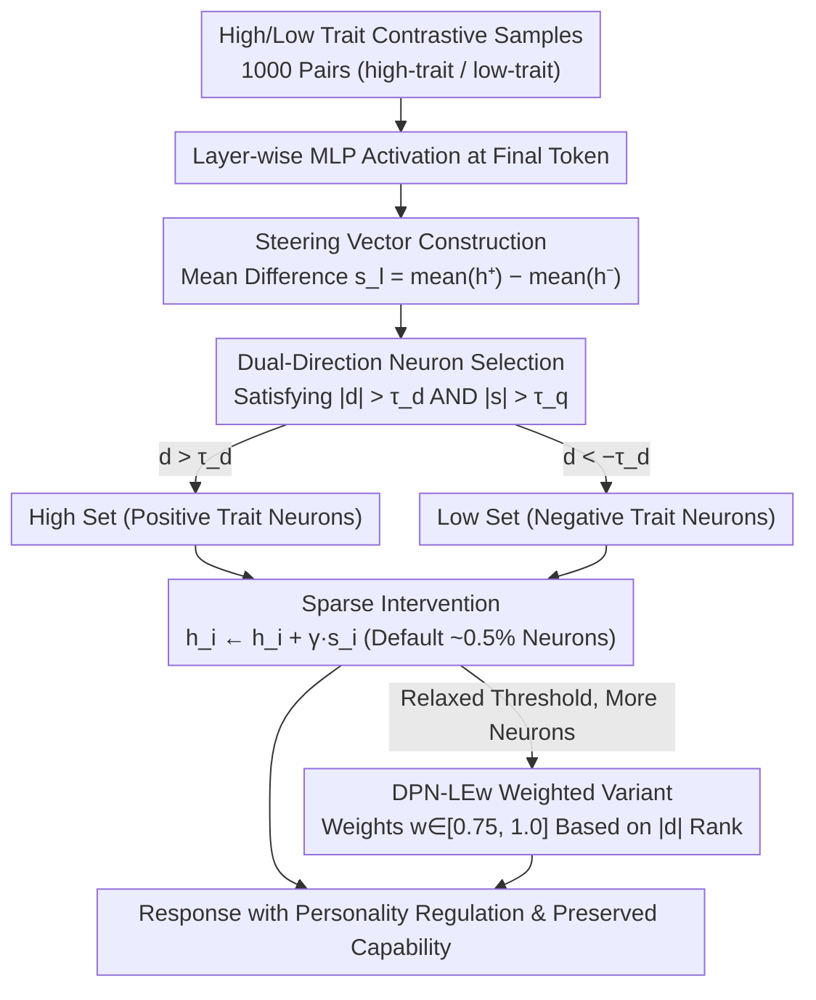

# DPN-LE: Dual Personality Neuron Localization and Editing for Large Language Models

**Conference**: ACL2026 Findings  
**arXiv**: [2604.27929](https://arxiv.org/abs/2604.27929)  
**Code**: https://github.com/Z1ivan/DPN-LE  
**Area**: LLM Interpretability / Model Editing  
**Keywords**: Personality Editing, Neuron Localization, Sparse Intervention, Big Five, Representation Analysis

## TL;DR
This paper proposes DPN-LE, which locates mutually exclusive personality-related neurons by comparing MLP activations of high/low personality trait samples. By intervening in only approximately 0.5% of neurons, it achieves personality control and better preserves general capabilities compared to existing large-scale neuron editing methods.

## Background & Motivation
**Background**: LLM personality control is commonly used for role-playing, social surveys, personalized assistants, and personality analysis. Existing methods are generally divided into prompt-based personality induction and neuron-editing: the former is simple but unstable, while the latter directly intervenes in internal representations but often requires modifying a large number of neurons.

**Limitations of Prior Work**: The representative neuron editing method NPTI can change personality traits but leads to significant performance degradation. Preliminary experiments in the paper show that on LLaMA-3-8B-Instruct, NPTI causes an average decline in GSM8K of 16.00% in the high direction and 40.79% in the low direction, indicating that many modified neurons are related to general reasoning or knowledge.

**Key Challenge**: Personality-related representations are not independent switches completely separated from general capabilities. Neurons exhibit polysemanticity; coarse-grained editing simultaneously affects personality, knowledge, and reasoning abilities, resulting in a strong trade-off between personality control and capability preservation.

**Goal**: The authors aim to answer "which neurons are truly related to personality traits" and design a sparser, more selective inference-time intervention method to control Big Five personality expression without retraining the model.

**Key Insight**: The paper observes that high/low personality trait samples exhibit mutually exclusive separation patterns in the activation space of specific MLP layers. Therefore, trait-exclusive neurons can be identified by comparing high and low samples.

**Core Idea**: Construct a steering vector using the average activation difference between high/low trait samples, and perform dual screening using Cohen's $d$ and activation magnitude to retain only statistically significant and strongly responsive personality-exclusive neurons for sparse linear intervention.

## Method
DPN-LE is a training-free inference-time editing method. It does not modify model weights but adds or subtracts personality-direction steering signals from the selected MLP hidden neurons during generation. The method consists of three steps: steering vector construction, dual-direction neuron selection, and sparse intervention.

### Overall Architecture
Given a Big Five trait (e.g., Neuroticism), DPN-LE first uses 1,000 pairs of high-trait / low-trait contrastive samples to calculate the activation statistics of each MLP layer at the final token position, distilling a directional vector representing "which direction in this layer indicates a higher trait." It then applies dual filtering via statistical significance and response magnitude to select a sparse, mutually exclusive subset of neurons that truly distinguish high and low personality. Finally, during inference, signals are added or subtracted along this direction for only this small group of neurons—positive intervention to enhance the trait, negative to suppress it. The input is a standard generation request, and the output is a response with directionally adjusted personality and largely preserved general capabilities.

### Key Designs

**1. Steering Vector Construction: Characterizing personality direction using paired sample mean differences.** Personality is not a local phenomenon of a single token or prompt, and relying on any single instance introduces noise. DPN-LE calculates the average difference for the $l$-th layer MLP hidden state: $s_l = \mathrm{mean}(h_l^+) - \mathrm{mean}(h_l^-)$, where $h_l^+$ and $h_l^-$ are from high-trait and low-trait samples respectively. Paired averaging smooths out individual noise, leaving a stable average shift in the activation space for that trait to serve as a baseline for filtering and intervention.

**2. Dual-Direction Neuron Selection: Identifying sparse personality-exclusive subsets using dual criteria.** Since neurons are polysemantic, relying on a single metric leads to errors: using only effect size captures many weak-response neurons, while using only activation magnitude captures statistically unstable differences. DPN-LE requires a neuron to satisfy both $|d_l| > \tau_d$ and $|s_l| > \tau_q$—where Cohen's $d$ ensures the difference is statistically significant, and the quantile threshold for steering magnitude ensures the response is sufficiently strong. Neurons passing the criteria enter the "high set" if $d_l > \tau_d$ or the "low set" if $d_l < -\tau_d$, forming two mutually exclusive sparse sets that exclude redundant neurons entangled with general language processing.

**3. Sparse Intervention and Weighted Variant: Minimum neurons for control, weighted by specificity for stability.** By default, only about 0.5% of neurons are selected (approx. 70 per layer at Q995), which is sufficiently sparse for the base DPN-LE to apply $h_i \leftarrow h_i + \gamma s_i$. When thresholds are relaxed and more neurons are included, weakly specific neurons can cause instability. DPN-LEw assigns weights $w_i \in [0.75, 1.0]$ based on the rank of $|d_l|$, allowing more personality-exclusive neurons to receive stronger intervention while mitigating side effects from marginal neurons in wider sets.

### Loss & Training
DPN-LE involves no training loss and no model fine-tuning. It only calculates activation statistics using 1,000 pairs of contrastive samples. Intervention layers are 12-31 for LLaMA-3-8B-Instruct and 14-27 for Qwen2.5-7B-Instruct. Key hyperparameters for LLaMA include quantile threshold $q=0.995$, Cohen's $d$ threshold $\tau_d=0.8$, and intervention strength $\gamma \in [0.0, 2.0]$. Qwen uses a lower $\tau_d=0.3$ due to weaker activation differences. The default configuration selects approximately 0.5% of total MLP neurons.

## Key Experimental Results

### Main Results

| Task / Metric | Ours | Comparison | Key Figures | Conclusion |
|--------|----------|----------|----------|------|
| PersonalityBench Avg Score | DPN-LE 9.11 | NPTI 9.43 | Scores close to SOTA | Sparse intervention effectively controls personality |
| Modified Neuron Count | DPN-LE Avg High 711 / Low 713 | NPTI Avg High 21,223 / Low 22,140 | 96.7% Reduction | Many NPTI neurons are redundant |
| GSM8K Capability Drop | DPN-LEw Avg High -7.08%, Low -5.93% | NPTI High -16.00%, Low -40.79% | Significantly better preservation | Sparse selection reduces reasoning damage |
| HotpotQA F1 Drop | DPN-LEw High -2.05, Low -2.27 | NPTI High -1.04, Low -2.81 | Close to or better than NPTI | Minimal QA capability loss |
| TriviaQA F1 Drop | DPN-LEw High -2.88, Low -3.80 | NPTI High -3.61, Low -4.34 | Lower degradation | Knowledge QA is well-preserved |
| IPIP-NEO-300 Total | DPN-LEw 6.64, DPN-LE 6.75 | P2P 7.71, LLaMA Few-shot 5.96 | Better than some prompt methods but not always strongest | Individual-level personality matching involves trade-offs |

### Ablation Study

| Configuration | Key Metrics | Description |
|------|---------|------|
| $\gamma=0.8$ | trait score 8.02, fluency 9.85 | Balance between personality control and fluency |
| $\gamma=1.0$ | trait score 8.59, fluency 9.33 | Stronger control but decreased fluency |
| $\gamma=1.5$ | DPN-LE fluency 5.42, DPN-LEw fluency 6.58 | Excessive intervention breaks generation; weighted is more stable |
| Q999 0.1% | trait 7.55, fluency 9.90 | Too few neurons, insufficient control |
| Q995 0.5% | trait 8.59, fluency 9.33 | Optimal balance point |
| Q970 3.0% | trait 8.68, fluency 7.78 | Selecting more neurons barely improves personality but damages fluency |

### Key Findings
- On average, LLaMA requires only ~72 neurons per layer and Qwen ~92 neurons per layer to form an effective personality intervention subset.
- DPN-LE significantly outperforms NPTI in capability preservation, though certain trait directions still damage reasoning (e.g., DPN-LEw Extraversion-low drops 17.89% on GSM8K).
- DPN-LEw is more stable under strong intervention, showing that weighting by effect size reduces side effects of low-specificity neurons when the set expands.

## Highlights & Insights
- The most important insight is that "personality neurons" are not "the more the better." The key to personality control lies in excluding general capability-related neurons rather than expanding the intervention scope.
- Dual-criteria screening is practical: Cohen's $d$ addresses statistical significance while steering magnitude addresses intervention strength; their combination is more reasonable than a single threshold.
- The method requires no training or weight changes, modifying sparse activations only during inference. This makes it suitable as an interpretability tool and convenient for analyzing the overlap between traits and capabilities.

## Limitations & Future Work
- DPN-LE relies on contrastive samples; whether these samples represent true personality expression directly affects the steering vector quality.
- Although the capability degradation is less than NPTI, some personality directions still share neural foundations with reasoning abilities, especially Extraversion and Neuroticism.
- This paper only studies single personality trait intervention; multi-trait combinations, trait conflicts, and long-term dialogue stability have not been verified.
- Individual-level alignment on IPIP-NEO-300 is weaker than PAS and NPTI, indicating a trade-off between sparse capability preservation and fine-grained personality fitting. Future work could include reasoning-protective neuron selection to explicitly exclude neurons highly correlated with reasoning tasks.

## Related Work & Insights
- **vs Simple Prompt / P2P**: Prompt methods are easy to deploy but depend on phrasing and lack stability; DPN-LE acts directly on the representation layer and is better suited for analyzing personality mechanisms.
- **vs PAS**: PAS searches for attention heads and activation offsets, leaning towards optimization-based personality alignment; DPN-LE focuses on mutually exclusive MLP neuron representations.
- **vs NPTI**: NPTI modifies ~20,000 neurons, providing strong control but high capability degradation; DPN-LE modifies ~0.5% of neurons, preserving capabilities better.
- **Insights**: When performing internal LLM editing, identifying "truly exclusive" sparse subsets using contrastive activation and capability evaluation is more stable than simply increasing the editing scope.

## Rating
- Novelty: ⭐⭐⭐⭐☆ Framing personality editing as dual sparse neuron localization is clear and distinct from large-scale editing.
- Experimental Thoroughness: ⭐⭐⭐⭐☆ Covers personality, general capability, generalization, and ablation, though multi-trait combinations are missing.
- Writing Quality: ⭐⭐⭐⭐☆ Formulas and conclusions are clear; despite dense tables from PDF conversion, the main line is well-defined.
- Value: ⭐⭐⭐⭐☆ Valuable for personality control, model editing, and representation interpretability, especially for research on capability-preserving interventions.

<!-- RELATED:START -->

## Related Papers

- [\[ICML 2026\] Dual Mechanisms of Value Expression: Intrinsic vs. Prompted Values in Large Language Models](../../ICML2026/interpretability/dual_mechanisms_of_value_expression_intrinsic_vs_prompted_values_in_large_langua.md)
- [\[ICML 2026\] Towards Atoms of Large Language Models](../../ICML2026/interpretability/towards_atoms_of_large_language_models.md)
- [\[ACL 2026\] Compositional Steering of Large Language Models with Steering Tokens](compositional_steering_of_large_language_models_with_steering_tokens.md)
- [\[ACL 2026\] Knowledge Vector of Logical Reasoning in Large Language Models](knowledge_vector_of_logical_reasoning_in_large_language_models.md)
- [\[ACL 2026\] Tracing Relational Knowledge Recall in Large Language Models](tracing_relational_knowledge_recall_in_large_language_models.md)

<!-- RELATED:END -->
