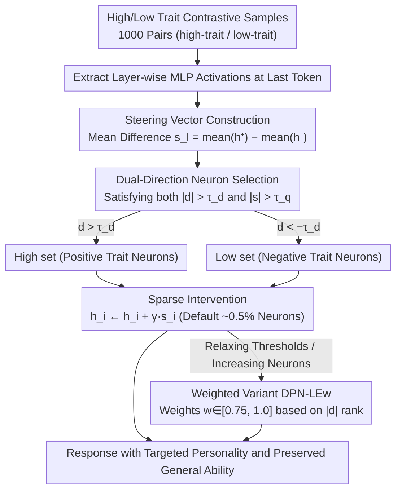

# DPN-LE: Dual Personality Neuron Localization and Editing for Large Language Models

**Conference**: ACL2026 Findings  
**arXiv**: [2604.27929](https://arxiv.org/abs/2604.27929)  
**Code**: https://github.com/Z1ivan/DPN-LE  
**Area**: LLM Interpretability / Model Editing  
**Keywords**: Personality Editing, Neuron Localization, Sparse Intervention, Big Five, Representation Analysis

## TL;DR
This paper proposes DPN-LE, which locates mutually exclusive personality-related neurons by comparing MLP activations of high/low trait samples. By intervening in only approximately 0.5% of neurons, it achieves personality control while preserving general capabilities significantly better than existing large-scale neuron editing methods.

## Background & Motivation
**Background**: Personality control in LLMs is commonly used for role-playing, social surveys, personalized assistants, and personality analysis. Existing methods are generally categorized into prompt-based personality induction and neuron-editing. The former is simple but unstable, while the latter directly intervenes in internal representations but often requires modifying a massive number of neurons.

**Limitations of Prior Work**: NPTI, a representative neuron editing method, can alter personality traits but leads to significant capability degradation. Preliminary experiments in the paper show that on LLaMA-3-8B-Instruct, NPTI causes an average decline of 16.00% in the high direction and 40.79% in the low direction on GSM8K, indicating that many modified neurons were actually related to general reasoning or knowledge.

**Key Challenge**: Personality-related representations are not independent switches completely separated from general capabilities. Neurons exhibit polysemanticity; coarse-grained editing simultaneously affects personality, knowledge, and reasoning, leading to a strong trade-off between personality control and capability preservation.

**Goal**: The authors aim to identify which neurons are truly related to personality traits and design a sparser, more selective inference-time intervention method to control Big Five personality expression without retraining the model.

**Key Insight**: The authors observe that high/low personality trait samples exhibit mutually exclusive separation patterns in the activation space of specific MLP layers. Therefore, trait-exclusive neurons can be identified by contrasting high and low samples.

**Core Idea**: Construct a steering vector using the average activation difference between high and low trait samples, then apply a dual filtering mechanism involving Cohen's $d$ and activation magnitude to retain only statistically significant and strongly responsive personality-exclusive neurons for sparse linear intervention.

## Method
DPN-LE is a training-free inference-time editing method. It does not modify model weights but adds or subtracts personality-oriented steering signals to selected MLP hidden neurons during generation. The method involves three steps: steering vector construction, dual-direction neuron selection, and sparse intervention.

### Overall Architecture
Given a specific Big Five trait (e.g., Neuroticism), DPN-LE first uses 1,000 pairs of high-trait / low-trait contrastive samples to calculate the mean MLP activations at the final token position in each layer. This produces a directional vector representing "which direction in this layer corresponds to a higher trait." A dual filter of statistical significance and response magnitude then selects a sparse, mutually exclusive subset of neurons that truly distinguish high and low personalities. During inference, signals are added or subtracted only from this small subset—positive intervention to enhance a trait and negative to suppress it. The input is a standard generation request, and the output is a response with directionally adjusted personality and largely preserved general capabilities.

### Key Designs

**1. Steering Vector Construction: Characterizing personality directions using mean differences of paired samples.** Personality is not a local phenomenon of a single token or prompt; relying on a single instance introduces noise. DPN-LE calculates the mean difference $s_l = \mathrm{mean}(h_l^+) - \mathrm{mean}(h_l^-)$ for the $l$-th layer's MLP hidden states, where $h_l^+$ and $h_l^-$ are derived from high-trait and low-trait samples respectively. Paired averaging smooths out individual noise, leaving a stable average shift for that trait in the activation space to serve as the baseline for screening and intervention.

**2. Dual-Direction Neuron Selection: Selecting a sparse subset of exclusive neurons using dual standards.** Neurons are polysemantic, so single metrics can be misleading: relying only on effect size introduces weak-response neurons, while relying only on activation magnitude captures statistically unstable differences. DPN-LE requires a neuron to satisfy both $|d_l| > \tau_d$ and $|s_l| > \tau_q$—where Cohen's $d$ ensures the difference is statistically significant, and the quantile threshold for steering magnitude ensures the response is sufficiently strong. Neurons with $d_l > \tau_d$ enter the high set, while those with $d_l < -\tau_d$ enter the low set, forming two mutually exclusive sparse sets that exclude redundant neurons entangled with general language processing.

**3. Sparse Intervention and Weighted Variant: Micro-neuron control for personality and specificity-based weighting for stability.** By default, only about 0.5% of neurons are selected (roughly 70 per layer under the Q995 setting), which is sufficiently sparse for the basic DPN-LE to apply uniform intervention $h_i \leftarrow h_i + \gamma s_i$. When thresholds are relaxed to include more neurons, weakly specific neurons can introduce instability. Thus, DPN-LEw assigns weights $w_i \in [0.75, 1.0]$ based on the rank of $|d_l|$, ensuring stronger intervention for personality-exclusive neurons and weaker intervention for peripheral ones, mitigating side effects in larger sets.

### Loss & Training
DPN-LE involves no training loss and no model fine-tuning. It only uses 1,000 pairs of contrastive samples to collect activation statistics. On LLaMA-3-8B-Instruct, the intervention layers are 12-31; on Qwen2.5-7B-Instruct, they are 14-27. Critical hyperparameters for LLaMA include quantile threshold $q=0.995$, Cohen's $d$ threshold $\tau_d=0.8$, and intervention strength $\gamma \in [0.0, 2.0]$. Qwen uses a lower $\tau_d=0.3$ due to weaker activation differences. The default configuration selects approximately 0.5% of total MLP neurons.

## Key Experimental Results

### Main Results

| Task / Metric | Ours | Comparison | Key Number | Conclusion |
|--------|----------|----------|----------|------|
| PersonalityBench Avg Score | DPN-LE 9.11 | Prev. SOTA (NPTI) 9.43 | Near SOTA scores | Sparse intervention effectively controls personality |
| Number of Modified Neurons | DPN-LE avg High 711 / Low 713 | Prev. SOTA (NPTI) avg High 21,223 / Low 22,140 | 96.7% reduction | Most NPTI neurons are redundant |
| GSM8K Performance Drop | DPN-LEw avg High -7.08%, Low -5.93% | Prev. SOTA (NPTI) High -16.00%, Low -40.79% | Significantly better preservation | Sparse selection reduces reasoning damage |
| HotpotQA F1 Drop | DPN-LEw High -2.05, Low -2.27 | Prev. SOTA (NPTI) High -1.04, Low -2.81 | Comparable or better | Low impact on QA capabilities |
| TriviaQA F1 Drop | DPN-LEw High -2.88, Low -3.80 | Prev. SOTA (NPTI) High -3.61, Low -4.34 | Lower degradation | Better knowledge retrieval preservation |
| IPIP-NEO-300 total | DPN-LEw 6.64, DPN-LE 6.75 | P2P 7.71, LLaMA Few-shot 5.96 | Better than some prompt methods | Trade-off exists for individual-level matching |

### Ablation Study

| Configuration | Key Metric | Description |
|------|---------|------|
| $\gamma=0.8$ | trait score 8.02, fluency 9.85 | Balanced control and fluency |
| $\gamma=1.0$ | trait score 8.59, fluency 9.33 | Stronger control but lower fluency |
| $\gamma=1.5$ | DPN-LE fluency 5.42, DPN-LEw 6.58 | Extreme intervention disrupts generation; weighted is more stable |
| Q999 0.1% | trait 7.55, fluency 9.90 | Insufficient neurons for control |
| Q995 0.5% | trait 8.59, fluency 9.33 | Optimal balance point |
| Q970 3.0% | trait 8.68, fluency 7.78 | More neurons barely improve trait but damage fluency |

### Key Findings
- On LLaMA, an average of only ~72 neurons per layer is needed, while Qwen requires ~92, to form a functional personality intervention subset.
- DPN-LE significantly outperforms NPTI in capability preservation, though certain trait directions still damage reasoning (e.g., DPN-LEw’s Extraversion-low drops GSM8K by 17.89%, and Neuroticism-high by 11.37%).
- DPN-LEw is more stable under stronger intervention, showing that weighting by effect size reduces side effects when the neuron set is expanded.

## Highlights & Insights
- The most critical insight is that "personality neurons" are not "the more, the better." The key to personality control lies in excluding neurons related to general capabilities rather than expanding the scope of intervention.
- The dual screening criteria are practical: Cohen's $d$ handles statistical significance, while steering magnitude handles intervention strength. Together, they are more logical than a single threshold.
- The method requires no training or weight modification, involving only sparse activation shifts at inference. This makes it a valuable tool for interpretability research and analyzing the overlap between traits and capabilities.

## Limitations & Future Work
- DPN-LE relies on contrastive samples; whether these samples represent true personality expressions directly affects the quality of the steering vector.
- Although capability degradation is lower than NPTI, some personality directions still share neural foundations with reasoning, particularly those related to Extraversion and Neuroticism.
- This study focuses on single trait intervention; multi-trait combinations, trait conflicts, and stability in long-term dialogues have yet to be verified.
- Individual-level alignment on IPIP-NEO-300 is weaker than PAS and NPTI, indicating a remaining trade-off between sparse capability preservation and fine-grained personality fitting. Future work could incorporate reasoning-protective neuron selection to explicitly exclude neurons highly correlated with reasoning tasks.

## Related Work & Insights
- **vs Simple Prompt / P2P**: Prompt methods are easy to deploy but depend on phrasing and lack stability; DPN-LE acts directly on representations, making it better for analyzing personality mechanisms.
- **vs PAS**: PAS searches for attention heads and activation offsets in an optimization-style alignment; DPN-LE focuses on mutually exclusive MLP neuron representations.
- **vs NPTI**: NPTI modifies ~20,000 neurons, providing strong control but high degradation; DPN-LE intervenes in only ~0.5% of neurons for better capability preservation.
- **Insight**: When performing internal edits on LLMs, identifying "truly exclusive" sparse subsets using contrastive activations and capability benchmarks is more stable than simply increasing the edit scope.

## Rating
- Novelty: ⭐⭐⭐⭐☆ Framing personality editing as dual-direction sparse neuron localization is clear and distinct from large-scale editing.
- Experimental Thoroughness: ⭐⭐⭐⭐☆ Covers personality, general capability, generalization, and ablation, though multi-trait combinations are missing.
- Writing Quality: ⭐⭐⭐⭐☆ Formulas and experimental conclusions are clear; tables are dense but the main logic is explicit.
- Value: ⭐⭐⭐⭐☆ Valuable for personality control, model editing, and representation interpretability, especially for studying capability-preserving interventions.

<!-- RELATED:START -->

## Related Papers

- [\[ICML 2026\] Dual Mechanisms of Value Expression: Intrinsic vs. Prompted Values in Large Language Models](../../ICML2026/interpretability/dual_mechanisms_of_value_expression_intrinsic_vs_prompted_values_in_large_langua.md)
- [\[ICML 2026\] Towards Atoms of Large Language Models](../../ICML2026/interpretability/towards_atoms_of_large_language_models.md)
- [\[ACL 2026\] Compositional Steering of Large Language Models with Steering Tokens](compositional_steering_of_large_language_models_with_steering_tokens.md)
- [\[ACL 2026\] Knowledge Vector of Logical Reasoning in Large Language Models](knowledge_vector_of_logical_reasoning_in_large_language_models.md)
- [\[ACL 2026\] Tracing Relational Knowledge Recall in Large Language Models](tracing_relational_knowledge_recall_in_large_language_models.md)

<!-- RELATED:END -->
