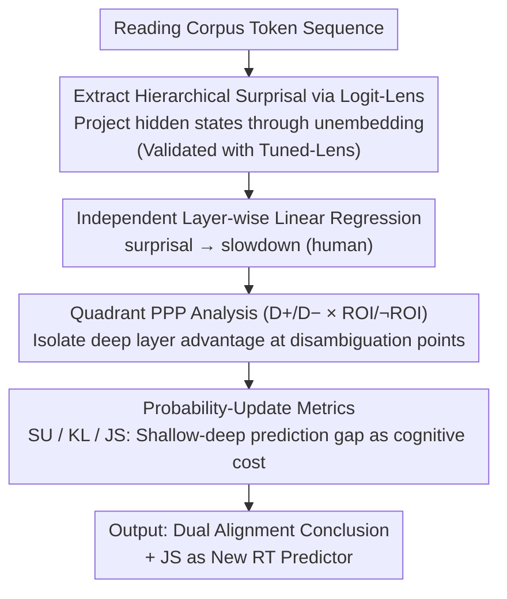

# Dual Alignment Between Language Model Layers and Human Sentence Processing

**Conference**: ACL 2026  
**arXiv**: [2604.18563](https://arxiv.org/abs/2604.18563)  
**Code**: https://github.com/kuribayashi4/internal_surprisal_targeted_assessment (Available)  
**Area**: Interpretability / Cognitive / Psycholinguistics  
**Keywords**: surprisal, Logit-Lens, syntactic ambiguity, reading time, dual alignment

## TL;DR
The authors utilize logit-lens to decode "internal surprisal" from every layer across 19 LMs (GPT-2/Pythia/OPT) and discover a counter-intuitive "dual alignment": while **shallow** layer surprisal aligns best with humans on naturalistic reading corpora, **deep** layers align better on **syntactic challenge sentences** (e.g., garden-path, NPS, NPZ, RC, Attachment). This corresponds to human dual-mechanism reading models—balancing "shallow default processing" with "deep reanalysis" during difficulty. Consequently, the authors propose using the difference (KL/JS) between shallow and deep surprisal as an "inter-layer prediction update" to serve as a supplementary feature for reading-time prediction.

## Background & Motivation

**Background**: Computational psycholinguistics has long utilized LM surprisal $S_t = -\log P(w_t \mid w_{<t})$ as a predictor for reading-time (RT), supported by extensive evidence of a near-linear positive correlation (Smith & Levy 2013). Recently, Kuribayashi et al. (2025) extended logit-lens to hierarchical levels, finding that **early layer** surprisal aligns better with humans on naturalistic corpora, partially addressing the "holistic misalignment" problem.

**Limitations of Prior Work**: A "**targeted misalignment**" remains unresolved. On **syntactic challenge sentences** such as garden-path (e.g., MVRR "The girl fed the lamb remained..."), NPS, and NPZ, humans slow down significantly at the disambiguating point. However, surprisal from the final layer of all LMs **severely underestimates** the magnitude of this slowdown. A natural question arises: if early layers perform better on naturalistic reading, do they also perform better on syntactic challenge sentences?

**Key Challenge**: The authors demonstrate empirically that the answer is negative—**early layers show almost no difference on syntactic challenge sentences** (surprisal for D+ and D− are nearly identical because they only perceive local co-occurrence and are insensitive to long-range dependencies). This implies that "which layer is most human-like" is not a global answer but depends on task difficulty.

**Goal**: (i) Clarify the "optimal layer" location across different syntactic difficulties; (ii) Provide a unified perspective to explain this dual alignment; (iii) Explicitly formulate this "layer difference" as a new reading-time predictor.

**Key Insight**: The authors analogize the hierarchical forward computation of LMs to the two-stage processing in human reading: **shallow layers ≈ default shallow processing** (fast, surface-level, local) and **deep layers ≈ reanalysis / deep integration** (slow, requiring full context). If this metaphor holds, garden-path sentences should necessitate a "shift to deep layers."

**Core Idea**: Layer-wise surprisal **does not follow a monotonic curve**. In naturalistic settings, shallow layers align best; in syntactically challenging settings, deep layers align best. Furthermore, the **prediction update from shallow to deep layers** (surprisal update / KL / JS) can itself serve as a proxy for processing cost.

## Method

### Overall Architecture
The method involves no model training; LMs are treated as probes for regression analysis on reading-time data. First, logit-lens is used to decode the hidden states of every LM, token, and layer into "internal surprisal," transforming surprisal from a scalar into a layer-wise curve. Second, linear regressions are fitted independently for each layer to map "surprisal → slowdown" in syntactically ambiguous reading data to identify which layer's estimated slowdown most closely matches humans. A 2x2 quadrant analysis (D+/D− × ROI/¬ROI) is used to isolate where the "deep layer advantage" occurs. Finally, the "prediction update from shallow to deep layers" (SU/KL/JS) is extracted as a new reading-time predictor.

### Key Designs

**1. Hierarchical Surprisal via Logit-Lens + Tuned-Lens Robustness: Tracking which layer predicts the next word.** To investigate which LM layers correspond to human fast/slow processing, the black-box prediction must be decomposed into a layer-wise sequence. The unembedding matrix (with LayerNorm) is applied to the hidden state $h^{(l)}_{i}$ of the $i$-th token at layer $l$ to obtain the predictive distribution. The hierarchical surprisal is calculated as $S^{(l)}_t = -\log P^{(l)}(w_t \mid w_{<t})$. Since early-layer logit-lens can be biased, Tuned-Lens (Belrose 2023) is used to verify the consistency of the conclusions.

**2. Quadrant PPP Analysis (D+/D− × ROI/¬ROI): Isolating the "deep layer advantage" to disambiguation points.** To prevent the "gain from depth" effect from being diluted by other data points, tokens are categorized into four quadrants: whether they belong to an ambiguous sentence (D+ vs D−) and whether they fall within the disambiguating window (ROI: $t^*-2$ to $t^*+2$ vs ¬ROI). The Predictive Power Proximity ($\Delta\mathrm{LL} = \mathrm{LL}_{\text{full}} - \mathrm{LL}_{\text{baseline}}$) is calculated for each layer, and the Pearson correlation between "layer depth" and "PPP" is reported. The dual alignment hypothesis predicts that humans only shift to deep reanalysis at disambiguation points; thus, a strong positive correlation between depth and PPP should only appear in the D+ ∩ ROI quadrant.

**3. Probability-Update Metrics (SU / KL / JS) as New RT Features: Quantifying the prediction gap between shallow and deep layers.** Under the "shallow predicts, deep corrects" model, the magnitude of correction should proxy cognitive effort. Three metrics are defined: $\mathrm{SU}(w_t) = \log \frac{Q_t(w_t)}{P_t(w_t)}$ at the target word; $\mathrm{KL}(Q_t \| P_t) = \mathbb{E}_{w \sim Q_t}[\mathrm{SU}(w)]$ across the vocabulary; and the symmetric $\mathrm{JS}(Q_t \| P_t)$. Here, $P_t$ is from a shallow layer and $Q_t$ from the final layer. Since JS is symmetric and incorporates full distribution information, it provides the strongest additional explanatory power beyond standard surprisal in ROI regions, implementing the "shallow vs deep processing" concept (Li & Futrell 2024) as a computable metric.

### Loss & Training
- **Probing approach**: No fine-tuning is performed. Logit-lens/Tuned-lens are used for extraction, followed by linear regression on reading-time data.
- **Regression Model**: $\text{RT}(w_t) = \beta_0 + \beta_1 \text{Surprisal}(w_t) + \beta_2 \text{Length}(w_t) + \beta_3 \text{LogFreq}(w_t) + \text{spillover}(w_{t-1}, w_{t-2}) + \epsilon$.
- **PPP Indicator**: $\Delta\text{LL} = \text{LL}_{\text{full}} - \text{LL}_{\text{baseline}}$.
- **Filler-Target Split**: Regressions are trained on filler sentences from the Huang dataset and tested on target sentences (D+/D−) to avoid over-fitting to garden-path structures.

## Key Experimental Results

### Main Results
**Exp.1** (Fig.2): Estimated slowdown vs. human ground truth (red line) for 19 LMs:

| Construction | Human slowdown (ms) | LM Estimate (All Layers) | Best Layer Position |
|--------------|---------------------|--------------------------|----------------------|
| MVRR         | ~100                | Max ~50 (GPT2-xl late)   | Late layers          |
| NPS          | ~45                 | Max ~25                  | Late layers          |
| NPZ          | ~100                | Max ~50                  | Late layers          |
| RC           | ~25                 | Max ~15                  | Late layers          |
| Attachment   | ~10                 | ~5-10                    | Late layers          |

General Conclusion: **All layers underestimate** human slowdown, but **later layers are closer** than early layers; this **directly contradicts** the "early layer is best" conclusion from Kuribayashi 2025 based on naturalistic reading.

**Exp.2** (Tab.2): Pearson correlation between layer depth and PPP in the D+ ∩ ROI quadrant (Syntactic challenge + Disambiguation point):

| Model      | MVRR D+∩RoI | NPS D+∩RoI | NPZ D+∩RoI | RC D+∩RoI | Attachment D+∩RoI |
|------------|-------------|------------|------------|-----------|-------------------|
| GPT2-xl    | +0.88       | -0.07      | +0.88      | +0.96     | -0.32             |
| OPT-13b    | +0.09       | +0.71      | +0.81      | +0.88     | +0.26             |
| Pythia-12b | **+0.88**   | **+0.93**  | **+0.79**  | **+0.97** | **+0.80**         |

Pythia-12B shows strong positive correlations (+0.79 to +0.97) across all constructions in D+ ∩ ROI, whereas D− ∩ ROI correlations are negative (-0.41 to -0.89). This contrast amplifies with model scale.

### Ablation Study
**Exp.3** (Fig.4): Average PPP across 19 LMs replacing surprisal with SU / KL / JS, or combining Surprisal+JS:

| Feature                | Full Avg PPP         | RoI Avg PPP          | Notes                       |
|------------------------|----------------------|----------------------|-----------------------------|
| Surprisal (last layer) | Baseline             | Baseline             | Standard practice           |
| Surprisal Update (SU)  | > Baseline           | Marginal             | Target word only            |
| KL(Q‖P)                | Significant (most)   | Significant (some)   | Asymmetric                  |
| JS                     | **Best of Three**    | Significant (some)   | Symmetric                   |
| Surprisal + JS         | **> Surprisal alone**| **> Surprisal alone**| Complementary information   |

LR tests indicate Surprisal+JS is significantly better than Surprisal alone for MVR (Full), RC (Full), and Attachment (Full/RoI).

### Key Findings
- **Early layers fail on syntactic challenges**: In MVRR "fed the lamb remained," early layers only see local patterns like "the lamb remained," yielding near-identical surprisal for D+ and D−. This proves they lack syntactic sensitivity to long-range dependencies.
- **Dual alignment scales with model size**: In Pythia (70M to 12B), the depth-PPP correlation in D+ ∩ ROI increases from 0 to +0.97. Scaling encourages models to differentiate "shallow vs deep" mechanisms, mirroring human dual-process reading.
- **JS > KL > SU**: JS is the superior metric as it is symmetric and considers the full distribution, while SU only considers the target word. JS provides unique explanatory power in RoI regions.
- **Slowdown remains underestimated**: Even with optimal layers and JS features, LM-estimated slowdown stays at < 50% of human levels, indicating LMs do not fully capture all facets of human garden-path reanalysis effort.

## Highlights & Insights
- **Dynamic optimal layers**: The discovery that the "most human-like layer" depends on task difficulty moves hierarchical probing toward a dynamic perspective—different LM stages correspond to different stages of human cognitive processing.
- **Precise causal isolation**: The 2x2 design cleanly demonstrates that the "deep layer advantage" is exclusive to D+ ∩ ROI.
- **Unified cost proxy**: The JS/KL/SU framework allows the "shallow-to-deep prediction delta" to be quantified as cognitive effort, a concept applicable to any reanalysis phenomenon.
- **Honest reporting of limitations**: The authors do not use "tricks" to overfit RT data; they transparently report the persistent underestimation of slowdown.
- **Reproducible pipeline**: The combination of Logit-Lens, Tuned-Lens, and Whitespace-Trailing Decoding provides a standardized, low-barrier pipeline for studying predictive distributions.

## Limitations & Future Work
- **Residual slowdown gap**: Layer-wise surprisal and JS cannot fully account for garden-path effort, suggesting LM reanalysis only partially aligns with human brains.
- **Linguistic scope**: Only English SPR data (Huang et al.) was used. Whether garden-path sentences in other languages (e.g., Chinese, Japanese) require deep layers remains an open question.
- **Instruction-tuned LMs**: The study excludes SFT/RLHF models as they can distort cognitive alignment; however, these are the primary models used in industry.
- **Layer-to-time gap**: LM processing is hierarchical (layers), while brain dynamics are temporal. The authors acknowledge the challenge in building a theoretical bridge.
- **Future directions**: Implementing explicit gating (switching layers based on entropy/JS thresholds) might increase PPP. Applying dual alignment to multilingual models could reveal whether the "shallow-deep switch point" is language-invariant.

## Related Work & Insights
- **vs. Kuribayashi et al. (2025)**: While the previous work found early layers are best for naturalistic reading, this paper provides a contrasting conclusion for syntactic challenges and integrates them into a "dual alignment" framework.
- **vs. van Schijndel & Linzen (2021) / Huang et al. (2024)**: Previous reports highlighted final-layer underestimation of RT; this work clarifies that while all layers underestimate, deep layers are relatively superior and proposes layer-deltas as new features.
- **vs. Tenney et al. (2019)**: Aligns with the "BERT rediscovers the NLP pipeline" finding (POS early, syntax mid, semantics late) by providing behavioral alignment evidence for a "shallow-to-deep" processing pipeline.
- **vs. Li & Futrell (2024)**: Realizes their theoretical "shallow vs deep processing" model through computable layer-wise surprisal metrics.

## Rating
- Novelty: ⭐⭐⭐⭐ "Deep layer advantage is exclusive to garden-paths" is a counter-intuitive finding not explicitly reported in prior probing work.
- Experimental Thoroughness: ⭐⭐⭐⭐ Extensive coverage across 19 LMs, 5 phenomena, 4 quadrants, and 3 update measures, with Tuned-Lens validation.
- Writing Quality: ⭐⭐⭐⭐⭐ Clear conceptualization of "dual alignment" backed by intuitive visualizations and consistent framing.
- Value: ⭐⭐⭐⭐ Provides a new perspective and set of features (JS update) for the computational psycholinguistics community, with implications for NLP interpretability.

<!-- RELATED:START -->

## Related Papers

- [\[ACL 2026\] A Systematic Comparison between Extractive Self-Explanations and Human Rationales in Text Classification](a_systematic_comparison_between_extractive_self-explanations_and_human_rationale.md)
- [\[ICML 2026\] Discovering Implicit Large Language Model Alignment Objectives](../../ICML2026/interpretability/discovering_implicit_large_language_model_alignment_objectives.md)
- [\[AAAI 2026\] Can LLMs Truly Embody Human Personality? Analyzing AI and Human Behavior Alignment in Dispute Resolution](../../AAAI2026/interpretability/can_llms_truly_embody_human_personality_analyzing_ai_and_human_behavior_alignmen.md)
- [\[NeurIPS 2025\] Probabilistic Token Alignment for Large Language Model Fusion](../../NeurIPS2025/interpretability/probabilistic_token_alignment_for_large_language_model_fusion.md)
- [\[ACL 2026\] DPN-LE: Dual Personality Neuron Localization and Editing for Large Language Models](dpn-le_dual_personality_neuron_localization_and_editing_for_large_language_model.md)

<!-- RELATED:END -->
