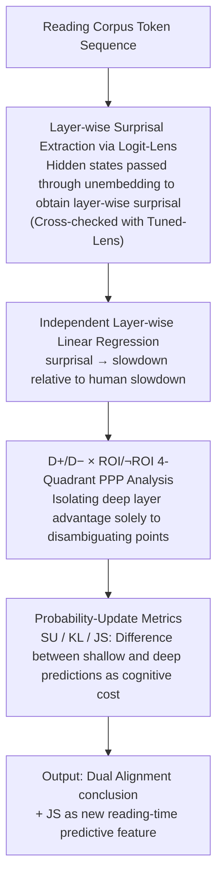

# Dual Alignment Between Language Model Layers and Human Sentence Processing

**Conference**: ACL 2026  
**arXiv**: [2604.18563](https://arxiv.org/abs/2604.18563)  
**Code**: https://github.com/kuribayashi4/internal_surprisal_targeted_assessment (Available)  
**Area**: Interpretability / Cognition / Psycholinguistics  
**Keywords**: surprisal, Logit-Lens, syntactic ambiguity, reading time, dual alignment

## TL;DR
The authors use logit-lens to decode "internal surprisal" from each layer of 19 LMs (including GPT-2/Pythia/OPT) and discover a counter-intuitive "dual alignment": on naturalistic reading corpora, **shallow** layer surprisal aligns best with humans; however, on **syntactic challenge sentences** such as garden-path, NPS, NPZ, RC, and Attachment, **deep** layers align better. This corresponds to the human dual-mechanism reading model—"default shallow processing + switching to deep reanalysis when difficult"—and leads to the proposal of using the difference in surprisal between shallow and deep layers (KL/JS) as an "inter-layer prediction update" to serve as a supplementary feature for reading-time.

## Background & Motivation

**Background**: Computational psycholinguistics has long used LM surprisal $S_t = -\log P(w_t \mid w_{<t})$ as a predictor for reading-time, as extensive experiments prove that RT is approximately linearly and positively correlated with surprisal (Smith & Levy 2013). Recently, Kuribayashi et al. (2025) extended logit-lens to hierarchies: on naturalistic reading corpora, they found that surprisal from **early layers** aligns more with humans than the final layer—partially solving the "holistic misalignment" problem.

**Limitations of Prior Work**: However, a "**targeted misalignment**" remains unsolved—on **syntactic challenge sentences** like garden-path (e.g., MVRR "The girl fed the lamb remained..."), NPS, and NPZ, humans slow down significantly at the disambiguating point, but surprisal from the final layer of all LMs **severely underestimates** this slowdown magnitude. A natural question follows: if early layers are better for naturalistic reading, are they also better for syntactic challenge sentences?

**Key Challenge**: The authors directly conducted experiments that yielded a negative answer—**early layers show almost no difference on syntactic challenge sentences** (surprisal for D+ and D− are similar because they only see local co-occurrence and are insensitive to long dependencies). This implies that "which layer aligns best with humans" is not a global answer but depends on task difficulty.

**Goal**: (i) Clarify where the "optimal layer" lies under different syntactic difficulties; (ii) provide a unified perspective to explain why this dual alignment occurs; (iii) explicitize this "inter-layer difference" as a new reading-time predictor.

**Key Insight**: The authors analogize the hierarchical forward computation of LMs to the two-stage processing in human reading—**shallow layers ≈ default shallow processing** (fast, surface, local) / **deep layers ≈ reanalysis / deep integration** (slow, requires full context). If this metaphor holds, garden-path sentences should require a "shift to deep layers."

**Core Idea**: Layer-wise surprisal **is not a monotonic curve**—shallow layers align best during naturalistic reading, while deep layers align best during syntactically challenging reading; furthermore, the **prediction update from shallow to deep layers** (surprisal update / KL / JS) can itself serve as a proxy for processing cost.

## Method

### Overall Architecture
The method does not involve training models; it treats LMs as probes and runs regressions on reading-time data. First, logit-lens is used to decode the hidden states of each layer for every LM and every token into "internal surprisal," transforming surprisal from a single scalar into a curve expanded by layers. Then, linear regressions of "surprisal → slowdown" are fitted independently for each layer on syntactic ambiguity reading data to see which layer's estimated slowdown is closest to humans. A 4-quadrant analysis (D+/D− × ROI/¬ROI) is used to isolate exactly where the "deep layer advantage" appears. Finally, the "prediction update from shallow to deep layers" (SU/KL/JS) is explicitly extracted as a new reading-time predictor feature alongside surprisal. The input is a text token sequence, and the output includes layer-wise surprisal, 4-quadrant correlation analysis, and the explanatory gain of inter-layer updates on reading-time.

### Key Designs

**1. Hierarchical surprisal extraction via Logit-Lens + Tuned-Lens robustness: expanding "which layer is predicting the next word" into a hierarchical curve.** To ask "which layers of the model correspond to human fast/slow processing," one must first decompose "model prediction" from a black box into a sequence of layers. Specifically, the model's own unembedding matrix (with LayerNorm) is applied to the hidden state $h^{(l)}_{i}$ of the $i$-th token at each layer to obtain the predicted distribution for the next token. Then, the layer-wise surprisal $S^{(l)}_t = -\log P^{(l)}(w_t \mid w_{<t})$ is calculated, with subwords accumulated via joint probability. Since logit-lens in early layers can have significant bias, the authors repeated the experiments using Tuned-Lens (Belrose 2023), confirming the main conclusions remain stable under more reliable probes.

**2. D+/D− × ROI/¬ROI 4-Quadrant PPP Analysis: Precisely isolating the "deep layer advantage" to disambiguating points.** If only a single average metric is considered, the effect of "depth-based gain" would be diluted by other data points. The paper categorizes every token by whether it belongs to an ambiguous sentence (D+ vs D−) and whether it falls in a disambiguating window (ROI: $t^*-2$ to $t^*+2$ vs ¬ROI). For each layer, the PPP $\Delta\mathrm{LL} = \mathrm{LL}_{\text{full}} - \mathrm{LL}_{\text{baseline}}$ is calculated, and the Pearson correlation between "layer depth and PPP" is reported for each model × construct × quadrant. The dual alignment hypothesis predicts that humans only shift to deep reanalysis at the disambiguating point; theoretically, a strong positive correlation of "deeper is better" should only appear in the D+ ∩ ROI cell.

**3. Probability-Update Metrics (SU / KL / JS) as new RT features: Quantifying the "prediction difference between shallow and deep layers" as cognitive cost.** The explanatory model is "shallow predicts first, deep corrects later"; thus, the "magnitude of correction" should itself be a proxy for effort. Three metrics are defined: SU looks only at the target word position $\mathrm{SU}(w_t) = \log \frac{Q_t(w_t)}{P_t(w_t)}$; KL is calculated over the entire vocabulary $\mathrm{KL}(Q_t \| P_t) = \mathbb{E}_{w \sim Q_t}[\mathrm{SU}(w)]$; JS is the symmetric version $\mathrm{JS}(Q_t \| P_t)$. Here, $P_t$ is from a shallow layer and $Q_t$ from the final layer. Before regression, layer surprisal is normalized via z-score to eliminate scale differences. JS provides more information than SU and symmetry over KL, yielding the strongest additional explanatory power beyond surprisal in ROI regions.

### Loss & Training
- **Non-training, Probing only**: The authors do not fine-tune LMs; they only extract hierarchical outputs via logit-lens/tuned-lens and run linear regressions on reading-time data.
- **Regression Model**: $\text{RT}(w_t) = \beta_0 + \beta_1 \text{Surprisal}(w_t) + \beta_2 \text{Length}(w_t) + \beta_3 \text{LogFreq}(w_t) + \text{spillover}(w_{t-1}, w_{t-2}) + \epsilon$, with same features for $t-1$ and $t-2$ for spillover.
- **PPP Metric**: $\Delta\text{LL} = \text{LL}_{\text{full}} - \text{LL}_{\text{baseline}}$, where "full" includes surprisal and "baseline" does not.
- **Filler Train / Target Test**: Regressions are trained on filler sentences from the Huang dataset and tested on target sentences (D+/D−) to avoid overfitting to garden-paths.

## Key Experimental Results

### Main Results
**Exp.1** (Fig.2): Across 19 LMs (GPT-2 / OPT / Pythia), estimated slowdown per layer vs. human baseline (Human red line):

| Construct | Human slowdown (ms) | All-layer LM Estimate | Optimal Layer Position |
|-----------|----------------------|-----------------------|------------------------|
| MVRR      | ~100                 | Max ~50 (Late GPT2-xl)| Late Layers            |
| NPS       | ~45                  | Max ~25               | Late Layers            |
| NPZ       | ~100                 | Max ~50               | Late Layers            |
| RC        | ~25                  | Max ~15               | Late Layers            |
| Attachment| ~10                  | ~5-10                 | Late Layers            |

General Conclusion: **All layers underestimate** human slowdown, but **later layers are closer** than early layers; this is **exactly opposite** to the Kuribayashi 2025 conclusion for naturalistic reading.

**Exp.2** (Tab.2): Pearson (layer depth, PPP) correlation coefficients for each LM × 5 constructs × 4 quadrants, focusing on D+ ∩ ROI:

| Model      | MVRR D+∩RoI | NPS D+∩RoI | NPZ D+∩RoI | RC D+∩RoI | Attachment D+∩RoI |
|------------|-------------|------------|------------|-----------|-------------------|
| GPT2-xl    | +0.88       | -0.07      | +0.88      | +0.96     | -0.32             |
| OPT-13b    | +0.09       | +0.71      | +0.81      | +0.88     | +0.26             |
| Pythia-12b | **+0.88**   | **+0.93**  | **+0.79**  | **+0.97** | **+0.80**         |

Pythia-12B shows strong positive correlations (+0.79 to +0.97) for D+ ∩ ROI across all five constructs, while D− ∩ ROI are all negative (-0.41 to -0.89); larger models show more distinct contrasts.

### Ablation Study
**Exp.3** (Fig.4): Across 10 conditions (5 phenomena × {Full, RoI}), replacing surprisal with SU / KL / JS, or stacking surprisal+JS, reporting average PPP of 19 LMs:

| Feature                   | Full Avg PPP         | RoI Avg PPP          | Remarks                          |
|---------------------------|----------------------|----------------------|----------------------------------|
| Surprisal (last layer)    | Baseline             | Baseline             | Standard practice                |
| Surprisal Update (SU)     | Sig. > baseline      | Marginal             | Target word position only        |
| KL(Q‖P)                   | Sig. for most        | Sig. for some        | Asymmetric                       |
| JS                        | **Best of the three**| Sig. for some        | Symmetric                        |
| Surprisal + JS            | **Better than alone**| **Better than alone**| Complementary                    |

LR tests show surprisal+JS is significantly better than surprisal alone on MVR (Full) / RC (Full) / Attachment (Full/RoI).

### Key Findings
- **Early layers fail in syntactic challenges**: In MVRR "fed the lamb remained," early layers only see the local "the lamb remained" co-occurrence, giving almost identical surprisal for D+ and D−—proving they do not capture long dependencies or syntactic sensitivity.
- **Dual alignment is more evident in larger models**: In Pythia ranging from 70M to 12B, the layer depth-PPP correlation for D+ ∩ ROI monotonically increases from 0 to +0.97; scaling allows models to naturally differentiate "shallow vs deep" mechanisms, echoing human dual-mechanism theory.
- **JS is superior to KL and SU**: Because JS is symmetric and considers the full distribution, while SU only looks at the target word. JS provides extra explanatory power beyond surprisal in RoI.
- **Slowdown is still underestimated**: Even with the optimal layer + JS addition, estimated slowdown is < human ~50% ms, indicating LMs do not fully capture all human effort in garden-paths.

## Highlights & Insights
- **"Which layer aligns best with humans" is task-dependent**: This discovery pushes the hierarchical probing field toward a dynamic perspective—not finding a single optimal layer, but acknowledging that different LM stages correspond to different human processing stages.
- **2×2 design precisely isolates the effect**: The observation that "deep layer advantage appears only in D+ ∩ ROI" would be lost without this categorical separation, offering a clean causal isolation.
- **JS / KL / SU metrics provide a unified framework**: The "inter-layer prediction difference as cost proxy" can be generalized to all cognitive modeling tasks where reanalysis is required.
- **Honest reporting of underestimation**: The authors do not overfit to reading-time data but honestly report "still underestimate," presenting the boundaries of discovery alongside failures—a model for good cognitive modeling research.

## Limitations & Future Work
- **Slowdown still underestimated by ~50%**: Layer-wise surprisal + JS cannot fully explain garden-path effort, meaning LM "reanalysis" only partially aligns with the human brain.
- **English/Written only**: All data comes from Huang et al. (English SPR); the authors briefly mention whether garden-paths in other languages (Chinese, Japanese) also require deep layers in the discussion.
- **No instruction-tuned models**: The authors explicitly exclude SFT/RLHF models, citing Kuribayashi (2024) which showed they distort cognitive alignment; however, the practical value is limited as these are the mainstream models.
- **Theoretical gap between layers and time**: Human brain dynamics unfold over time, while LMs unfold over layers; the correspondence "still needs a thorny theoretical bridge."

## Related Work & Insights
- **vs Kuribayashi et al. (2025)**: The previous work found "early layers are best" only on naturalistic reading; Ours extends this to syntactic challenges, providing the inverse conclusion and unifying it under the "dual alignment" framework.
- **vs van Schijndel & Linzen (2021) / Huang et al. (2024)**: They already reported final-layer surprisal underestimates RT in garden-paths; Ours further shows that "underestimation" exists across all layers but is mitigated in deep layers, while providing inter-layer differences as new features.
- **vs Tenney et al. (2019) "BERT rediscovers NLP pipeline"**: Early probing found BERT performs POS early, syntax in the middle, and semantics late; Ours provides a behavioral alignment perspective for "shallow early, deep late," consistent with the pipeline hypothesis.
- **vs Li & Futrell (2024)**: They proposed an information-theoretic model for shallow vs deep processing; Ours implements it as a computable metric using layer-wise surprisal.

## Rating
- Novelty: ⭐⭐⭐⭐ The "deep layer advantage appearing only in garden-paths" is a counter-intuitive conclusion not explicitly reported in previous layer probing work.
- Experimental Thoroughness: ⭐⭐⭐⭐ 19 LMs × 5 phenomena × 4 quadrants × 3 layer-update measures; the use of Tuned-Lens for cross-validation is rigorous.
- Writing Quality: ⭐⭐⭐⭐⭐ Fig.1 clearly illustrates "dual alignment"; variable explanations and theoretical framing are fluid.
- Value: ⭐⭐⭐⭐ Provides a new perspective and new features (JS update) for the computational psycholinguistics community, with transferability to NLP interpretability.

<!-- RELATED:START -->

## Related Papers

- [\[ICLR 2026\] Representational Alignment Across Model Layers and Brain Regions with Multi-Level Optimal Transport](../../ICLR2026/interpretability/representational_alignment_across_model_layers_and_brain_regions_with_multi-leve.md)
- [\[ACL 2026\] A Systematic Comparison between Extractive Self-Explanations and Human Rationales in Text Classification](a_systematic_comparison_between_extractive_self-explanations_and_human_rationale.md)
- [\[ACL 2026\] Probing Semantic Alignment, Lexical Invariance, and Syntactic Influence in LLM Metaphor Processing](probing_semantic_alignment_lexical_invariance_and_syntactic_influence_in_llm_met.md)
- [\[ICML 2026\] Discovering Implicit Large Language Model Alignment Objectives](../../ICML2026/interpretability/discovering_implicit_large_language_model_alignment_objectives.md)
- [\[AAAI 2026\] Can LLMs Truly Embody Human Personality? Analyzing AI and Human Behavior Alignment in Dispute Resolution](../../AAAI2026/interpretability/can_llms_truly_embody_human_personality_analyzing_ai_and_human_behavior_alignmen.md)

<!-- RELATED:END -->
