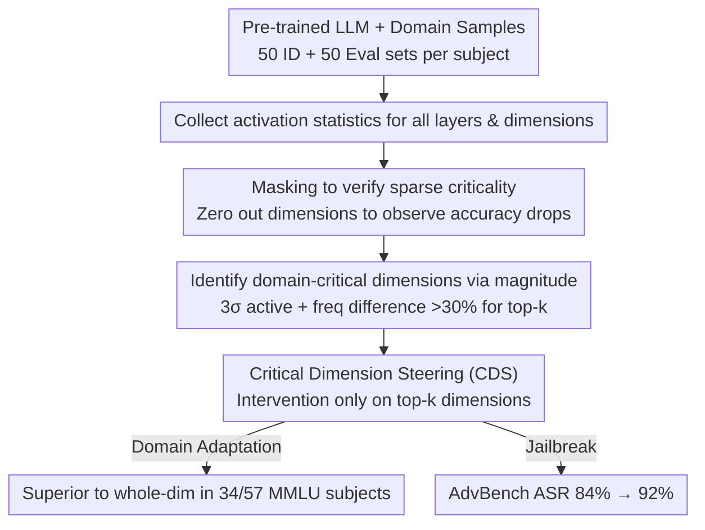

# Embracing Anisotropy: Turning Massive Activations into Interpretable Control Knobs for Large Language Models

**Conference**: ACL2026  
**arXiv**: [2603.00029](https://arxiv.org/abs/2603.00029)  
**Code**: https://github.com/nyancat0222/dimension-analyzer  
**Area**: Interpretability / Activation Steering  
**Keywords**: anisotropy, massive activations, domain-critical dimensions, activation steering, jailbreaking

## TL;DR
This paper reinterprets "massive activations," often regarded as outliers in LLMs, as interpretable domain-critical dimensions. It identifies these dimensions using a training-free activation magnitude criterion and performs activation steering exclusively on these dimensions, proving more effective than full-dimension steering in domain adaptation and jailbreaking scenarios.

## Background & Motivation
**Background**: Hidden representations in Transformer-based LLMs are typically highly anisotropic, meaning a few dimensions possess activation magnitudes significantly higher than others. Prior work often treated this as a representation imbalance or a quantization/stability issue, aiming to suppress outlier dimensions or make representations more isotropic.

**Limitations of Prior Work**: Treating extreme dimensions solely as noise or artifacts ignores their potential functional roles. Furthermore, interpretive methods like probe classifiers and Sparse Autoencoders (SAEs) can link internal representations to semantic concepts but typically require additional training and introduce new parameters or interpretive biases.

**Key Challenge**: Massive activations appear to be outliers but may also be sparse functional units formed by the model for domain specialization. The challenge lies in identifying these dimensions without additional training and verifying that they are both interpretable and capable of controlling model behavior.

**Goal**: The authors aim to prove two points: first, a small number of hidden dimensions are highly critical for specific domain performance; second, these dimensions can serve as sparse control knobs for fine-grained activation steering.

**Key Insight**: Starting from 57 subjects in MMLU, the paper treats each subject as a domain, sampling identification and evaluation sets. It first uses masking to prove that a single dimension can significantly impact domain performance, then uses simple activation statistics to identify these domain-critical dimensions.

**Core Idea**: Instead of eliminating anisotropy, embrace it: use activation magnitude to find domain-critical dimensions and manipulate only these dimensions to achieve domain adaptation or behavioral guidance.

## Method
The central hypothesis is that "extreme activations are not pure noise, but traces of functional specialization." The authors design a two-part workflow: first identifying domain-critical dimensions, then using them as intervention targets for Critical Dimension Steering (CDS). Note: The local cache only covers up to Section 2.2; subsequent steering details and complete limitations are not present. Only confirmed content is included below.

### Overall Architecture
Given a pre-trained LLM, a target domain, and domain samples, the method first collects activation statistics for each dimension in the hidden states of all layers. For MMLU, 100 test prompts per subject are used: 50 for the identification set to find critical dimensions, and 50 for the evaluation set to verify impacts on performance and control. The identification phase does not train probes or SAEs; instead, it selects top-$k$ dimensions based on activation magnitude and domain-discriminative activation frequency. The control phase uses these dimensions as sparse steering targets, modifying only the identified critical dimensions rather than the entire hidden vector.

### Key Designs

**1. Verifying Sparse Criticality via Masking: Proving "few dimensions determine performance"**

The premise is that "extreme activations are traces of functional specialization." To validate this, the first step is proving that hidden dimensions are not equivalent. The authors conduct dimension-wise ablation on Gemma-2-2B-IT and Qwen-3-8B by zeroing out specific dimension activations across all layers (excluding input embeddings).

The results are extreme: masking the Rank-1 dimension in Qwen-3-8B causes average accuracy to collapse from 73.30% to 21.97%, while the Rank-100 dimension has almost no impact. This gap confirms that dimension importance is highly sparse, providing ground truth for sparse manipulation.

**2. Identifying Domain-Critical Dimensions via Magnitude: Using intrinsic statistical signals instead of trained interpreters**

While masking identifies critical dimensions, it is computationally expensive. Probes and SAEs require training and introduce biases. The authors leverage the model's existing activation magnitude: a dimension is defined as "active" for a query if its activation exceeds the mean by $3\sigma$. When the activation frequency difference between two domains exceeds 30%, the dimension is judged to have a domain-discriminative pattern. The final selection uses top-$k$ high-magnitude dimensions.

Validation shows these statistically selected high-magnitude dimensions overlap significantly with ground-truth dimensions from masking. At the token level, dimension 1046 corresponds to mathematical terms, 2106 to biological terms, and 334 to topic keywords, proving functional importance can be inferred without training.

**3. Critical Dimension Steering: Using verified sparse dimensions as precision knobs**

Traditional activation steering applies a direction to the entire hidden vector. If domain behavior is dominated by a few high-impact dimensions, full-dimension steering perturbs many irrelevant dimensions, causing side effects. CDS restricts intervention to the top-$k$ domain-critical dimensions while keeping others intact, focusing intervention on verified causal handles.

> ⚠️ Local cache ends near Section 2.2. Full steering coefficients and implementation formulas are not present. Results from the introduction indicate CDS outperformed whole-dimension steering in 34/57 MMLU subjects and increased jailbreak ASR on AdvBench from 84% to 92%.

### Loss & Training
The method is a training-free interpretation and inference-time steering approach. No new training losses are introduced. The identification phase uses hidden activation statistics from MMLU prompts. Evaluation is based on masking, domain adaptation accuracy, and jailbreak attack success rates.

## Key Experimental Results

### Main Results
The primary table shows the impact of single-dimension masking and the aggregate effectiveness of CDS.

| Experiment | Model | Baseline/Control | Key Result | Description |
| :--- | :--- | :--- | :--- | :--- |
| Single-dim Masking | Gemma-2-2B-IT | Original Acc: 56.53% | Rank-1 Masking: 41.97% | Average drop of 14.56 pts |
| Single-dim Masking | Gemma-2-2B-IT | Original Acc: 56.53% | Rank-10 Masking: 52.39% | Impact weakens with rank |
| Single-dim Masking | Qwen-3-8B | Original Acc: 73.30% | Rank-1 Masking: 21.97% | Average drop of 51.33 pts |
| Single-dim Masking | Qwen-3-8B | Original Acc: 73.30% | Rank-100 Masking: 71.97% | Most dimensions have minimal impact |
| Domain Adaptation | MMLU 57 subjects | Whole-dim steering | CDS better in 34/57 subjects | Aggregate result from intro |
| Jailbreaking | AdvBench | Whole-dim ASR: 84% | CDS ASR: 92% | Aggregate result from intro |

### Ablation Study
Confirms identifying criteria: functional sparsity and domain discriminativeness.

| Analysis Object | Confirmed Setting | Observation | Conclusion |
| :--- | :--- | :--- | :--- |
| Functional Sparsity | Dimension-wise masking across all layers | Qwen-3-8B Rank-1 masking drops acc from 73.30% to 21.97% | Few dimensions dominate performance |
| Domain Discriminativeness | Active if value > $3\sigma$ from mean | Freq differences >30% exist between Math and Bio subjects | Extreme activations carry domain info |
| Interpretability Case | Gemma-2-2B-IT token-level patterns | Dim 1046: Math; Dim 2106: Biology; Dim 334: Keywords | Single dimensions act as semantic detectors |

### Key Findings
- The impact of a single hidden dimension can be massive. In Qwen-3-8B, masking the most critical dimension drops accuracy by over 50 percentage points.
- High-magnitude dimensions are not just unstable outliers; they correspond to domain differences in MMLU subjects (e.g., Math vs. Bio).
- CDS achieves an ASR of 92% in AdvBench jailbreaking, higher than the 84% of whole-dimension steering, demonstrating stronger control.

## Highlights & Insights
- The paper flips the narrative: anisotropy, previously seen as a representation defect, is treated here as a natural result of internal specialization.
- Using magnitude to identify dimensions is simple but captures the observable signal of massive activations, making it lighter than probes/SAEs for rapid diagnosis.
- CDS links interpretability to control: if a dimension explains a domain concept, manipulating only that dimension acts as a "precision knob."
- Security implication: Sparse dimensions that increase jailbreak ASR are also the weak points of the model's safety boundary.

## Limitations & Future Work
- The domain is operationalized mainly through MMLU subjects; this works for exam topics but may not cover mixed domains, long contexts, or open-ended generation in real-world applications.
- The training-free magnitude criterion might mistake high-frequency formatting features for semantic units; future alignment with causal interventions or SAE features is needed.
- Increased jailbreak ASR implies potential dual-use risks; public tools require accompanying defensive analysis.

## Related Work & Insights
- **vs. Isotropy Calibration / Outlier Suppression**: These aim to reduce the impact of extreme dimensions; this paper argues they are meaningful functional units to be interpreted.
- **vs. Probe Classifiers**: Probes require supervision; this method uses activation statistics for lower cost and shorter interpretation chains.
- **vs. Sparse Autoencoder**: SAEs decompose multi-semantic features into sparser ones; this method works on original hidden dimensions, making it lighter but more limited in expressive power.
- **vs. Whole-dimension Activation Steering**: Traditional steering can introduce unrelated perturbations; CDS restricts intervention to verified causal handles.

## Rating
- Novelty: ⭐⭐⭐⭐☆ (Distinct perspective on massive activations as interpretable units).
- Experimental Thoroughness: ⭐⭐⭐☆☆ (Strong aggregate results, but missing full subject-level steering and sensitivity tables).
- Writing Quality: ⭐⭐⭐⭐☆ (Clear motivation and background).
- Value: ⭐⭐⭐⭐☆ (Insightful for interpretability, steering, and security assessment).

<!-- RELATED:START -->

## Related Papers

- [\[ACL 2026\] Preference Heads in Large Language Models: A Mechanistic Framework for Interpretable Personalization](preference_heads_in_large_language_models_a_mechanistic_framework_for_interpreta.md)
- [\[ACL 2026\] Sparse Feature Coactivation Reveals Causal Semantic Modules in Large Language Models](sparse_feature_coactivation_reveals_causal_semantic_modules_in_large_language_mo.md)
- [\[ICML 2026\] Towards Atoms of Large Language Models](../../ICML2026/interpretability/towards_atoms_of_large_language_models.md)
- [\[ACL 2026\] Knowledge Vector of Logical Reasoning in Large Language Models](knowledge_vector_of_logical_reasoning_in_large_language_models.md)
- [\[ACL 2026\] Compositional Steering of Large Language Models with Steering Tokens](compositional_steering_of_large_language_models_with_steering_tokens.md)

<!-- RELATED:END -->
