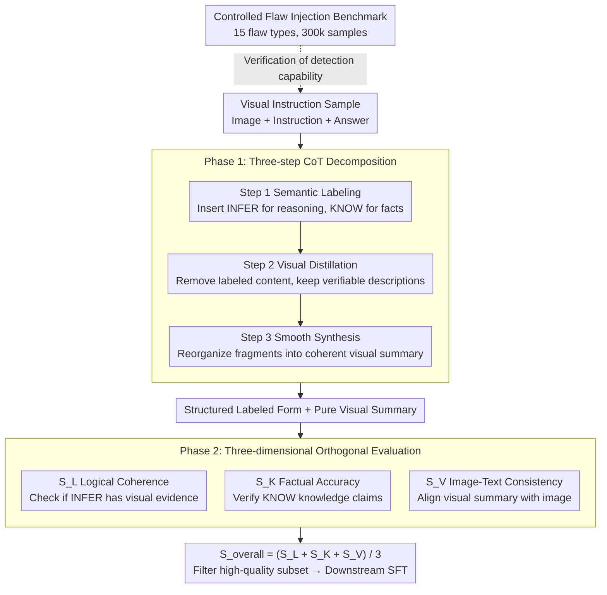

# Evian: Towards Explainable Visual Instruction-tuning Data Auditing

**Conference**: ACL 2026  
**arXiv**: [2604.20544](https://arxiv.org/abs/2604.20544)  
**Code**: None  
**Area**: Interpretability  
**Keywords**: Data Auditing, Visual Instruction Tuning, Explainable Evaluation, Data Quality, Multi-modal Large Language Models

## TL;DR

This paper proposes the "Decomposition-then-Evaluation" paradigm and the EVIAN framework, which decomposes answers in visual instruction-tuning data into three components: visual descriptions, subjective reasoning, and factual claims. These are evaluated across three orthogonal dimensions: image-text consistency, logical coherence, and factual accuracy. The study finds that models trained on a small amount of high-quality data filtered by EVIAN outperform those trained on large-scale datasets.

## Background & Motivation

**Background**: Large Vision-Language Models (LVLMs) rely on Visual Instruction Tuning (VIT) to achieve alignment between visual perception and language understanding, but the quality of training data remains inconsistent.

**Limitations of Prior Work**: (1) Large-scale data synthesis (e.g., LLaVA-Instruct-150K) improves instruction following but introduces noise; (2) Existing filtering methods (e.g., CLIP score) use coarse-grained single-dimensional scoring, failing to detect subtle semantic defects such as logical fallacies and factual errors; (3) The LLM-as-a-Judge paradigm suffers from bias, instability, and reasoning shortcut issues.

**Key Challenge**: Existing data filtering compresses various error types into a single opaque score, making it impossible to distinguish between different types of quality issues such as visual misrepresentation, factual inaccuracies, and reasoning defects.

**Goal**: To construct an explainable fine-grained data auditing framework that decomposes answers into verifiable cognitive components for multi-dimensional evaluation.

**Key Insight**: Treat responses as composite structures consisting of visual descriptions, subjective reasoning, and factual claims, rather than indivisible text blocks.

**Core Idea**: By decomposing complex auditing tasks into verifiable sub-tasks tailored to different cognitive components, more precise data quality assessment can be achieved compared to coarse-grained scoring. Furthermore, logical coherence is identified as the most critical factor in data quality.

## Method

### Overall Architecture

EVIAN audits an answer of a visual instruction sample as a "composite cognitive structure" rather than an indivisible text block. The process follows two phases: Phase 1 uses a three-step Chain-of-Thought (CoT) to decompose the answer into a structured form with labels and a pure visual summary, separating visual descriptions, subjective reasoning, and factual claims. Phase 2 scores the sample (1-5) along three non-overlapping dimensions: logical coherence $S_L$, factual accuracy $S_K$, and image-text consistency $S_V$. The final quality score is the average: $S_{\text{overall}} = (S_L + S_K + S_V) / 3$. Additionally, a controlled flaw injection benchmark is established to quantify the fine-grained detection capability of the auditing pipeline.

### Key Designs

**1. Three-step CoT Decomposition: Breaking sentences into independently verifiable cognitive components**

Coarse-grained scoring fails to identify logical fallacies or factual errors because it evaluates heterogeneous content together. EVIAN utilizes a three-step chain for isolation: Step 1 (Semantic Labeling) inserts `<INFER>` labels for subjective reasoning and `<KNOW>` labels for factual claims, leaving unlabeled parts as pure visual descriptions; Step 2 (Visual Distillation) removes or rewrites labeled content to leave only objective descriptions verifiable by the image; Step 3 (Smooth Synthesis) organizes these fragments into a coherent paragraph. This allows each component to be sent to its most appropriate evaluation dimension, avoiding the ambiguity inherent in mixed evaluation.

**2. Three-dimensional Orthogonal Evaluation Scheme: Measuring different flaws with different metrics**

Visual misrepresentation, factual inaccuracy, and reasoning defects are fundamentally different issues requiring distinct criteria. EVIAN orthogonalizes the evaluation: $S_L$ focuses solely on the logical soundness of reasoning within `<INFER>` tags—specifically whether visual evidence supports it; $S_K$ performs fact-checking on knowledge claims within `<KNOW>` tags; $S_V$ measures the consistency between the pure visual summary and the image, explicitly prioritizing consistency over completeness. These non-overlapping dimensions ensure each flaw is pinpointed without being diluted by other signals.

**3. Controlled Flaw Injection Benchmark: A 300,000-sample diagnostic tool for auditing pipelines**

Existing datasets lack systematically injected controllable errors, making it difficult to quantify how well an auditing pipeline detects fine-grained defects. EVIAN constructs a benchmark with 15 semantic flaw types (5 subtypes each for visual consistency, logical coherence, and factual accuracy). These flaws are injected via a three-stage pipeline: content analysis, context-aware error type selection, and guided rewriting. This ensures the injected errors are subtle and contextually relevant rather than obvious blunders, allowing the "auditor's detection capability" to be measured statistically.

### Loss & Training

Qwen3-235B is used for answer decomposition, and Qwen2.5-VL-7B serves as the automatic auditor for scoring. Downstream validation is performed by fine-tuning Qwen2-VL-2B on the filtered 10K subset. All comparison methods share the same architecture and SFT process to ensure that performance gains result solely from the data filtering strategy.

## Key Experimental Results

### Main Results (Qwen2-VL-2B fine-tuned on 10K subset)

| Method | MME | MMBench | ScienceQA | A-OKVQA | POPE | Avg |
|------|-----|---------|-----------|---------|------|-----|
| Random | 1475.76 | 0.5353 | 0.6614 | 0.7092 | 75.50 | 63.18 |
| Full Data (300K) | 1553.05 | 0.5953 | 0.6267 | 0.6934 | 78.17 | 63.77 |
| SCALE (Prev. SOTA) | 1814.97 | 0.6318 | 0.6916 | 0.7066 | 73.81 | 67.41 |
| EVIAN (Ours) | 1876.89 | 0.6463 | 0.7115 | 0.7493 | 79.87 | 70.20 |

### Ablation Study

| Configuration | Avg | Description |
|------|-----|------|
| EVIAN (Full) | 70.20 | Optimal full framework |
| w/o Decomposition | 67.93 | Loss of 2.27 without decomposition phase |
| w/o $S_L$ (Logical Coh.) | 57.27 | **Largest loss without logical coherence** (↓12.93) |
| w/o $S_K$ (Factual Acc.) | 64.21 | Loss of 5.99 without factual accuracy |
| Only $S_V$ (Visual Cons.) | 65.36 | Decent average but POPE drops to 68.56 |

### Key Findings
- **Logical Coherence is Critical**: Removing $S_L$ caused the Average to plummet from 70.20 to 57.27, as relying only on $S_K$ and $S_V$ includes samples that are factually correct but logically inconsistent, creating contradictory supervision signals.
- **"Less is More"**: The 10K subset filtered by EVIAN (3.3% of 300K) outperforms the full 300K dataset.
- In the score distribution, 92.3% of original high-quality samples scored $\ge 3.0$, while flawed samples concentrated around 3.0 (JSD=0.35, AUC=0.86).
- Cross-architecture validation (InternVL2-2B) indicates that improvements stem from data quality rather than inductive bias alignment between the auditor and target model.

## Highlights & Insights
- Core insight of the "Decomposition-then-Evaluation" paradigm: Decomposing auditing into verifiable sub-tasks makes complex auditing reliable.
- Challenges the "the more data, the better" paradigm by surpassing full-scale training with only 3.3% of the data.
- Discovers that logical coherence (rather than visual alignment or factual accuracy) is the most critical factor in data quality, a counter-intuitive and significant finding.
- The taxonomy design of the flaw injection benchmark is systematic, covering 5 subtypes each for consistency, reasoning, and knowledge.

## Limitations & Future Work
- Reliability depends on large multi-modal models for decomposition and evaluation, which may inherit their biases and blind spots.
- Errors in the decomposition phase propagate to subsequent evaluations, necessitating improved robustness.
- High computational cost due to multiple calls to large models limits application to ultra-large-scale datasets.
- Other dimensions of data quality, such as style diversity and pedagogical value, have not yet been modeled.

## Related Work & Insights
- **vs SCALE**: SCALE employs multi-stage filtering (modality quality, relevance, clarity, task rarity) but lacks component-level decomposition; EVIAN achieves more precise fine-grained auditing via cognitive component decomposition.
- **vs CLIPScore/BLIP**: Coarse-grained filtering based on similarity fails to capture logical fallacies and factual errors.
- **vs LLM-as-a-Judge**: Direct holistic scoring by models is prone to bias and instability; EVIAN mitigates this through structured decomposition.

## Rating
- Novelty: ⭐⭐⭐⭐ "Decomposition-then-Evaluation" paradigm is novel; 15-type flaw taxonomy is systematic.
- Experimental Thoroughness: ⭐⭐⭐⭐⭐ Multiple baselines, complete ablations, cross-architecture validation, and a 300k-sample benchmark.
- Writing Quality: ⭐⭐⭐⭐ Clear structure, rich diagrams, and in-depth analysis.
- Value: ⭐⭐⭐⭐ Significant guidance for multi-modal data curation; the findings on logical coherence priority have broad impact.

<!-- RELATED:START -->

## Related Papers

- [\[ICLR 2026\] Exploring Interpretability for Visual Prompt Tuning with Cross-layer Concepts](../../ICLR2026/interpretability/exploring_interpretability_for_visual_prompt_tuning_with_cross-layer_concepts.md)
- [\[ICML 2025\] Configurable Preference Tuning with Rubric-Guided Synthetic Data](../../ICML2025/interpretability/configurable_preference_tuning_with_rubric-guided_synthetic_data.md)
- [\[ACL 2026\] Diffusion-CAM: Faithful Visual Explanations for dMLLMs](diffusion-cam_faithful_visual_explanations_for_dmllms.md)
- [\[ACL 2026\] Investigating More Explainable and Partition-Free Compositionality Estimation for LLMs: A Rule-Generation Perspective](investigating_more_explainable_and_partition-free_compositionality_estimation_fo.md)
- [\[ICLR 2026\] Can LLMs Reason Soundly in Law? Auditing Inference Patterns for Legal Judgment](../../ICLR2026/interpretability/can_llms_reason_soundly_in_law_auditing_inference_patterns_for_legal_judgment.md)

<!-- RELATED:END -->
