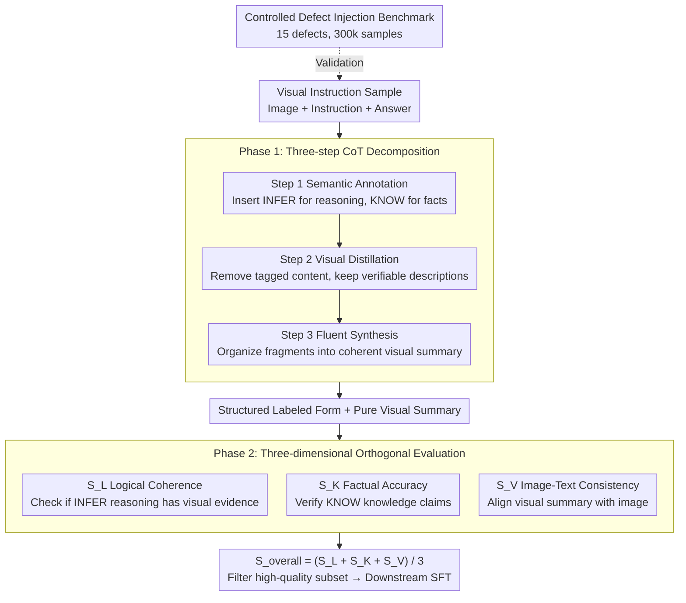

# Evian: Towards Explainable Visual Instruction-tuning Data Auditing

**Conference**: ACL 2026  
**arXiv**: [2604.20544](https://arxiv.org/abs/2604.20544)  
**Code**: None  
**Area**: Explainability  
**Keywords**: Data Auditing, Visual Instruction Tuning, Explainable Evaluation, Data Quality, Multimodal Large Language Models

## TL;DR

Proposes the "Decomposition-then-Evaluation" paradigm and the EVIAN framework, which decomposes answers in visual instruction tuning data into three components: visual descriptions, subjective reasoning, and factual claims. These are evaluated across three orthogonal dimensions: image-text consistency, logical coherence, and factual accuracy. It finds that models trained on a small amount of high-quality data filtered by this method outperform those trained on large-scale datasets.

## Background & Motivation

**Background**: Large Vision-Language Models (LVLMs) rely on Visual Instruction Tuning (VIT) to achieve alignment between visual perception and language understanding, but the quality of training data is inconsistent.

**Limitations of Prior Work**: (1) Large-scale data synthesis (e.g., LLaVA-Instruct-150K) improves instruction following but introduces noise; (2) Existing filtering methods (e.g., CLIP score) use coarse-grained single-dimensional scoring, failing to detect subtle semantic defects like logical fallacies and factual errors; (3) The LLM-as-a-Judge paradigm suffers from bias, instability, and reasoning shortcut issues.

**Key Challenge**: Existing data filtering compresses multiple types of errors into a single opaque score, making it impossible to distinguish between different quality issues such as visual misrepresentation, factual inaccuracy, and reasoning flaws.

**Goal**: Build an explainable fine-grained data auditing framework that decomposes answers into verifiable cognitive components for multi-dimensional evaluation.

**Key Insight**: Treat answers as composite structures consisting of visual descriptions, subjective reasoning, and factual claims, rather than indivisible text blocks.

**Core Idea**: By decomposing complex auditing tasks into verifiable sub-tasks tailored to different cognitive components, more precise data quality assessment can be achieved than coarse-grained scoring, revealing that logical coherence is the most critical factor in data quality.

## Method

### Overall Architecture

EVIAN audits an answer of a visual instruction sample as a "composite cognitive structure" rather than an indivisible block of text for a total score. The process consists of two steps: Phase 1 uses a three-step Chain-of-Thought (CoT) to decompose the answer into a structured form with labels and a pure visual summary, isolating visual descriptions, subjective reasoning, and factual claims; Phase 2 then scores these along three non-overlapping dimensions: logical coherence $S_L$, factual accuracy $S_K$, and image-text consistency $S_V$ on a 1-5 scale. The final explainable data quality score is the average $S_{\text{overall}} = (S_L + S_K + S_V) / 3$. Additionally, a controlled defect injection benchmark is constructed to quantify the fine-grained detection capability of the auditing pipeline.

### Key Designs

**1. Three-step CoT Decomposition: Breaking Sentences into Independently Verifiable Cognitive Components**

The reason coarse-grained scoring fails to detect logical fallacies or factual errors is that it judges multiple heterogeneous contents together; no single score can explain "which category is wrong." EVIAN uses a three-step chain for isolation: Step 1 Semantic Annotation inserts `<INFER>` tags at subjective reasoning points and `<KNOW>` tags at factual claims, with unlabeled parts defaulting to pure visual descriptions; Step 2 Visual Distillation removes or rewrites tagged content, leaving only objective descriptions verifiable by the image; Step 3 Fluent Synthesis organizes the fragmented distillation results into coherent paragraphs. After decomposition, each component is handled by its most suitable evaluation dimension, avoiding the inherent ambiguity of mixed assessment.

**2. 3D Orthogonal Evaluation System: Different Rulers for Different Defects**

Visual misrepresentation, factual inaccuracy, and reasoning flaws are essentially three types of issues requiring different criteria; mixing them in one dimension causes mutual interference. EVIAN therefore orthogonalizes the evaluation: $S_L$ only checks the logicality of reasoning within `<INFER>` tags—whether there is corresponding visual evidence; $S_K$ performs fact-checking for knowledge claims within `<KNOW>` tags; $S_V$ measures the consistency between the pure visual summary and the image, explicitly prioritizing consistency over completeness. These non-overlapping dimensions allow each type of defect to be isolated without dilution by other signals.

**3. Controlled Defect Injection Benchmark: A 300,000-Sample Diagnostic Tool for Auditing Pipelines**

Existing datasets lack systematically injected controllable errors, making it impossible to quantify the fine-grained detection capability of an auditing pipeline. EVIAN constructs a benchmark with 15 semantic defect categories (5 sub-types each for visual consistency, logical coherence, and factual accuracy). These defects are injected using a three-stage pipeline: content analysis, context-aware error type selection, and guided rewriting, ensuring errors are subtle and contextually appropriate rather than obvious flaws. This controlled platform allows the statistics of "whether the auditor can detect a certain type of defect" to be recorded as metrics.

### Loss & Training

Qwen3-235B is used for answer decomposition, and Qwen2.5-VL-7B serves as the automatic auditor for scoring. Downstream validation utilizes Qwen2-VL-2B fine-tuned on the filtered 10K subset. All comparison methods share the same architecture and SFT process to ensure performance differences stem solely from the data filtering strategy.

## Key Experimental Results

### Main Results (Fine-tuning Qwen2-VL-2B on 10K Subset)

| Method | MME | MMBench | ScienceQA | A-OKVQA | POPE | Avg |
|------|-----|---------|-----------|---------|------|-----|
| Random | 1475.76 | 0.5353 | 0.6614 | 0.7092 | 75.50 | 63.18 |
| Full Data (300K) | 1553.05 | 0.5953 | 0.6267 | 0.6934 | 78.17 | 63.77 |
| SCALE (Prev. SOTA) | 1814.97 | 0.6318 | 0.6916 | 0.7066 | 73.81 | 67.41 |
| EVIAN (Ours) | 1876.89 | 0.6463 | 0.7115 | 0.7493 | 79.87 | 70.20 |

### Ablation Study

| Configuration | Avg | Description |
|------|-----|------|
| EVIAN (Full) | 70.20 | Complete framework is optimal |
| w/o Decomposition | 67.93 | Removing decomposition phase loses 2.27 |
| w/o $S_L$ (Logic) | 57.27 | **Removing logical coherence causes largest drop** (↓12.93) |
| w/o $S_K$ (Fact) | 64.21 | Removing factual accuracy loses 5.99 |
| Only $S_V$ (Visual) | 65.36 | Visual consistency alone is fair but POPE drops to 68.56 |

### Key Findings
- **Logical Coherence is Most Critical**: Removing $S_L$ caused the Avg to plummet from 70.20 to 57.27, as relying only on $S_K$ and $S_V$ includes samples that are factually correct but logically inconsistent, creating contradictory supervision signals.
- **"Less is More"**: The 10K subset filtered by EVIAN (3.3% of 300K) outperformed training on the full 300K dataset.
- In the score distribution, $92.3\%$ of original high-quality samples scored $\geq 3.0$, while defect samples concentrated around 3.0 (JSD=0.35, AUC=0.86).
- Cross-architecture validation (InternVL2-2B) indicates that gains come from data quality rather than alignment of inductive biases between the auditor and target model.

## Highlights & Insights
- Core insight of the "Decomposition-then-Evaluation" paradigm: Decomposing auditing into verifiable sub-tasks makes complex auditing reliable.
- Challenges the "larger data is better" paradigm by surpassing full-scale training with only 3.3% of the data.
- Discovers that logical coherence (rather than visual alignment or factual accuracy) is the most critical factor in data quality, a significant counter-intuitive finding.
- The taxonomic design of the defect injection benchmark is systematic, covering 5 error sub-types each for consistency, reasoning, and knowledge categories.

## Limitations & Future Work
- Relies on large multimodal models for decomposition and evaluation, potentially inheriting their biases and blind spots.
- Errors in the decomposition phase propagate to subsequent evaluations; robustness needs improvement.
- High computational cost (multiple LLM calls) limits application to ultra-large-scale datasets.
- Fails to model other data quality dimensions such as stylistic diversity or pedagogical value.

## Related Work & Insights
- **vs SCALE**: SCALE employs multi-stage filtering (modality quality, relevance, clarity, task rarity) but lacks component-level decomposition; EVIAN achieves more precise fine-grained auditing via cognitive component decomposition.
- **vs CLIPScore/BLIP**: Coarse-grained filtering based on similarity cannot capture logical fallacies or factual errors.
- **vs LLM-as-a-Judge**: Directly asking a model for an overall score introduces bias and instability; EVIAN mitigates this through structural decomposition.

## Rating
- Novelty: ⭐⭐⭐⭐ The "Decomposition-then-Evaluation" paradigm is novel; 15-defect taxonomy is systematic.
- Experimental Thoroughness: ⭐⭐⭐⭐⭐ Comparison with multiple baselines, complete ablations, cross-architecture validation, and a 300k-sample benchmark.
- Writing Quality: ⭐⭐⭐⭐ Clear structure, rich diagrams, and in-depth analysis.
- Value: ⭐⭐⭐⭐ Highly guiding for multimodal data curation; the finding of logical coherence priority has broad impact.

<!-- RELATED:START -->

## Related Papers

- [\[ICLR 2026\] Exploring Interpretability for Visual Prompt Tuning with Cross-layer Concepts](../../ICLR2026/interpretability/exploring_interpretability_for_visual_prompt_tuning_with_cross-layer_concepts.md)
- [\[CVPR 2026\] Learning complete and explainable visual representations from itemized text supervision](../../CVPR2026/interpretability/learning_complete_and_explainable_visual_representations_from_itemized_text_supe.md)
- [\[ICML 2025\] Configurable Preference Tuning with Rubric-Guided Synthetic Data](../../ICML2025/interpretability/configurable_preference_tuning_with_rubric-guided_synthetic_data.md)
- [\[ACL 2026\] Diffusion-CAM: Faithful Visual Explanations for dMLLMs](diffusion-cam_faithful_visual_explanations_for_dmllms.md)
- [\[ACL 2026\] Investigating More Explainable and Partition-Free Compositionality Estimation for LLMs: A Rule-Generation Perspective](investigating_more_explainable_and_partition-free_compositionality_estimation_fo.md)

<!-- RELATED:END -->
