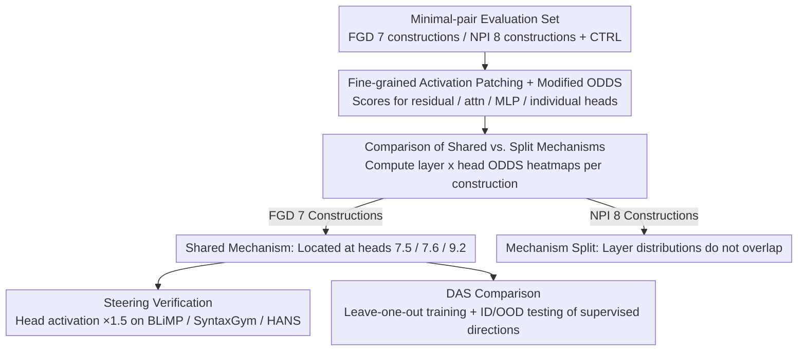

# Fine-Grained Analysis of Shared Syntactic Mechanisms in Language Models

**Conference**: ACL 2026  
**arXiv**: [2604.22166](https://arxiv.org/abs/2604.22166)  
**Code**: https://github.com/ynklab/shared_syntactic_mechanism (Available)  
**Area**: Interpretability / Linguistics / Causal Analysis / Mechanistic Interpretability  
**Keywords**: Activation Patching, DAS, Filler-Gap Dependency, NPI, Pythia

## TL;DR
The paper utilizes activation patching at the attention head granularity to demonstrate that Pythia and Gemma share a unified mechanism—residing in three specific attention heads in the early-to-mid layers—for processing seven English Filler-Gap Dependency (FGD) constructions. Scaling the activations of these heads by $1.5 \times$ improves performance on multiple BLiMP categories. In contrast, Negative Polarity Item (NPI) licensing lacks such a unified mechanism, and the "DAS directions" learned during training prove completely ineffective on OOD data, suggesting that unsupervised patching is more reliable than supervised DAS.

## Background & Motivation
**Background**: To determine whether LLMs truly utilize "shared syntactic mechanisms" as proposed by linguists, the primary path is causal abstraction—using activation patching or Distributed Alignment Search (DAS) to perform causal interventions on internal components and observe output changes. Prior works (Finlayson 2021, Boguraev 2025, Arora 2024) conducted preliminary analyses on subject-verb agreement and FGD, but mostly focused on the residual stream without drilling down to the attention head level, and lacked systematic verification of OOD robustness.

**Limitations of Prior Work**: (1) **Coarse Granularity**: Analyzing only the residual stream may lead to misidentifying mechanisms as "the same" if they utilize entirely different sets of heads but produce similar residual representations. (2) **Risk of Training Artifacts**: The "causal directions" learned by supervised methods like DAS may merely overfit the training lexicon or construction distribution, failing on OOD data—a risk that has not been systematically validated. (3) **Lack of Verification Loop**: Even if a "shared mechanism" is identified, there is little verification of whether this mechanism can actually alter model behavior on external benchmarks (e.g., BLiMP).

**Key Challenge**: While shared syntactic mechanisms are a compelling linguistic hypothesis, improper methodology can lead to both false positives and missed identifications. A conclusive argument must simultaneously satisfy: (a) fine-grained attention-head level resolution, (b) OOD generalization, and (c) behavior-level steering verification.

**Goal**: To examine whether LMs share internal mechanisms across two major classes of syntactic phenomena involving multiple constructions—FGD and NPI—at the attention head and MLP granularity; simultaneously, to contrast activation patching vs. DAS to determine which is more reliable.

**Key Insight**: (1) Selecting two contrasting phenomena—FGD (7 constructions) which involves long-distance syntactic dependencies, and NPI (8 constructions + control) which requires integration of semantic licensing; (2) Using a modified ODDS as a fine-grained measure of causal effect; (3) Strictly separating training, ID test, and OOD test sets using disjoint lexicons.

**Core Idea**: Activation patching does not require training and thus avoids overfitting, making it an ideal control for OOD experiments. If patching remains stable on OOD data while DAS does not, it provides direct evidence of DAS's unreliability.

## Method

### Overall Architecture
This is a causal analysis for mechanistic interpretability: the authors aim to confirm at the attention head level whether LMs utilize the same internal mechanism when processing various syntactic constructions. First, a minimal-pair evaluation set is constructed, covering 7 FGD constructions (EWHK/EWHW/MWH/RELCL/CLEFT/PCLEFT/TOPIC), 8 NPI constructions (COND/DNEG/SONLY/QNT/EMBQ/SMPQ/SUP/ONLY), and a capital-knowledge control (CTRL). Then, activation patching is performed on Pythia (1B/2.8B/6.9B checkpoints) and Gemma 3 (1B/12B) across four granularities: residual stream, attention output, MLP, and individual attention heads. ODDS scores are computed to determine "sharing" based on the consistency of distributions. Finally, two validation branches are executed: steering by amplifying key head activations to observe improvements in BLiMP/SyntaxGym/HANS, and comparing against DAS using leave-one-out training and ID/OOD evaluation.

### Key Designs

**1. Fine-grained Activation Patching + Modified ODDS: Locating Causal Contribution to Single Heads**

Focusing solely on the residual stream can misclassify mechanisms as identical if they yield similar representations via disjoint head sets. Thus, drilling down to the head level is necessary. The approach replaces the activation $f(b)$ of a component on a base input $b$ with the corresponding activation $f(s)$ from a source input $s$, observing changes in output probability. The modified metric is defined as:
$$\text{ODDS}(p, p_{\text{interv}}, T) = \frac{1}{|T|}\sum \log\left(\frac{p(y_b|b)}{p(y_b|s)} \cdot \frac{p_{\text{interv}}(y_b|s,b)}{p_{\text{interv}}(y_b|b,s)}\right)$$
This measures the shift in the probability gap of a specific token $y_b$ caused by the intervention. Unlike the original Arora version which compares $y_b$ vs $y_s$ (asymmetric in NPI contexts), this version tracks the same token's probability. This modification achieves three goals: no training (no overfitting risk), mathematical equivalence to the original version on symmetric pairs, and high resolution for head-level differentiation.

**2. Contrastive Design of Shared FGD vs. Split NPI: Establishing Validity via Falsifiable Hypotheses**

If all FGD constructions appear shared, it might be an artifact of the patching method itself. The authors construct "layer × token × head" ODDS heatmaps for each construction. Sharing is confirmed if all 7 FGD constructions show significant ODDS at the same heads/layers. Conversely, if NPI constructions show vastly different heatmaps, it indicates mechanism splitting. The results show FGD ODDS are concentrated in layer 7 (heads 7.5/7.6) and layer 9 (head 9.2), whereas NPI shows distinct layer distributions for DNEG/COND/SUP. Including NPI as a control proves that "sharing" is not a methodological artifact.

**3. Steering Verification: From Head Manipulation to Behavioral Improvement**

High ODDS on synthetic minimal pairs may still be a dataset artifact. To verify the mechanism's utility in real sentences, the authors multiply the activations of the three identified heads (7.5, 7.6, 9.2) by a coefficient $\alpha \in \{0.8, 1.0, 1.5, 2.0\}$. Accuracy on BLiMP categories shows that for FGD-related tasks, accuracy increases monotonically with $\alpha > 1$. Unexpectedly, categories like island effects, binding, and NPI also benefit, suggesting these heads serve a general hierarchical dependency backbone rather than being FGD-specific.

### Loss & Training
Activation patching is entirely inference-only. DAS involves training a one-dimensional vector $a$ with the loss: $\min_a (-\sum_{(b,s,y_b,y_s)\in D}\log p_{\text{interv}}(y_s|b,s))$, where the intervention is defined as $f_{\text{interv}}(b, s) = f(b) + (f(s)\cdot a - f(b)\cdot a) \cdot a^T$. Training uses 100 steps, lr $5\times 10^{-3}$, batch size 4, and 10% linear warmup. The dataset is split into train (200), ID (50), and OOD (50) with non-overlapping lexicons to test generalization.

## Key Experimental Results

### Main Results
ODDS scores (Pythia 1B, EWHK + 6 FGD constructions) demonstrate sharing, with key heads located:

| Construction | Head 7.5 ODDS | Head 7.6 ODDS | Head 9.2 ODDS | Shared |
|--------------|---------------|---------------|---------------|--------|
| EWHK         | ~2.0          | ~2.0          | ~1.5          | ✓      |
| EWHW         | High          | High          | High          | ✓      |
| MWH          | High          | High          | High          | ✓      |
| RELCL        | High          | High          | High          | ✓      |
| CLEFT        | High          | High          | High          | ✓      |
| PCLEFT       | High          | High          | High          | ✓      |
| TOPIC        | High          | High          | High          | ✓      |
| CTRL         | ~0            | ~0            | ~0            | —      |

NPI constructions (COND, DNEG, SUP) exhibit a split pattern, with DNEG appearing in earlier layers and COND/SUP having non-overlapping peak head positions.

BLiMP steering (amplifying heads 7.5/7.6/9.2):

| Category | $\alpha=0.8$ | $\alpha=1.0$ | $\alpha=1.5$ | $\alpha=2.0$ |
|----------|--------------|--------------|--------------|--------------|
| Filler gap (Target) | Slight drop | baseline | **+** | **++** |
| Island effects | baseline | baseline | **+** | **+** |
| Binding | baseline | baseline | **+** | **+** |
| Quantifiers | baseline | baseline | **+** | **+** |
| NPI | baseline | baseline | **+** | **+** |
| Subject-verb agr. | baseline | baseline | **+** | **+** |

### Ablation Study
Comparison of Activation Patching vs. DAS on ID / OOD:

| Setting | ID ODDS | OOD ODDS | Consistency |
|---------|---------|----------|-------------|
| Activation Patching (Residual) | High | **High (consistent with ID)** | ✓ |
| DAS (Residual) | High | **Significantly drops** | ✗ (Suspected overfit) |
| Activation Patching (Head) | High | **High** | ✓ |
| DAS (Head) | Moderate | Slight drop | Partial ✓ |

Training dynamics (Pythia 1B): High-frequency constructions like EWHK approach final ODDS by step 4000, while low-frequency ones (PCLEFT) continue increasing until step 10000, suggesting shared mechanisms emerge hierarchically, starting with frequent constructions.

Model scaling: Across Pythia (1B-6.9B) and Gemma 3 (1B-12B), mechanisms tend to shift to earlier layers as depth increases, but the head count and shared structure remain stable.

### Key Findings
- **Three heads (7.5, 7.6, 9.2) handle nearly all FGD processing**—this level of sparsity and localization is a remarkably clean finding in mechanistic interpretability.
- **Training frequency determines convergence speed**—high-frequency constructions stabilize at step 4k, while low-frequency ones require step 10k+, indicating "shared mechanisms" are frequency-driven emergences rather than innate priors.
- **DAS fails on OOD data**—this serves as a rigorous warning: trained causal directions may be dataset-specific fits, necessitating mandatory OOD validation.
- **Manipulated heads boost multiple syntax tasks**—these heads likely represent a general syntactic backbone for "hierarchical dependency" rather than being specialized solely for FGD.

## Highlights & Insights
- **Methodological**: The "contrastive design (shared FGD vs. split NPI) + strict OOD separation + behavioral steering" suite sets a new benchmark for evidence strength in mechanistic interpretability.
- **Scientific**: Successfully transforms the "shared syntactic mechanism" from a linguistic hypothesis into an empirical finding indexed by specific heads.
- **Training Dynamics**: Demonstrates that data diversity determines whether a mechanism extends to low-frequency constructions, providing a microscopic view of SLM performance stability.
- **DAS Overfit Warning**: Calls for a re-examination of many mechanistic interpretability works while validating the necessity of training-free causal methods.

## Limitations & Future Work
- Primarily tested on English; head distributions might vary in free-word-order languages like Japanese or Finnish.
- Minimal pairs are synthetic; although some validation was done on real sentences, the distribution is narrow.
- Only covers FGD and NPI; mechanisms for subject-verb agreement, anaphora, or ellipsis remain to be tested.
- While identifying "mechanism split" in NPI, the paper does not fully explain *why* it splits—complexity of semantic licensing vs. low variance in NPI tokens is unclear.
- Evaluation limited to Pythia and Gemma 3; applicability to closed-source models (OpenAI/Claude/DeepSeek) is unknown.

## Related Work & Insights
- **vs. Boguraev et al. 2025**: Both study FGD sharing, but the current work drills down to the head level, includes strict OOD testing, and completes the loop with steering.
- **vs. Finlayson et al. 2021**: Extends early causal mediation work by incorporating OOD risk management and fine-grained head analysis.
- **vs. Jumelet et al. 2021**: Contrasts the hypothesis that NPI is handled via a unified monotonicity mechanism; this study finds no such unification in decoder-only LMs.
- **vs. Kryvosheieva et al. 2025**: Probing-based approaches cannot verify causal impact; the dual causal + behavioral evidence here is significantly stronger.

## Rating
- Novelty: ⭐⭐⭐⭐ (The triple methodological suite is exemplary.)
- Experimental Thoroughness: ⭐⭐⭐⭐⭐ (Cross-model, cross-size, cross-step, ID/OOD splits, and multiple benchmarks.)
- Writing Quality: ⭐⭐⭐⭐ (Clear contrastive visualizations and solid mathematical proofs.)
- Value: ⭐⭐⭐⭐⭐ (Sets a methodological benchmark and provides hard evidence for linguistic debates.)

<!-- RELATED:START -->

## Related Papers

- [\[ACL 2026\] FineSteer: A Unified Framework for Fine-Grained Inference-Time Steering in Large Language Models](finesteer_a_unified_framework_for_fine-grained_inference-time_steering_in_large_.md)
- [\[CVPR 2025\] Prompt-CAM: Making Vision Transformers Interpretable for Fine-Grained Analysis](../../CVPR2025/interpretability/prompt-cam_making_vision_transformers_interpretable_for_fine-grained_analysis.md)
- [\[CVPR 2026\] Understanding Counting Mechanisms in Large Language and Vision-Language Models](../../CVPR2026/interpretability/understanding_counting_mechanisms_in_large_language_and_vision-language_models.md)
- [\[AAAI 2026\] Partially Shared Concept Bottleneck Models](../../AAAI2026/interpretability/partially_shared_concept_bottleneck_models.md)
- [\[ACL 2026\] How Language Models Conflate Logical Validity with Plausibility: A Representational Analysis of Content Effects](how_language_models_conflate_logical_validity_with_plausibility_a_representation.md)

<!-- RELATED:END -->
