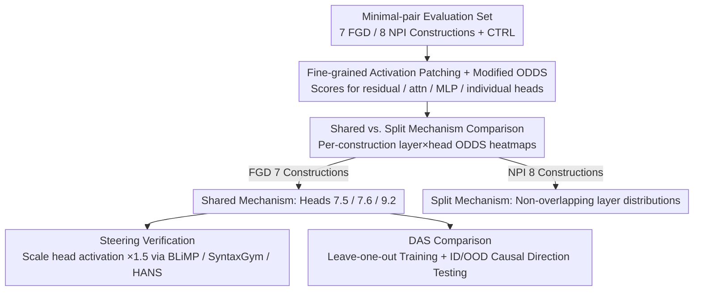

# Fine-Grained Analysis of Shared Syntactic Mechanisms in Language Models

**Conference**: ACL 2026  
**arXiv**: [2604.22166](https://arxiv.org/abs/2604.22166)  
**Code**: https://github.com/ynklab/shared_syntactic_mechanism (Available)  
**Area**: Interpretability / Linguistics / Causal Analysis / Mechanistic Interpretability  
**Keywords**: Activation Patching, DAS, Filler-Gap Dependency, NPI, Pythia

## TL;DR
The paper employs activation patching at the attention head granularity to demonstrate that Pythia and Gemma share a unified mechanism involving three attention heads in early-to-mid layers for processing seven types of English filler-gap dependencies (FGD). Scaling the activations of these specific heads by $1.5 \times$ improves performance on the BLiMP benchmark. Conversely, Negative Polarity Item (NPI) licensing lacks such a unified mechanism, and supervised "DAS directions" learned during training fail entirely on Out-of-Distribution (OOD) data, suggesting that unsupervised patching is more reliable than supervised DAS.

## Background & Motivation
**Background**: To determine whether LLMs truly utilize "shared syntactic mechanisms" as described by linguists, the mainstream approach involves causal abstraction—performing causal interventions on internal components via activation patching or Distributed Alignment Search (DAS) to observe changes in output. Prior works (Finlayson 2021, Boguraev 2025, Arora 2024) conducted preliminary analyses on subject-verb agreement and FGD, but most focused on the residual stream without drilling down to the attention head level or systematically verifying OOD robustness.

**Limitations of Prior Work**: (1) **Coarse Granularity**: Analyzing only the residual stream may lead to misidentifying mechanisms as "identical" if they produce similar residual representations despite using entirely different sets of heads. (2) **Risk of Training Artifacts**: Supervised methods like DAS may learn a "causal direction" that simply overfits the training lexicon or construction distribution, failing on OOD data—a phenomenon not yet systematically verified. (3) **Lack of Verification Loop**: Even when a "shared mechanism" is identified, there is little verification of whether this mechanism actually alters model behavior on external benchmarks (e.g., BLiMP).

**Key Challenge**: While shared syntactic mechanisms are a compelling linguistic hypothesis, the use of inappropriate methods can lead to false discoveries or misidentifications. Definitively arguing for such mechanisms requires: (a) head-level granularity, (b) OOD generalization, and (c) behavior-level steering verification.

**Goal**: To examine whether LMs share internal mechanisms across multiple constructions for FGD and NPI at the attention head and MLP granularity, while contrasting activation patching and DAS to determine which method is more reliable.

**Key Insight**: (1) Select two contrasting phenomena—FGD (7 constructions) and NPI (8 constructions + control). FGD primarily requires long-distance syntactic dependencies, while NPI involves integrated semantic licensing. (2) Use a modified ODDS as a fine-grained measure of causal effect. (3) Strictly separate vocabularies between training, ID tests, and OOD tests.

**Core Idea**: Because activation patching does not require training, it is immune to overfitting, making it ideal for OOD controlled experiments. If patching remains stable on OOD data while DAS does not, it proves the unreliability of the latter.

## Method

### Overall Architecture
This is a causal analysis for mechanistic interpretability. The authors aim to confirm at the head level whether LMs share internal mechanisms when processing various syntactic constructions. First, a minimal-pair evaluation set is constructed, covering 7 FGD constructions (EWHK/EWHW/MWH/RELCL/CLEFT/PCLEFT/TOPIC), 8 NPI constructions (COND/DNEG/SONLY/QNT/EMBQ/SMPQ/SUP/ONLY), and a capital-knowledge control (CTRL). Next, activation patching is performed on Pythia (1B/2.8B/6.9B checkpoints) and Gemma 3 (1B/12B). ODDS scores are calculated across four granularities: residual stream, attention output, MLP, and individual attention heads. Mechanism sharing is determined by comparing the consistency of ODDS distributions. Finally, two validation paths are followed: scaling the identified influential heads to observe behavioral changes on BLiMP/SyntaxGym/HANS, and using supervised DAS for leave-one-out training and ID/OOD evaluation.

### Key Designs

**1. Fine-grained Activation Patching + Modified ODDS: Localizing Causal Contribution to Individual Heads**

Analyzing only the residual stream can misidentify two mechanisms as the same if they produce similar representations using different heads. The authors replace the activation $f(b)$ of a component on base input $b$ with the corresponding activation $f(s)$ from source input $s$. They observe the change in output probability using a modified $\text{ODDS}(p, p_{\text{interv}}, T) = \frac{1}{|T|}\sum \log\left(\frac{p(y_b|b)}{p(y_b|s)} \cdot \frac{p_{\text{interv}}(y_b|s,b)}{p_{\text{interv}}(y_b|b,s)}\right)$, which measures the shift in probability gap for a specific token $y_b$. Unlike the original Arora version which compares $y_b$ vs $y_s$, this version tracks the probability of the same token, which is necessary for asymmetric NPI scenarios. This approach avoids overfitting (no training involved), handles NPI asymmetries, and distinguishes between similar residual signals from different heads.

**2. Contrastive Design for Shared vs. Split Mechanisms: Validating Hypotheses via Falsifiability**

To ensure that finding shared mechanisms in FGD is not just an artifact of the patching method itself, the authors generate "layer × token × head" ODDS heatmaps for every construction. If all 7 FGD constructions show significant ODDS at the same heads and layers, they are judged as sharing a mechanism. Conversely, if the 8 NPI constructions show vastly different heatmaps, they are judged as having split mechanisms. Results show FGD ODDS concentrated in heads 7.5/7.6 (layer 7) and 9.2 (layer 9) across all constructions, whereas NPI shows distinct layer distributions for DNEG, COND, and SUP. Using NPI as a control confirms that "sharing" is a specific phenomenon rather than a methodological artifact.

**3. Steering Verification: From Head Manipulation to Behavioral Accuracy**

High ODDS on synthetic pairs might still be a dataset artifact. The authors scale the identified heads (7.5, 7.6, 9.2) by $\alpha \in \{0.8, 1.0, 1.5, 2.0\}$ and test on BLiMP. FGD-related categories show monotonic accuracy improvements for $\alpha > 1$. Surprisingly, categories like island effects, binding, and NPI also benefit, indicating these heads serve as a general "hierarchical dependency" skeleton rather than being FGD-specific. This behavior transfer to external benchmarks provides strong evidence for the mechanism's reality.

### Loss & Training
Activation patching is inference-only. DAS training involves learning a 1D vector $a$ with the loss $\min_a (-\sum_{(b,s,y_b,y_s)\in D}\log p_{\text{interv}}(y_s|b,s))$. Intervention is defined as $f_{\text{interv}}(b, s) = f(b) + (f(s)\cdot a - f(b)\cdot a) \cdot a^T$. Training parameters: 100 steps, LR $5\times 10^{-3}$, batch size 4, 10% linear warmup. Data split: 200 train / 50 ID / 50 OOD, where OOD uses a disjoint lexicon to test generalization.

## Key Experimental Results

### Main Results
ODDS scores (Pythia 1B, EWHK + 6 FGD constructions) showing shared mechanisms and key head localization:

| Construction | Attention Head 7.5 ODDS | Head 7.6 ODDS | Head 9.2 ODDS | Shared |
|--------------|-------------------------|---------------|---------------|--------|
| EWHK         | ~2.0                    | ~2.0          | ~1.5          | ✓      |
| EWHW         | Consistently High       | Consistently High | Consistently High | ✓      |
| MWH          | Consistently High       | Consistently High | Consistently High | ✓      |
| RELCL        | Consistently High       | Consistently High | Consistently High | ✓      |
| CLEFT        | Consistently High       | Consistently High | Consistently High | ✓      |
| PCLEFT       | Consistently High       | Consistently High | Consistently High | ✓      |
| TOPIC        | Consistently High       | Consistently High | Consistently High | ✓      |
| CTRL (Control)| ~0                      | ~0            | ~0            | —      |

NPI constructions (COND, DNEG, SUP) show a clear split pattern: DNEG high ODDS appear in earlier layers, and top-performing heads do not overlap between COND/SUP.

BLiMP steering (amplifying heads 7.5/7.6/9.2):

| Category | $\alpha=0.8$ | $\alpha=1.0$ | $\alpha=1.5$ | $\alpha=2.0$ |
|----------|--------------|--------------|--------------|--------------|
| Filler gap (Target) | Slightly lower | baseline | **+** | **++** |
| Island effects | baseline | baseline | **+** | **+** |
| Binding | baseline | baseline | **+** | **+** |
| Quantifiers | baseline | baseline | **+** | **+** |
| NPI | baseline | baseline | **+** | **+** |
| Subject-verb agr. (PP/RC) | baseline | baseline | **+** | **+** |

### Ablation Study
Comparison of Activation Patching vs. DAS on ID / OOD data:

| Setting | ID ODDS | OOD ODDS | Consistency |
|---------|---------|----------|-------------|
| Activation Patching (Residual stream) | High (starts at L7) | **High (consistent with ID)** | ✓ |
| DAS (Residual stream) | High (L7+) | **Significant drop** | ✗ (Likely overfit) |
| Activation Patching (Attention head) | High | **High** | ✓ |
| DAS (Attention head) | Moderate | Slight drop | Partial ✓ |

Training dynamics (Pythia 1B): High-frequency constructions (EWHK) reach final ODDS by step 4000; low-frequency ones (PCLEFT) continue rising until step 10000, suggesting shared mechanisms emerge hierarchically.

Scaling: Across Pythia (1B to 6.9B) and Gemma 3, mechanisms transition to earlier layers as model size increases, but head counts and shared structures remain stable.

### Key Findings
- **Three heads (7.5, 7.6, 9.2) handle nearly all FGD processing** — This extreme sparsity and localization is a notably clean discovery in mechanistic interpretability.
- **Training frequency determines convergence speed** — High-frequency constructions stabilize by step 4k, while low-frequency ones require 10k+ steps, indicating "shared mechanisms" are frequency-driven emergences rather than inherent priors.
- **DAS fails on OOD data** — This serves as a warning for the community: learned causal directions may simply be dataset fitting; OOD validation is mandatory.
- **Manipulated heads generalize** — These heads boost performance not only for FGD but also for binding, island effects, and long-distance SV agreement, suggesting they form a general hierarchical syntactic skeleton.

## Highlights & Insights
- **Methodologically**: The combination of contrastive design (FGD vs. NPI), strict OOD separation, and behavioral steering sets a high standard for evidence in mechanistic interpretability.
- **Scientifically**: This work moves "shared syntactic mechanisms" from a linguistic conjecture to an empirical discovery indexed by specific heads (e.g., Head 9.2 is the "filler-gap processor").
- **Training Dynamics**: The observation that frequency dictates mechanism established by step 4k provides a micro-explanation for why small models struggle with long-tail constructions.
- **DAS Caution**: This finding warrants a re-evaluation of supervised interpretability work and validates the robustness of training-free causal methods.

## Limitations & Future Work
- Evaluation is limited to English; word-order-free languages (e.g., Japanese, Finnish) or low-resource languages may exhibit different mechanisms.
- While synthetic minimal pairs were supplemented with real-world sentence tests, the distribution remains narrow.
- Only FGD and NPI constructions were covered; subject-verb agreement, anaphora, and ellipsis require further testing.
- The reason for "mechanism split" in NPI remains under-explained—is it due to semantic complexity or weak signals from limited NPI lexical variation?
- Analysis is restricted to Pythia and Gemma 3; shared 3-head mechanisms in closed-source models (GPT-4, Claude) remain unknown.

## Related Work & Insights
- **vs. Boguraev et al. 2025 (FGD causal interventions)**: Both study FGD shared mechanisms, but Boguraev et al. only analyzed the residual stream without strict OOD tests; this work is a comprehensive superset.
- **vs. Finlayson et al. 2021 (subject-verb agreement)**: This work extends early causal mediation by adding OOD verification and fine-grained head analysis.
- **vs. Jumelet et al. 2021 (NPI monotonicity hypothesis)**: While Jumelet suggested unified monotonicity mechanisms, this work finds no such unity in decoder LMs, creating a notable contrast.
- **vs. Kryvosheieva et al. 2025 (probing shared units)**: Probing lacks causal verification; this work provides stronger evidence through causal and behavioral results.

## Rating
- Novelty: ⭐⭐⭐⭐ (Methodological rigor using the "OOD + Steering" trifecta).
- Experimental Thoroughness: ⭐⭐⭐⭐⭐ (Cross-model, cross-size, cross-step, and multi-benchmark coverage).
- Writing Quality: ⭐⭐⭐⭐ (Clear contrastive visualizations and solid mathematical proofs).
- Value: ⭐⭐⭐⭐⭐ (Establishes a methodological benchmark and provides hard evidence for syntactic processing in LMs).

<!-- RELATED:START -->

## Related Papers

- [\[ACL 2026\] FineSteer: A Unified Framework for Fine-Grained Inference-Time Steering in Large Language Models](finesteer_a_unified_framework_for_fine-grained_inference-time_steering_in_large_.md)
- [\[CVPR 2025\] Prompt-CAM: Making Vision Transformers Interpretable for Fine-Grained Analysis](../../CVPR2025/interpretability/prompt-cam_making_vision_transformers_interpretable_for_fine-grained_analysis.md)
- [\[AAAI 2026\] Partially Shared Concept Bottleneck Models](../../AAAI2026/interpretability/partially_shared_concept_bottleneck_models.md)
- [\[ICLR 2026\] Linear Mechanisms for Spatiotemporal Reasoning in Vision Language Models](../../ICLR2026/interpretability/linear_mechanisms_for_spatiotemporal_reasoning_in_vision_language_models.md)
- [\[CVPR 2026\] SafeDrive: Fine-Grained Safety Reasoning for End-to-End Driving in a Sparse World](../../CVPR2026/interpretability/safedrive_fine-grained_safety_reasoning_for_end-to-end_driving_in_a_sparse_world.md)

<!-- RELATED:END -->
