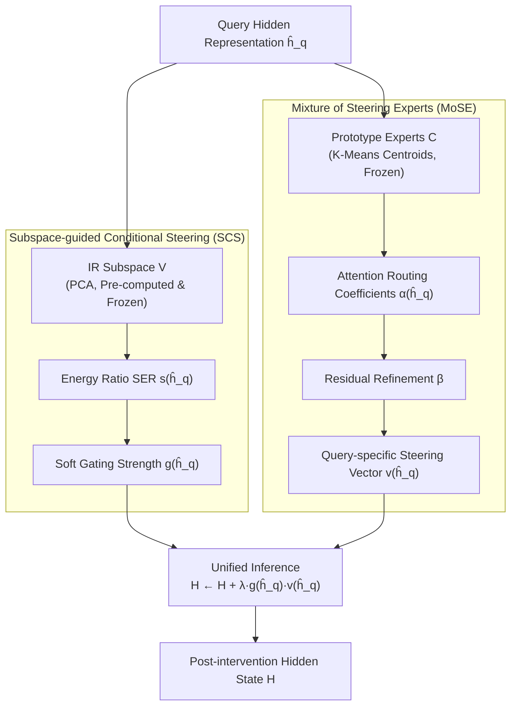

# FineSteer: A Unified Framework for Fine-Grained Inference-Time Steering in Large Language Models

**Conference**: ACL 2026  
**arXiv**: [2604.15488](https://arxiv.org/abs/2604.15488)  
**Code**: [GitHub](https://github.com/YukinoAsuna/FineSteer)  
**Area**: Multimodal VLM  
**Keywords**: Inference-time steering, Conditional steering, Mixture of steering experts, Jailbreak defense, Hallucination mitigation

## TL;DR
FineSteer decomposes inference-time steering into two complementary stages: Subspace-guided Conditional Steering (SCS) determines "when to steer" using the energy ratio of the IR query subspace as a gate; Mixture of Steering Experts (MoSE) determines "how to steer" by dynamically aggregating prototype experts and residual refinement via an attention gating network to generate query-specific steering vectors. It outperforms SOTA on safety and truthfulness benchmarks.

## Background & Motivation

**Background**: Inference-time steering adjusts LLM behavior by modifying hidden representations during inference, avoiding parameter updates. Methods have evolved from global fixed vectors (CAA, ITI, RV) to learned adaptive vectors (AlphaSteer, TruthFlow).

**Limitations of Prior Work**: (1) Global steering vectors are "one-size-fits-all" designs—applying the same intervention to all queries, creating a sharp trade-off between safety and utility (e.g., RV rejects many benign queries while rejecting malicious ones); (2) AlphaSteer learns "when to steer" but applies almost identical vectors to all queries needing intervention, lacking fine-grained calibration of "how to steer"; (3) Low training efficiency—AlphaSteer requires 12,000 general queries to train the conditional matrix.

**Key Challenge**: Effective steering requires simultaneously satisfying three seemingly contradictory goals: effectiveness (sufficient intervention for target queries), utility preservation (no impact on general queries), and training efficiency (learning with minimal data).

**Goal**: Design a unified steering framework that simultaneously satisfies effectiveness, utility preservation, and training efficiency.

**Key Insight**: Decompose inference-time steering into two independent stages, "when" and "how," addressed by specialized mechanisms.

**Core Idea**: SCS uses subspace energy ratio for efficient gating + MoSE uses prototype experts and residual refinement for query-specific vector synthesis.

## Method

### Overall Architecture
FineSteer decomposes "inference-time steering" into two clearly defined sub-problems—when to steer and how to steer—and answers each with a specialized module. Given the hidden representation of a query $\hat{\mathbf{h}}_q$, the Subspace-guided Conditional Steering (SCS) first determines if it falls into the "intervention required (IR)" low-dimensional subspace, outputting a soft gating strength $g(\hat{\mathbf{h}}_q)$. Once the gate is opened, the Mixture of Steering Experts (MoSE) synthesizes a tailored steering vector $\mathbf{v}(\hat{\mathbf{h}}_q)$ for this query on the fly. The final hidden state intervention is unified as $\mathbf{H} \leftarrow \mathbf{H} + \lambda \cdot g(\hat{\mathbf{h}}_q) \cdot \mathbf{v}(\hat{\mathbf{h}}_q)$, where the gate determines the presence of intervention and the experts determine the direction, allowing both to be optimized independently.

### Key Designs

**1. Subspace-guided Conditional Steering (SCS): Modeling "When to Steer" as a One-class Problem**

The difficulty with prior conditional judgment lies in the fact that "general queries" constitute an open, vast distribution that is nearly impossible to model explicitly. AlphaSteer requires over 10,000 general queries to learn "when not to steer." SCS reverses this by modeling only the compact side—the IR queries needing intervention. It uses PCA to project IR query representations into a low-dimensional subspace $\mathbf{V}$. For any new query, it calculates the energy ratio (SER) within this subspace: $s(\hat{\mathbf{h}}_q) = \|V^\top(\hat{\mathbf{h}}_q - \boldsymbol{\mu}_h)\|^2 / \|\hat{\mathbf{h}}_q - \boldsymbol{\mu}_h\|^2$. A higher SER indicates a closer fit to the IR pattern. The gating uses a conservative lower-tail threshold, with a fast decay term $(F(s)/\epsilon)^\gamma$ to suppress intervention strength near zero for queries below the threshold. By characterizing a compact subspace rather than an open distribution, SCS can be established with very few IR queries, significantly reducing training data requirements compared to AlphaSteer.

**2. Mixture of Steering Experts (MoSE): Synthesizing Directions On-the-fly**

Different undesirable behaviors—factual hallucinations, logical errors, jailbreaks—require correction in different directions. A single global vector cannot accommodate this heterogeneity regardless of intensity. MoSE synthesizes vectors in a query-specific manner via "fixed prototypes + learnable routing + residual refinement." It first performs K-Means on the difference vectors $\delta_i = \mathbf{h}_+^{(i)} - \mathbf{h}_-^{(i)}$ from the training set; the centroids serve as prototype experts $\mathbf{C} = [\mathbf{c}_1, ..., \mathbf{c}_K]$ and are frozen. Then, a scaled dot-product attention routes the current query into expert mixture coefficients $\alpha(\hat{\mathbf{h}}_q) = \text{softmax}((\mathbf{W}_K\mathbf{C})^\top(\mathbf{W}_Q\hat{\mathbf{h}}_q) / \sqrt{d_k})$. Finally, a lightweight MLP predicts residual coefficients $\boldsymbol{\beta}$ on the PCA basis space $\mathbf{U}_{res}$ to recover fine-grained directions not covered by prototypes. Prototypes provide the "general direction," while attention and residuals provide "query-specific refinement."

**3. Training Efficient Unified Inference: Learning Only Routing and Refinement Parameters**

Pre-computing and freezing expensive components is the fundamental reason FineSteer maintains low training costs. The SCS subspace, MoSE prototype experts, and residual basis space are all computed once before training and fixed. The only learnable parameters in the entire framework are $\Theta = \{\mathbf{W}_Q, \mathbf{W}_K, \boldsymbol{\beta}\}$. The training objective is straightforward—aligning the synthesized vector with the observed ground-truth difference vectors: $\mathcal{L} = \frac{1}{M}\sum\|\mathbf{v}(\hat{\mathbf{h}}_q^{(i)}) - \delta_i\|^2$. Compared to full-parameter learned steering, this "heavy pre-computation + light learnable routing" division of labor yields much lower computational overhead while retaining query-level adaptability.

### Loss & Training
The training uses MSE to align the predicted steering vector with the ground-truth difference vector, with a regularization term: 
$$\mathcal{L} = \frac{1}{M}\sum\|\mathbf{v}(\hat{\mathbf{h}}_q^{(i)}) - \delta_i\|^2 + \lambda_{reg}\|\Theta\|^2$$
Since prototype experts and basis spaces are pre-computed and frozen, optimization only affects $\Theta$.

## Key Experimental Results

### Main Results

| Task | Model | FineSteer | Prev. SOTA | Gain |
|------|------|-----------|----------|------|
| TruthfulQA | Llama-3 | +7.6% | AlphaSteer | Significant |
| Jailbreak Defense DSR | Multiple Attacks | High | RV/BiPO | High DSR + Utility Preservation |
| General Intent Utility | MT-Bench | Negligible Change | AlphaSteer (Dropped) | Better Utility Preservation |

### Ablation Study

| Configuration | Key Metric | Description |
|------|---------|------|
| W/O SCS (Steer All) | Utility Drops | Gating is key to utility preservation |
| W/O MoSE (Global Vector) | Effectiveness Drops | Query-specific vectors are more effective |
| W/O Residual Refinement | Slight Drop | Residuals complement prototype omissions |
| SCS Hard vs Soft | Soft is Smoother | Soft gating is more robust for boundary queries |

### Key Findings
- SCS achieves reliable conditional steering using only a small number of IR queries (without needing general query data).
- MoSE prototype experts naturally correspond to different types of undesirable behaviors; clustering results are semantically interpretable.
- FineSteer reaches SOTA in both safety and truthfulness domains, proving the framework's universality.
- Training data efficiency is orders of magnitude higher than AlphaSteer.

## Highlights & Insights
- **Decoupling "when" and "how"** is an elegant design—allowing independent optimization of both stages and avoiding the complexity of joint training.
- The **one-class modeling** approach of SCS is clever—modeling "what requires intervention" is much simpler than modeling "what does not," as the former is a compact subspace while the latter is an open distribution.
- The **fixed prototypes + learnable routing** architecture of MoSE achieves an excellent balance between parameter efficiency and adaptability.

## Limitations & Future Work
- The number of prototypes $K$ is determined via K-Means but may not be optimal.
- Validated only on safety and truthfulness; applicability to other targets like creativity or style control is unknown.
- The subspace assumption in SCS might fail if IR queries are highly heterogeneous.
- Added computational overhead during inference is small but non-zero.

## Related Work & Insights
- **vs CAA/ITI**: Global fixed vectors; no query differentiation leading to high utility loss.
- **vs RV**: Aggressive steering causes many benign queries to be rejected.
- **vs AlphaSteer**: Learns conditions but lacks vector diversity; requires massive general data for training.

## Rating
- Novelty: ⭐⭐⭐⭐⭐ Two-stage decomposition of conditional steering and MoE is highly novel.
- Experimental Thoroughness: ⭐⭐⭐⭐⭐ Dual domains (safety + truthfulness), multiple attacks, detailed ablation.
- Writing Quality: ⭐⭐⭐⭐ Strong motivation analysis and complete mathematical formalization.

<!-- RELATED:START -->

## Related Papers

- [\[ACL 2026\] Compositional Steering of Large Language Models with Steering Tokens](compositional_steering_of_large_language_models_with_steering_tokens.md)
- [\[ACL 2026\] Fine-Grained Analysis of Shared Syntactic Mechanisms in Language Models](fine-grained_analysis_of_shared_syntactic_mechanisms_in_language_models.md)
- [\[ACL 2026\] Preference Heads in Large Language Models: A Mechanistic Framework for Interpretable Personalization](preference_heads_in_large_language_models_a_mechanistic_framework_for_interpreta.md)
- [\[ACL 2026\] MINED: Probing and Updating with Multimodal Time-Sensitive Knowledge for Large Multimodal Models](mined_probing_and_updating_with_multimodal_time-sensitive_knowledge_for_large_mu.md)
- [\[ACL 2026\] Knowledge Vector of Logical Reasoning in Large Language Models](knowledge_vector_of_logical_reasoning_in_large_language_models.md)

<!-- RELATED:END -->
