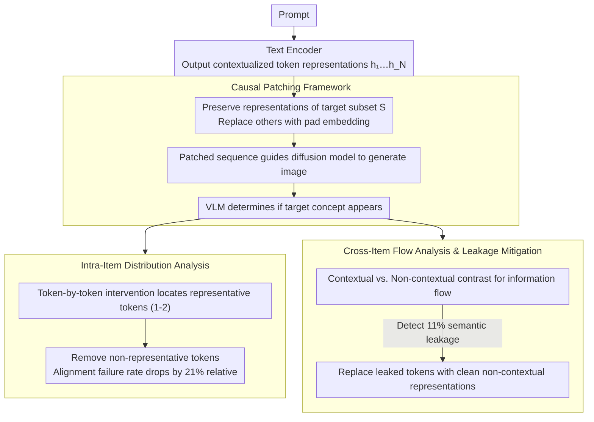

# Follow the Flow: On Information Flow Across Textual Tokens in Text-to-Image Models

**Conference**: ACL 2026  
**arXiv**: [2504.01137](https://arxiv.org/abs/2504.01137)  
**Code**: [https://github.com/tokeron/lens](https://github.com/tokeron/lens)  
**Area**: Image Generation  
**Keywords**: Text-to-Image, Information Flow, Token Representation, Semantic Leakage, Text Encoder

## TL;DR
This paper systematically investigates the token-level information distribution of text encoder outputs in text-to-image models through a causal intervention framework. It discovers that the semantics of lexical items are typically concentrated on 1-2 representative tokens, and cross-item information flow leads to semantic leakage and image misinterpretation in 11% of cases. The authors propose simple and effective token-level intervention methods to improve alignment.

## Background & Motivation

**Background**: Text-to-image (T2I) models consist of two parts: a text encoder and a diffusion model. The text encoder transforms user prompts into representations that guide the diffusion process. Despite their widespread use, T2I models frequently suffer from text-image misalignment, where generated images fail to accurately capture the objects and relationships in the text.

**Limitations of Prior Work**: Previous work mainly focused on improving alignment by modifying the diffusion process (especially the cross-attention mechanism), implicitly assuming that each text token reliably encodes its corresponding concept. However, this assumption has never been systematically verified—is the information distribution in token representations uniform or concentrated? Is there information crossover between different lexical items?

**Key Challenge**: Many alignment improvement methods in T2I models (such as Attend-and-Excite) treat all tokens equally. However, if the information distribution is non-uniform or if semantic leakage occurs between tokens, the effectiveness of these methods is fundamentally constrained.

**Goal**: To answer two fundamental questions—(1) is the semantics of a lexical item uniformly distributed across all its tokens or concentrated on a few? (2) Does each token only encode its own lexical item, or does it also absorb information from neighboring items?

**Key Insight**: Using causal intervention (patching) techniques to isolate the contribution of specific tokens by replacing other tokens with pad embeddings, and then generating images to directly examine what information those tokens encode. This is more reliable than probing methods because it tests the information that the diffusion model actually utilizes.

**Core Idea**: Reveal the patterns of information distribution in text encoders through token-by-token causal intervention, and design token-level intervention methods based on these findings to improve T2I alignment.

## Method

### Overall Architecture
The core of this paper is a set of causal intervention probes that "infer token meaning from generation results." Given a T2I prompt, the text encoder first produces contextualized representations $h_1, \ldots, h_N$ for all tokens. To test what a specific token subset $S$ encodes, the representations within $S$ are preserved while all other tokens are replaced with pad embeddings. This patched sequence is then fed into the diffusion model to generate an image, and a VLM (Qwen2-VL-72B) judges whether the target concept appears in the image. "Appearance in the image = the subset indeed encodes that concept." Thus, the same intervention can address intra-item distribution—"where is the semantics of a word concentrated?"—and cross-item flow—"does a token absorb information from neighbors?"

### Key Designs

**1. Causal Patching: Verifying if information is truly used via downstream generation**

Probing methods may learn spurious correlations, and attention analysis can often be misleading; both only "observe" representations without testing whether the diffusion model actually relies on that information. Causal Patching directly delegates the judgment to the generation results: for a target token subset $S$, it constructs $\tilde{t}_i = h_i$ (if $i \in S$), otherwise $\tilde{t}_i = p_i$ (pad embedding). This representation, which only preserves $S$, guides the diffusion process. Whether the target concept appears in the generated image determines if $S$ is composed of "representative tokens." Since the signal chain reaches the actual generated image, this verification measures "what information the downstream component actually uses," which is far more reliable than indirect observation and serves as the basic tool for both subsequent analyses.

**2. Intra-Item Representation: Word semantics are actually compressed into 1-2 tokens**

By applying the above intervention token-by-token within the same lexical item, one can see whether semantics are diluted or concentrated. The authors perform patching for each token of a word individually and determine if the generated image contains that word. The results show that in 89% of cases, at least one representative token exists, and usually only 1-2 tokens are sufficient to represent the entire concept (e.g., in the three tokens of "pelican," only "lic" sustains the pelican concept). Non-representative tokens account for 52% in multi-token lexical items. Even more counter-intuitively, removing these non-representative tokens does not degrade quality but instead reduces the generation failure rate by a relative 21%—indicating that the encoder output contains many "noise" tokens that interfere with diffusion, and simple pruning yields benefits.

**3. Cross-Item & Semantic Leakage Mitigation: Locating and blocking encoder-side semantic "contamination"**

Applying the same intervention to different targets allows tracking whether information flows between different lexical items. For each lexical item, images are generated under "contextual" and "non-contextual" conditions to compare whether contextualized representations have absorbed information from other items. Statistics show that 89% of word pairs remain isolated, but information flow still occurs in 11% of cases, with polysemous words being particularly problematic—for example, "pool" in "a pool by a table" is influenced by context to be interpreted as a billiard table rather than a swimming pool. Once a misinterpretation caused by such leakage is identified, the fix is lightweight: replace the contextualized representation of the leaked token back with its "clean" non-contextual representation. On FLUX-Schnell, this can suppress the semantic leakage rate from 94% to 14%, directly hitting the root cause of alignment failure at the encoder side.

### Loss & Training
To avoid running a full generation every time to find redundant tokens, the authors trained an additional single-layer linear classifier. It predicts whether a token is redundant directly from its token embedding, achieving 90% precision and 83% accuracy, thereby allowing real-time filtering of redundant tokens during the encoding stage.

## Key Experimental Results

### Main Results

| Non-representative tokens removed | Number of Prompts | Accuracy Before Removal | Accuracy After Removal | Unaffected | Improved |
|----------------------|---------|------------|------------|---------|------|
| 1 | 144 | 81.25% | 83.33% | 98.29% | 14.83% |
| 2 | 98 | 82.65% | 88.78% | 100% | 35.27% |
| Total | 339 | 83.48% | 87.02% | 98.90% | 25.00% |

### Ablation Study

| Model | Initial Leakage Rate | RAG-Diffusion | Patching (Ours) |
|------|-----------|---------------|-----------------|
| FLUX-Dev | 79% | 39% | 20% |
| FLUX-Schnell | 94% | 43% | 14% |

### Key Findings
- Word semantics are typically concentrated on 1-2 representative tokens; non-representative tokens account for 52% of multi-token items, and removing them relatively improves alignment by 21%.
- Cross-item information flow does not exist between 89% of lexical items, but it occurs in 11% of cases, leading to semantic leakage especially in polysemous words.
- Encoder type affects representative token position: in bidirectional T5, representative tokens can appear anywhere; in unidirectional Gemma/CLIP, they always appear at the last token.
- The [CLS] token of the CLIP encoder concentrates most of the semantic information, leading to weak information content in other tokens and limiting token-level interpretability.

## Highlights & Insights
- The discovery that "removing non-representative tokens actually improves alignment" is a counter-intuitive but far-reaching conclusion—it implies that T2I model text encoder outputs contain significant "noise" tokens that may interfere with the diffusion model. Simple token pruning can enhance alignment quality by 21%.
- The mechanism analysis of semantic leakage is insightful: in "a pool by a table," the representation of "pool" is contaminated by context and encoded as the "billiard table" concept, whereas in "a pool by a chair," it maintains the "swimming pool" meaning. This reveals a systematic failure mode of word disambiguation in text encoders.
- The generalization potential of the Patching method is noteworthy: the same mechanism can be used for polysemy control (users actively choosing word meanings) and bias mitigation (e.g., eliminating gender-context-driven biases for "runway" between fashion and airports), transforming an analytical tool into a practical generation control method.

## Limitations & Future Work
- Prompts are concentrated on object-centric simple syntax; generalization to spelling errors, rare words, or abstract concepts remains to be explored.
- Although VLM judgment shows high consistency with human judgment (Cohen's Kappa 0.868), it is still an approximate evaluation.
- The formation mechanism of representative tokens in bidirectional encoders (e.g., why "T" becomes the representative token in "T-shirt") remains an open question.
- The redundant token classifier was only trained and evaluated on FLUX-schnell; its transferability to other T2I models needs verification.

## Related Work & Insights
- **vs Attend-and-Excite (Chefer et al., 2023)**: Attend-and-Excite modifies attention during the diffusion stage to improve alignment but implicitly assumes correct token encoding; this paper proves the problem may originate in the encoding stage, making root-cause fixes more efficient.
- **vs RAG-Diffusion (Tan et al., 2024)**: RAG-Diffusion improves alignment by restricting diffusion attention via bounding boxes, but it is less effective than this paper's patching method in semantic leakage scenarios (FLUX-Schnell: 43% vs 14% leakage rate).
- **vs Patchscopes (Ghandeharioun et al., 2024)**: Patchscopes analyze token information through representation decoding but do not test whether downstream components actually use that information; this paper's causal intervention method directly validates information effectiveness via image generation.

## Rating
- Novelty: ⭐⭐⭐⭐ First systematic study of token-level information distribution in T2I text encoders, revealing representative tokens and semantic leakage.
- Experimental Thoroughness: ⭐⭐⭐⭐ Validated across 4 T2I models and 3 encoder types, with human evaluation and quantitative analysis.
- Writing Quality: ⭐⭐⭐⭐⭐ Extremely intuitive diagrams; the transition from analysis to application is natural and smooth.
- Overall Recommendation: ⭐⭐⭐⭐ Provides a new perspective and practical tools for researching text encoders in T2I models.
- Reproducibility: ⭐⭐⭐⭐ Code is open-sourced; experimental setup is clear, based on public models and datasets.
- Impact: ⭐⭐⭐⭐ Holds practical guidance significance for understanding and improving T2I alignment.

<!-- RELATED:START -->

## Related Papers

- [\[ICCV 2025\] VITAL: More Understandable Feature Visualization through Distribution Alignment and Relevant Information Flow](../../ICCV2025/interpretability/vital_more_understandable_feature_visualization_through_distribution_alignment_a.md)
- [\[ACL 2026\] Compositional Steering of Large Language Models with Steering Tokens](compositional_steering_of_large_language_models_with_steering_tokens.md)
- [\[ACL 2026\] HistLens: Mapping Idea Change across Concepts and Corpora](histlens_mapping_idea_change_across_concepts_and_corpora.md)
- [\[ICLR 2026\] Concepts' Information Bottleneck Models](../../ICLR2026/interpretability/concepts_information_bottleneck_models.md)
- [\[ACL 2026\] A Systematic Comparison between Extractive Self-Explanations and Human Rationales in Text Classification](a_systematic_comparison_between_extractive_self-explanations_and_human_rationale.md)

<!-- RELATED:END -->
