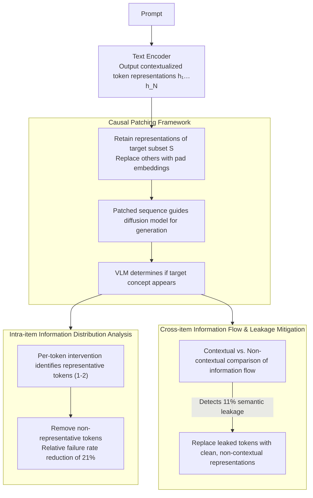

# Follow the Flow: On Information Flow Across Textual Tokens in Text-to-Image Models

**Conference**: ACL 2026  
**arXiv**: [2504.01137](https://arxiv.org/abs/2504.01137)  
**Code**: [https://github.com/tokeron/lens](https://github.com/tokeron/lens)  
**Area**: Image Generation  
**Keywords**: Text-to-Image, Information Flow, Token Representation, Semantic Leakage, Text Encoder

## TL;DR
This paper systematically investigates the token-level information distribution in text encoder outputs within text-to-image models using a causal intervention framework. It finds that the semantics of lexical items are typically concentrated on 1-2 representative tokens, and cross-item information flow leads to semantic leakage and image misinterpretation in 11% of cases. A simple yet effective token-level intervention method is proposed to improve alignment.

## Background & Motivation

**Background**: Text-to-image (T2I) models consist of two main components: a text encoder and a diffusion model. The text encoder transforms user prompts into representations that guide the diffusion process. Despite their wide use, T2I models frequently suffer from text-image misalignment, where generated images fail to accurately capture the objects and relationships described in the text.

**Limitations of Prior Work**: Previous work mainly improved alignment by modifying the diffusion process (especially the cross-attention mechanism), implicitly assuming that each text token reliably encodes its corresponding concept. However, this assumption has never been systematically verified—is information distribution in token representations uniform or concentrated? Is there information crosstalk between different lexical items?

**Key Challenge**: Many alignment improvement methods in T2I models (such as Attend-and-Excite) treat all tokens equally. However, if information distribution is non-uniform or if semantic leakage occurs between tokens, the effectiveness of these methods is fundamentally constrained.

**Goal**: To answer two fundamental questions: (1) Is the semantics of a lexical item uniformly distributed across all its tokens or concentrated on a few? (2) Does each token only encode its own lexical item, or does it also absorb information from neighboring items?

**Key Insight**: Using causal intervention (patching) techniques, the contribution of specific tokens is isolated by replacing other tokens with pad embeddings. Images are then generated to directly examine what information those tokens encode—this is more reliable than probing methods because it tests the information actually utilized by the diffusion model.

**Core Idea**: Reveal information distribution patterns in text encoders through per-token causal intervention and design token-level intervention methods based on these findings to improve T2I alignment.

## Method

### Overall Architecture
The core of this paper is a set of causal intervention probes that "infer token meaning from generation results." Given a T2I prompt, the text encoder outputs contextualized representations $h_1, \ldots, h_N$ for all tokens. To examine what a specific token subset $S$ encodes, the representations within $S$ are retained while all other tokens are replaced with pad embeddings. This patched sequence is sent to the diffusion model to generate an image, and a VLM (Qwen2-VL-72B) determines if the target concept appears. "Presence in image = the subset indeed encodes the concept." Thus, the same intervention can address "where a word's semantics are concentrated" at the intra-item level and "whether a token absorbs information from neighbors" at the cross-item level.

### Key Designs

**1. Causal Patching: Verifying if information is actually used via downstream generation**

Probing methods may learn spurious correlations, and attention analysis can be misleading; both only "observe" representations without testing if the diffusion model truly relies on that information. Causal Patching leaves the judgment to the generation results: for a target token subset $S$, construct $\tilde{t}_i = h_i$ if $i \in S$, otherwise $\tilde{t}_i = p_i$ (pad embedding). This representation, retaining only $S$, guides the diffusion. The presence of the target concept in the generated image determines if $S$ represents "representative tokens." Since the signal chain reaches the actual generated image, this verification measures "what information the downstream components truly use," making it more reliable than indirect observations.

**2. Intra-item Representation: Word semantics are concentrated on only 1-2 tokens**

Applying the above intervention per-token within the same lexical item reveals whether semantics are diluted or concentrated. The authors perform patching for each token of a word and determine the presence of the word in the generated image. Results show that in 89% of cases, at least one representative token exists, and usually only 1-2 tokens suffice to represent the entire concept (e.g., in "pelican," only "lic" among the three tokens supports the concept). Non-representative tokens account for 52% of multi-token lexical items. Counter-intuitively, removing these non-representative tokens does not degrade quality but reduces the generation failure rate by a relative 21%—indicating that encoder outputs contain "noise" tokens that interfere with diffusion. Simple pruning yields gains.

**3. Cross-item & Semantic Leakage Mitigation: Locating and blocking encoder-side semantic "crosstalk"**

The same intervention can track information flow between different lexical items: images are generated for each lexical item under "contextual" and "non-contextual" conditions to compare whether contextualized representations absorb information from other items. Statistics show 89% of word pairs remain isolated, but information flow occurs in 11% of cases, particularly with polysemous words—for example, "pool" in "a pool by a table" is influenced by context to mean a billiard table rather than a swimming pool. Once identified as the cause of misinterpretation, the fix is lightweight: replace the contextualized representation of the leaked token with its "clean" non-contextual representation. On FLUX-Schnell, this reduces the semantic leakage rate from 94% to 14%, directly addressing the root of alignment failure at the encoder.

### Loss & Training
To avoid running generation every time to find redundant tokens, the authors trained an additional single-layer linear classifier. It predicts whether a token is redundant directly from its token embedding, achieving 90% precision and 83% accuracy. This allows real-time filtering of redundant tokens during the encoding stage.

## Key Experimental Results

### Main Results

| Number of non-representative tokens removed | Number of Prompts | Accuracy Before Removal | Accuracy After Removal | Unaffected | Gain |
|----------------------|---------|------------|------------|---------|------|
| 1 | 144 | 81.25% | 83.33% | 98.29% | 14.83% |
| 2 | 98 | 82.65% | 88.78% | 100% | 35.27% |
| Total | 339 | 83.48% | 87.02% | 98.90% | 25.00% |

### Ablation Study

| Model | Initial Leakage Rate | RAG-Diffusion | Patching (Ours) |
|------|-----------|---------------|-----------------|
| FLUX-Dev | 79% | 39% | 20% |
| FLUX-Schnell | 94% | 43% | 14% |

### Key Findings
- Word semantics are typically concentrated on 1-2 representative tokens. Non-representative tokens account for 52% of multi-token items, and removing them relatively improves alignment by 21%.
- No cross-item information flow exists between 89% of lexical items, but information flow occurs in 11% of cases, where polysemous words are particularly prone to semantic leakage.
- Encoder types affect representative token positions: in bidirectional T5, representative tokens can appear anywhere; in unidirectional Gemma/CLIP, they are always the last token.
- The [CLS] token in CLIP encoders concentrates most semantic information, resulting in weak information in other tokens and limiting token-level interpretability.

## Highlights & Insights
- The finding that "removing non-representative tokens improves alignment" is counter-intuitive but far-reaching—it implies that T2I text encoder outputs contain significant "noise" tokens that may interfere with the diffusion model. Simple token pruning can enhance alignment quality by 21%.
- The analysis of semantic leakage mechanisms is excellent: in "a pool by a table," the "pool" representation is contaminated by context and encoded as a "billiard table" concept, whereas in "a pool by a chair," it retains the "swimming pool" meaning. This reveals a systematic failure mode of polysemy disambiguation in text encoders.
- The generalization potential of the Patching method is noteworthy: the same mechanism can be used for polysemy control (users actively choosing word meanings) and bias mitigation (e.g., eliminating gender-context-driven biases for "runway" between fashion and airports), transforming an analytical tool into a practical generation control method.

## Limitations & Future Work
- Prompts are focused on object-centric simple grammatical cases; generalization to typos, rare words, or abstract concepts remains to be explored.
- While VLM evaluation shows high consistency with human judgment (评估 coefficients 0.868), it remains an approximate assessment.
- The mechanism of representative token formation in bidirectional encoders (e.g., why "T" becomes the representative token in "T-shirt") is still an open question.
- The redundant token classifier was only trained and evaluated on FLUX-schnell; transferability to other T2I models requires verification.

## Related Work & Insights
- **vs Attend-and-Excite (Chefer et al., 2023)**: Attend-and-Excite modifies attention during diffusion to improve alignment but assumes tokens are encoded correctly; this paper proves the problem may stem from the encoding stage and fixes it more efficiently at the root.
- **vs RAG-Diffusion (Tan et al., 2024)**: RAG-Diffusion improves alignment by restricting diffusion attention via bounding boxes, but is less effective than the patching method in semantic leakage scenarios (FLUX-Schnell: 43% vs 14% leakage rate).
- **vs Patchscopes (Ghandeharioun et al., 2024)**: Patchscopes analyzes token information through representation decoding but does not test if downstream components actually use that information; this paper's causal intervention method directly verifies information validity through image generation.

## Rating
- Novelty: ⭐⭐⭐⭐ First systematic study of token-level information distribution in T2I text encoders, revealing representative tokens and semantic leakage.
- Experimental Thoroughness: ⭐⭐⭐⭐ Validated across 4 T2I models and 3 encoder types, including human evaluation and quantitative analysis.
- Writing Quality: ⭐⭐⭐⭐⭐ Extremely intuitive diagrams, with a natural transition from analysis to application.
- Overall Recommendation: ⭐⭐⭐⭐ Provides a new perspective and practical tools for researching T2I text encoders.
- Reproducibility: ⭐⭐⭐⭐ Open-sourced code with clear experimental settings based on public models and datasets.
- Impact: ⭐⭐⭐⭐ Offers practical guidance for understanding and improving T2I alignment.

<!-- RELATED:START -->

## Related Papers

- [\[ICLR 2026\] Flow-Disentangled Feature Importance](../../ICLR2026/interpretability/flow-disentangled_feature_importance.md)
- [\[ACL 2026\] Compositional Steering of Large Language Models with Steering Tokens](compositional_steering_of_large_language_models_with_steering_tokens.md)
- [\[ICCV 2025\] VITAL: More Understandable Feature Visualization through Distribution Alignment and Relevant Information Flow](../../ICCV2025/interpretability/vital_more_understandable_feature_visualization_through_distribution_alignment_a.md)
- [\[ACL 2026\] HistLens: Mapping Idea Change across Concepts and Corpora](histlens_mapping_idea_change_across_concepts_and_corpora.md)
- [\[CVPR 2026\] Where Culture Fades: Revealing the Cultural Gap in Text-to-Image Generation](../../CVPR2026/interpretability/where_culture_fades_revealing_the_cultural_gap_in_text-to-image_generation.md)

<!-- RELATED:END -->
