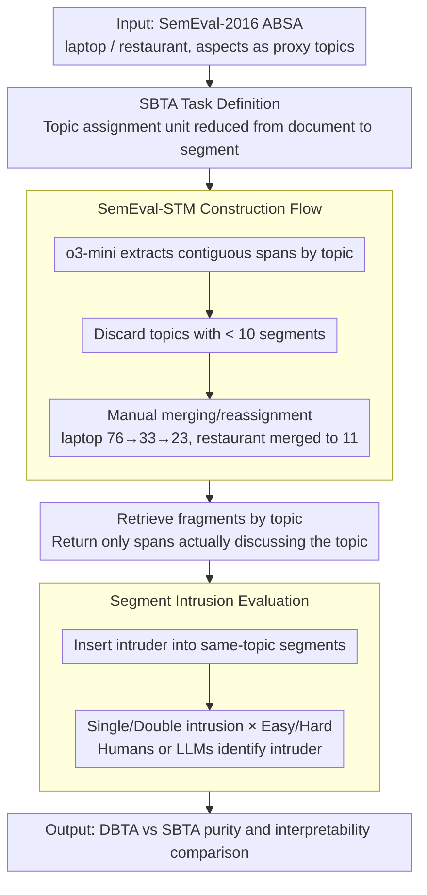

# From Documents to Segments: A Contextual Reformulation for Topic Assignment

**Conference**: ACL2026 Findings  
**arXiv**: [2605.17714](https://arxiv.org/abs/2605.17714)  
**Code**: Dataset https://huggingface.co/datasets/LG-AI-Research/SemEval-STM; Code repository cache not provided  
**Area**: Topic Modeling / Interpretable Text Analysis / NLP Understanding  
**Keywords**: Topic modeling, text segmentation, topic contamination, SemEval-STM, segment intrusion  

## TL;DR
This paper shifts the fundamental unit of topic assignment from documents to segments. It proposes SBTA and the SemEval-STM dataset, demonstrating that assigning topics based on semantic segments in multi-topic short texts significantly improves topic purity, interpretability, and downstream retrieval utility.

## Background & Motivation
**Background**: Traditional topic modeling typically treats documents as the basic unit, representing each document as a mixture of one or more topics. LDA, BERTopic, and recent LLM-based topic modeling follow this approach, improving only in topic generation, label naming, or semantic representation.

**Limitations of Prior Work**: In real-world applications, many texts do not discuss only one topic. A product review might cover price, quality, service, and appearance simultaneously; employee feedback might discuss compensation, culture, and promotion at once. Document-level topic assignment mixes these disparate topics, leading to topic contamination: retrieving a topic returns an entire multi-topic document rather than the most relevant specific statements.

**Key Challenge**: The goal of topic modeling is to obtain clean, interpretable, and retrievable topic sets, but the document unit is often coarser than the topics themselves. The more heterogeneous a document is, the more likely document-level assignment will introduce irrelevant content into topic clusters.

**Goal**: The authors aim to formally redefine topic assignment: assigning topics not to documents, but to short, semantically self-consistent text segments, and constructing a dataset and task to evaluate this setting.

**Key Insight**: The paper borrows from aspect-based sentiment analysis (ABSA) data because ABSA naturally contains aspect labels, which are suitable as proxy topics. LLMs are used to extract text spans corresponding to each aspect.

**Core Idea**: Change the fundamental object of topic allocation to segments, allowing each topic to aggregate truly relevant semantic fragments rather than complete documents containing off-topic content.

## Method
SBTA can be understood as a "granularity restructuring of topic modeling." It does not require reinventing all topic modeling algorithms but instead changes the units of input and output: documents are first split into segments expressing single or few related topics, and then topic assignment, clustering evaluation, and human consistency assessment are performed at the segment level.

### Overall Architecture
Given a corpus $\mathcal{D}=\{d_1,\ldots,d_D\}$ and $K$ topics, DBTA associates topics with the entire document. SBTA constructs a segment set $\mathcal{Q}_d$ for each document, where each segment is a combination of a continuous token span $[i:j]$ and a set of topics $\mathcal{T}$. If a user focuses on topic $k$, the system returns $\mathcal{Q}_{d,k}=\{Q\in\mathcal{Q}_d|k\in\mathcal{T}(Q)\}$, which are the fragments in the document actually discussing that topic.

At the data level, the authors build SemEval-STM. Based on the laptop and restaurant domains of SemEval-2016 ABSA, aspect labels are used as topic proxies. An LLM extracts relevant segments for each topic, followed by post-processing, manual merging, and reassignment to form a benchmark supporting both DBTA and SBTA comparisons.

### Key Designs

**1. Segment-based Topic Allocation Task Definition: Reducing the atomic unit of topic assignment from documents to semantic segments.**

What users truly want during text analysis is to know "which sentences talk about price / service / quality," rather than receiving a whole review that discusses price, quality, service, and appearance simultaneously. Document-based Topic Allocation (DBTA) mixes these heterogeneous contents into the same topic cluster, causing topic contamination. SBTA changes the assignment object to segments: each segment is defined as $([i:j], \mathcal{T})$, where $[i:j]$ is a contiguous token span and $\mathcal{T}$ is the set of topics involved in that span.

Since a segment usually covers only one or a few topics, it is naturally purer than an entire document. When retrieving topic $k$, the system returns $\mathcal{Q}_{d,k}=\{Q\in\mathcal{Q}_d\mid k\in\mathcal{T}(Q)\}$, the set of fragments actually discussing that topic, rather than bringing along off-topic content from the whole document.

**2. SemEval-STM Construction Flow: Using ABSA aspects as proxy topics to build a fair benchmark for DBTA/SBTA comparison.**

To verify that "changing the unit is effective," data supporting both document-level and segment-level comparison is needed. Annotating topics from scratch is too costly, so the authors use the laptop and restaurant domains from SemEval-2016 ABSA, which have built-in aspect labels serving as proxy topics. During construction, o3-mini extracts maximal contiguous spans by topic and document. Topics with fewer than 10 segments are discarded. Spans are then manually merged and reassigned: laptop was reduced from 76 topics to 33 and then to 23, while restaurant was organized into 11.

A deliberate conservative design choice: DBTA and SBTA share the same set of topics and use short texts where "off-topic content is present but not dominant." If extremely heterogeneous documents were used, SBTA would win too easily, making the comparison less credible.

**3. Segment Intrusion Evaluation: Shifting interpretability assessment from "how similar are the topic words" to "are these segments of the same category."**

Traditional word intrusion only picks mixed-in words from topic words, which cannot measure whether segments are coherent in context and is mismatched with the segment granularity of SBTA. The authors modified this into segment intrusion: an intruder segment that semantically does not belong to the topic is inserted into a group of segments belonging to the same topic. Humans or LLMs are then asked to identify it. A higher success rate indicates higher consistency in the original topic cluster.

The task is divided into four difficulty levels: single/double intrusion, crossed with easy (intruder from a different domain) and hard (intruder from the same domain). Hard double intrusion is the most difficult (human consistency $\kappa$ drops to 0.86–0.88), but overall it maintains high inter-annotator agreement, proving the stability of the evaluation.

### Loss & Training
This paper does not propose an end-to-end neural training loss but focuses on task reformulation, data construction, and evaluation protocols. Experiments use LDA, BERTopic, and various LLM-based topic assignment methods as baselines or model families. For LLM methods, segments and a predefined candidate topic list are provided, and the model selects the most relevant topic, similar to the assignment phase of TopicGPT, but with segments as the assignment unit.

## Key Experimental Results

### Main Results

| Comparison | Domain | DBTA | SBTA | Conclusion |
|------------|--------|------|------|------------|
| DB Index ↓ | Laptop | 20.1768 | 6.2767 | SBTA clusters are tighter |
| CH Index ↑ | Laptop | 3.0037 | 15.5184 | SBTA has stronger inter-class separation |
| Silhouette ↑ | Laptop | -0.0522 | 0.0460 | SBTA improves from negative to positive |
| XB Index ↓ | Laptop | 95.8645 | 10.8348 | SBTA significantly reduces intra-class mixing |
| DB Index ↓ | Restaurant | 70.9506 | 6.6657 | DBTA is particularly disorganized in restaurant |
| CH Index ↑ | Restaurant | 1.7204 | 22.6709 | SBTA topic structure is more evident |
| Silhouette ↑ | Restaurant | -0.0303 | 0.0222 | SBTA is more separable |
| XB Index ↓ | Restaurant | 1233.5519 | 12.1985 | Segment-level assignment drastically reduces topic contamination |

### Ablation Study

| Task / Metric | Method | Laptop | Restaurant | Description |
|---------------|--------|--------|------------|-------------|
| Label-based F1 ↑ | LDA | 0.3577 | 0.4512 | Traditional topic models are weaker |
| Label-based F1 ↑ | BERTopic | 0.5102 | 0.6692 | Embedding clustering shows significant improvement |
| Label-based F1 ↑ | DeepSeek-v3 | 0.7383 | 0.8278 | LLM assignment performs strongly |
| Label-based F1 ↑ | Claude-3.7-Sonnet | 0.7182 | 0.8353 | Best model reported for restaurant in the paper |
| Inter-annotator $\kappa$ | Laptop intrusion | easy single 1.0000 / easy double 1.0000 / hard single 0.9519 / hard double 0.8650 | - | Hard double is the most difficult but remains high |
| Inter-annotator $\kappa$ | Restaurant intrusion | easy single 0.9514 / easy double 0.9550 / hard single 0.9753 / hard double 0.8800 | - | Segment intrusion has stable human consistency |

### Key Findings
- SBTA significantly outperforms DBTA on clustering metrics, indicating that topic contamination stems primarily from documents being too coarse a unit rather than specific models being insufficient.
- After topic shuffling, clustering metrics for SBTA drop more sharply, showing that the original SBTA structure carries stronger semantic organization; DBTA is insensitive to shuffling, exposing its already loose clusters.
- Traditional coherence metrics are unstable for SBTA because they rely on word co-occurrence; short segments naturally have few co-occurrences, making it difficult for these metrics to distinguish topic quality.
- LLMs are significantly stronger than LDA/BERTopic in label-based topic assignment, but segment intrusion shows many models still perform below human levels, indicating room for improvement in fine-grained semantic consistency.

## Highlights & Insights
- The core contribution is the change of unit rather than model stacking. It points out that many interpretability issues in topic modeling arise because "the document is not the appropriate atomic unit."
- The choice of SemEval-STM is clever. ABSA aspect labels provide natural weak supervision, avoiding the cost of manual labeling from scratch while retaining the complexity of multi-topic interleaving in real reviews.
- Segment intrusion is an insightful evaluation. It shifts from "how similar are the topic words" to "can these semantic fragments be seen as the same category by humans," which is closer to the interpretability analysts actually care about.
- For practical product feedback, surveys, customer logs, and review analysis, SBTA is more aligned with the workflow than DBTA because downstream tasks often require reading specific evidence sentences rather than entire documents.

## Limitations & Future Work
- Segment extraction relies on LLMs; despite manual post-processing, boundary inconsistencies and automatic system biases may persist.
- Traditional coherence metrics do not match the span-level goals of SBTA, meaning the existing automatic evaluation framework needs redesigning.
- SemEval-STM primarily consists of short reviews and responses; verification in long documents, news, meeting minutes, or customer conversations is still needed.
- Currently, many experiments use predefined topic lists. Real-world unsupervised deployment requires a full loop of topic generation and segment assignment, along with assessment of topic drift and label merging quality.

## Related Work & Insights
- **vs LDA / BERTopic**: LDA and BERTopic typically output document-level topic distributions or clusters. SBTA changes the fundamental object, allowing these methods or LLM assignment to operate on purer segments.
- **vs TopicGPT**: TopicGPT uses segments as explanatory evidence, but topics remain primarily document-oriented; this paper promotes the segment to a formal unit of topic assignment.
- **vs Topic Segmentation**: Topic segmentation focuses on where to split a document, whereas SBTA focuses on which topic a split segment should be assigned to and how to use it for topic modeling. The two are complementary.

## Rating
- Novelty: ⭐⭐⭐⭐☆ The task reformulation is clear and technically straightforward, offering an effective correction to fundamental assumptions in topic modeling.
- Experimental Thoroughness: ⭐⭐⭐⭐☆ Data construction, DBTA/SBTA comparison, LLM benchmarks, and intrusion evaluations are relatively complete; long-document scenarios are lacking.
- Writing Quality: ⭐⭐⭐⭐☆ Motivations and examples are easy to understand; appendix tables are thorough, though some main results rely on the appendix.
- Value: ⭐⭐⭐⭐☆ Practical for user feedback analysis, survey mining, and corporate insight; also provides a finer-grained evaluation direction for LLM topic modeling.

<!-- RELATED:START -->

## Related Papers

- [\[ICML 2026\] Sparse Autoencoders are Topic Models](../../ICML2026/interpretability/sparse_autoencoders_are_topic_models.md)
- [\[ACL 2026\] METER: Evaluating Multi-Level Contextual Causal Reasoning in Large Language Models](meter_evaluating_multi-level_contextual_causal_reasoning_in_large_language_model.md)
- [\[ACL 2025\] Llama See, Llama Do: A Mechanistic Perspective on Contextual Entrainment and Distraction in LLMs](../../ACL2025/interpretability/llama_see_llama_do_entrainment.md)
- [\[ACL 2026\] Interpreting Style Representations via Style-Eliciting Prompts](interpreting_style_representations_via_style-eliciting_prompts.md)
- [\[ACL 2026\] DPN-LE: Dual Personality Neuron Localization and Editing for Large Language Models](dpn-le_dual_personality_neuron_localization_and_editing_for_large_language_model.md)

<!-- RELATED:END -->
