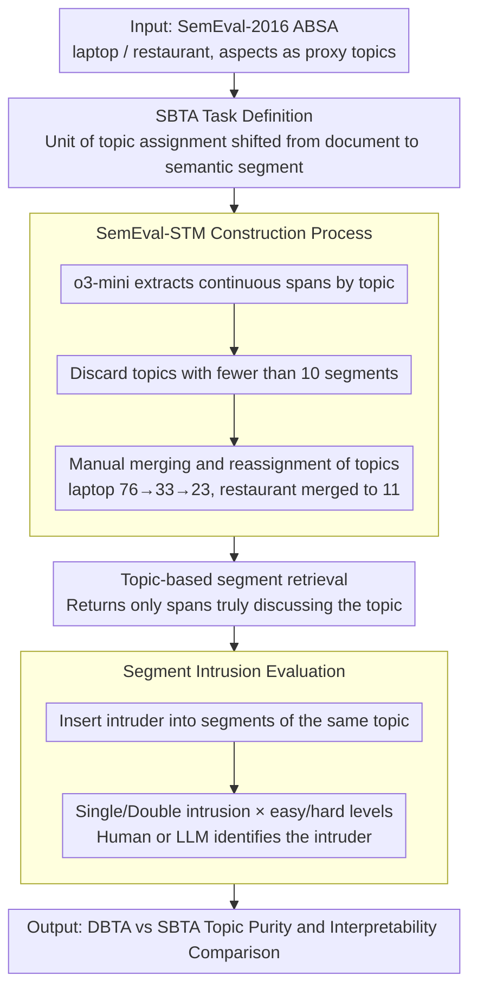

# From Documents to Segments: A Contextual Reformulation for Topic Assignment

**Conference**: ACL2026 Findings  
**arXiv**: [2605.17714](https://arxiv.org/abs/2605.17714)  
**Code**: Dataset https://huggingface.co/datasets/LG-AI-Research/SemEval-STM; Code repository cache not provided  
**Area**: Topic Modeling / Interpretable Text Analysis / NLP Understanding  
**Keywords**: Topic Modeling, Text Segmentation, Topic Contamination, SemEval-STM, segment intrusion  

## TL;DR
This paper shifts the fundamental unit of topic assignment from documents to segments, proposing SBTA and the SemEval-STM dataset. It demonstrates that assigning topics based on semantic segments in multi-topic short texts significantly improves topic purity, interpretability, and downstream retrieval utility.

## Background & Motivation
**Background**: Traditional topic modeling typically uses the document as the fundamental unit, representing each document as a mixture of one or more topics. LDA, BERTopic, and recent LLM-based topic modeling follow this logic, merely enhancing topic generation, label naming, or semantic representation.

**Limitations of Prior Work**: In real-world applications, many texts are not "about a single topic." A product review might simultaneously discuss price, quality, service, and appearance; employee feedback might cover compensation, culture, and promotion. Document-level topic assignment mixes these diverse topics, leading to "topic contamination": when retrieving a specific topic, the system returns entire multi-topic documents rather than the most relevant specific statements.

**Key Challenge**: The goal of topic modeling is to obtain clear, interpretable, and retrievable topic sets, but the document unit is often coarser than the topic itself. The more heterogeneous a document is, the more likely document-level assignment is to introduce irrelevant content into topic clusters.

**Goal**: The authors aim to formally redefine topic assignment: instead of assigning topics to documents, topics are assigned to short, semantically self-consistent text segments. They also build a dataset and task to evaluate this setting.

**Key Insight**: The paper borrows data from aspect-based sentiment analysis (ABSA), because ABSA naturally contains aspect labels suitable as proxy topics. LLMs are used to extract text spans corresponding to each aspect.

**Core Idea**: Change the fundamental object of topic allocation to segments, allowing each topic to aggregate truly relevant semantic fragments rather than complete documents containing many off-topic elements.

## Method
SBTA can be understood as a "granular restructuring of topic modeling." It does not require reinventing all topic modeling algorithms but changes the unit of input and output: documents are first split into segments expressing single or few related topics, and then topic assignment, cluster evaluation, and human consistency assessment are performed at the segment level.

### Overall Architecture
Given a corpus $\mathcal{D}=\{d_1,\ldots,d_D\}$ and $K$ topics, DBTA (Document-Based) associates topics with the entire document. SBTA constructs a set of segments $\mathcal{Q}_d$ for each document, where each segment is a combination of a continuous token span $[i:j]$ and a set of topics $\mathcal{T}$. If a user focuses on topic $k$, the system returns $\mathcal{Q}_{d,k}=\{Q\in\mathcal{Q}_d|k\in\mathcal{T}(Q)\}$, which are the segments in the document truly discussing that topic.

Regarding data, the authors construct SemEval-STM. Based on the laptop and restaurant domains of SemEval-2016 ABSA, aspect labels are used as proxy topics. LLMs first extract relevant segments for each topic, followed by post-processing, manual merging, and reassignment to form a benchmark supporting comparison between DBTA and SBTA.

### Key Designs

**1. Segment-based Topic Allocation Task Definition: Reducing the atomic unit of topic assignment from documents to semantic segments**

What users truly want during text analysis is to know "which sentences discuss price / service / quality," rather than retrieving an entire review that discusses price, quality, service, and appearance simultaneously. Document-level assignment (DBTA) mixes this heterogeneous content into the same topic cluster, causing topic contamination. SBTA changes the allocation object to segments: each segment is defined as $([i:j],\mathcal{T})$, where $[i:j]$ is a continuous token span and $\mathcal{T}$ is the set of topics involved in that span.

Since a segment typically covers only one or a few topics, it is naturally purer than an entire document. When retrieving topic $k$, the system returns $\mathcal{Q}_{d,k}=\{Q\in\mathcal{Q}_d\mid k\in\mathcal{T}(Q)\}$, which is the set of segments truly discussing that topic within the document, rather than bringing back the entire off-topic content.

**2. SemEval-STM Construction Process: Using ABSA aspects as proxy topics to create a fair benchmark for DBTA/SBTA comparison**

To verify that "changing the unit is effective," a dataset supporting both document-level and segment-level comparison is needed. Since manual topic labeling from scratch is too costly, the authors leverage the laptop and restaurant domains of SemEval-2016 ABSA, which provide aspect labels as proxy topics. During construction, o3-mini is used to extract maximal contiguous spans per topic and document. Topics with fewer than 10 segments are discarded, followed by manual merging: laptop topics were reduced from 76 to 33 and then merged into 23, while restaurant topics were organized into 11.

A deliberate conservative design choice was made: DBTA and SBTA share the same set of topics, and short texts where "multi-topic content exists but off-topic content does not dominate" were selected. If extremely heterogeneous documents were used, SBTA would win too easily; this makes the comparison more credible.

**3. Segment Intrusion Evaluation: Shifting interpretability evaluation from "similarity of topic words" to "coherency of segments"**

Traditional word intrusion only picks intruders from topic words, failing to measure whether segments are contextually coherent, which does not match the segment granularity of SBTA. The authors adapted this into segment intrusion: an intruder that semantically does not belong to a topic is inserted into a set of segments belonging to that same topic. Humans or LLMs are asked to identify it; a higher success rate indicates higher consistency of the original topic cluster.

The task is divided into four difficulty levels: Single/Double intrusion, multiplied by "easy" (intruder from a different domain) and "hard" (intruder from the same domain). Same-domain double intrusion is the most difficult (human consistency $\kappa$ drops to 0.86–0.88), but overall inter-annotator agreement remains high, showing that this evaluation is stable and closer to what analysts truly care about: "whether segments can be viewed as the same category."

### Loss & Training
This paper does not propose an end-to-end neural training loss but rather focuses on task reformulation, data construction, and evaluation protocols. In experiments, LDA, BERTopic, and various LLM-based topic assignment methods are used as baselines or model families. For LLM methods, segments and a predefined candidate topic list are provided as input, and the model selects the most relevant topics. This process is similar to the assignment phase of TopicGPT but replaces the assignment unit with segments.

## Key Experimental Results

### Main Results

| Comparison | Domain | DBTA | SBTA | Conclusion |
| :--- | :--- | :--- | :--- | :--- |
| DB Index ↓ | Laptop | 20.1768 | 6.2767 | SBTA clusters are more compact |
| CH Index ↑ | Laptop | 3.0037 | 15.5184 | SBTA shows stronger inter-class separation |
| Silhouette ↑ | Laptop | -0.0522 | 0.0460 | SBTA improves from negative to positive |
| XB Index ↓ | Laptop | 95.8645 | 10.8348 | SBTA significantly reduces intra-class mixing |
| DB Index ↓ | Restaurant | 70.9506 | 6.6657 | DBTA is particularly chaotic on restaurant |
| CH Index ↑ | Restaurant | 1.7204 | 22.6709 | SBTA topic structure is more obvious |
| Silhouette ↑ | Restaurant | -0.0303 | 0.0222 | SBTA is more separable |
| XB Index ↓ | Restaurant | 1233.5519 | 12.1985 | Segment-level assignment drastically reduces topic contamination |

### Ablation Study

| Task / Metric | Method | Laptop | Restaurant | Description |
| :--- | :--- | :--- | :--- | :--- |
| Label-based F1 ↑ | LDA | 0.3577 | 0.4512 | Traditional topic models are weaker |
| Label-based F1 ↑ | BERTopic | 0.5102 | 0.6692 | Embedding clustering shows significant gain |
| Label-based F1 ↑ | DeepSeek-v3 | 0.7383 | 0.8278 | LLM assignment performance is strong |
| Label-based F1 ↑ | Claude-3.7-Sonnet | 0.7182 | 0.8353 | Best model reported in text for restaurant |
| Inter-annotator $\kappa$ | Laptop intrusion | easy single 1.0000 / easy double 1.0000 / hard single 0.9519 / hard double 0.8650 | - | hard double is hardest, but consistency remains high |
| Inter-annotator $\kappa$ | Restaurant intrusion | easy single 0.9514 / easy double 0.9550 / hard single 0.9753 / hard double 0.8800 | - | Segment intrusion evaluation has stable human agreement |

### Key Findings
- SBTA significantly outperforms DBTA on clustering metrics, indicating that topic contamination primarily stems from the document unit being too coarse rather than a specific model being insufficiently strong.
- After topic shuffling, SBTA's clustering metrics drop more significantly, showing that the original SBTA structure carries stronger semantic organization; DBTA's lack of sensitivity to shuffling exposes that its topic clusters were already loose.
- Traditional coherence metrics are unstable for SBTA because they rely on word co-occurrence; short segments naturally have fewer co-occurrences, making these metrics struggle to distinguish good topics from bad ones.
- LLMs are significantly stronger than LDA / BERTopic in label-based topic assignment, but segment intrusion still shows many models performing below human levels, indicating room for improvement in fine-grained semantic consistency.

## Highlights & Insights
- The core contribution of this paper is changing the unit rather than stacking models. It suggests that many interpretability issues in topic modeling arise because "the document is not the appropriate atomic unit."
- The choice of SemEval-STM is clever. ABSA aspect labels provide natural weak supervision, avoiding manual topic labeling from scratch while retaining the difficulty of interleaved multi-topic content in real reviews.
- Segment intrusion is an inspiring evaluation. It shifts from "how similar topic words are" to "whether these semantic segments can be seen as the same category by humans," which is closer to the interpretability analysts truly care about.
- For practical analysis of product feedback, surveys, customer service logs, and user reviews, SBTA is more aligned with workflows than DBTA because down-stream tasks usually require reading specific evidence sentences rather than entire documents.

## Limitations & Future Work
- Segment extraction relies on LLMs; despite manual post-processing, boundary inconsistencies and automatic system biases may still exist.
- Traditional coherence metrics do not align with the span-level goal of SBTA, meaning existing automatic evaluation systems need redesigning.
- SemEval-STM primarily consists of short reviews and responses; segment construction in long documents, news, meeting minutes, or customer service dialogues needs further verification.
- Currently, many experiments use a predefined topic list. Real-world unsupervised deployment still requires a full loop of topic generation and segment assignment, as well as evaluating topic drift and label merging quality.

## Related Work & Insights
- **vs LDA / BERTopic**: LDA and BERTopic typically output document-level topic distributions or document clusters. SBTA changes the fundamental object, allowing these methods or LLM assignment to work on purer segments.
- **vs TopicGPT**: TopicGPT already uses segments as explanatory evidence, but topics remain primarily oriented toward documents; this paper elevates the segment to a formal topic assignment unit.
- **vs Topic Segmentation**: Topic segmentation focuses on where to split a document, while SBTA focuses on which topic a split segment should be assigned to and how to use it for topic modeling; the two are complementary.

## Rating
- Novelty: ⭐⭐⭐⭐☆ The task reformulation is clear; technically simple but effectively corrects fundamental assumptions of topic modeling.
- Experimental Thoroughness: ⭐⭐⭐⭐☆ Data construction, DBTA/SBTA comparison, LLM benchmarking, and intrusion evaluation are fairly complete; lacks long-document scenarios.
- Writing Quality: ⭐⭐⭐⭐☆ Motivation and examples are easy to understand; appendix tables are comprehensive, though some results for full models in the text rely on the appendix.
- Value: ⭐⭐⭐⭐☆ Highly practical for user feedback analysis, survey mining, and corporate text insights; it also provides a finer-grained evaluation direction for LLM topic modeling.

<!-- RELATED:START -->

## Related Papers

- [\[ICML 2026\] Sparse Autoencoders are Topic Models](../../ICML2026/interpretability/sparse_autoencoders_are_topic_models.md)
- [\[ACL 2026\] METER: Evaluating Multi-Level Contextual Causal Reasoning in Large Language Models](meter_evaluating_multi-level_contextual_causal_reasoning_in_large_language_model.md)
- [\[ACL 2025\] Llama See, Llama Do: A Mechanistic Perspective on Contextual Entrainment and Distraction in LLMs](../../ACL2025/interpretability/llama_see_llama_do_entrainment.md)
- [\[ACL 2026\] Interpreting Style Representations via Style-Eliciting Prompts](interpreting_style_representations_via_style-eliciting_prompts.md)
- [\[ACL 2026\] DPN-LE: Dual Personality Neuron Localization and Editing for Large Language Models](dpn-le_dual_personality_neuron_localization_and_editing_for_large_language_model.md)

<!-- RELATED:END -->
